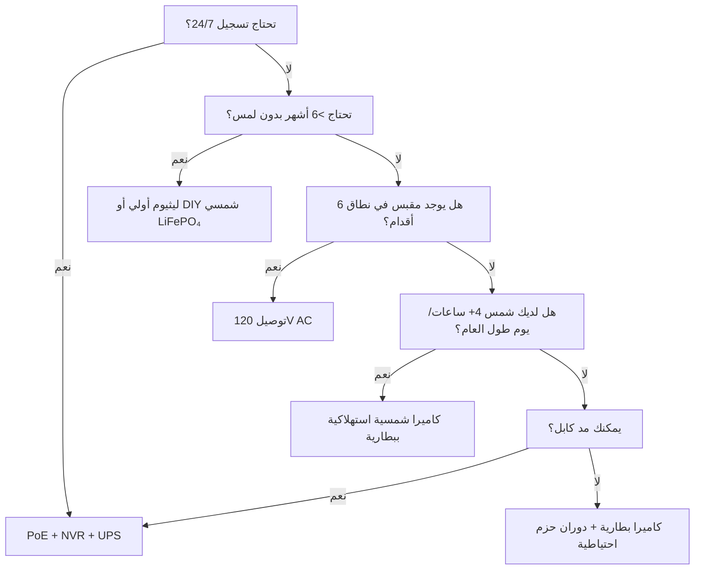

الطاقة هي السبب رقم 1 لفشل كاميرات المراقبة. بطارية فارغة في الساعة 3 صباحًا. ليثيوم أيون متجمد في يناير. لوح شمسي مدفون تحت الثلج. محول PoE مفصول «لدقيقة واحدة». يشرح هذا الدليل كل بنية طاقة مع فيزياء حقيقية وبيانات حقيقية وأطر قرار لتختار مرة واحدة ويعمل النظام.

<Badge variant="outline">الفيزياء أولاً</Badge> **الطاقة الداخلة = الطاقة
الخارجة + الفقد.** لا تغيير أي تسويق لهذا. حدد مصدرك بناءً على أسوأ حالة (أقصر
يوم، أبرد درجة حرارة، أعلى نشاط)، وليس أفضل حالة.

## مقارنة بنى الطاقة

| البنية                           | مصدر الجهد         | أقصى مسافة                | الموثوقية       | تعقيد التركيب | الأفضل لـ                               |
| -------------------------------- | ------------------ | ------------------------- | --------------- | ------------- | --------------------------------------- |
| **120V AC + محول**               | مقبس حائط          | 6 أقدام (السلك)           | ★★★★★ (الشبكة)  | بسيط جدًا     | داخلي، شرفة، مقبس موجود                 |
| **PoE (802.3af/at/bt)**          | محول PoE/حاقن      | 328 قدمًا (100 م)         | ★★★★★ (مع UPS)  | متوسط (كابل)  | **المعيار الذهبي** — 24/7، NVR، عن بُعد |
| **12V/24V DC مباشر**             | بنك بطاريات / PSU  | 50–100 قدم (انخفاض الجهد) | ★★★★☆           | متوسط         | خارج الشبكة، عربة تخييم، ناقل 12V موجود |
| **ليثيوم أيون قابل للشحن**       | بطارية داخلية      | لا ينطبق (لاسلكي)         | ★★☆☆☆ (موسمي)   | بسيط جدًا     | مستأجرون، مؤقت، مناطق بلا كابلات        |
| **ليثيوم أولي (غير قابل للشحن)** | بطارية داخلية      | لا ينطبق                  | ★★★☆☆ (1–2 سنة) | بسيط جدًا     | كاميرات مسار، ناءٍ جدًا، لا شمس         |
| **شمسي + قابل للشحن**            | شمس → لوح → بطارية | لا ينطبق                  | ★★★☆☆ (طقس)     | سهل–متوسط     | سياج، بوابة، سقيفة، خارج الشبكة         |
| **هجين: PoE + بطارية احتياطية**  | PoE + UPS/داخلي    | 328 قدمًا                 | ★★★★★           | أعلى          | مدخل حساس، لوحات ترقيم                  |

<Callout type="warning">

**التسويق مقابل الواقع:** «عمر بطارية 6 أشهر» = 10 أحداث حركة/يوم، مقاطع 10
ثوانٍ، 70°F، لا مشاهدة مباشرة. **العالم الحقيقي:** 20–40 حدثًا/يوم + 5 مشاهدات
مباشرة = **2–6 أسابيع**. خفّض دائمًا 3–5 أضعاف.

</Callout>

## تعمق: كل بنية

### 1. PoE (الطاقة عبر الإيثرنت) — الخيار الاحترافي

<Accordion type="single" collapsible>
  <AccordionItem value="poe-basics">
    <AccordionTrigger>كيف يعمل PoE والمعايير</AccordionTrigger>
    <AccordionContent>

<strong>IEEE 802.3af (PoE):</strong> 15.4W عند PSE → 12.95W عند PD (الكاميرا).
يشغل معظم الكاميرات الثابتة والقبابية.
<strong>IEEE 802.3at (PoE+):</strong> 30W عند PSE → 25.5W عند PD. يشغل PTZ،
السخانات، إضاءات IR.
<strong>IEEE 802.3bt (PoE++):</strong> 60W (Type 3) / 90W (Type 4) عند PSE → 51W
/ 71W عند PD. يشغل القباب السريعة، متعددة الحساسات، المساحات/السخانات.

<strong>الكابل:</strong> Cat5e كحد أدنى (Cat6/6a لـ PoE++). أقصى 100 م (328
قدمًا) لكل قطعة.
<strong>الهيكل:</strong> كاميرا → Cat5e/6 → محول PoE (أو NVR بمنافذ PoE) → UPS →
الشبكة.
<strong>الجهد:</strong> 44–57V DC على أزواج الأسلاك (Mode A: أزواج بيانات / Mode
B: أزواج احتياطية). الكاميرا تحول DC-DC داخليًا إلى 12V/5V/3.3V.

</AccordionContent>

  </AccordionItem>
  <AccordionItem value="poe-ups">
    <AccordionTrigger>حجم UPS لـ PoE (حاسم للتشغيل 24/7)</AccordionTrigger>
    <AccordionContent>

<strong>القاعدة:</strong> يجب أن يغطي UPS
<strong>جميع منافذ محول PoE + NVR + الراوتر</strong> لمدة التشغيل المستهدفة.

| الحمل                                      | الواط النموذجي         | 4 ساعات تشغيل (Wh)      | 12 ساعة تشغيل (Wh)        | 24 ساعة تشغيل (Wh)        |
| ------------------------------------------ | ---------------------- | ----------------------- | ------------------------- | ------------------------- |
| محول PoE+ 8 منافذ (4 كاميرات)              | 45W                    | 180 Wh                  | 540 Wh                    | 1,080 Wh                  |
| محول PoE+ 16 منفذ (12 كاميرا)              | 120W                   | 480 Wh                  | 1,440 Wh                  | 2,880 Wh                  |
| NVR (8 فتحات، 2 HDD)                       | 35W                    | 140 Wh                  | 420 Wh                    | 840 Wh                    |
| راوتر/مودم                                 | 15W                    | 60 Wh                   | 180 Wh                    | 360 Wh                    |
| <strong>الإجمالي (نظام 12 كاميرا)</strong> | <strong>~170W</strong> | <strong>680 Wh</strong> | <strong>2,040 Wh</strong> | <strong>4,080 Wh</strong> |

<strong>توصيات UPS:</strong>

<ul>
  <li>
    <strong>&lt;4 ساعات:</strong> CyberPower CP1500PFCLCD (1,500 VA / 1,050 Wh)
    — $200
  </li>
  <li>
    <strong>8–12 ساعة:</strong> APC SMT1500RM2UC + حزمة بطارية خارجية — $600+
  </li>
  <li>
    <strong>24+ ساعة:</strong> بطارية رف خادم 48V LiFePO₄ (5–10 kWh) + محول/شاحن
    Victron — $2,000+
  </li>
</ul>

<strong>نصيحة احترافية:</strong> ضع محول PoE + NVR + الراوتر على
<strong>UPS واحد</strong>. UPS جانب الكاميرا (لكل كاميرا) موجود لكن تكلفته 5
أضعاف لنفس المدة.

</AccordionContent>

  </AccordionItem>
</Accordion>

### 2. كاميرات البطارية القابلة للشحن — فخ الراحة

<Callout type="note">

**الكيمياء:**几乎所有 كاميرات البطاريات الاستهلاكية تستخدم **Li-ion (NMC/LCO)،
3.6–3.7V اسمي، 4.2V أقصى**. ليس LiFePO₄. هذا مهم للبرودة.

</Callout>

**عمر البطارية الحقيقي (موديلات 2025–2026، 1080p/2K/4K)**

| الكاميرا              | البطارية             | المعلن  | **حقيقي (نشاط عالٍ)** | **حقيقي (نشاط منخفض)** | طريقة الشحن                 |
| --------------------- | -------------------- | ------- | --------------------- | ---------------------- | --------------------------- |
| EufyCam 3 S330        | 13,000 mAh           | 365 يوم | 14–21 يوم             | 90–120 يوم             | USB-C (5V) / شمسي           |
| Reolink Argus 4 Pro   | 9,600 mAh            | 6 أشهر  | 10–18 يوم             | 60–90 يوم              | USB-C (5V) / شمسي           |
| Ring Stick Up Cam Pro | 6,000 mAh            | 6 أشهر  | 7–14 يوم              | 45–60 يوم              | USB-C (5V) / شمسي / توصيل   |
| Arlo Pro 5S 2K        | 5,200 mAh            | 6 أشهر  | 5–10 أيام             | 30–45 يوم              | مغناطيسي (خاص) / شمسي       |
| Blink Outdoor 4       | 2× AA Li (3,000 mAh) | سنتان   | 60–90 يوم             | 180–365 يوم            | استبدال AA (غير قابل للشحن) |
| Wyze Cam Outdoor v2   | 5,200 mAh            | 6 أشهر  | 10–16 يوم             | 50–75 يوم              | Micro-USB / شمسي            |
| Reolink Go PT Plus    | 7,800 mAh            | 3 أشهر  | 8–14 يوم              | 40–60 يوم              | USB-C / شمسي / 12V          |

**نشاط عالٍ =** 30+ حدث حركة/يوم + 3 مشاهدات مباشرة/يوم + IR ليلي نشط  
**نشاط منخفض =** 5 أحداث/يوم + 0 مشاهدة مباشرة + نهار فقط

<Accordion type="single" collapsible>
  <AccordionItem value="battery-physics">
    <AccordionTrigger>لماذا ينهار عمر البطارية (الفيزياء)</AccordionTrigger>
    <AccordionContent>

<ol>
  <li>
    <strong>استهلاك الإرسال هو المسيطر:</strong> راديو Wi-Fi عند +17 dBm =
    300–500 mA @
  </li>
</ol>
<ol>
  <li>
    <strong>مصابيح IR:</strong> 850 nm IR لمسافة 100 قدم = 1–2W لمدة 30
    ثانية/مقطع. 30 مقطعًا = 0.25–0.5 Wh = <strong>70–140 mAh @ 3.7V</strong>.
  </li>
  <li>
    <strong>يقظة PIR + DSP:</strong> 50–100 mA لمدة 2–5 ثوانٍ لكل حدث. ضئيل
    منفردًا، يتراكم.
  </li>
  <li>
    <strong>البرودة:</strong> Li-ion{" "}
    <strong>المقاومة الداخلية تتضاعف عند 32°F (0°C)</strong>. الجهد يهبط تحت حمل
    الإرسال → BMS يقطع عند 3.0V → بطارية «فارغة» عند 40% SoC.{" "}
    <strong>السعة عند 14°F (-10°C) ≈ 50% من سعة 70°F.</strong>
  </li>
  <li>
    <strong>التفريغ الذاتي:</strong> 2–5%/شهر. ضئيل مقارنة بالاستهلاك النشط.
  </li>
  <li>
    <strong>المشاهدة المباشرة:</strong> 5 دقائق مشاهدة مباشرة = طاقة 30+ مقطعًا.{" "}
    <strong>تجنب الفحص المباشر اليومي.</strong>
  </li>
</ol>

    </AccordionContent>

  </AccordionItem>
  <AccordionItem value="charging">
    <AccordionTrigger>استراتيجيات شحن مجدية</AccordionTrigger>
    <AccordionContent>

      <strong>لا تنتظر 0%.</strong> Li-ion يكره التفريغ العميق. اشحن عند 20–30%. <strong>حجم اللوح
      الشمسي:</strong> اللوح (W) ≥ متوسط استهلاك الكاميرا (W) × 3 (شتاء/غائم) ÷ ساعات
      الذروة الشمسية (أسوأ شهر). - مثال: Argus 4 Pro متوسط 1.5W → تحتاج 4.5W.
      أسوأ شهر (ديسمبر، المنطقة 5) = 1.5 ساعة ذروة → <strong>لوح 3W كحد أدنى، 6W موصى
      به</strong>. <strong>كابلات USB-C PD Trigger:</strong> Reolink/Argus/Eufy تقبل
        5V/9V/12V/15V/20V عبر تفاوض PD. استخدم كابل 12V←USB-C PD trigger للشحن من
      بنك 12V لعربة التخييم/المنزل مباشرة (90% كفاءة مقابل 12V←120V محول←5V محول
      بـ 60%). <strong>تدوير بطاريتين:</strong> اشتر حزمة احتياطية. بدّل المشحونة بالفارغة.
      بدون توقف. يعمل فقط مع الحزم القابلة للإزالة (Reolink, Blink, بعض Ring).

    </AccordionContent>

  </AccordionItem>
</Accordion>

### 3. الليثيوم الأولي (غير قابل للشحن) — أخصائي المدى الطويل

| نوع البطارية                      | الكيمياء | الجهد | السعة      | نطاق الحرارة    | الأفضل لـ                        |
| --------------------------------- | -------- | ----- | ---------- | --------------- | -------------------------------- |
| **Energizer Ultimate Lithium AA** | Li/FeS₂  | 1.5V  | 3,000 mAh  | -40°F إلى 140°F | Blink، كاميرات مسار، تشغيل -40°F |
| **Tadiran TL-5930 (D-cell)**      | Li/SOCl₂ | 3.6V  | 19,000 mAh | -67°F إلى 185°F | أنابيب، قياس عن بعد، 5–10 سنوات  |
| **Saft LS 14500 (AA)**            | Li/SOCl₂ | 3.6V  | 2,600 mAh  | -60°F إلى 185°F | صناعي، مناطق ATEX                |

**الإيجابيات:** كثافة طاقة 10–20× مقابل القلوي؛ يعمل عند -40°F؛ عمر تخزين 10–20 سنة؛ لا حاجة لدائرة شحن  
**السلبيات:** **غير قابلة للشحن**؛ $2–10/خلية؛ هضبة الجهد تصعّب قياس الوقود؛ التخميل (تأخير الجهد بعد راحة طويلة)  
**الاستخدام:** كاميرا مسار على درب صيد تُفحص فصليًا؛ حساس أنابيب؛ كاميرا أبحاث في أنتاركتيكا. **ليست للاستخدام الأمني اليومي.**

### 4. شمسي + بطارية — هندسة خارج الشبكة

<Callout type="info">

**الطاقة الشمسية هي شاحن بطارية، وليس مصدر طاقة.** حدد **البطارية** لعدد أيام
الاستقلالية (أيام بدون شمس). حدد **اللوح** لإعادة شحن تلك البطارية في يوم جيد
واحد.

</Callout>

**ورقة عمل تحديد حجم النظام**

```
  1. متوسط طاقة الكاميرا (W) × 24 ساعة = Wh/يوم المطلوب
   مثال: Reolink Go PT Plus = 2.5W متوسط → 60 Wh/يوم

  2. أيام استقلالية البطارية × Wh/يوم = Wh البطارية
     3 أيام استقلالية → 180 Wh
   LiFePO₄ 12.8V → 180 Wh ÷ 12.8V = 14 Ah → **حزمة 20 Ah (هامش 20%)**

  3. ساعات الذروة الشمسية لأسوأ شهر (PSH) × واط اللوح × 0.75 (فقد) = Wh/يوم تحصيل
   ديسمبر، المنطقة 5: 1.5 PSH × اللوح W × 0.75 = 60 Wh → اللوح = 53W → **لوح 60W**

  4. منظم الشحن: MPPT (95% كفاءة) مقابل PWM (75% كفاءة). **استخدم MPPT دائمًا لأكثر من 20W.**
   Victron SmartSolar 75/10, 75/15, 100/20 — بلوتوث، قابل للبرمجة، موثوق.

  5. التركيب: مواجه للجنوب (نصف الكرة الشمالي)، زاوية الميل = خط العرض + 15° لتحسين الشتاء
   حامل أرضي قابل للتعديل > سطح > عمود سياج.
```

**مجموعات كاميرات شمسية حقيقية (2026)**

| المجموعة                                                      | اللوح              | البطارية       | المنظم      | الكاميرا                    | تشغيل شتوي المنطقة 5                     |
| ------------------------------------------------------------- | ------------------ | -------------- | ----------- | --------------------------- | ---------------------------------------- |
| Reolink 6W + Argus 4 Pro                                      | 6W (ثابت)          | 9.6 Ah (داخلي) | داخلي (PWM) | Argus 4 Pro                 | **يفشل ديسمبر–فبراير** (اللوح صغير جدًا) |
| Reolink 20W + Go PT Plus                                      | 20W (قابل للتعديل) | 7.8 Ah (داخلي) | داخلي       | Go PT Plus                  | **حدي** (أضف LiFePO₄ خارجي 20Ah)         |
| EufyCam 3 + شمسي                                              | 2.4W (مدمج)        | 13 Ah (داخلي)  | داخلي       | EufyCam 3                   | **يفشل نوفمبر–مارس** (اللوح صغير جدًا)   |
| **DIY: 60W + 20Ah LiFePO₄ + Victron + Go PT Plus**            | 60W                | 256 Wh         | MPPT        | Go PT Plus                  | **95% تشغيل** (هندسي)                    |
| **DIY: 100W + 40Ah LiFePO₄ + Victron + حاقن PoE + كاميرا 4K** | 100W               | 512 Wh         | MPPT        | Reolink RLC-1212A + 12V→PoE | **99% تشغيل** (PoE خارج الشبكة حقيقي)    |

<Accordion type="single" collapsible>
  <AccordionItem value="winter">
    <AccordionTrigger>واقع الطاقة الشمسية الشتوي (المناطق 4–6)</AccordionTrigger>
    <AccordionContent>

<strong>الانقلاب الشتوي (المنطقة 5، 42°N):</strong>
<ul>
  <li>
    ساعات الذروة الشمسية: <strong>1.0–1.5</strong> (مقابل 5.5 في يونيو)
  </li>
  <li>
    إنتاج اللوح عند ميل 30°: <strong>15–20% من تصنيف STC</strong>
  </li>
  <li>
    الغطاء الثلجي: <strong>0% إنتاج</strong> حتى التنظيف (توجد ألواح ذاتية
    التسخين: 5–10W استهلاك طفيلي)
  </li>
  <li>
    البطارية عند 14°F: <strong>Li-ion = 50% سعة; LiFePO₄ = 80% سعة</strong>
  </li>
</ul>

<strong>استراتيجيات البقاء:</strong>

<ol>
  <li>
    <strong>ضاعف اللوح 3–4×</strong> مقارنة بحساب الصيف (60W → مصفوفة 180–240W)
  </li>
  <li>
    <strong>بطارية LiFePO₄</strong> (وليست Li-ion) — تشحن حتى -4°F مع سخان BMS
  </li>
  <li>
    <strong>قلل دورة عمل الكاميرا:</strong> حركة فقط، دقة أقل، مقاطع أقصر، تعطيل
    IR (استخدم الإضاءة المحيطة)
  </li>
  <li>
    <strong>شحن احتياطي:</strong> كابل 12V→USB-C PD trigger من مركبة/مولد شهريًا
  </li>
  <li>
    <strong>تقبل التوقف:</strong> صمم لتشغيل 90%، وليس 100%. 3–5 أيام ظلام/سنة
    أمر طبيعي.
  </li>
</ol>

</AccordionContent>
   </AccordionItem>
</Accordion>

### 5. 12V/24V DC مباشر — النظام الأصلي لعربة التخييم/خارج الشبكة

**لماذا 12V DC؟** لا فقد عاكس (120V AC → 12V DC = 15–25% فقد). الكاميرا تعمل أصلاً على 12V داخليًا.

**توصيل كاميرا 12V مباشرة:**

```
بطارية المنزل (12V LiFePO₄)
  → فيوز 10A
  → سلك بحري معلب 18 AWG (أحمر/أسود)
  → موصل Deutsch / SAE / Anderson مقاوم للماء
  → دخل الكاميرا 12V (تحقق من القطبية!)
  → **محول خفض** إذا كانت الكاميرا تحتاج 5V/9V (معظم كاميرات PoE تحتاج 48V → استخدم حاقن PoE 12V→48V)
```

**حاسبة انخفاض الجهد:**

```
Vdrop = (2 × الطول_قدم × التيار_A × 0.000016) / مساحة_السلك_CM
  18 AWG (1,624 CM)، 50 قدمًا، 1A → انخفاض 0.98V (8% على 12V) — مقبول
  18 AWG، 100 قدم، 1A → انخفاض 1.96V (16%) — استخدم 16 AWG (2,583 CM) → 1.2V (10%)
```

**القاعدة:** اجعل مسافة 12V أقل من 50 قدمًا على 18 AWG؛ وأقل من 100 قدم على 14 AWG. أو استخدم توزيع 24V/48V مع خفض عند الكاميرا.

**حواقن 12V→PoE (تشغيل كاميرات PoE على بنك 12V):**

- Tycon POE-12-48V (12V دخول → 48V PoE خروج، 15W) — $25
- Ubiquiti INJ-12V-48V (12V → 48V PoE+، 30W) — $35
- صناعي: Mean Well NDR-120-48 (120W سكة DIN) + مقسم PoE — $60
- **الكفاءة:** 85–92%. الكاميرا ترى PoE قياسي — لا اختراق للبرامج الثابتة.

### 6. هجين: PoE + بطارية احتياطية (بدون توقف)

**الهيكل:** كاميرا → محول PoE → UPS (LiFePO₄) → الشبكة.  
**بالإضافة:** كاميرا ذات بطارية داخلية (Reolink Go PT Plus، Arlo Go 2) أو UPS خارجي لكل كاميرا.

| النهج                                | التكلفة     | مدة التشغيل (لكل كاميرا) | التعقيد |
| ------------------------------------ | ----------- | ------------------------ | ------- |
| UPS مركزي (محول+NVR)                 | $200–2,000  | ساعات–أيام               | منخفض   |
| UPS لكل كاميرا (APC BE600M1)         | $60×عدد     | 30–60 دقيقة              | متوسط   |
| كاميرا ببطارية داخلية (Go PT Plus)   | $230        | 2–4 أسابيع (شمسي)        | منخفض   |
| **PoE + 12V LiFePO₄ + تبديل تلقائي** | $150/كاميرا | أيام–أسابيع              | عالٍ    |

**أفضل ما في العالمين:** PoE للتسجيل 24/7 + NVR. بطارية داخلية **للتسجيل أثناء انقطاع الشبكة** (آخر 30 دقيقة قبل نفاد UPS). Reolink Go PT Plus يفعل هذا أصلاً — يسجل على microSD عند فقدان PoE.

## التكلفة الإجمالية للملكية (5 سنوات)

| البنية                                  | السنة 1 | السنوات 2–5 (سنويًا)         | الإجمالي 5 سنوات | الأفضل لـ                      |
| --------------------------------------- | ------- | ---------------------------- | ---------------- | ------------------------------ |
| **PoE + NVR + UPS**                     | $1,500  | $50 (استبدال HDD)            | **$1,700**       | دائم، 24/7، 8+ كاميرات         |
| **بطارية + شمسي (DIY LiFePO₄)**         | $800    | $0                           | **$800**         | خارج الشبكة، 1–4 كاميرات، DIY  |
| **كاميرا بطارية + لوح شمسي (استهلاكي)** | $500    | $50 (استبدال بطارية السنة 3) | **$700**         | إيجار، بدون أسلاك، 1–2 كاميرات |
| **ليثيوم أولي (كاميرا مسار)**           | $300    | $100 (خلايا/سنة)             | **$700**         | ناءٍ جدًا، فحص فصلي            |
| **توصيل 120V AC**                       | $200    | $10                          | **$240**         | داخلي، شرفة، يوجد مقبس         |

<Callout type="tip">

**تكلفة خفية:** زيارات ميدانية. كاميرا بطارية تموت الساعة 3 صباحًا → تقود 30
دقيقة لتبديلها = $50/مرة. PoE + UPS = 0 زيارات ميدانية لأجل الطاقة. احسب $50 ×
الأعطال المتوقعة/السنة.

</Callout>

## مصفوفة القرار: اختر بنيتك



## قائمة المواصفات السريعة لكاميرتك

- [ ] **PoE:** 802.3af (15W) / at (30W) / bt (60/90W) — طابق المحول
- [ ] **12V DC:** يقبل 10–14V؟ حماية عكس قطبية؟ نوع الموصل؟
- [ ] **البطارية:** قابلة للإزالة؟ الكيمياء (Li-ion مقابل LiFePO₄)؟ mAh @ 3.7V؟ شحن عبر USB-C PD؟
- [ ] **الشمسي:** واط اللوح؟ MPPT أم PWM؟ طول الكابل؟ قابلية تعديل الحامل؟
- [ ] **درجة حرارة التشغيل:** -4°F / -20°C كحد أدنى لـ Li-ion؛ -40°F لـ LiFePO₄/الأولي
- [ ] **استهلاك الطاقة:** ورقة البيانات «أقصى» مقابل «نموذجي» — صمم للنموذجي × 1.5
- [ ] **تنبيه انخفاض البطارية:** إشعار تطبيق عند 20%؟ حد الإغلاق التلقائي؟
- [ ] **توافق UPS:** NVR + المحول على نفس UPS؟ مدة التشغيل محسوبة؟

---

## أدلة ذات صلة

- [أفضل كاميرات مراقبة تعمل بالطاقة الشمسية (خارج الشبكة)](/blog/best-solar-powered-security-cameras-offgrid) — تعمق في حجم اللوح/البطارية
- [أفضل كاميرات مراقبة لعربات التخييم والمنازل المتنقلة](/blog/best-security-cameras-for-rvs-mobile-homes) — 12V DC، الاهتزاز، خلوي
- [مقارنة PoE مقابل اللاسلكي مقابل الشمسي](/blog/poe-vs-wireless-vs-solar-comparison) — إطار قرار
- [تركيب الكاميرات اللاسلكية: نصائح DIY](/blog/wireless-camera-setup-diy-installation-tips) — Wi-Fi، البطارية، التثبيت
