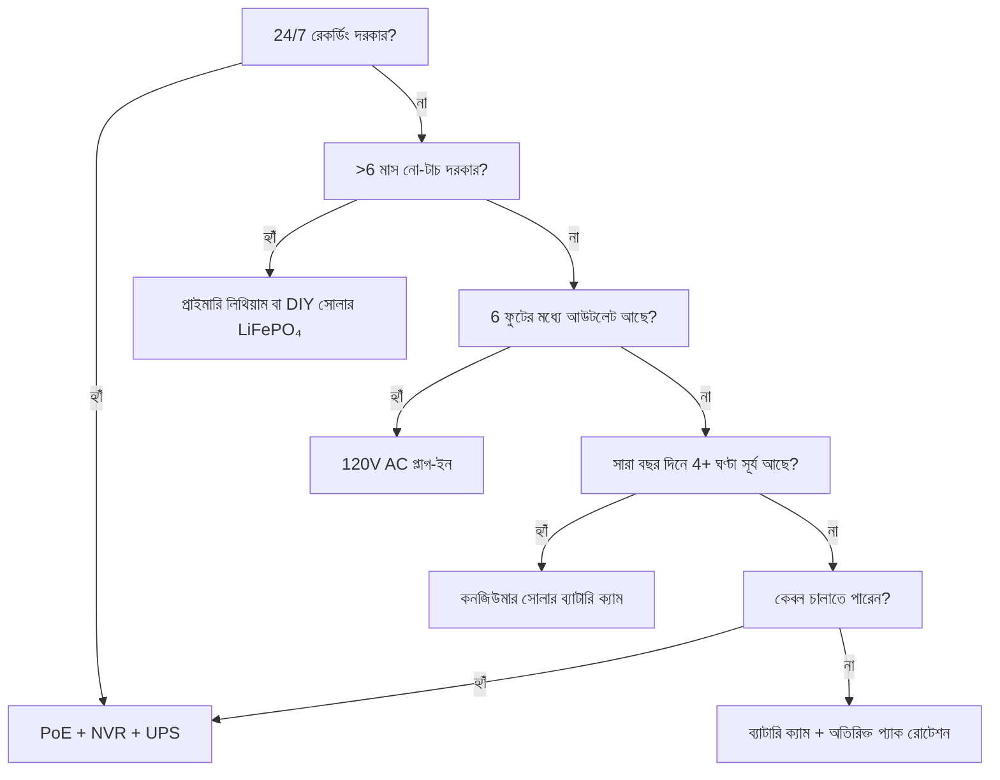

পাওয়ার হল সিকিউরিটি ক্যামেরা ব্যর্থ হওয়ার #1 কারণ। ভোর 3টায় ব্যাটারি শেষ। জানুয়ারিতে Li-ion জমে গেছে। সোলার প্যানেল তুষারে ঢাকা। PoE সুইচ "এক মিনিটের জন্য" আনপ্লাগ করা। এই গাইড প্রকৃত পদার্থবিদ্যা, প্রকৃত ডেটা এবং সিদ্ধান্ত কাঠামো সহ প্রতিটি পাওয়ার আর্কিটেকচার ভেঙে দেয়।

<Badge variant="outline">পদার্থবিদ্যা প্রথম</Badge> **শক্তি ইনপুট = আউটপুট শক্তি
+ ক্ষতি।** কোনো মার্কেটিং এটি পরিবর্তন করতে পারে না। সেরা ক্ষেত্রে নয়, সবচেয়ে
খারাপ ক্ষেত্রে (ছোট দিন, ঠান্ডা তাপমাত্রা, সর্বোচ্চ কার্যকলাপ) আপনার উৎসের আকার
নির্ধারণ করুন।

## পাওয়ার আর্কিটেকচার তুলনা

| আর্কিটেকচার                            | ভোল্টেজ উৎস                | সর্বোচ্চ দূরত্ব           | নির্ভরযোগ্যতা      | ইনস্টল জটিলতা | সেরা জন্য                                  |
| -------------------------------------- | -------------------------- | ------------------------- | ------------------ | ------------- | ------------------------------------------ |
| **120V AC + অ্যাডাপ্টার**              | ওয়াল আউটলেট               | 6 ফুট (কর্ড)              | ★★★★★ (গ্রিড)      | সাধারণ        | ইনডোর, পোর্চ, বিদ্যমান আউটলেট              |
| **PoE (802.3af/at/bt)**                | PoE সুইচ/ইনজেক্টর          | 328 ফুট (100 মি)          | ★★★★★ (UPS-ব্যাকড) | মাঝারি (কেবল) | **গোল্ড স্ট্যান্ডার্ড** — 24/7, NVR, রিমোট |
| **12V/24V DC সরাসরি**                  | ব্যাটারি ব্যাংক / PSU      | 50-100 ফুট (ভোল্টেজ ড্রপ) | ★★★★☆              | মাঝারি        | অফ-গ্রিড, আরভি, বিদ্যমান 12V বাস           |
| **রিচার্জেবল Li-ion**                  | অভ্যন্তরীণ ব্যাটারি        | N/A (ওয়্যারলেস)          | ★★☆☆☆ (মৌসুমী)     | সাধারণ        | ভাড়াটে, অস্থায়ী, কোনো কেবল জোন নয়       |
| **প্রাইমারি লিথিয়াম (নন-রিচার্জেবল)** | অভ্যন্তরীণ ব্যাটারি        | N/A                       | ★★★☆☆ (1-2 বছর)    | সাধারণ        | ট্রেল ক্যাম, অতি-দূরবর্তী, কোনো সূর্য নেই  |
| **সোলার + রিচার্জেবল**                 | সূর্য → প্যানেল → ব্যাটারি | N/A                       | ★★★☆☆ (আবহাওয়া)   | সহজ-মাঝারি    | বেড়া, গেট, শেড, অফ-গ্রিড                  |
| **হাইব্রিড: PoE + ব্যাটারি ব্যাকআপ**   | PoE + UPS/অভ্যন্তরীণ       | 328 ফুট                   | ★★★★★              | উচ্চ          | সমালোচনামূলক প্রবেশ, লাইসেন্স প্লেট        |

<Callout type="warning">

**মার্কেটিং বনাম বাস্তবতা:** "6 মাসের ব্যাটারি লাইফ" = প্রতিদিন 10টি মোশন
ইভেন্ট, 10 সেকেন্ডের ক্লিপ, 70°F, কোনো লাইভ ভিউ নেই। **বাস্তব জগৎ:** প্রতিদিন
20-40 ইভেন্ট + 5টি লাইভ ভিউ = **2-6 সপ্তাহ**। সর্বদা 3-5× ডিরেট করুন।

</Callout>

## গভীর ডাইভ: প্রতিটি আর্কিটেকচার

### 1. PoE (পাওয়ার ওভার ইথারনেট) — পেশাদার পছন্দ

<Accordion type="single" collapsible>
  <AccordionItem value="poe-basics">
    <AccordionTrigger>PoE কীভাবে কাজ করে ও মান</AccordionTrigger>
    <AccordionContent>

<strong>IEEE 802.3af (PoE):</strong> PSE-তে 15.4W → PD-তে (ক্যামেরা) 12.95W।
বেশিরভাগ ফিক্সড বুলেট/ডোম চালায়।
<strong>IEEE 802.3at (PoE+):</strong> PSE-তে 30W → PD-তে 25.5W। PTZ, হিটার, IR
ইলুমিনেটর চালায়।
<strong>IEEE 802.3bt (PoE++):</strong> PSE-তে 60W (Type 3) / 90W (Type 4) →
PD-তে 51W / 71W। স্পিড ডোম, মাল্টি-সেন্সর, ওয়াইপার/হিটার চালায়।

<strong>কেবল:</strong> ন্যূনতম Cat5e (PoE++-এর জন্য Cat6/6a)। প্রতি সেগমেন্ট
সর্বোচ্চ 100 মি (328 ফুট)।
<strong>টপোলজি:</strong> ক্যামেরা → Cat5e/6 → PoE সুইচ (বা PoE পোর্টসহ NVR) →
UPS → গ্রিড।
<strong>ভোল্টেজ:</strong> তারের জোড়ায় 44-57V DC (Mode A: ডেটা জোড়া / Mode B:
অতিরিক্ত জোড়া)। ক্যামেরা DC-DC রূপান্তর করে 12V/5V/3.3V অভ্যন্তরীণ।

</AccordionContent>

  </AccordionItem>
  <AccordionItem value="poe-ups">
    <AccordionTrigger>PoE-র জন্য UPS সাইজিং (24/7-এর জন্য গুরুত্বপূর্ণ)</AccordionTrigger>
    <AccordionContent>

<strong>নিয়ম:</strong> UPS-কে অবশ্যই
<strong>সমস্ত PoE সুইচ পোর্ট + NVR + রাউটার</strong> টার্গেট রানটাইমের জন্য কভার
করতে হবে।

| লোড                                     | সাধারণ ওয়াট           | 4-ঘণ্টা রানটাইম (Wh)    | 12-ঘণ্টা রানটাইম (Wh)     | 24-ঘণ্টা রানটাইম (Wh)     |
| --------------------------------------- | ---------------------- | ----------------------- | ------------------------- | ------------------------- |
| 8-পোর্ট PoE+ সুইচ (4 ক্যাম)             | 45W                    | 180 Wh                  | 540 Wh                    | 1,080 Wh                  |
| 16-পোর্ট PoE+ সুইচ (12 ক্যাম)           | 120W                   | 480 Wh                  | 1,440 Wh                  | 2,880 Wh                  |
| NVR (8-বে, 2 HDD)                       | 35W                    | 140 Wh                  | 420 Wh                    | 840 Wh                    |
| রাউটার/মডেম                             | 15W                    | 60 Wh                   | 180 Wh                    | 360 Wh                    |
| <strong>মোট (12-ক্যাম সিস্টেম)</strong> | <strong>~170W</strong> | <strong>680 Wh</strong> | <strong>2,040 Wh</strong> | <strong>4,080 Wh</strong> |

<strong>UPS প্রস্তাবনা:</strong>

<ul>
  <li>
    <strong>&lt;4 ঘণ্টা:</strong> CyberPower CP1500PFCLCD (1,500 VA / 1,050 Wh)
    — $200
  </li>
  <li>
    <strong>8-12 ঘণ্টা:</strong> APC SMT1500RM2UC + বাহ্যিক ব্যাটারি প্যাক —
    $600+
  </li>
  <li>
    <strong>24+ ঘণ্টা:</strong> 48V LiFePO₄ সার্ভার র্যাক ব্যাটারি (5-10 kWh) +
    Victron ইনভার্টার/চার্জার — $2,000+
  </li>
</ul>

<strong>প্রো টিপ:</strong> PoE সুইচ + NVR + রাউটার <strong>একই UPS-এ</strong>
রাখুন। ক্যামেরা-সাইড UPS (প্রতি-ক্যামেরা) বিদ্যমান কিন্তু একই রানটাইমের জন্য 5×
বেশি খরচ।

</AccordionContent>

  </AccordionItem>
</Accordion>

### 2. রিচার্জেবল ব্যাটারি ক্যামেরা — সুবিধার ফাঁদ

<Callout type="note">

**রসায়ন:** প্রায় সব কনজিউমার ব্যাটারি ক্যাম Li-ion (NMC/LCO), 3.6-3.7V
নামমাত্র, 4.2V সর্বোচ্চ ব্যবহার করে। LiFePO₄ নয়। এটি ঠান্ডার জন্য
গুরুত্বপূর্ণ।

</Callout>

**বাস্তব-জগতের ব্যাটারি লাইফ (2025-2026 মডেল, 1080p/2K/4K)**

| ক্যামেরা              | ব্যাটারি             | দাবিকৃত | **বাস্তব (উচ্চ কার্যকলাপ)** | **বাস্তব (নিম্ন কার্যকলাপ)** | চার্জ পদ্ধতি                     |
| --------------------- | -------------------- | ------- | --------------------------- | ---------------------------- | -------------------------------- |
| EufyCam 3 S330        | 13,000 mAh           | 365 দিন | 14-21 দিন                   | 90-120 দিন                   | USB-C (5V) / সোলার               |
| Reolink Argus 4 Pro   | 9,600 mAh            | 6 মাস   | 10-18 দিন                   | 60-90 দিন                    | USB-C (5V) / সোলার               |
| Ring Stick Up Cam Pro | 6,000 mAh            | 6 মাস   | 7-14 দিন                    | 45-60 দিন                    | USB-C (5V) / সোলার / প্লাগ-ইন    |
| Arlo Pro 5S 2K        | 5,200 mAh            | 6 মাস   | 5-10 দিন                    | 30-45 দিন                    | ম্যাগনেটিক (মালিকানাধীন) / সোলার |
| Blink Outdoor 4       | 2× AA Li (3,000 mAh) | 2 বছর   | 60-90 দিন                   | 180-365 দিন                  | AA প্রতিস্থাপন (নন-রিচার্জ)      |
| Wyze Cam Outdoor v2   | 5,200 mAh            | 6 মাস   | 10-16 দিন                   | 50-75 দিন                    | Micro-USB / সোলার                |
| Reolink Go PT Plus    | 7,800 mAh            | 3 মাস   | 8-14 দিন                    | 40-60 দিন                    | USB-C / সোলার / 12V              |

**উচ্চ কার্যকলাপ =** প্রতিদিন 30+ মোশন ইভেন্ট + 3টি লাইভ ভিউ + রাতের IR চালু  
**নিম্ন কার্যকলাপ =** প্রতিদিন 5টি ইভেন্ট + কোনো লাইভ ভিউ নেই + শুধু দিন

<Accordion type="single" collapsible>
  <AccordionItem value="battery-physics">
    <AccordionTrigger>
      কেন ব্যাটারি লাইফ ভেঙে পড়ে (পদার্থবিদ্যা)
    </AccordionTrigger>
    <AccordionContent>

<ol>
  <li>
    <strong>Tx পাওয়ার প্রাধান্য:</strong> Wi-Fi রেডিও +17 dBm = 300-500 mA @
    3.7V। 10
  </li>
</ol>
<ol>
  <li>
    <strong>IR LED:</strong> 100 ফুটে 850 nm IR = 30 সেকেন্ড/ক্লিপে 1-2W। 30
    ক্লিপ = 0.25-0.5 Wh = <strong>70-140 mAh @ 3.7V</strong>।
  </li>
  <li>
    <strong>PIR ওয়েক + DSP:</strong> প্রতি ইভেন্টে 50-100 mA 2-5 সেকেন্ডের
    জন্য। একা নগণ্য, কিন্তু জমে যায়।
  </li>
  <li>
    <strong>ঠান্ডা তাপমাত্রা:</strong> Li-ion-এর{" "}
    <strong>32°F (0°C)-এ অভ্যন্তরীণ প্রতিরোধ দ্বিগুণ হয়</strong>। Tx লোডে
    ভোল্টেজ কমে → BMS 3.0V-এ কেটে দেয় → 40% SoC-তে "মৃত" ব্যাটারি।{" "}
    <strong>14°F (-10°C)-এ ক্ষমতা ≈ 70°F-এর 50%।</strong>
  </li>
  <li>
    <strong>স্ব-ডিসচার্জ:</strong> 2-5%/মাস। সক্রিয় ড্রেনের তুলনায় নগণ্য।
  </li>
  <li>
    <strong>লাইভ ভিউ:</strong> 5 মিনিট লাইভ ভিউ = 30+ ক্লিপের শক্তি।{" "}
    <strong>প্রতিদিন লাইভ চেক এড়িয়ে চলুন।</strong>
  </li>
</ol>

    </AccordionContent>

  </AccordionItem>
  <AccordionItem value="charging">
    <AccordionTrigger>কার্যকরী চার্জিং কৌশল</AccordionTrigger>
    <AccordionContent>

      <strong>0%-এর জন্য অপেক্ষা করবেন না।</strong> Li-ion গভীর ডিসচার্জ ঘৃণা করে। 20-30%-এ
      চার্জ করুন। <strong>সোলার প্যানেল সাইজিং:</strong> প্যানেল (W) ≥ ক্যামেরা গড় ড্র (W) ×
        3 (শীত/মেঘলা) ÷ পিক সান আওয়ার (সবচেয়ে খারাপ মাস)। - উদাহরণ: Argus 4 Pro
      গড় 1.5W → প্রয়োজন 4.5W। সবচেয়ে খারাপ মাস (ডিসেম্বর, জোন 5) = 1.5 পিক
      ঘন্টা → <strong>ন্যূনতম 3W প্যানেল, 6W প্রস্তাবিত</strong>। <strong>USB-C PD ট্রিগার কেবল:</strong>
      Reolink/Argus/Eufy PD আলোচনার মাধ্যমে 5V/9V/12V/15V/20V গ্রহণ করে।
        12V→USB-C PD ট্রিগার কেবল ব্যবহার করে সরাসরি 12V আরভি/হাউস ব্যাংক থেকে
      চার্জ করুন (130% দক্ষ বনাম 12V→120V ইনভার্টার→5V অ্যাডাপ্টার 60%)।
      <strong>ডুয়াল-ব্যাটারি রোটেশন:</strong> অতিরিক্ত প্যাক কিনুন। চার্জড দিয়ে ডিসচার্জড
      প্রতিস্থাপন করুন। শূন্য ডাউনটাইম। শুধু ব্যবহারকারী-অপসারণযোগ্য প্যাকের
      সাথে কাজ করে (Reolink, Blink, কিছু Ring)।

    </AccordionContent>

  </AccordionItem>
</Accordion>

### 3. প্রাইমারি লিথিয়াম (নন-রিচার্জেবল) — দীর্ঘ-পথের বিশেষজ্ঞ

| ব্যাটারি টাইপ                     | রসায়ন   | ভোল্টেজ | ক্ষমতা     | তাপমাত্রা রেঞ্জ  | সেরা জন্য                            |
| --------------------------------- | -------- | ------- | ---------- | ---------------- | ------------------------------------ |
| **Energizer Ultimate Lithium AA** | Li/FeS₂  | 1.5V    | 3,000 mAh  | -40°F থেকে 140°F | Blink, ট্রেল ক্যাম, -40°F অপারেশন    |
| **Tadiran TL-5930 (D-সেল)**       | Li/SOCl₂ | 3.6V    | 19,000 mAh | -67°F থেকে 185°F | পাইপলাইন, রিমোট টেলিমেট্রি, 5-10 বছর |
| **Saft LS 14500 (AA)**            | Li/SOCl₂ | 3.6V    | 2,600 mAh  | -60°F থেকে 185°F | শিল্প, ATEX জোন                      |

**পেশাদার:** ক্ষারীয়র তুলনায় 10-20× শক্তি ঘনত্ব; -40°F-এ কাজ করে; 10-20 বছর শেলফ লাইফ; কোনো চার্জিং সার্কিটের প্রয়োজন নেই  
**অসুবিধা:** **নন-রিচার্জেবল**; $2-10/সেল; ভোল্টেজ প্লাটু ফুয়েল গেজিং কঠিন করে; প্যাসিভেশন (দীর্ঘ বিশ্রামের পরে ভোল্টেজ বিলম্ব)  
**ব্যবহার:** ত্রৈমাসিক পরীক্ষিত খেলার পথের ট্রেল ক্যাম; পাইপলাইন সেন্সর; অ্যান্টার্কটিক গবেষণা ক্যাম। **দৈনন্দিন সিকিউরিটির জন্য নয়।**

### 4. সোলার + ব্যাটারি — অফ-গ্রিড ইঞ্জিনিয়ারিং

<Callout type="info">

**সোলার একটি ব্যাটারি চার্জার, পাওয়ার উৎস নয়।** স্বায়ত্তশাসনের জন্য (সূর্য
ছাড়া দিন) **ব্যাটারির** আকার নির্ধারণ করুন। 1 ভালো দিনে সেই ব্যাটারি রিচার্জ
করতে **প্যানেলের** আকার নির্ধারণ করুন।

</Callout>

**সিস্টেম সাইজিং ওয়ার্কশীট**

```
  1. ক্যামেরা গড় পাওয়ার (W) × 24h = প্রতিদিন প্রয়োজনীয় Wh
   উদাহরণ: Reolink Go PT Plus = 2.5W গড় → 60 Wh/দিন

  2. ব্যাটারি স্বায়ত্তশাসন (সূর্য ছাড়া দিন) × Wh/দিন = ব্যাটারি Wh
     3 দিন স্বায়ত্তশাসন → 180 Wh
   LiFePO₄ 12.8V → 180 Wh ÷ 12.8V = 14 Ah → **20 Ah প্যাক (20% মার্জিন)**

  3. সবচেয়ে খারাপ মাসের পিক সান আওয়ার (PSH) × প্যানেল ওয়াট × 0.75 (ক্ষতি) = Wh/দিন সংগ্রহ
   ডিসেম্বর, জোন 5: 1.5 PSH × প্যানেল W × 0.75 = 60 Wh → প্যানেল = 53W → **60W প্যানেল**

  4. চার্জ কন্ট্রোলার: MPPT (95% দক্ষতা) vs PWM (75% দক্ষতা)। **>20W-এর জন্য সবসময় MPPT।**
   Victron SmartSolar 75/10, 75/15, 100/20 — ব্লুটুথ, প্রোগ্রামেবল, নির্ভরযোগ্য।

  5. মাউন্ট: সত্যিকারের দক্ষিণে মুখ (উত্তর গোলার্ধ), অক্ষাংশ টিল্ট (30-45°), **21 ডিসেম্বর সকাল 9টা-বিকেল 3টার মধ্যে কোনো ছায়া নয়**।
   সামঞ্জস্যযোগ্য গ্রাউন্ড মাউন্ট > ছাদ > বেড়ার পোস্ট।
```

**বাস্তব সোলার ক্যামেরা কিট (2026)**

| কিট                                                              | প্যানেল              | ব্যাটারি            | কন্ট্রোলার       | ক্যামেরা                    | শীতকালীন জোন 5 রানটাইম                            |
| ---------------------------------------------------------------- | -------------------- | ------------------- | ---------------- | --------------------------- | ------------------------------------------------- |
| Reolink 6W + Argus 4 Pro                                         | 6W (ফিক্সড)          | 9.6 Ah (অভ্যন্তরীণ) | অভ্যন্তরীণ (PWM) | Argus 4 Pro                 | **ডিসেম্বর-ফেব্রুয়ারি ব্যর্থ** (প্যানেল খুব ছোট) |
| Reolink 20W + Go PT Plus                                         | 20W (সামঞ্জস্যযোগ্য) | 7.8 Ah (অভ্যন্তরীণ) | অভ্যন্তরীণ       | Go PT Plus                  | **সীমিত** (বাহ্যিক 20Ah LiFePO₄ যোগ করুন)         |
| EufyCam 3 + সোলার                                                | 2.4W (ইন্টিগ্রেটেড)  | 13 Ah (অভ্যন্তরীণ)  | অভ্যন্তরীণ       | EufyCam 3                   | **নভেম্বর-মার্চ ব্যর্থ** (প্যানেল খুব ছোট)        |
| **DIY: 60W + 20Ah LiFePO₄ + Victron + Go PT Plus**               | 60W                  | 256 Wh              | MPPT             | Go PT Plus                  | **95% আপটাইম** (ইঞ্জিনিয়ারড)                     |
| **DIY: 100W + 40Ah LiFePO₄ + Victron + PoE ইনজেক্টর + 4K বুলেট** | 100W                 | 512 Wh              | MPPT             | Reolink RLC-1212A + 12V→PoE | **99% আপটাইম** (প্রকৃত অফ-গ্রিড PoE)              |

<Accordion type="single" collapsible>
  <AccordionItem value="winter">
    <AccordionTrigger>শীতকালীন সোলার বাস্তবতা পরীক্ষা (জোন 4-6)</AccordionTrigger>
    <AccordionContent>

<strong>ডিসেম্বর সলস্টিস (জোন 5, 42°N):</strong>

<ul>
  <li>
    পিক সান আওয়ার: <strong>1.0-1.5</strong> (জুনে 5.5)
  </li>
  <li>
    30° টিল্টে প্যানেল আউটপুট: <strong>STC রেটিং-এর 15-20%</strong>
  </li>
  <li>
    তুষার আচ্ছাদন: <strong>পরিষ্কার না করা পর্যন্ত 0% আউটপুট</strong>{" "}
    (স্বয়ং-উত্তপ্ত প্যানেল বিদ্যমান: 5-10W প্যারাসিটিক)
  </li>
  <li>
    14°F-এ ব্যাটারি: <strong>Li-ion = 50% ক্ষমতা; LiFePO₄ = 80% ক্ষমতা</strong>
  </li>
</ul>

<strong>টিকে থাকার কৌশল:</strong>

<ol>
  <li>
    গ্রীষ্মকালীন গণনার <strong>3-4× প্যানেল ওভারসাইজ</strong> (60W → 180-240W
    অ্যারে)
  </li>
  <li>
    <strong>LiFePO₄ ব্যাটারি</strong> (Li-ion নয়) — BMS হিটারসহ -4°F-এ চার্জ
    হয়
  </li>
  <li>
    <strong>ক্যামেরা ডিউটি সাইকেল কমান:</strong> শুধু মোশন, নিম্ন রেজোলিউশন, ছোট
    ক্লিপ, IR নিষ্ক্রিয় করুন (অ্যাম্বিয়েন্ট লাইট ব্যবহার করুন)
  </li>
  <li>
    <strong>ব্যাকআপ চার্জ:</strong> মাসিক যানবাহন/জেনারেটর থেকে 12V→USB-C PD
    ট্রিগার কেবল
  </li>
  <li>
    <strong>ডাউনটাইম স্বীকার করুন:</strong> 100% নয়, 90% আপটাইমের জন্য ডিজাইন
    করুন। প্রতি বছর 3-5 দিন অন্ধকার স্বাভাবিক।
  </li>
</ol>

</AccordionContent>

  </AccordionItem>
</Accordion>

### 5. 12V/24V DC সরাসরি — আরভি/অফ-গ্রিড নেটিভ

**কেন 12V DC?** কোনো ইনভার্টার ক্ষতি নেই (120V AC → 12V DC = 15-25% ক্ষতি)। ক্যামেরা ইতিমধ্যে অভ্যন্তরীণ 12V-এ চলে।

**12V ক্যামেরা সরাসরি ওয়্যারিং:**

```
হাউস ব্যাটারি (12V LiFePO₄)
  → 10A ব্লেড ফিউজ
  → 18 AWG টিনযুক্ত মেরিন ওয়্যার (লাল/কালো)
  → ওয়াটারপ্রুফ Deutsch / SAE / Anderson কানেক্টর
  → ক্যামেরা 12V ইনপুট (পোলারিটি যাচাই করুন!)
  → **বাক কনভার্টার** যদি ক্যামেরার 5V/9V প্রয়োজন (বেশিরভাগ PoE ক্যামেরার 48V প্রয়োজন → 12V→48V PoE ইনজেক্টর ব্যবহার করুন)
```

**ভোল্টেজ ড্রপ ক্যালকুলেটর:**

```
Vdrop = (2 × দৈর্ঘ্য_ফুট × কারেন্ট_A × 0.000016) / তার_CM
  18 AWG (1,624 CM), 50 ফুট, 1A → 0.98V ড্রপ (12V-তে 8%) — গ্রহণযোগ্য
  18 AWG, 100 ফুট, 1A → 1.96V ড্রপ (16%) — 16 AWG (2,583 CM) ব্যবহার করুন → 1.2V (10%)
```

**নিয়ম:** 18 AWG-তে 12V রান &lt;50 ফুট রাখুন; 14 AWG-তে &lt;100 ফুট। অথবা 24V/48V ডিস্ট্রিবিউশন + ক্যামেরায় বাক ব্যবহার করুন।

**12V→PoE ইনজেক্টর (12V ব্যাংকে PoE ক্যাম চালান):**

- Tycon POE-12-48V (12V ইন → 48V PoE আউট, 15W) — $25
- Ubiquiti INJ-12V-48V (12V → 48V PoE+, 30W) — $35
- শিল্প: Mean Well NDR-120-48 (120W DIN রেল) + PoE স্প্লিটার — $60
- **দক্ষতা:** 85-92%। ক্যামেরা স্ট্যান্ডার্ড PoE দেখে — কোনো ফার্মওয়্যার হ্যাক নেই।

### 6. হাইব্রিড: PoE + ব্যাটারি ব্যাকআপ (শূন্য ডাউনটাইম)

**আর্কিটেকচার:** ক্যামেরা → PoE সুইচ → UPS (LiFePO₄) → গ্রিড।  
**প্লাস:** ক্যামেরার অভ্যন্তরীণ ব্যাটারি (Reolink Go PT Plus, Arlo Go 2) অথবা প্রতি ক্যামেরায় বাহ্যিক UPS।

| পদ্ধতি                                       | খরচ        | রানটাইম (প্রতি ক্যাম) | জটিলতা |
| -------------------------------------------- | ---------- | --------------------- | ------ |
| কেন্দ্রীয় UPS (সুইচ+NVR)                    | $200-2,000 | ঘন্টা-দিন             | কম     |
| প্রতি-ক্যামেরা UPS (APC BE600M1)             | $60×N      | 30-60 মিনিট           | মাঝারি |
| অভ্যন্তরীণ ব্যাটারি সহ ক্যামেরা (Go PT Plus) | $230       | 2-4 সপ্তাহ (সোলার)    | কম     |
| **PoE + 12V LiFePO₄ + অটো-সুইচ**             | $150/ক্যাম | দিন-সপ্তাহ            | উচ্চ   |

**উভয়ের সেরা:** 24/7 রেকর্ডিং + NVR-এর জন্য PoE। **গ্রিড-আউট রেকর্ডিং**-এর জন্য অভ্যন্তরীণ ব্যাটারি (UPS মারা যাওয়ার আগে শেষ 30 মিনিট)। Reolink Go PT Plus এটি নেটিভভাবে করে — PoE হারিয়ে গেলে microSD-তে রেকর্ড করে।

## মোট মালিকানা খরচ (5 বছর)

| আর্কিটেকচার                                   | বছর 1  | বছর 2-5 (বার্ষিক)                  | 5 বছরের মোট | সেরা জন্য                       |
| --------------------------------------------- | ------ | ---------------------------------- | ----------- | ------------------------------- |
| **PoE + NVR + UPS**                           | $1,500 | $50 (HDD প্রতিস্থাপন)              | **$1,700**  | স্থায়ী, 24/7, 8+ ক্যাম         |
| **ব্যাটারি + সোলার (DIY LiFePO₄)**            | $800   | $0                                 | **$800**    | অফ-গ্রিড, 1-4 ক্যাম, DIY        |
| **ব্যাটারি ক্যাম + সোলার প্যানেল (কনজিউমার)** | $500   | $50 (বছর 3-এ ব্যাটারি প্রতিস্থাপন) | **$700**    | ভাড়া, কোনো তার নেই, 1-2 ক্যাম  |
| **প্রাইমারি লিথিয়াম (ট্রেল ক্যাম)**          | $300   | $100 (সেল/বছর)                     | **$700**    | অতি-দূরবর্তী, ত্রৈমাসিক পরীক্ষা |
| **120V AC প্লাগ-ইন**                          | $200   | $10                                | **$240**    | ইনডোর, পোর্চ, আউটলেট বিদ্যমান   |

<Callout type="tip">

**লুকানো খরচ:** ট্রাক রোল। ব্যাটারি ক্যাম ভোর 3টায় মারা যায় → আপনি
প্রতিস্থাপন করতে 30 মিনিট গাড়ি চালান = $50/বার। PoE + UPS = পাওয়ারের জন্য 0
ট্রাক রোল। $50 × প্রত্যাশিত ব্যর্থতা/বছর ফ্যাক্টর করুন।

</Callout>

## সিদ্ধান্ত ম্যাট্রিক্স



## ক্যামেরার জন্য দ্রুত স্পেক চেকলিস্ট

- [ ] **PoE:** 802.3af (15W) / at (30W) / bt (60/90W) — সুইচের সাথে মিলান
- [ ] **12V DC:** 10-14V গ্রহণ করে? রিভার্স পোলারিটি প্রটেকশন? কানেক্টর টাইপ?
- [ ] **ব্যাটারি:** অপসারণযোগ্য? রসায়ন (Li-ion vs LiFePO₄)? 3.7V-এ mAh? USB-C PD-তে চার্জ?
- [ ] **সোলার:** প্যানেল ওয়াট? MPPT বা PWM? কেবলের দৈর্ঘ্য? মাউন্ট সামঞ্জস্যযোগ্যতা?
- [ ] **অপারেটিং তাপমাত্রা:** Li-ion-এর জন্য -4°F / -20°C সর্বনিম্ন; LiFePO₄/প্রাইমারির জন্য -40°F
- [ ] **পাওয়ার ড্র:** স্পেসিফিকেশন শীট "সর্বোচ্চ" vs "সাধারণ" — সাধারণ × 1.5 দিয়ে ডিজাইন করুন
- [ ] **নিম্ন ব্যাটারি অ্যালার্ট:** 20%-এ অ্যাপ পুশ? অটো-শাটডাউন থ্রেশহোল্ড?
- [ ] **UPS সামঞ্জস্যতা:** NVR + সুইচ একই UPS-এ? রানটাইম গণনা করা হয়েছে?

---

## সম্পর্কিত গাইড

- [সেরা সোলার-চালিত সিকিউরিটি ক্যামেরা (অফ-গ্রিড)](/blog/best-solar-powered-security-cameras-offgrid) — প্যানেল/ব্যাটারি সাইজিং গভীর ডাইভ
- [আরভি ও মোবাইল হোমের জন্য সেরা সিকিউরিটি ক্যামেরা](/blog/best-security-cameras-for-rvs-mobile-homes) — 12V DC, কম্পন, সেলুলার
- [PoE বনাম ওয়্যারলেস বনাম সোলার তুলনা](/blog/poe-vs-wireless-vs-solar-comparison) — সিদ্ধান্ত কাঠামো
- [ওয়্যারলেস ক্যামেরা সেটআপ: DIY ইনস্টলেশন টিপস](/blog/wireless-camera-setup-diy-installation-tips) — Wi-Fi, ব্যাটারি, মাউন্টিং
