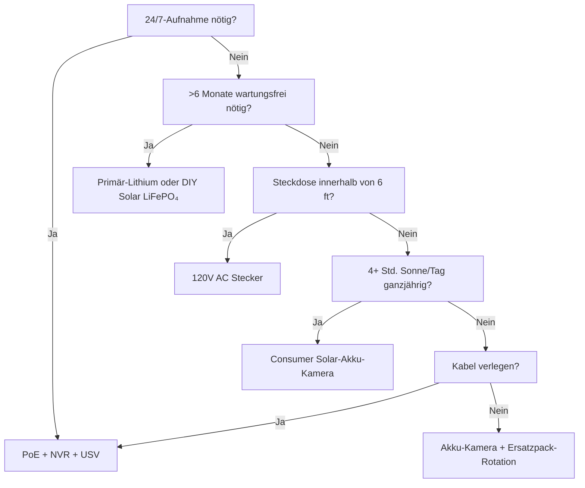

Strom ist der häufigste Grund, warum Überwachungskameras ausfallen. Leerer Akku um 3 Uhr morgens. Gefrorener Li-Ion im Januar. Solarmodul unter Schnee. PoE-Switch für "nur eine Minute" ausgesteckt. Dieser Leitfaden analysiert jede Stromversorgungsarchitektur mit echter Physik, echten Daten und Entscheidungsrahmen, damit Sie einmal richtig wählen und es funktioniert.

<Badge variant="outline">Physik zuerst</Badge> **Energie rein = Energie raus +
Verluste.** Kein Marketing ändert dies. Dimensionieren Sie für den schlechtesten
Fall (kürzester Tag, kälteste Temperatur, höchste Aktivität), nicht den besten.

## Architekturvergleich der Stromversorgung

| Architektur                          | Spannungsquelle      | Max. Entfernung           | Zuverlässigkeit   | Installationsaufwand | Am besten geeignet                         |
| ------------------------------------ | -------------------- | ------------------------- | ----------------- | -------------------- | ------------------------------------------ |
| **120V AC + Adapter**                | Wandsteckdose        | 6 ft (Kabel)              | ★★★★★ (Netz)      | Einfach              | Innen, Veranda, vorhandene Steckdose       |
| **PoE (802.3af/at/bt)**              | PoE-Switch/Injektor  | 328 ft (100 m)            | ★★★★★ (USV)       | Mittel (Kabel)       | **Goldstandard** — 24/7, NVR, Remote       |
| **12V/24V DC Direkt**                | Akkubank / Netzteil  | 50–100 ft (Spannungsabf.) | ★★★★☆             | Mittel               | Off-Grid, Wohnmobil, vorhandener 12V-Bus   |
| **Wiederaufladbarer Li-Ion**         | Interner Akku        | N/V (kabellos)            | ★★☆☆☆ (saisonal)  | Einfach              | Mieter, temporär, Bereiche ohne Kabel      |
| **Primär-Lithium (nicht aufladbar)** | Interner Akku        | N/V                       | ★★★☆☆ (1–2 Jahre) | Einfach              | Wildkameras, extrem abgelegen, keine Sonne |
| **Solar + wiederaufladbar**          | Sonne → Modul → Akku | N/V                       | ★★★☆☆ (Wetter)    | Einfach–Mittel       | Zaun, Tor, Schuppen, Off-Grid              |
| **Hybrid: PoE + Akku-Backup**        | PoE + USV/Intern     | 328 ft                    | ★★★★★             | Höher                | Kritische Eingänge, Kennzeichen            |

<Callout type="warning">

**Marketing vs Realität:** "6 Monate Akkulaufzeit" = 10
Bewegungsereignisse/Tag, 10s Clips, 70°F, keine Live-Ansicht. **Realität:**
20–40 Ereignisse/Tag + 5 Live-Ansichten = **2–6 Wochen**. Immer 3–5× abwerten.

</Callout>

## Tiefer Einblick: Jede Architektur

### 1. PoE (Power over Ethernet) — Die professionelle Wahl

<Accordion type="single" collapsible>
  <AccordionItem value="poe-basics">
    <AccordionTrigger>Wie PoE funktioniert & Standards</AccordionTrigger>
    <AccordionContent>

<strong>IEEE 802.3af (PoE):</strong> 15,4W am PSE → 12,95W am PD (Kamera).
Versorgt die meisten festen Bullet-/Dome-Kameras.
<strong>IEEE 802.3at (PoE+):</strong> 30W am PSE → 25,5W am PD. Versorgt PTZ,
Heizungen, IR-Strahler.
<strong>IEEE 802.3bt (PoE++):</strong> 60W (Typ 3) / 90W (Typ 4) am PSE → 51W /
71W am PD. Versorgt Speed-Domes, Multi-Sensor, Wischer/Heizungen.

<strong>Kabel:</strong> Cat5e Minimum (Cat6/6a für PoE++). Max. 100 m (328 ft)
pro Segment.
<strong>Topologie:</strong> Kamera → Cat5e/6 → PoE-Switch (oder NVR mit
PoE-Ports) → USV → Netz.
<strong>Spannung:</strong> 44–57V DC auf den Aderpaaren (Mode A: Datenpaare /
Mode B: Reservepaare). Die Kamera wandelt intern per DC-DC auf 12V/5V/3,3V um.

</AccordionContent>

  </AccordionItem>
  <AccordionItem value="poe-ups">
    <AccordionTrigger>USV-Dimensionierung für PoE (Kritisch für 24/7)</AccordionTrigger>
    <AccordionContent>

<strong>Regel:</strong> Die USV muss
<strong>alle PoE-Switch-Ports + NVR + Router</strong> für die gewünschte
Laufzeit abdecken.

| Last                                    | Typische Watt          | 4-Std.-Laufzeit (Wh)    | 12-Std.-Laufzeit (Wh)     | 24-Std.-Laufzeit (Wh)     |
| --------------------------------------- | ---------------------- | ----------------------- | ------------------------- | ------------------------- |
| 8-Port PoE+ Switch (4 Cams)             | 45W                    | 180 Wh                  | 540 Wh                    | 1.080 Wh                  |
| 16-Port PoE+ Switch (12 Cams)           | 120W                   | 480 Wh                  | 1.440 Wh                  | 2.880 Wh                  |
| NVR (8-Schacht, 2 HDD)                  | 35W                    | 140 Wh                  | 420 Wh                    | 840 Wh                    |
| Router/Modem                            | 15W                    | 60 Wh                   | 180 Wh                    | 360 Wh                    |
| <strong>Gesamt (12-Cam-System)</strong> | <strong>~170W</strong> | <strong>680 Wh</strong> | <strong>2.040 Wh</strong> | <strong>4.080 Wh</strong> |

<strong>USV-Empfehlung:</strong>

<ul>
  <li>
    <strong>&lt;4 Std.:</strong> CyberPower CP1500PFCLCD (1.500 VA / 1.050 Wh) —
    $200
  </li>
  <li>
    <strong>8–12 Std.:</strong> APC SMT1500RM2UC + externer Akkupack — $600+
  </li>
  <li>
    <strong>24+ Std.:</strong> 48V LiFePO₄-Server-Rack-Akku (5–10 kWh) + Victron
    Wechselrichter/Ladegerät — $2.000+
  </li>
</ul>

<strong>Pro-Tipp:</strong> PoE-Switch + NVR + Router an
<strong>dieselbe USV</strong>. Kamera-seitige USV (pro Kamera) existiert, kostet
aber 5× mehr für dieselbe Laufzeit.

</AccordionContent>

  </AccordionItem>
</Accordion>

### 2. Wiederaufladbare Akku-Kameras — Die Bequemlichkeitsfalle

<Callout type="note">

**Chemie:** Fast alle Consumer-Akku-Kameras verwenden **Li-Ion (NMC/LCO),
3,6–3,7V Nennspannung, 4,2V max**. Nicht LiFePO₄. Das ist wichtig für Kälte.

</Callout>

**Reale Akkulaufzeit (Modelle 2025–2026, 1080p/2K/4K)**

| Kamera                | Akku                 | Behauptet | **Real (Hohe Akt.)** | **Real (Niedrige Akt.)** | Lademethode                     |
| --------------------- | -------------------- | --------- | -------------------- | ------------------------ | ------------------------------- |
| EufyCam 3 S330        | 13.000 mAh           | 365 Tage  | 14–21 Tage           | 90–120 Tage              | USB-C (5V) / Solar              |
| Reolink Argus 4 Pro   | 9.600 mAh            | 6 Monate  | 10–18 Tage           | 60–90 Tage               | USB-C (5V) / Solar              |
| Ring Stick Up Cam Pro | 6.000 mAh            | 6 Monate  | 7–14 Tage            | 45–60 Tage               | USB-C (5V) / Solar / Stecker    |
| Arlo Pro 5S 2K        | 5.200 mAh            | 6 Monate  | 5–10 Tage            | 30–45 Tage               | Magnetisch (proprietär) / Solar |
| Blink Outdoor 4       | 2× AA Li (3.000 mAh) | 2 Jahre   | 60–90 Tage           | 180–365 Tage             | AA ersetzen (nicht aufladbar)   |
| Wyze Cam Outdoor v2   | 5.200 mAh            | 6 Monate  | 10–16 Tage           | 50–75 Tage               | Micro-USB / Solar               |
| Reolink Go PT Plus    | 7.800 mAh            | 3 Monate  | 8–14 Tage            | 40–60 Tage               | USB-C / Solar / 12V             |

**Hohe Aktivität =** 30+ Bewegungser.-/Tag + 3 Live-Ansichten/Tag + IR an
**Niedrige Aktivität =** 5 Ereignisse/Tag + 0 Live-Ansichten + nur tagsüber

<Accordion type="single" collapsible>
  <AccordionItem value="battery-physics">
    <AccordionTrigger>
      Warum die Akkulaufzeit einbricht (Physik)
    </AccordionTrigger>
    <AccordionContent>

<ol>
  <li>
    <strong>Tx-Leistung dominiert:</strong> WLAN-Funk bei +17 dBm = 300–500 mA @
    3,7V.
  </li>
</ol>
<ol>
  <li>
    <strong>IR-LEDs:</strong> 850 nm IR bei 100 ft = 1–2W für 30s/Clip. 30 Clips
    = 0,25–0,5 Wh = <strong>70–140 mAh @ 3,7V</strong>.
  </li>
  <li>
    <strong>PIR-Aufwachen + DSP:</strong> 50–100 mA für 2–5s pro Ereignis.
    Allein vernachlässigbar, summiert sich.
  </li>
</ol>
<ol>
  <li>
    <strong>Kälte:</strong> Li-Ion{" "}
    <strong>Innenwiderstand verdoppelt sich bei 0°C.</strong> Spannung
  </li>
</ol>
<ol>
  <li>
    <strong>Selbstentladung:</strong> 2–5%/Monat. Unerheblich vs. aktiven
    Verbrauch.
  </li>
  <li>
    <strong>Live-Ansicht:</strong> 5 Minuten Live-Ansicht = Energie von 30+
    Clips. <strong>Tägliche Live-Kontrollen vermeiden.</strong>
  </li>
</ol>

    </AccordionContent>

  </AccordionItem>
  <AccordionItem value="charging">
    <AccordionTrigger>Ladestrategien, die funktionieren</AccordionTrigger>
    <AccordionContent>

      <strong>Nicht auf 0% warten.</strong> Li-Ion hasst Tiefentladung. Bei 20–30% laden.
      <strong>Solarmodul-Dimensionierung:</strong> Modul (W) ≥ Kamera-Durchschnittsverbrauch
      (W) × 3 (Winter/bewölkt) ÷ Spitzen-Sonnenstunden (schlechtester Monat). -
      Beispiel: Argus 4 Pro durchschnittlich 1,5W → 4,5W benötigt. Schlechtester
      Monat (Dez., Zone 5) = 1,5 Spitzen-Std. → <strong>3W-Modul Minimum, 6W
      empfohlen</strong>. <strong>USB-C-PD-Triggerkabel:</strong> Reolink/Argus/Eufy akzeptieren
        5V/9V/12V/15V/20V via PD-Aushandlung. Verwenden Sie das
        12V→USB-C-PD-Triggerkabel, um direkt vom 12V-Wohnmobil-/Haus-Akku zu laden
      (90% Effizienz vs. 12V→120V Wechselrichter→5V-Adapter bei 60%).
      <strong>Zwei-Akku-Rotation:</strong> Ersatzpack kaufen. Geladen gegen entladen
      tauschen. Null Ausfallzeit. Funktioniert nur mit vom Benutzer entfernbaren
      Packs (Reolink, Blink, einige Ring).

    </AccordionContent>

  </AccordionItem>
</Accordion>

### 3. Primär-Lithium (nicht wiederaufladbar) — Der Langstrecken-Spezialist

| Akku-Typ                          | Chemie   | Spannung | Kapazität  | Temperaturbereich | Am besten geeignet                |
| --------------------------------- | -------- | -------- | ---------- | ----------------- | --------------------------------- |
| **Energizer Ultimate Lithium AA** | Li/FeS₂  | 1,5V     | 3.000 mAh  | -40°F bis 140°F   | Blink, Wildkameras, -40°F-Betrieb |
| **Tadiran TL-5930 (D-Zelle)**     | Li/SOCl₂ | 3,6V     | 19.000 mAh | -67°F bis 185°F   | Pipeline, Fernmessung, 5–10 Jahre |
| **Saft LS 14500 (AA)**            | Li/SOCl₂ | 3,6V     | 2.600 mAh  | -60°F bis 185°F   | Industrie, ATEX-Zonen             |

**Vorteile:** 10–20× Energiedichte vs. Alkali; funktioniert bei -40°F; 10–20 Jahre Lagerfähigkeit; kein Ladekreis nötig
**Nachteile:** **Nicht wiederaufladbar**; $2–10/Zelle; Spannungsplateau erschwert Füllstandsmessung; Passivierung (Spannungsverzögerung nach langer Ruhe)
**Anwendungsfall:** Wildkamera auf dem Pirschpfad, vierteljährlich überprüft; Pipeline-Sensor; Antarktis-Forschungskamera. **Nicht für den täglichen Sicherheitseinsatz.**

### 4. Solar + Akku — Off-Grid-Technik

<Callout type="info">

**Solar ist ein Akku-Ladegerät, keine Stromquelle.** Dimensionieren Sie den
**Akku** für Autonomie (Tage ohne Sonne). Dimensionieren Sie das **Modul**, um
diesen Akku an einem guten Tag zu laden.

</Callout>

**Systemdimensionierungs-Arbeitsblatt**

```
  1. Durchschnittliche Kamera-Leistung (W) × 24h = Wh/Tag benötigt
   Beispiel: Reolink Go PT Plus = 2,5W Durchschnitt → 60 Wh/Tag

  2. Akku-Autonomie (Tage ohne Sonne) × Wh/Tag = Akku-Wh
     3 Tage Autonomie → 180 Wh
   LiFePO₄ 12,8V → 180 Wh ÷ 12,8V = 14 Ah → **20 Ah Pack (20% Reserve)**

  3. Spitzen-Sonnenstunden (SSS) des schlechtesten Monats × Modul-Watt × 0,75 (Verluste) = Wh/Tag Ertrag
   Dez., Zone 5: 1,5 SSS × Modul-W × 0,75 = 60 Wh → Modul = 53W → **60W-Modul**

  4. Laderegler: MPPT (95% Wirk.) vs PWM (75% Wirk.). **Immer MPPT für >20W.**
   Victron SmartSolar 75/10, 75/15, 100/20 — Bluetooth, programmierbar, zuverlässig.

  5. Montage: Südausrichtung (NH), Breitengrad-Neigung (30–45°), **kein Schatten 9–15 Uhr am 21. Dez.**.
   Verstellbare Bodenmontage > Dach > Zaunpfosten.
```

**Reale Solar-Kamera-Kits (2026)**

| Kit                                                               | Modul             | Akku            | Regler       | Kamera                      | Winter Zone 5 Laufzeit                     |
| ----------------------------------------------------------------- | ----------------- | --------------- | ------------ | --------------------------- | ------------------------------------------ |
| Reolink 6W + Argus 4 Pro                                          | 6W (fest)         | 9,6 Ah (intern) | Intern (PWM) | Argus 4 Pro                 | **Fällt Dez–Feb aus** (Modul zu klein)     |
| Reolink 20W + Go PT Plus                                          | 20W (verstellb.)  | 7,8 Ah (intern) | Intern       | Go PT Plus                  | **Grenzwertig** (ext. 20Ah LiFePO₄)        |
| EufyCam 3 + Solar                                                 | 2,4W (integriert) | 13 Ah (intern)  | Intern       | EufyCam 3                   | **Fällt Nov–Mär aus** (Modul winzig)       |
| **DIY: 60W + 20Ah LiFePO₄ + Victron + Go PT Plus**                | 60W               | 256 Wh          | MPPT         | Go PT Plus                  | **95% Betriebszeit** (technisch)           |
| **DIY: 100W + 40Ah LiFePO₄ + Victron + PoE-Injektor + 4K Bullet** | 100W              | 512 Wh          | MPPT         | Reolink RLC-1212A + 12V→PoE | **99% Betriebszeit** (echtes Off-Grid PoE) |

<Accordion type="single" collapsible>
  <AccordionItem value="winter">
    <AccordionTrigger>Solar-Realitätscheck im Winter (Zone 4–6)</AccordionTrigger>
    <AccordionContent>

<strong>Wintersonnenwende (Zone 5, 42°N):</strong>
<ul>
  <li>
    Spitzen-Sonnenstunden: <strong>1,0–1,5</strong> (vs. 5,5 im Juni)
  </li>
  <li>
    Modulleistung bei 30° Neigung: <strong>15–20% der STC-Nennleistung</strong>
  </li>
  <li>
    Schneebedeckung: <strong>0% Leistung</strong> bis zur Reinigung
    (selbstheizende Module existieren: 5–10W parasitäre Last)
  </li>
  <li>
    Akku bei -10°C:{" "}
    <strong>Li-Ion = 50% Kapazität; LiFePO₄ = 80% Kapazität</strong>
  </li>
</ul>

<strong>Überlebensstrategien:</strong>

<ol>
  <li>
    <strong>Modul 3–4× überdimensionieren</strong> (60W → 180–240W Array)
  </li>
  <li>
    <strong>LiFePO₄-Akku</strong> (nicht Li-Ion) — lädt bei -20°C mit
    BMS-Heizung
  </li>
  <li>
    <strong>Kamera-Tastverhältnis reduzieren:</strong> Nur bei Bewegung,
    niedrigere Auflösung, kürzere Clips, IR deaktivieren (Umgebungslicht nutzen)
  </li>
  <li>
    <strong>Backup-Ladung:</strong> 12V→USB-C-PD-Triggerkabel von
    Fahrzeug/Generator monatlich
  </li>
  <li>
    <strong>Ausfallzeiten akzeptieren:</strong> Für 90% Betriebszeit auslegen,
    nicht 100%. 3–5 dunkle Tage/Jahr sind normal.
  </li>
</ol>

</AccordionContent>
   </AccordionItem>
</Accordion>

### 5. 12V/24V DC Direkt — Die Wohnmobil-/Off-Grid-Lösung

**Warum 12V DC?** Kein Wechselrichterverlust (120V AC → 12V DC = 15–25% Verlust). Die Kamera läuft intern bereits mit 12V.

**Verdrahtung einer 12V-Kamera direkt:**

```
Haus-Akku (12V LiFePO₄)
  → 10A Flachsicherung
  → 18 AWG verzinntes Marinekabel (rot/schwarz)
  → Wasserdichter Deutsch / SAE / Anderson Stecker
  → Kamera 12V Eingang (Polarität prüfen!)
  → **Buck-Wandler** falls Kamera 5V/9V benötigt (die meisten PoE-Kameras brauchen 48V → 12V→48V PoE-Injektor)
```

**Spannungsabfall-Rechner:**

```
Vdrop = (2 × Länge_ft × Strom_A × 0,000016) / Kabel_CM
  18 AWG (1.624 CM), 50 ft, 1A → 0,98V Abfall (8% bei 12V) — AKZEPTABEL
  18 AWG, 100 ft, 1A → 1,96V Abfall (16%) — 16 AWG (2.583 CM) → 1,2V (10%)
```

**Regel:** 12V-Leitungen &lt;50 ft mit 18 AWG; &lt;100 ft mit 14 AWG. Oder 24V/48V-Verteilung + Abwärtswandler an der Kamera.

**12V→PoE-Injektoren (PoE-Kameras mit 12V-Akku betreiben):**

- Tycon POE-12-48V (12V ein → 48V PoE aus, 15W) — $25
- Ubiquiti INJ-12V-48V (12V → 48V PoE+, 30W) — $35
- Industriell: Mean Well NDR-120-48 (120W DIN-Schiene) + PoE-Splitter — $60
- **Wirkungsgrad:** 85–92%. Kamera sieht Standard-PoE — keine Firmware-Hacks.

### 6. Hybrid: PoE + Akku-Backup (Null Ausfallzeit)

**Architektur:** Kamera → PoE-Switch → USV (LiFePO₄) → Netz.
**Plus:** Kamera hat internen Akku (Reolink Go PT Plus, Arlo Go 2) ODER externe USV pro Kamera.

| Ansatz                                | Kosten     | Laufzeit (pro Kamera) | Komplexität |
| ------------------------------------- | ---------- | --------------------- | ----------- |
| Zentrale USV (Switch+NVR)             | $200–2.000 | Stunden–Tage          | Niedrig     |
| Pro-Kamera-USV (APC BE600M1)          | $60×N      | 30–60 Min.            | Mittel      |
| Kamera mit internem Akku (Go PT Plus) | $230       | 2–4 Wochen (Solar)    | Niedrig     |
| **PoE + 12V LiFePO₄ + Auto-Switch**   | $150/Cam   | Tage–Wochen           | Hoch        |

**Das Beste aus beiden Welten:** PoE für 24/7-Aufnahme + NVR. Interner Akku für **Aufnahme bei Netzausfall** (letzte 30 Min. bevor USV stirbt). Reolink Go PT Plus macht das nativ — zeichnet auf microSD auf, wenn PoE ausfällt.

## Gesamtbetriebskosten (5 Jahre)

| Architektur                             | Jahr 1 | Jahr 2–5 (Jährlich)      | 5-J.-Gesamt | Am besten geeignet              |
| --------------------------------------- | ------ | ------------------------ | ----------- | ------------------------------- |
| **PoE + NVR + USV**                     | $1.500 | $50 (HDD-Ersatz)         | **$1.700**  | Dauerhaft, 24/7, 8+ Kameras     |
| **Akku + Solar (DIY LiFePO₄)**          | $800   | $0                       | **$800**    | Off-Grid, 1–4 Kameras, DIY      |
| **Akku-Kamera + Solarmodul (Consumer)** | $500   | $50 (Akkuwechsel Jahr 3) | **$700**    | Miete, keine Kabel, 1–2 Cams    |
| **Primär-Lithium (Wildkamera)**         | $300   | $100 (Zellen/Jahr)       | **$700**    | Extrem abgelegen, vierteljährl. |
| **120V AC Stecker**                     | $200   | $10                      | **$240**    | Innen, Veranda, Steckdose da    |

<Callout type="tip">

**Versteckte Kosten:** Anfahrt. Akku-Kamera stirbt um 3 Uhr → 30 Min. fahren
zum Tausch = $50/Mal. PoE + USV = 0 Anfahrt wegen Strom. $50 × erwartete
Ausfälle/Jahr einkalkulieren.

</Callout>

## Entscheidungsmatrix: Wählen Sie Ihre Architektur



## Schnell-Checkliste für Ihre Kamera

- [ ] **PoE:** 802.3af (15W) / at (30W) / bt (60/90W) — Switch anpassen
- [ ] **12V DC:** Akzeptiert 10–14V? Verpolungsschutz? Steckertyp?
- [ ] **Akku:** Herausnehmbar? Chemie (Li-Ion vs LiFePO₄)? mAh @ 3,7V? Laden via USB-C PD?
- [ ] **Solar:** Modul-Watt? MPPT oder PWM? Kabellänge? Halterung verstellbar?
- [ ] **Betriebstemp.:** -20°C Minimum für Li-Ion; -40°C für LiFePO₄/Primär
- [ ] **Stromverbrauch:** Datenblatt "max" vs "typisch" — für typisch × 1,5 auslegen
- [ ] **Niedrige Akku-Warnung:** App-Push bei 20%? Auto-Abschalt-Schwelle?
- [ ] **USV-Kompatibilität:** NVR + Switch an derselben USV? Laufzeit berechnet?

---

## Verwandte Leitfäden

- [Beste solarbetriebene Überwachungskameras (Off-Grid)](/blog/best-solar-powered-security-cameras-offgrid) — Modul-/Akku-Dimensionierung
- [Beste Überwachungskameras für Wohnmobile & Mobilheime](/blog/best-security-cameras-for-rvs-mobile-homes) — 12V DC, Vibration, Mobilfunk
- [PoE vs Wireless vs Solar im Vergleich](/blog/poe-vs-wireless-vs-solar-comparison) — Entscheidungsrahmen
- [Kabellose Kamera-Einrichtung: DIY-Installationstipps](/blog/wireless-camera-setup-diy-installation-tips) — WLAN, Akku, Montage
