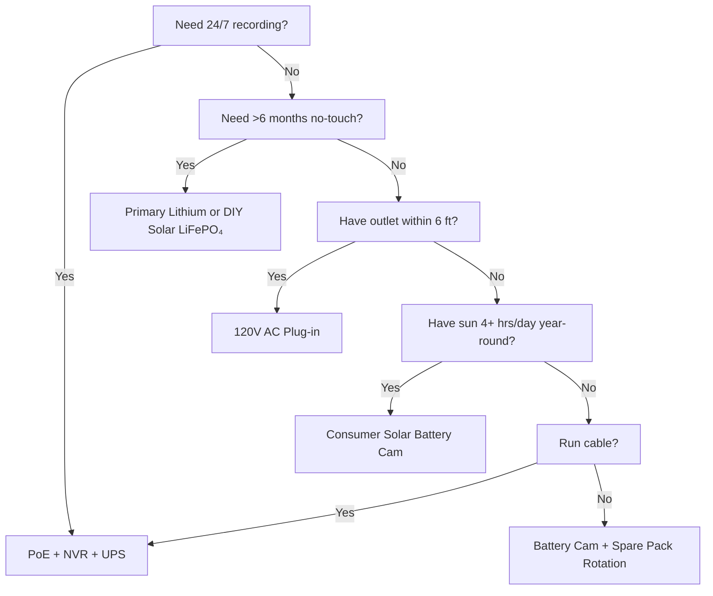

import { Callout } from "@/components/ui/callout"
import { Badge } from "@/components/ui/badge"
import { Accordion, AccordionItem, AccordionTrigger, AccordionContent } from "@/components/ui/accordion"

Power is the #1 reason security cameras fail. Dead battery at 3 AM. Frozen Li-ion in January. Solar panel buried in snow. PoE switch unplugged for "just a minute." This guide breaks down every power architecture with real physics, real data, and decision frameworks so you pick once and it works.

<Badge variant="outline">Physics First</Badge> **Energy in = Energy out + Losses.** No marketing changes this. Size your source for worst-case (shortest day, coldest temp, highest activity), not best-case.

## Power Architecture Comparison

| Architecture | Voltage Source | Max Distance | Reliability | Install Complexity | Best For |
|--------------|----------------|--------------|-------------|-------------------|----------|
| **120V AC + Adapter** | Wall outlet | 6 ft (cord) | ★★★★★ (grid) | Trivial | Indoor, porch, existing outlet |
| **PoE (802.3af/at/bt)** | PoE Switch/Injector | 328 ft (100 m) | ★★★★★ (UPS-backed) | Moderate (cable) | **Gold standard** — 24/7, NVR, remote |
| **12V/24V DC Direct** | Battery bank / PSU | 50–100 ft (voltage drop) | ★★★★☆ | Moderate | Off-grid, RV, existing 12V bus |
| **Rechargeable Li-ion** | Internal battery | N/A (wireless) | ★★☆☆☆ (seasonal) | Trivial | Renters, temp, no-cable zones |
| **Primary Lithium (Non-rechargeable)** | Internal battery | N/A | ★★★☆☆ (1–2 yr) | Trivial | Trail cams, ultra-remote, no sun |
| **Solar + Rechargeable** | Sun → Panel → Battery | N/A | ★★★☆☆ (weather) | Easy–Moderate | Fence, gate, shed, off-grid |
| **Hybrid: PoE + Battery Backup** | PoE + UPS/Internal | 328 ft | ★★★★★ | Higher | Critical entry, license plate |

<Callout type="warning">
**Marketing vs Reality:** "6-month battery life" = 10 motion events/day, 10s clips, 70°F, no live view. **Real world:** 20–40 events/day + 5 live views = **2–6 weeks**. Always derate 3–5×.
</Callout>

## Deep Dive: Each Architecture

### 1. PoE (Power over Ethernet) — The Professional Choice

<Accordion type="single" collapsible>
  <AccordionItem value="poe-basics">
    <AccordionTrigger>How PoE Works & Standards</AccordionTrigger>
    <AccordionContent>
**IEEE 802.3af (PoE):** 15.4W at PSE → 12.95W at PD (camera). Powers most fixed bullets/domes.
**IEEE 802.3at (PoE+):** 30W at PSE → 25.5W at PD. Powers PTZ, heaters, IR illuminators.
**IEEE 802.3bt (PoE++):** 60W (Type 3) / 90W (Type 4) at PSE → 51W / 71W at PD. Powers speed domes, multi-sensor, wipers/heaters.

**Cable:** Cat5e minimum (Cat6/6a for PoE++). Max 100 m (328 ft) per segment.
**Topology:** Camera → Cat5e/6 → PoE Switch (or NVR with PoE ports) → UPS → Grid.
**Voltage:** 44–57V DC on wire pairs (Mode A: data pairs / Mode B: spare pairs). Camera DC-DC converts to 12V/5V/3.3V internally.
    </AccordionContent>
  </AccordionItem>
  <AccordionItem value="poe-ups">
    <AccordionTrigger>UPS Sizing for PoE (Critical for 24/7)</AccordionTrigger>
    <AccordionContent>
**Rule:** UPS must cover **all PoE switch ports + NVR + router** for target runtime.

| Load | Typical Watts | 4-hr Runtime (Wh) | 12-hr Runtime (Wh) | 24-hr Runtime (Wh) |
|------|---------------|-------------------|--------------------|--------------------|
| 8-port PoE+ Switch (4 cams) | 45W | 180 Wh | 540 Wh | 1,080 Wh |
| 16-port PoE+ Switch (12 cams) | 120W | 480 Wh | 1,440 Wh | 2,880 Wh |
| NVR (8-bay, 2 HDD) | 35W | 140 Wh | 420 Wh | 840 Wh |
| Router/Modem | 15W | 60 Wh | 180 Wh | 360 Wh |
| **Total (12-cam system)** | **~170W** | **680 Wh** | **2,040 Wh** | **4,080 Wh** |

**UPS Recommendation:** 
- **<4 hrs:** CyberPower CP1500PFCLCD (1,500 VA / 1,050 Wh) — $200
- **8–12 hrs:** APC SMT1500RM2UC + external battery pack — $600+
- **24+ hrs:** 48V LiFePO₄ server rack battery (5–10 kWh) + Victron inverter/charger — $2,000+

**Pro Tip:** Put PoE switch + NVR + router on **same UPS**. Camera-side UPS (per-camera) exists but costs 5× more for same runtime.
    </AccordionContent>
  </AccordionItem>
</Accordion>

### 2. Rechargeable Battery Cameras — The Convenience Trap

<Callout type="note">
**Chemistry:** Almost all consumer battery cams use **Li-ion (NMC/LCO), 3.6–3.7V nominal, 4.2V max**. Not LiFePO₄. This matters for cold.
</Callout>

**Real-World Battery Life (2025–2026 Models, 1080p/2K/4K)**

| Camera | Battery | Claimed | **Real (High Activity)** | **Real (Low Activity)** | Charge Method |
|--------|---------|---------|--------------------------|-------------------------|---------------|
| EufyCam 3 S330 | 13,000 mAh | 365 days | 14–21 days | 90–120 days | USB-C (5V) / Solar |
| Reolink Argus 4 Pro | 9,600 mAh | 6 months | 10–18 days | 60–90 days | USB-C (5V) / Solar |
| Ring Stick Up Cam Pro | 6,000 mAh | 6 months | 7–14 days | 45–60 days | USB-C (5V) / Solar / Plug-in |
| Arlo Pro 5S 2K | 5,200 mAh | 6 months | 5–10 days | 30–45 days | Magnetic (proprietary) / Solar |
| Blink Outdoor 4 | 2× AA Li (3,000 mAh) | 2 years | 60–90 days | 180–365 days | Replace AA (non-rech) |
| Wyze Cam Outdoor v2 | 5,200 mAh | 6 months | 10–16 days | 50–75 days | Micro-USB / Solar |
| Reolink Go PT Plus | 7,800 mAh | 3 months | 8–14 days | 40–60 days | USB-C / Solar / 12V |

**High Activity =** 30+ motion events/day + 3 live views/day + night IR on  
**Low Activity =** 5 events/day + 0 live views + day only

<Accordion type="single" collapsible>
  <AccordionItem value="battery-physics">
    <AccordionTrigger>Why Battery Life Collapses (Physics)</AccordionTrigger>
    <AccordionContent>
1. **Tx Power Dominates:** Wi-Fi radio at +17 dBm = 300–500 mA @ 3.7V. 10s clip = 5–10 mAh. 30 clips = 150–300 mAh/day = **3–6% of 5,000 mAh/day**.
2. **IR LEDs:** 850 nm IR at 100 ft = 1–2W for 30s/clip. 30 clips = 0.25–0.5 Wh = **70–140 mAh @ 3.7V**.
3. **PIR Wake + DSP:** 50–100 mA for 2–5s per event. Negligible alone, adds up.
4. **Cold Temp:** Li-ion **internal resistance doubles resistance at 32°F (0°C)**. Voltage sags under Tx load → BMS cuts off at 3.0V → "dead" battery at 40% SoC. **Capacity at 14°F (-10°C) ≈ 50% of 70°F.**
5. **Self-Discharge:** 2–5%/month. Negligible vs active drain.
6. **Live View:** 5 min live view = 30+ clips worth of energy. **Avoid daily live checks.**
    </AccordionContent>
  </AccordionItem>
  <AccordionItem value="charging">
    <AccordionTrigger>Charging Strategies That Work</AccordionTrigger>
    <AccordionContent>
**Don't wait for 0%.** Li-ion hates deep discharge. Charge at 20–30%.
**Solar Panel Sizing:** Panel (W) ≥ Camera Avg Draw (W) × 3 (winter/cloudy) ÷ Peak Sun Hours (worst month).
- Example: Argus 4 Pro avg 1.5W → 4.5W needed. Worst month (Dec, Zone 5) = 1.5 peak hrs → **3W panel minimum, 6W recommended**.
**USB-C PD Trigger Cables:** Reolink/Argus/Eufy accept 5V/9V/12V/15V/20V via PD negotiation. Use 12V→USB-C PD trigger cable to charge from 12V RV/house bank directly (90% efficient vs 12V→120V inverter→5V adapter at 60%).
**Dual-Battery Rotation:** Buy spare pack. Swap charged for depleted. Zero downtime. Only works with user-removable packs (Reolink, Blink, some Ring).
    </AccordionContent>
  </AccordionItem>
</Accordion>

### 3. Primary Lithium (Non-Rechargeable) — The Long-Haul Specialist

| Battery Type | Chemistry | Voltage | Capacity | Temp Range | Best For |
|--------------|-----------|---------|----------|------------|----------|
| **Energizer Ultimate Lithium AA** | Li/FeS₂ | 1.5V | 3,000 mAh | -40°F to 140°F | Blink, trail cams, -40°F ops |
| **Tadiran TL-5930 (D-cell)** | Li/SOCl₂ | 3.6V | 19,000 mAh | -67°F to 185°F | Pipeline, remote telemetry, 5–10 yr |
| **Saft LS 14500 (AA)** | Li/SOCl₂ | 3.6V | 2,600 mAh | -60°F to 185°F | Industrial, ATEX zones |

**Pros:** 10–20× energy density vs alkaline; works at -40°F; 10–20 yr shelf life; no charging circuit needed  
**Cons:** **Non-rechargeable**; $2–10/cell; voltage plateau makes fuel gauging hard; passivation (voltage delay after long rest)  
**Use Case:** Trail cam on game trail checked quarterly; pipeline sensor; Antarctic research cam. **Not for daily-use security.**

### 4. Solar + Battery — Off-Grid Engineering

<Callout type="info">
**Solar is a battery charger, not a power source.** Size the **battery** for autonomy (days without sun). Size the **panel** to recharge that battery in 1 good day.
</Callout>

**System Sizing Worksheet**

```
1. Camera avg power (W) × 24h = Wh/day needed
   Example: Reolink Go PT Plus = 2.5W avg → 60 Wh/day

2. Battery autonomy (days without sun) × Wh/day = Battery Wh
   3 days autonomy → 180 Wh
   LiFePO₄ 12.8V → 180 Wh ÷ 12.8V = 14 Ah → **20 Ah pack (20% margin)**

3. Worst-month peak sun hours (PSH) × Panel Watts × 0.75 (losses) = Wh/day harvest
   Dec, Zone 5: 1.5 PSH × Panel W × 0.75 = 60 Wh → Panel = 53W → **60W panel**

4. Charge Controller: MPPT (95% eff) vs PWM (75% eff). **Always MPPT for >20W.**
   Victron SmartSolar 75/10, 75/15, 100/20 — Bluetooth, programmable, reliable.

5. Mount: South-facing (NH), latitude tilt (30–45°), **no shade 9am–3pm Dec 21**.
   Adjustable ground mount > roof > fence post.
```

**Real-World Solar Camera Kits (2026)**

| Kit | Panel | Battery | Controller | Camera | Winter Zone 5 Runtime |
|-----|-------|---------|------------|--------|----------------------|
| Reolink 6W + Argus 4 Pro | 6W (fixed) | 9.6 Ah (internal) | Internal (PWM) | Argus 4 Pro | **Fails Dec–Feb** (panel too small) |
| Reolink 20W + Go PT Plus | 20W (adj) | 7.8 Ah (internal) | Internal | Go PT Plus | **Marginal** (add external 20Ah LiFePO₄) |
| EufyCam 3 + Solar | 2.4W (integrated) | 13 Ah (internal) | Internal | EufyCam 3 | **Fails Nov–Mar** (panel tiny) |
| **DIY: 60W + 20Ah LiFePO₄ + Victron + Go PT Plus** | 60W | 256 Wh | MPPT | Go PT Plus | **95% uptime** (engineered) |
| **DIY: 100W + 40Ah LiFePO₄ + Victron + PoE Injector + 4K Bullet** | 100W | 512 Wh | MPPT | Reolink RLC-1212A + 12V→PoE | **99% uptime** (true off-grid PoE) |

<Accordion type="single" collapsible>
  <AccordionItem value="winter">
    <AccordionTrigger>Winter Solar Reality Check (Zone 4–6)</AccordionTrigger>
    <AccordionContent>
**December Solstice (Zone 5, 42°N):**
- Peak Sun Hours: **1.0–1.5** (vs 5.5 in June)
- Panel output at 30° tilt: **15–20% of STC rating**
- Snow cover: **0% output** until cleared (auto-heated panels exist: 5–10W parasitic)
- Battery at 14°F: **Li-ion = 50% capacity; LiFePO₄ = 80% capacity**

**Survival Strategies:**
1. **Oversize panel 3–4×** summer math (60W → 180–240W array)
2. **LiFePO₄ battery** (not Li-ion) — charges at -4°F with BMS heater
3. **Reduce camera duty cycle:** Motion-only, lower resolution, shorter clips, disable IR (use ambient light)
4. **Backup charge:** 12V→USB-C PD trigger cable from vehicle/genny monthly
5. **Accept downtime:** Design for 90% uptime, not 100%. 3–5 days dark/yr is normal.
    </AccordionContent>
  </AccordionItem>
</Accordion>

### 5. 12V/24V DC Direct — The RV/Off-Grid Native

**Why 12V DC?** No inverter loss (120V AC → 12V DC = 15–25% loss). Camera already runs on 12V internally.

**Wiring a 12V Camera Direct:**
```
House Battery (12V LiFePO₄) 
  → 10A Blade Fuse 
  → 18 AWG Tinned Marine Wire (red/black) 
  → Waterproof Deutsch / SAE / Anderson Connector 
  → Camera 12V Input (verify polarity!)
  → **Buck Converter** if camera needs 5V/9V (most PoE cams need 48V → use 12V→48V PoE Injector)
```

**Voltage Drop Calculator:**
```
Vdrop = (2 × Length_ft × Current_A × 0.000016) / Wire_CM
18 AWG (1,624 CM), 50 ft, 1A → 0.98V drop (8% on 12V) — ACCEPTABLE
18 AWG, 100 ft, 1A → 1.96V drop (16%) — USE 16 AWG (2,583 CM) → 1.2V (10%)
```
**Rule:** Keep 12V runs <50 ft on 18 AWG; <100 ft on 14 AWG. Or use 24V/48V distribution + buck at camera.

**12V→PoE Injectors (Run PoE Cams on 12V Bank):**
- Tycon POE-12-48V (12V in → 48V PoE out, 15W) — $25
- Ubiquiti INJ-12V-48V (12V → 48V PoE+, 30W) — $35
- Industrial: Mean Well NDR-120-48 (120W DIN rail) + PoE splitter — $60
- **Efficiency:** 85–92%. Camera sees standard PoE — no firmware hacks.

### 6. Hybrid: PoE + Battery Backup (Zero Downtime)

**Architecture:** Camera → PoE Switch → UPS (LiFePO₄) → Grid.  
**Plus:** Camera has internal battery (Reolink Go PT Plus, Arlo Go 2) OR external UPS per camera.

| Approach | Cost | Runtime (per cam) | Complexity |
|----------|------|-------------------|------------|
| Central UPS (switch+NVR) | $200–2,000 | Hours–Days | Low |
| Per-camera UPS (APC BE600M1) | $60×N | 30–60 min | Medium |
| Camera w/ internal battery (Go PT Plus) | $230 | 2–4 weeks (solar) | Low |
| **PoE + 12V LiFePO₄ + Auto-switch** | $150/cam | Days–Weeks | High |

**Best of Both Worlds:** PoE for 24/7 recording + NVR. Internal battery for **grid-out recording** (last 30 min before UPS dies). Reolink Go PT Plus does this natively — records to microSD when PoE lost.

## Total Cost of Ownership (5-Year)

| Architecture | Year 1 | Year 2–5 (Annual) | 5-Yr Total | Best For |
|--------------|--------|-------------------|------------|----------|
| **PoE + NVR + UPS** | $1,500 | $50 (HDD replace) | **$1,700** | Permanent, 24/7, 8+ cams |
| **Battery + Solar (DIY LiFePO₄)** | $800 | $0 | **$800** | Off-grid, 1–4 cams, DIY |
| **Battery Cam + Solar Panel (Consumer)** | $500 | $50 (battery replace yr 3) | **$700** | Rental, no wires, 1–2 cams |
| **Primary Lithium (Trail Cam)** | $300 | $100 (cells/yr) | **$700** | Ultra-remote, quarterly check |
| **120V AC Plug-in** | $200 | $10 | **$240** | Indoor, porch, outlet exists |

<Callout type="tip">
**Hidden Cost:** Truck rolls. Battery cam dies at 3 AM → you drive 30 min to swap = $50/time. PoE + UPS = 0 truck rolls for power. Factor $50 × expected failures/yr.
</Callout>

## Decision Matrix: Choose Your Architecture



## Quick Spec Checklist for Your Camera

- [ ] **PoE:** 802.3af (15W) / at (30W) / bt (60/90W) — match switch
- [ ] **12V DC:** Accepts 10–14V? Reverse polarity protection? Connector type?
- [ ] **Battery:** Removable? Chemistry (Li-ion vs LiFePO₄)? mAh @ 3.7V? Charge via USB-C PD?
- [ ] **Solar:** Panel watts? MPPT or PWM? Cable length? Mount adjustability?
- [ ] **Operating Temp:** -4°F / -20°C minimum for Li-ion; -40°F for LiFePO₄/primary
- [ ] **Power Draw:** Spec sheet "max" vs "typical" — design for typical × 1.5
- [ ] **Low Battery Alert:** App push at 20%? Auto-shutdown threshold?
- [ ] **UPS Compatibility:** NVR + Switch on same UPS? Runtime calculated?

---

## Related Guides

- [Best Solar-Powered Security Cameras (Off-Grid)](/blog/best-solar-powered-security-cameras-offgrid) — Panel/battery sizing deep dive
- [Best Security Cameras for RVs & Mobile Homes](/blog/best-security-cameras-for-rvs-mobile-homes) — 12V DC, vibration, cellular
- [PoE vs Wireless vs Solar Comparison](/blog/poe-vs-wireless-vs-solar-comparison) — Decision framework
- [Wireless Camera Setup: DIY Installation Tips](/blog/wireless-camera-setup-diy-installation-tips) — Wi-Fi, battery, mounting