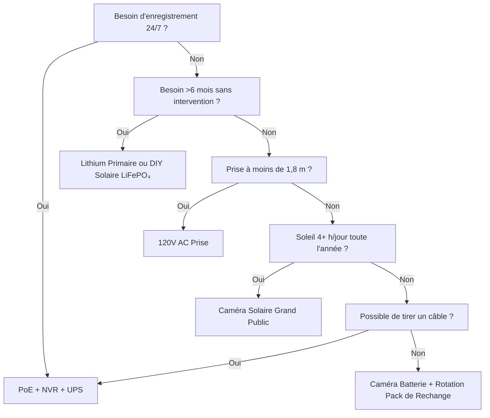

L'alimentation est la raison n°1 pour laquelle les caméras de sécurité tombent en panne. Batterie morte à 3 heures du matin. Li-ion gelé en janvier. Panneau solaire enterré sous la neige. Commutateur PoE débranché pour "une minute seulement". Ce guide détaille chaque architecture d'alimentation avec de la vraie physique, de vraies données et des cadres de décision pour que vous choisissiez une fois et que ça fonctionne.

<Badge variant="outline">La Physique d'Abord</Badge> **Énergie entrante =
Énergie sortante + Pertes.** Aucun marketing ne change cela. Dimensionnez votre
source pour le pire cas (jour le plus court, température la plus froide,
activité la plus élevée), pas le meilleur cas.

## Comparaison des Architectures d'Alimentation

| Architecture                            | Source de Tension           | Distance Max            | Fiabilité          | Complexité d'Installation | Idéal Pour                                      |
| --------------------------------------- | --------------------------- | ----------------------- | ------------------ | ------------------------- | ----------------------------------------------- |
| **120V AC + Adaptateur**                | Prise murale                | 1,8 m (cordon)          | ★★★★★ (réseau)     | Triviale                  | Intérieur, porche, prise existante              |
| **PoE (802.3af/at/bt)**                 | Commutateur/Injecteur PoE   | 100 m                   | ★★★★★ (UPS)        | Modérée (câble)           | **Étalon-or** — 24/7, NVR, distant              |
| **12V/24V DC Direct**                   | Banque de batteries / ALIM  | 15–30 m (chute tension) | ★★★★☆              | Modérée                   | Hors réseau, camping-car, bus 12V existant      |
| **Li-ion Rechargeable**                 | Batterie interne            | N/A (sans fil)          | ★★☆☆☆ (saisonnier) | Triviale                  | Locataires, temporaire, zones sans câble        |
| **Lithium Primaire (Non rechargeable)** | Batterie interne            | N/A                     | ★★★☆☆ (1–2 ans)    | Triviale                  | Caméras de chasse, ultra-éloigné, pas de soleil |
| **Solaire + Rechargeable**              | Soleil → Panneau → Batterie | N/A                     | ★★★☆☆ (météo)      | Facile–Modérée            | Clôture, portail, hangar, hors réseau           |
| **Hybride : PoE + Batterie de Secours** | PoE + UPS/Interne           | 100 m                   | ★★★★★              | Plus élevée               | Entrée critique, plaque d'immatriculation       |

<Callout type="warning">

**Marketing vs Réalité :** "Autonomie de 6 mois" = 10 événements de
mouvement/jour, clips de 10 s, 21 °C, pas de vue en direct. **Monde réel :**
20–40 événements/jour + 5 vues en direct = **2–6 semaines**. Réduisez toujours
de 3–5×.

</Callout>

## Analyse Approfondie : Chaque Architecture

### 1. PoE (Power over Ethernet) — Le Choix Professionnel

<Accordion type="single" collapsible>
  <AccordionItem value="poe-basics">
    <AccordionTrigger>Fonctionnement et Normes PoE</AccordionTrigger>
    <AccordionContent>

<strong>IEEE 802.3af (PoE) :</strong> 15,4W au PSE → 12,95W au PD (caméra).
Alimente la plupart des bullets/dômes fixes.
<strong>IEEE 802.3at (PoE+) :</strong> 30W au PSE → 25,5W au PD. Alimente PTZ,
chauffages, illuminateurs IR.
<strong>IEEE 802.3bt (PoE++) :</strong> 60W (Type 3) / 90W (Type 4) au PSE → 51W
/ 71W au PD. Alimente speed domes, multi-capteurs, essuie-glaces/chauffages.

<strong>Câble :</strong> Cat5e minimum (Cat6/6a pour PoE++). Max 100 m par
segment.
<strong>Topologie :</strong> Caméra → Cat5e/6 → Commutateur PoE (ou NVR avec
ports PoE) → UPS → Réseau.
<strong>Tension :</strong> 44–57V DC sur les paires de fils.

</AccordionContent>

  </AccordionItem>
  <AccordionItem value="poe-ups">
    <AccordionTrigger>Dimensionnement UPS pour PoE (Critique pour 24/7)</AccordionTrigger>
    <AccordionContent>

<strong>Règle :</strong> L'UPS doit couvrir
<strong>tous les ports du commutateur PoE + NVR + routeur</strong> pour la durée
d'autonomie cible.

| Charge                                  | Watts Typiques         | Autonomie 4 h (Wh)      | Autonomie 12 h (Wh)       | Autonomie 24 h (Wh)       |
| --------------------------------------- | ---------------------- | ----------------------- | ------------------------- | ------------------------- |
| Commutateur PoE+ 8 ports (4 cam)        | 45W                    | 180 Wh                  | 540 Wh                    | 1 080 Wh                  |
| Commutateur PoE+ 16 ports (12 cam)      | 120W                   | 480 Wh                  | 1 440 Wh                  | 2 880 Wh                  |
| NVR (8 baies, 2 DD)                     | 35W                    | 140 Wh                  | 420 Wh                    | 840 Wh                    |
| Routeur/Modem                           | 15W                    | 60 Wh                   | 180 Wh                    | 360 Wh                    |
| <strong>Total (système 12 cam)</strong> | <strong>~170W</strong> | <strong>680 Wh</strong> | <strong>2 040 Wh</strong> | <strong>4 080 Wh</strong> |

  </AccordionContent>
  </AccordionItem>
</Accordion>

### 2. Caméras à Batterie Rechargeable — Le Piège de la Commodité

**Autonomie Réelle (Modèles 2025–2026, 1080p/2K/4K)**

| Caméra                | Batterie             | Annoncé   | **Réel (Haute Activité)** | **Réel (Basse Activité)** | Méthode de Charge                   |
| --------------------- | -------------------- | --------- | ------------------------- | ------------------------- | ----------------------------------- |
| EufyCam 3 S330        | 13 000 mAh           | 365 jours | 14–21 jours               | 90–120 jours              | USB-C (5V) / Solaire                |
| Reolink Argus 4 Pro   | 9 600 mAh            | 6 mois    | 10–18 jours               | 60–90 jours               | USB-C (5V) / Solaire                |
| Ring Stick Up Cam Pro | 6 000 mAh            | 6 mois    | 7–14 jours                | 45–60 jours               | USB-C (5V) / Solaire / Prise        |
| Arlo Pro 5S 2K        | 5 200 mAh            | 6 mois    | 5–10 jours                | 30–45 jours               | Magnétique (propriétaire) / Solaire |
| Blink Outdoor 4       | 2× AA Li (3 000 mAh) | 2 ans     | 60–90 jours               | 180–365 jours             | Remplacer AA (non rech.)            |
| Reolink Go PT Plus    | 7 800 mAh            | 3 mois    | 8–14 jours                | 40–60 jours               | USB-C / Solaire / 12V               |

**Haute Activité =** 30+ événements mouvement/jour + 3 vues en direct/jour + IR nocturne allumé  
**Basse Activité =** 5 événements/jour + 0 vue en direct + jour seulement

### 3. Lithium Primaire (Non Rechargeable) — Le Spécialiste Longue Distance

**Avantages :** Densité énergétique 10–20× vs alcaline ; fonctionne à -40 °C ; durée de conservation 10–20 ans ; pas de circuit de charge nécessaire  
**Inconvénients :** **Non rechargeable** ; 2–10 $/pile ; plateau de tension rend la jauge de carburant difficile ; passivation (délai de tension après long repos)  
**Cas d'Utilisation :** Caméra de chasse sur piste contrôlée trimestriellement ; capteur de pipeline ; caméra de recherche antarctique. **Pas pour une sécurité quotidienne.**

### 4. Solaire + Batterie — Ingénierie Hors Réseau

<Callout type="info">

**Le solaire est un chargeur de batterie, pas une source d'alimentation.**
Dimensionnez la **batterie** pour l'autonomie (jours sans soleil).
Dimensionnez le **panneau** pour recharger cette batterie en 1 bonne journée.

</Callout>

**Réalité Hivernale (Zone 4–6) :**

- Heures d'ensoleillement de pointe en décembre : **1,0–1,5** (vs 5,5 en juin)
- Production du panneau à inclinaison 30° : **15–20 % de la valeur STC**
- Couverture neigeuse : **0 % de production** jusqu'au déneigement
- Batterie à -10 °C : **Li-ion = 50 % de capacité ; LiFePO₄ = 80 % de capacité**

### 5. 12V/24V DC Direct — Le Natif Camping-Car/Hors Réseau

**Pourquoi 12V DC ?** Pas de perte d'onduleur (120V AC → 12V DC = 15–25 % de perte). La caméra fonctionne déjà en 12V en interne.

### 6. Hybride : PoE + Batterie de Secours (Zéro Temps d'Arrêt)

**Architecture :** Caméra → Commutateur PoE → UPS (LiFePO₄) → Réseau.  
**Plus :** La caméra a une batterie interne (Reolink Go PT Plus, Arlo Go 2) OU un UPS externe par caméra.

## Coût Total de Possession (5 Ans)

| Architecture                               | Année 1 | Années 2–5 (Annuel)      | Total 5 Ans | Idéal Pour                          |
| ------------------------------------------ | ------- | ------------------------ | ----------- | ----------------------------------- |
| **PoE + NVR + UPS**                        | 1 500 $ | 50 $ (rempl. DD)         | **1 700 $** | Permanent, 24/7, 8+ caméras         |
| **Batterie + Solaire (DIY LiFePO₄)**       | 800 $   | 0 $                      | **800 $**   | Hors réseau, 1–4 caméras, DIY       |
| **Caméra Batterie + Panneau Solaire (GC)** | 500 $   | 50 $ (rempl. batt. an 3) | **700 $**   | Location, sans fils, 1–2 caméras    |
| **Lithium Primaire (Caméra de Chasse)**    | 300 $   | 100 $ (piles/an)         | **700 $**   | Ultra-éloigné, contrôle trimestriel |
| **120V AC Prise**                          | 200 $   | 10 $                     | **240 $**   | Intérieur, porche, prise existante  |

<Callout type="tip">

**Coût Caché :** Déplacements. La batterie de la caméra meurt à 3 h du matin →
vous conduisez 30 min pour remplacer = 50 $/fois. PoE + UPS = 0 déplacement
pour l'alimentation. Comptez 50 $ × échecs attendus/an.

</Callout>

## Matrice de Décision

## Liste de Vérification Rapide pour Votre Caméra

- [ ] **PoE :** 802.3af (15W) / at (30W) / bt (60/90W) — assortissez le commutateur
- [ ] **12V DC :** Accepte 10–14V ? Protection contre l'inversion de polarité ? Type de connecteur ?
- [ ] **Batterie :** Amovible ? Chimie (Li-ion vs LiFePO₄) ? mAh @ 3,7V ? Charge via USB-C PD ?
- [ ] **Solaire :** Watts du panneau ? MPPT ou PWM ? Longueur du câble ? Ajustabilité du montage ?
- [ ] **Température de fonctionnement :** -20 °C minimum pour Li-ion ; -40 °C pour LiFePO₄/primaire
- [ ] **Consommation :** Fiche technique "max" vs "typique" — dimensionnez pour typique × 1,5
- [ ] **Alerte Batterie Faible :** Push app à 20 % ? Seuil d'arrêt automatique ?
- [ ] **Compatibilité UPS :** NVR + Commutateur sur le même UPS ? Autonomie calculée ?

---

## Guides Connexes

- [Meilleures Caméras de Sécurité Solaires (Hors Réseau)](/blog/best-solar-powered-security-cameras-offgrid) — Analyse approfondie du dimensionnement panneau/batterie
- [Meilleures Caméras de Sécurité pour Camping-Cars et Maisons Mobiles](/blog/best-security-cameras-for-rvs-mobile-homes) — 12V DC, vibrations, cellulaire
- [Comparaison PoE vs Sans Fil vs Solaire](/blog/poe-vs-wireless-vs-solar-comparison) — Cadre de décision
- [Installation DIY de Caméras Sans Fil : Conseils](/blog/wireless-camera-setup-diy-installation-tips) — Wi-Fi, batterie, montage
