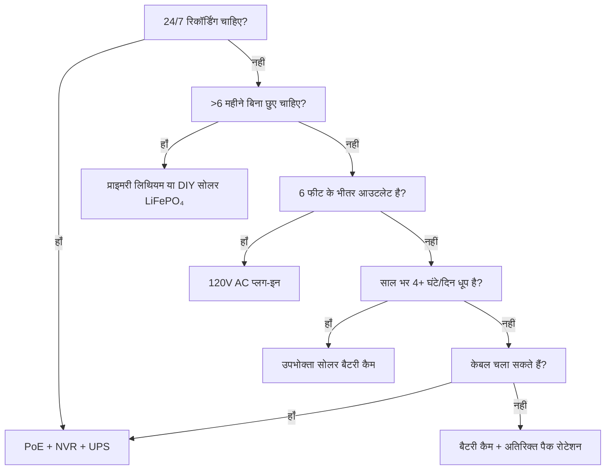

सुरक्षा कैमरों के विफल होने का #1 कारण पावर है। रात 3 बजे डेड बैटरी। जनवरी में जमी हुई Li-ion। बर्फ में दबा सोलर पैनल। "बस एक मिनट" के लिए अनप्लग किया गया PoE स्विच। यह मार्गदर्शिका वास्तविक भौतिकी, वास्तविक डेटा और निर्णय फ्रेमवर्क के साथ हर पावर आर्किटेक्चर को तोड़ती है ताकि आप एक बार चुनें और यह काम करे।

<Badge variant="outline">पहले भौतिकी</Badge> **ऊर्जा इन = ऊर्जा आउट + हानियाँ।**
कोई मार्केटिंग इसे नहीं बदलती। अपने स्रोत को सबसे खराब स्थिति (सबसे छोटा दिन,
सबसे ठंडा तापमान, उच्चतम गतिविधि) के लिए आकार दें, सबसे अच्छी स्थिति के लिए
नहीं।

## पावर आर्किटेक्चर तुलना

| आर्किटेक्चर                          | वोल्टेज स्रोत        | अधिकतम दूरी                | विश्वसनीयता         | इंस्टॉल जटिलता | सर्वोत्तम                              |
| ------------------------------------ | -------------------- | -------------------------- | ------------------- | -------------- | -------------------------------------- |
| **120V AC + एडेप्टर**                | वॉल आउटलेट           | 6 फीट (कॉर्ड)              | ★★★★★ (ग्रिड)       | सरल            | इनडोर, बरामदा, मौजूदा आउटलेट           |
| **PoE (802.3af/at/bt)**              | PoE स्विच/इंजेक्टर   | 328 फीट (100 मी)           | ★★★★★ (UPS-समर्थित) | मध्यम (केबल)   | **स्वर्ण मानक** — 24/7, NVR, रिमोट     |
| **12V/24V DC डायरेक्ट**              | बैटरी बैंक / PSU     | 50–100 फीट (वोल्टेज ड्रॉप) | ★★★★☆               | मध्यम          | ऑफ-ग्रिड, RV, मौजूदा 12V बस            |
| **रिचार्जेबल Li-ion**                | आंतरिक बैटरी         | N/A (वायरलेस)              | ★★☆☆☆ (मौसमी)       | सरल            | किराएदार, अस्थायी, नो-केबल ज़ोन        |
| **प्राइमरी लिथियम (नॉन-रिचार्जेबल)** | आंतरिक बैटरी         | N/A                        | ★★★☆☆ (1–2 वर्ष)    | सरल            | ट्रेल कैम, अल्ट्रा-रिमोट, कोई धूप नहीं |
| **सोलर + रिचार्जेबल**                | सूर्य → पैनल → बैटरी | N/A                        | ★★★☆☆ (मौसम)        | आसान–मध्यम     | फेंस, गेट, शेड, ऑफ-ग्रिड               |
| **हाइब्रिड: PoE + बैटरी बैकअप**      | PoE + UPS/आंतरिक     | 328 फीट                    | ★★★★★               | उच्च           | महत्वपूर्ण प्रवेश, लाइसेंस प्लेट       |

<Callout type="warning">

**मार्केटिंग बनाम वास्तविकता:** "6 महीने की बैटरी लाइफ" = 10 मोशन इवेंट/दिन,
10 सेकंड के क्लिप, 70°F, कोई लाइव व्यू नहीं। **वास्तविक दुनिया:** 20–40
इवेंट/दिन + 5 लाइव व्यू = **2–6 सप्ताह**। हमेशा 3–5 गुना घटाएँ।

</Callout>

## गहराई से: प्रत्येक आर्किटेक्चर

### 1. PoE (पावर ओवर ईथरनेट) — पेशेवर विकल्प

<Accordion type="single" collapsible>
  <AccordionItem value="poe-basics">
    <AccordionTrigger>PoE कैसे काम करता है और मानक</AccordionTrigger>
    <AccordionContent>

<strong>IEEE 802.3af (PoE):</strong> PSE पर 15.4W → PD (कैमरा) पर 12.95W।
अधिकांश फिक्स्ड बुलेट/डोम को पावर देता है।
<strong>IEEE 802.3at (PoE+):</strong> PSE पर 30W → PD पर 25.5W। PTZ, हीटर, IR
इल्यूमिनेटर को पावर देता है।
<strong>IEEE 802.3bt (PoE++):</strong> PSE पर 60W (टाइप 3) / 90W (टाइप 4) → PD
पर 51W / 71W। स्पीड डोम, मल्टी-सेंसर, वाइपर/हीटर को पावर देता है।

<strong>केबल:</strong> न्यूनतम Cat5e (PoE++ के लिए Cat6/6a)। अधिकतम 100 मीटर
(328 फीट) प्रति सेगमेंट।
<strong>टोपोलॉजी:</strong> कैमरा → Cat5e/6 → PoE स्विच (या PoE पोर्ट वाला NVR) →
UPS → ग्रिड।
<strong>वोल्टेज:</strong> वायर पेयर्स पर 44–57V DC (मोड A: डेटा पेयर्स / मोड B:
स्पेयर पेयर्स)। कैमरा DC-DC आंतरिक रूप से 12V/5V/3.3V में बदलता है।

</AccordionContent>

  </AccordionItem>
  <AccordionItem value="poe-ups">
    <AccordionTrigger>PoE के लिए UPS आकार (24/7 के लिए महत्वपूर्ण)</AccordionTrigger>
    <AccordionContent>

<strong>नियम:</strong> UPS को लक्ष्य रनटाइम के लिए
<strong>सभी PoE स्विच पोर्ट + NVR + राउटर</strong> को कवर करना चाहिए।

| लोड                                  | सामान्य वाट            | 4-घंटा रनटाइम (Wh)      | 12-घंटा रनटाइम (Wh)       | 24-घंटा रनटाइम (Wh)       |
| ------------------------------------ | ---------------------- | ----------------------- | ------------------------- | ------------------------- |
| 8-पोर्ट PoE+ स्विच (4 कैम)           | 45W                    | 180 Wh                  | 540 Wh                    | 1,080 Wh                  |
| 16-पोर्ट PoE+ स्विच (12 कैम)         | 120W                   | 480 Wh                  | 1,440 Wh                  | 2,880 Wh                  |
| NVR (8-बे, 2 HDD)                    | 35W                    | 140 Wh                  | 420 Wh                    | 840 Wh                    |
| राउटर/मॉडम                           | 15W                    | 60 Wh                   | 180 Wh                    | 360 Wh                    |
| <strong>कुल (12-कैम सिस्टम)</strong> | <strong>~170W</strong> | <strong>680 Wh</strong> | <strong>2,040 Wh</strong> | <strong>4,080 Wh</strong> |

<strong>UPS अनुशंसा:</strong>

<ul>
  <li>
    <strong>&lt;4 घंटे:</strong> CyberPower CP1500PFCLCD (1,500 VA / 1,050 Wh) —
    $200
  </li>
  <li>
    <strong>8–12 घंटे:</strong> APC SMT1500RM2UC + बाहरी बैटरी पैक — $600+
  </li>
  <li>
    <strong>24+ घंटे:</strong> 48V LiFePO₄ सर्वर रैक बैटरी (5–10 kWh) + Victron
    इन्वर्टर/चार्जर — $2,000+
  </li>
</ul>

<strong>प्रो टिप:</strong> PoE स्विच + NVR + राउटर को <strong>एक ही UPS</strong>
पर रखें। कैमरा-साइड UPS (प्रति-कैमरा) मौजूद है लेकिन समान रनटाइम के लिए 5 गुना
अधिक खर्च होता है।

</AccordionContent>

  </AccordionItem>
</Accordion>

### 2. रिचार्जेबल बैटरी कैमरे — सुविधा का जाल

<Callout type="note">

**रसायन:** लगभग सभी उपभोक्ता बैटरी कैम **Li-ion (NMC/LCO), 3.6–3.7V नॉमिनल,
4.2V मैक्स** का उपयोग करते हैं। LiFePO₄ नहीं। ठंड के लिए यह मायने रखता है।

</Callout>

**वास्तविक दुनिया की बैटरी लाइफ (2025–2026 मॉडल, 1080p/2K/4K)**

| कैमरा                 | बैटरी                | दावा    | **वास्तविक (उच्च गतिविधि)** | **वास्तविक (कम गतिविधि)** | चार्ज विधि                  |
| --------------------- | -------------------- | ------- | --------------------------- | ------------------------- | --------------------------- |
| EufyCam 3 S330        | 13,000 mAh           | 365 दिन | 14–21 दिन                   | 90–120 दिन                | USB-C (5V) / सोलर           |
| Reolink Argus 4 Pro   | 9,600 mAh            | 6 महीने | 10–18 दिन                   | 60–90 दिन                 | USB-C (5V) / सोलर           |
| Ring Stick Up Cam Pro | 6,000 mAh            | 6 महीने | 7–14 दिन                    | 45–60 दिन                 | USB-C (5V) / सोलर / प्लग-इन |
| Arlo Pro 5S 2K        | 5,200 mAh            | 6 महीने | 5–10 दिन                    | 30–45 दिन                 | मैग्नेटिक (मालिकाना) / सोलर |
| Blink Outdoor 4       | 2× AA Li (3,000 mAh) | 2 वर्ष  | 60–90 दिन                   | 180–365 दिन               | AA बदलें (नॉन-रिचार्ज)      |
| Wyze Cam Outdoor v2   | 5,200 mAh            | 6 महीने | 10–16 दिन                   | 50–75 दिन                 | Micro-USB / सोलर            |
| Reolink Go PT Plus    | 7,800 mAh            | 3 महीने | 8–14 दिन                    | 40–60 दिन                 | USB-C / सोलर / 12V          |

**उच्च गतिविधि =** 30+ मोशन इवेंट/दिन + 3 लाइव व्यू/दिन + रात में IR  
**कम गतिविधि =** 5 इवेंट/दिन + 0 लाइव व्यू + केवल दिन

<Accordion type="single" collapsible>
  <AccordionItem value="battery-physics">
    <AccordionTrigger>बैटरी लाइफ क्यों गिरती है (भौतिकी)</AccordionTrigger>
    <AccordionContent>

<ol>
  <li>
    <strong>Tx पावर हावी है:</strong> +17 dBm पर वाई-फ़ाई रेडियो = 300–500 mA @
    3.7V। 10
  </li>
</ol>
<ol>
  <li>
    <strong>IR LEDs:</strong> 100 फीट पर 850 nm IR = 30 सेकंड/क्लिप के लिए 1–2W।
    30 क्लिप = 0.25–0.5 Wh = <strong>3.7V पर 70–140 mAh</strong>।
  </li>
  <li>
    <strong>PIR वेक + DSP:</strong> प्रति इवेंट 50–100 mA 2–5 सेकंड के लिए।
    अकेले नगण्य, जुड़ता है।
  </li>
  <li>
    <strong>ठंडा तापमान:</strong> Li-ion का{" "}
    <strong>आंतरिक प्रतिरोध 32°F (0°C) पर दोगुना हो जाता है</strong>। Tx लोड के
    तहत वोल्टेज गिरता है → BMS 3.0V पर काटता है → 40% SoC पर "डेड" बैटरी।{" "}
    <strong>14°F (-10°C) पर क्षमता ≈ 70°F की 50%।</strong>
  </li>
  <li>
    <strong>सेल्फ-डिस्चार्ज:</strong> 2–5%/माह। सक्रिय ड्रेन की तुलना में नगण्य।
  </li>
  <li>
    <strong>लाइव व्यू:</strong> 5 मिनट का लाइव व्यू = 30+ क्लिप के बराबर ऊर्जा।{" "}
    <strong>दैनिक लाइव चेक से बचें।</strong>
  </li>
</ol>

    </AccordionContent>

  </AccordionItem>
  <AccordionItem value="charging">
    <AccordionTrigger>चार्जिंग रणनीतियाँ जो काम करती हैं</AccordionTrigger>
    <AccordionContent>

      <strong>0% तक न जाने दें।</strong> Li-ion गहरे डिस्चार्ज से नफरत करती है। 20–30% पर
      चार्ज करें। <strong>सोलर पैनल आकार:</strong> पैनल (W) ≥ कैमरा औसत खपत (W) × 3
      (सर्दी/बादल) ÷ पीक सन आवर्स (सबसे खराब महीना)। - उदाहरण: Argus 4 Pro औसत
        1.5W → 4.5W चाहिए। सबसे खराब महीना (दिसंबर, ज़ोन 5) = 1.5 पीक घंटे →
      <strong>न्यूनतम 3W पैनल, अनुशंसित 6W</strong>। <strong>USB-C PD ट्रिगर केबल:</strong>
      Reolink/Argus/Eufy PD नेगोशिएशन के माध्यम से 5V/9V/12V/15V/20V स्वीकार
      करते हैं। 12V RV/हाउस बैंक से सीधे चार्ज करने के लिए 12V→USB-C PD ट्रिगर
      केबल का उपयोग करें (12V→120V इन्वर्टर→5V एडेप्टर पर 60% बनाम 90% कुशल)।
      <strong>डुअल-बैटरी रोटेशन:</strong> अतिरिक्त पैक खरीदें। खत्म को चार्ज किए गए से बदलें।
      शून्य डाउनटाइम। केवल उपयोगकर्ता-हटाने योग्य पैक (Reolink, Blink, कुछ Ring)
      के साथ काम करता है।

    </AccordionContent>

  </AccordionItem>
</Accordion>

### 3. प्राइमरी लिथियम (नॉन-रिचार्जेबल) — लंबी दूरी का विशेषज्ञ

| बैटरी प्रकार                     | रसायन    | वोल्टेज | क्षमता     | तापमान रेंज    | सर्वोत्तम                             |
| -------------------------------- | -------- | ------- | ---------- | -------------- | ------------------------------------- |
| **Energizer अल्टीमेट लिथियम AA** | Li/FeS₂  | 1.5V    | 3,000 mAh  | -40°F से 140°F | Blink, ट्रेल कैम, -40°F ऑपरेशन        |
| **Tadiran TL-5930 (D-सेल)**      | Li/SOCl₂ | 3.6V    | 19,000 mAh | -67°F से 185°F | पाइपलाइन, रिमोट टेलीमेट्री, 5–10 वर्ष |
| **Saft LS 14500 (AA)**           | Li/SOCl₂ | 3.6V    | 2,600 mAh  | -60°F से 185°F | औद्योगिक, ATEX ज़ोन                   |

**लाभ:** क्षारीय बनाम 10–20 गुना ऊर्जा घनत्व; -40°F पर काम करता है; 10–20 वर्ष शेल्फ लाइफ; कोई चार्जिंग सर्किट आवश्यक नहीं
**नुकसान:** **नॉन-रिचार्जेबल**; $2–10/सेल; वोल्टेज पठार ईंधन गेजिंग को कठिन बनाता है; निष्क्रियता (लंबे आराम के बाद वोल्टेज विलंब)
**उपयोग मामला:** तिमाही जाँच वाला ट्रेल कैम; पाइपलाइन सेंसर; अंटार्कटिक रिसर्च कैम। **दैनिक उपयोग की सुरक्षा के लिए नहीं।**

### 4. सोलर + बैटरी — ऑफ-ग्रिड इंजीनियरिंग

<Callout type="info">

**सोलर एक बैटरी चार्जर है, बिजली का स्रोत नहीं।** **बैटरी** को ऑटोनॉमी (बिना
धूप के दिन) के लिए आकार दें। **पैनल** को उस बैटरी को 1 अच्छे दिन में रिचार्ज
करने के लिए आकार दें।

</Callout>

**सिस्टम आकार निर्धारण वर्कशीट**

```
  1. कैमरा औसत पावर (W) × 24h = प्रतिदिन Wh
   उदाहरण: Reolink Go PT Plus = 2.5W औसत → 60 Wh/दिन

  2. बैटरी ऑटोनॉमी (बिना धूप के दिन) × Wh/दिन = बैटरी Wh
     3 दिन ऑटोनॉमी → 180 Wh
   LiFePO₄ 12.8V → 180 Wh ÷ 12.8V = 14 Ah → **20 Ah पैक (20% मार्जिन)**

  3. सबसे खराब महीने के पीक सन आवर्स (PSH) × पैनल वाट × 0.75 (हानि) = प्रतिदिन Wh हार्वेस्ट
   दिसंबर, ज़ोन 5: 1.5 PSH × पैनल W × 0.75 = 60 Wh → पैनल = 53W → **60W पैनल**

  4. चार्ज कंट्रोलर: MPPT (95% दक्ष) बनाम PWM (75% दक्ष)। **20W से अधिक के लिए हमेशा MPPT।**
   Victron SmartSolar 75/10, 75/15, 100/20 — ब्लूटूथ, प्रोग्रामेबल, विश्वसनीय।

  5. माउंट: दक्षिण-मुखी (NH), अक्षांश झुकाव (30–45°), **21 दिसंबर को सुबह 9–शाम 3 बजे तक कोई छाया नहीं**।
   एडजस्टेबल ग्राउंड माउंट > रूफ > फेंस पोस्ट।
```

**वास्तविक दुनिया के सोलर कैमरा किट (2026)**

| किट                                                               | पैनल          | बैटरी           | कंट्रोलर     | कैमरा                       | विंटर ज़ोन 5 रनटाइम                    |
| ----------------------------------------------------------------- | ------------- | --------------- | ------------ | --------------------------- | -------------------------------------- |
| Reolink 6W + Argus 4 Pro                                          | 6W (फिक्स्ड)  | 9.6 Ah (आंतरिक) | आंतरिक (PWM) | Argus 4 Pro                 | **दिसंबर-फरवरी विफल** (पैनल बहुत छोटा) |
| Reolink 20W + Go PT Plus                                          | 20W (एडज)     | 7.8 Ah (आंतरिक) | आंतरिक       | Go PT Plus                  | **सीमांत** (बाहरी 20Ah LiFePO₄ जोड़ें) |
| EufyCam 3 + सोलर                                                  | 2.4W (एकीकृत) | 13 Ah (आंतरिक)  | आंतरिक       | EufyCam 3                   | **नवंबर-मार्च विफल** (पैनल छोटा)       |
| **DIY: 60W + 20Ah LiFePO₄ + Victron + Go PT Plus**                | 60W           | 256 Wh          | MPPT         | Go PT Plus                  | **95% अपटाइम** (इंजीनियर्ड)            |
| **DIY: 100W + 40Ah LiFePO₄ + Victron + PoE Injector + 4K Bullet** | 100W          | 512 Wh          | MPPT         | Reolink RLC-1212A + 12V→PoE | **99% अपटाइम** (सच्चा ऑफ-ग्रिड PoE)    |

<Accordion type="single" collapsible>
  <AccordionItem value="winter">
    <AccordionTrigger>शीतकालीन सोलर वास्तविकता जाँच (ज़ोन 4–6)</AccordionTrigger>
    <AccordionContent>

<strong>दिसंबर संक्रांति (ज़ोन 5, 42°N):</strong>

<ul>
  <li>
    पीक सन आवर्स: <strong>1.0–1.5</strong> (जून में 5.5 की तुलना में)
  </li>
  <li>
    30° झुकाव पर पैनल आउटपुट: <strong>STC रेटिंग का 15–20%</strong>
  </li>
  <li>
    बर्फ कवर: <strong>साफ होने तक 0% आउटपुट</strong> (ऑटो-हीटेड पैनल मौजूद:
    5–10W परजीवी)
  </li>
  <li>
    14°F पर बैटरी: <strong>Li-ion = 50% क्षमता; LiFePO₄ = 80% क्षमता</strong>
  </li>
</ul>

<strong>बचाव रणनीतियाँ:</strong>

<ol>
  <li>
    <strong>गर्मियों के गणित से पैनल 3–4 गुना बड़ा करें</strong> (60W → 180–240W
    ऐरे)
  </li>
  <li>
    <strong>LiFePO₄ बैटरी</strong> (Li-ion नहीं) — BMS हीटर के साथ -4°F पर चार्ज
    होती है
  </li>
  <li>
    <strong>कैमरा ड्यूटी साइकिल कम करें:</strong> केवल मोशन, कम रिज़ॉल्यूशन,
    छोटे क्लिप, IR बंद (एम्बिएंट लाइट का उपयोग करें)
  </li>
  <li>
    <strong>बैकअप चार्ज:</strong> वाहन/जनरेटर से मासिक 12V→USB-C PD ट्रिगर केबल
  </li>
  <li>
    <strong>डाउनटाइम स्वीकार करें:</strong> 100% नहीं, 90% अपटाइम के लिए डिज़ाइन
    करें। प्रति वर्ष 3–5 दिन अंधेरा सामान्य है।
  </li>
</ol>

              </AccordionContent>

           </AccordionItem>

    </Accordion>

### 5. 12V/24V DC डायरेक्ट — RV/ऑफ-ग्रिड नेटिव

**12V DC क्यों?** कोई इन्वर्टर हानि नहीं (120V AC → 12V DC = 15–25% हानि)। कैमरा पहले से आंतरिक रूप से 12V पर चलता है।

**12V कैमरा सीधा वायरिंग:**

```
हाउस बैटरी (12V LiFePO₄)
  → 10A ब्लेड फ्यूज
  → 18 AWG टिनड मरीन वायर (लाल/काला)
  → वॉटरप्रूफ Deutsch / SAE / Anderson कनेक्टर
  → कैमरा 12V इनपुट (पोलरिटी सत्यापित करें!)
  → **बक कन्वर्टर** यदि कैमरे को 5V/9V चाहिए (अधिकांश PoE कैम को 48V चाहिए → 12V→48V PoE इंजेक्टर का उपयोग करें)
```

**वोल्टेज ड्रॉप कैलकुलेटर:**

```
Vdrop = (2 × Length_ft × Current_A × 0.000016) / Wire_CM
  18 AWG (1,624 CM), 50 फीट, 1A → 0.98V ड्रॉप (12V पर 8%) — स्वीकार्य
  18 AWG, 100 फीट, 1A → 1.96V ड्रॉप (16%) — 16 AWG (2,583 CM) का उपयोग करें → 1.2V (10%)
```

**नियम:** 12V रन को 18 AWG पर 50 फीट से कम रखें; 14 AWG पर 100 फीट से कम। या 24V/48V वितरण + कैमरे पर बक का उपयोग करें।

**12V→PoE इंजेक्टर (12V बैंक पर PoE कैम चलाएँ):**

- Tycon POE-12-48V (12V इन → 48V PoE आउट, 15W) — $25
- Ubiquiti INJ-12V-48V (12V → 48V PoE+, 30W) — $35
- औद्योगिक: Mean Well NDR-120-48 (120W DIN रेल) + PoE स्प्लिटर — $60
- **दक्षता:** 85–92%। कैमरा मानक PoE देखता है — कोई फ़र्मवेयर हैक नहीं।

### 6. हाइब्रिड: PoE + बैटरी बैकअप (शून्य डाउनटाइम)

**आर्किटेक्चर:** कैमरा → PoE स्विच → UPS (LiFePO₄) → ग्रिड।
**प्लस:** कैमरे में आंतरिक बैटरी (Reolink Go PT Plus, Arlo Go 2) या प्रति कैमरा बाहरी UPS।

| दृष्टिकोण                            | लागत       | रनटाइम (प्रति कैम) | जटिलता |
| ------------------------------------ | ---------- | ------------------ | ------ |
| केंद्रीय UPS (स्विच+NVR)             | $200–2,000 | घंटे–दिन           | कम     |
| प्रति-कैमरा UPS (APC BE600M1)        | $60×N      | 30–60 मिनट         | मध्यम  |
| आंतरिक बैटरी वाला कैमरा (Go PT Plus) | $230       | 2–4 सप्ताह (सोलर)  | कम     |
| **PoE + 12V LiFePO₄ + ऑटो-स्विच**    | $150/कैम   | दिन–सप्ताह         | उच्च   |

**दोनों दुनियाओं का सर्वश्रेष्ठ:** 24/7 रिकॉर्डिंग + NVR के लिए PoE। **ग्रिड-आउट रिकॉर्डिंग** के लिए आंतरिक बैटरी (UPS मरने से पहले अंतिम 30 मिनट)। Reolink Go PT Plus यह मूल रूप से करता है — PoE खो जाने पर microSD पर रिकॉर्ड करता है।

## स्वामित्व की कुल लागत (5-वर्ष)

| आर्किटेक्चर                          | वर्ष 1 | वर्ष 2–5 (वार्षिक)       | 5-वर्ष कुल | सर्वोत्तम                     |
| ------------------------------------ | ------ | ------------------------ | ---------- | ----------------------------- |
| **PoE + NVR + UPS**                  | $1,500 | $50 (HDD बदलें)          | **$1,700** | स्थायी, 24/7, 8+ कैम          |
| **बैटरी + सोलर (DIY LiFePO₄)**       | $800   | $0                       | **$800**   | ऑफ-ग्रिड, 1–4 कैम, DIY        |
| **बैटरी कैम + सोलर पैनल (उपभोक्ता)** | $500   | $50 (बैटरी बदलें वर्ष 3) | **$700**   | किराया, कोई तार नहीं, 1–2 कैम |
| **प्राइमरी लिथियम (ट्रेल कैम)**      | $300   | $100 (सेल/वर्ष)          | **$700**   | अल्ट्रा-रिमोट, तिमाही जाँच    |
| **120V AC प्लग-इन**                  | $200   | $10                      | **$240**   | इनडोर, बरामदा, आउटलेट मौजूद   |

<Callout type="tip">

**छिपी हुई लागत:** ट्रक रोल। बैटरी कैम रात 3 बजे खत्म होती है → आप 30 मिनट
ड्राइव करके बदलने जाते हैं = $50/बार। PoE + UPS = पावर के लिए 0 ट्रक रोल।
अपेक्षित विफलताओं/वर्ष × $50 का कारक।

</Callout>

## निर्णय मैट्रिक्स: अपना आर्किटेक्चर चुनें



## अपने कैमरे के लिए त्वरित विशिष्टता जाँच सूची

- [ ] **PoE:** 802.3af (15W) / at (30W) / bt (60/90W) — स्विच से मिलान करें
- [ ] **12V DC:** 10–14V स्वीकार करता है? रिवर्स पोलरिटी प्रोटेक्शन? कनेक्टर प्रकार?
- [ ] **बैटरी:** हटाने योग्य? रसायन (Li-ion बनाम LiFePO₄)? 3.7V पर mAh? USB-C PD के माध्यम से चार्ज?
- [ ] **सोलर:** पैनल वाट? MPPT या PWM? केबल लंबाई? माउंट एडजस्टेबिलिटी?
- [ ] **ऑपरेटिंग तापमान:** Li-ion के लिए न्यूनतम -4°F / -20°C; LiFePO₄/प्राइमरी के लिए -40°F
- [ ] **पावर ड्रॉ:** स्पेक शीट "मैक्स" बनाम "टिपिकल" — टिपिकल × 1.5 के लिए डिज़ाइन करें
- [ ] **लो बैटरी अलर्ट:** 20% पर ऐप पुश? ऑटो-शटडाउन थ्रेशोल्ड?
- [ ] **UPS संगतता:** NVR + स्विच एक ही UPS पर? रनटाइम गणना?

---

## संबंधित गाइड

- [सर्वश्रेष्ठ सोलर-संचालित सुरक्षा कैमरे (ऑफ-ग्रिड)](/blog/best-solar-powered-security-cameras-offgrid) — पैनल/बैटरी आकार निर्धारण गहराई से
- [RVs और मोबाइल घरों के लिए सर्वश्रेष्ठ सुरक्षा कैमरे](/blog/best-security-cameras-for-rvs-mobile-homes) — 12V DC, कंपन, सेल्युलर
- [PoE बनाम वायरलेस बनाम सोलर तुलना](/blog/poe-vs-wireless-vs-solar-comparison) — निर्णय फ्रेमवर्क
- [वायरलेस कैमरा सेटअप: DIY इंस्टॉलेशन टिप्स](/blog/wireless-camera-setup-diy-installation-tips) — वाई-फ़ाई, बैटरी, माउंटिंग
