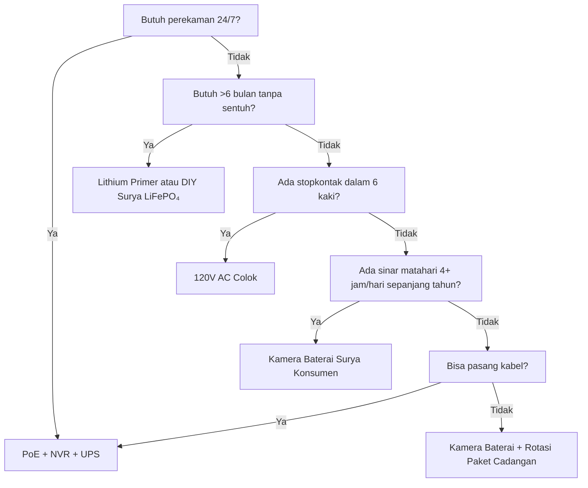

Daya adalah alasan #1 kamera keamanan gagal. Baterai habis jam 3 pagi. Li-ion membeku di bulan Januari. Panel surya terkubur salju. Switch PoE dicabut "sebentar saja." Panduan ini menguraikan setiap arsitektur daya dengan fisika nyata, data nyata, dan kerangka keputusan sehingga Anda memilih sekali dan berfungsi.

<Badge variant="outline">Fisika Dulu</Badge> **Energi masuk = Energi keluar +
Kerugian.** Tidak ada pemasaran yang mengubah ini. Ukur sumber Anda untuk kasus
terburuk (hari terpendek, suhu terdingin, aktivitas tertinggi), bukan kasus
terbaik.

## Perbandingan Arsitektur Daya

| Arsitektur                                  | Sumber Tegangan            | Jarak Maks                   | Keandalan       | Kompleksitas Instalasi | Terbaik Untuk                                  |
| ------------------------------------------- | -------------------------- | ---------------------------- | --------------- | ---------------------- | ---------------------------------------------- |
| **120V AC + Adaptor**                       | Stopkontak dinding         | 6 kaki (kabel)               | ★★★★★ (listrik) | Sepele                 | Dalam ruangan, teras, stopkontak ada           |
| **PoE (802.3af/at/bt)**                     | Switch/Injector PoE        | 328 kaki (100 m)             | ★★★★★ (UPS)     | Sedang (kabel)         | **Standar emas** — 24/7, NVR, jarak jauh       |
| **12V/24V DC Langsung**                     | Bank baterai / PSU         | 50–100 kaki (jatuh tegangan) | ★★★★☆           | Sedang                 | Off-grid, RV, bus 12V yang ada                 |
| **Li-ion Isi Ulang**                        | Baterai internal           | N/A (nirkabel)               | ★★☆☆☆ (musiman) | Sepele                 | Penyewa, sementara, zona tanpa kabel           |
| **Lithium Primer (Tidak bisa diisi ulang)** | Baterai internal           | N/A                          | ★★★☆☆ (1–2 thn) | Sepele                 | Kamera jejak, sangat terpencil, tanpa matahari |
| **Surya + Isi Ulang**                       | Matahari → Panel → Baterai | N/A                          | ★★★☆☆ (cuaca)   | Mudah–Sedang           | Pagar, gerbang, gudang, off-grid               |
| **Hybrid: PoE + Cadangan Baterai**          | PoE + UPS/Internal         | 328 kaki                     | ★★★★★           | Lebih tinggi           | Pintu masuk kritis, plat nomor                 |

<Callout type="warning">

**Pemasaran vs Realitas:** "Masa pakai baterai 6 bulan" = 10 kejadian
gerakan/hari, klip 10 detik, 70°F, tanpa tampilan langsung. **Dunia nyata:**
20–40 kejadian/hari + 5 tampilan langsung = **2–6 minggu**. Selalu turunkan
peringkat 3–5×.

</Callout>

## Pembahasan Mendalam: Setiap Arsitektur

### 1. PoE (Power over Ethernet) — Pilihan Profesional

<Accordion type="single" collapsible>
  <AccordionItem value="poe-basics">
    <AccordionTrigger>Cara Kerja & Standar PoE</AccordionTrigger>
    <AccordionContent>

<strong>IEEE 802.3af (PoE):</strong> 15,4W di PSE → 12,95W di PD (kamera).
Menggerakkan sebagian besar bullet/dome tetap.
<strong>IEEE 802.3at (PoE+):</strong> 30W di PSE → 25,5W di PD. Menggerakkan
PTZ, pemanas, penerangan IR.
<strong>IEEE 802.3bt (PoE++):</strong> 60W (Type 3) / 90W (Type 4) di PSE → 51W
/ 71W di PD. Menggerakkan speed dome, multi-sensor, wiper/pemanas.

<strong>Kabel:</strong> Cat5e minimum (Cat6/6a untuk PoE++). Maks 100 m (328
kaki) per segmen.
<strong>Topologi:</strong> Kamera → Cat5e/6 → Switch PoE (atau NVR dengan port
PoE) → UPS → Jaringan Listrik.
<strong>Tegangan:</strong> 44–57V DC pada pasangan kabel (Mode A: pasangan data
/ Mode B: pasangan cadangan). Kamera mengubah DC-DC secara internal menjadi
12V/5V/3.3V.

</AccordionContent>

  </AccordionItem>
  <AccordionItem value="poe-ups">
    <AccordionTrigger>Ukuran UPS untuk PoE (Penting untuk 24/7)</AccordionTrigger>
    <AccordionContent>

<strong>Aturan:</strong> UPS harus mencakup
<strong>semua port switch PoE + NVR + router</strong> untuk runtime target.

| Beban                                     | Watt Tipikal           | Runtime 4 Jam (Wh)      | Runtime 12 Jam (Wh)       | Runtime 24 Jam (Wh)       |
| ----------------------------------------- | ---------------------- | ----------------------- | ------------------------- | ------------------------- |
| Switch PoE+ 8 port (4 kamera)             | 45W                    | 180 Wh                  | 540 Wh                    | 1.080 Wh                  |
| Switch PoE+ 16 port (12 kamera)           | 120W                   | 480 Wh                  | 1.440 Wh                  | 2.880 Wh                  |
| NVR (8 bay, 2 HDD)                        | 35W                    | 140 Wh                  | 420 Wh                    | 840 Wh                    |
| Router/Modem                              | 15W                    | 60 Wh                   | 180 Wh                    | 360 Wh                    |
| <strong>Total (sistem 12 kamera)</strong> | <strong>~170W</strong> | <strong>680 Wh</strong> | <strong>2.040 Wh</strong> | <strong>4.080 Wh</strong> |

<strong>Rekomendasi UPS:</strong>

<ul>
  <li>
    <strong>&lt;4 jam:</strong> CyberPower CP1500PFCLCD (1.500 VA / 1.050 Wh) —
    $200
  </li>
  <li>
    <strong>8–12 jam:</strong> APC SMT1500RM2UC + paket baterai eksternal —
    $600+
  </li>
  <li>
    <strong>24+ jam:</strong> Baterai rack server 48V LiFePO₄ (5–10 kWh) +
    Victron inverter/charger — $2.000+
  </li>
</ul>

<strong>Tip Pro:</strong> Letakkan switch PoE + NVR + router di
<strong>UPS yang sama</strong>. UPS sisi kamera (per kamera) ada tetapi biayanya
5× lebih banyak untuk runtime yang sama.

</AccordionContent>

  </AccordionItem>
</Accordion>

### 2. Kamera Baterai Isi Ulang — Perangkap Kenyamanan

<Callout type="note">

**Kimia:** Hampir semua kamera baterai konsumen menggunakan **Li-ion
(NMC/LCO), 3,6–3,7V nominal, 4,2V maks**. Bukan LiFePO₄. Ini penting untuk
suhu dingin.

</Callout>

**Masa Pakai Baterai Dunia Nyata (Model 2025–2026, 1080p/2K/4K)**

| Kamera                | Baterai              | Klaim    | **Real (Aktivitas Tinggi)** | **Real (Aktivitas Rendah)** | Metode Pengisian               |
| --------------------- | -------------------- | -------- | --------------------------- | --------------------------- | ------------------------------ |
| EufyCam 3 S330        | 13.000 mAh           | 365 hari | 14–21 hari                  | 90–120 hari                 | USB-C (5V) / Surya             |
| Reolink Argus 4 Pro   | 9.600 mAh            | 6 bulan  | 10–18 hari                  | 60–90 hari                  | USB-C (5V) / Surya             |
| Ring Stick Up Cam Pro | 6.000 mAh            | 6 bulan  | 7–14 hari                   | 45–60 hari                  | USB-C (5V) / Surya / Colok     |
| Arlo Pro 5S 2K        | 5.200 mAh            | 6 bulan  | 5–10 hari                   | 30–45 hari                  | Magnetis (proprietary) / Surya |
| Blink Outdoor 4       | 2× AA Li (3.000 mAh) | 2 tahun  | 60–90 hari                  | 180–365 hari                | Ganti AA (tidak isi ulang)     |
| Wyze Cam Outdoor v2   | 5.200 mAh            | 6 bulan  | 10–16 hari                  | 50–75 hari                  | Micro-USB / Surya              |
| Reolink Go PT Plus    | 7.800 mAh            | 3 bulan  | 8–14 hari                   | 40–60 hari                  | USB-C / Surya / 12V            |

**Aktivitas Tinggi =** 30+ kejadian gerakan/hari + 3 tampilan langsung/hari + IR malam menyala
**Aktivitas Rendah =** 5 kejadian/hari + 0 tampilan langsung + hanya siang hari

<Accordion type="single" collapsible>
  <AccordionItem value="battery-physics">
    <AccordionTrigger>
      Mengapa Masa Pakai Baterai Runtuh (Fisika)
    </AccordionTrigger>
    <AccordionContent>

<ol>
  <li>
    <strong>Daya Tx Mendominasi:</strong> Radio Wi-Fi pada +17 dBm = 300–500 mA
    @ 3,7V.
  </li>
</ol>
<ol>
  <li>
    <strong>LED IR:</strong> IR 850 nm pada 100 kaki = 1–2W selama 30
    detik/klip. 30 klip = 0,25–0,5 Wh = <strong>70–140 mAh @ 3,7V</strong>.
  </li>
  <li>
    <strong>Bangun PIR + DSP:</strong> 50–100 mA selama 2–5 detik per kejadian.
    Diabaikan sendiri, bertambah.
  </li>
  <li>
    <strong>Suhu Dingin:</strong> Li-ion{" "}
    <strong>resistansi internal berlipat ganda pada 32°F (0°C)</strong>.
    Tegangan turun di bawah beban Tx → BMS memutus pada 3,0V → baterai "mati"
    pada 40% SoC. <strong>Kapasitas pada 14°F (-10°C) ≈ 50% dari 70°F.</strong>
  </li>
  <li>
    <strong>Self-Discharge:</strong> 2–5%/bulan. Diabaikan vs pengurasan aktif.
  </li>
  <li>
    <strong>Tampilan Langsung:</strong> Tampilan langsung 5 menit = energi 30+
    klip. <strong>Hindari pengecekan langsung harian.</strong>
  </li>
</ol>

    </AccordionContent>

  </AccordionItem>
  <AccordionItem value="charging">
    <AccordionTrigger>Strategi Pengisian yang Berhasil</AccordionTrigger>
    <AccordionContent>

      <strong>Jangan tunggu 0%.</strong> Li-ion benci pengosongan dalam. Isi daya pada
        20–30%. <strong>Ukuran Panel Surya:</strong> Panel (W) ≥ Rata-rata Daya Kamera (W) × 3
      (musim dingin/mendung) ÷ Jam Puncak Matahari (bulan terburuk). - Contoh:
      Argus 4 Pro rata-rata 1,5W → diperlukan 4,5W. Bulan terburuk (Des, Zona 5)
      = 1,5 jam puncak → <strong>panel 3W minimum, 6W direkomendasikan</strong>. <strong>Kabel
      Pemicu USB-C PD:</strong> Reolink/Argus/Eufy menerima 5V/9V/12V/15V/20V melalui
      negosiasi PD. Gunakan kabel pemicu 12V→USB-C PD untuk mengisi daya
      langsung dari bank 12V RV/rumah (90% efisien vs 12V→120V inverter→adaptor
        5V pada 60%). <strong>Rotasi Baterai Ganda:</strong> Beli paket cadangan. Tukar yang
      terisi dengan yang habis. Nol downtime. Hanya berfungsi dengan paket yang
      dapat dilepas pengguna (Reolink, Blink, beberapa Ring).

    </AccordionContent>

  </AccordionItem>
</Accordion>

### 3. Lithium Primer (Tidak Bisa Diisi Ulang) — Spesialis Jarak Jauh

| Jenis Baterai                     | Kimia    | Tegangan | Kapasitas  | Rentang Suhu       | Terbaik Untuk                        |
| --------------------------------- | -------- | -------- | ---------- | ------------------ | ------------------------------------ |
| **Energizer Ultimate Lithium AA** | Li/FeS₂  | 1,5V     | 3.000 mAh  | -40°F hingga 140°F | Blink, kamera jejak, operasi -40°F   |
| **Tadiran TL-5930 (D-cell)**      | Li/SOCl₂ | 3,6V     | 19.000 mAh | -67°F hingga 185°F | Pipa, telemetri jarak jauh, 5–10 thn |
| **Saft LS 14500 (AA)**            | Li/SOCl₂ | 3,6V     | 2.600 mAh  | -60°F hingga 185°F | Industri, zona ATEX                  |

**Kelebihan:** Kepadatan energi 10–20× vs alkaline; berfungsi pada -40°F; masa simpan 10–20 thn; tidak perlu sirkuit pengisian
**Kekurangan:** **Tidak bisa diisi ulang**; $2–10/sel; dataran tegangan membuat pengukuran bahan bakar sulit; pasivasi (penundaan tegangan setelah istirahat lama)
**Kasus Penggunaan:** Kamera jejak di jalur satwa liar diperiksa triwulanan; sensor pipa; kamera penelitian Antartika. **Bukan untuk keamanan penggunaan sehari-hari.**

### 4. Surya + Baterai — Teknik Off-Grid

<Callout type="info">

**Surya adalah pengisi daya baterai, bukan sumber daya.** Ukur **baterai**
untuk otonomi (hari tanpa matahari). Ukur **panel** untuk mengisi ulang
baterai itu dalam 1 hari cerah.

</Callout>

**Lembar Kerja Ukuran Sistem**

```
  1. Daya rata-rata kamera (W) × 24j = Wh/hari yang dibutuhkan
   Contoh: Reolink Go PT Plus = 2,5W rata-rata → 60 Wh/hari

  2. Otonomi baterai (hari tanpa matahari) × Wh/hari = Baterai Wh
     3 hari otonomi → 180 Wh
   LiFePO₄ 12,8V → 180 Wh ÷ 12,8V = 14 Ah → **Paket 20 Ah (margin 20%)**

  3. Jam puncak matahari bulan terburuk (PSH) × Watt Panel × 0,75 (kerugian) = Wh/hari panen
   Des, Zona 5: 1,5 PSH × Panel W × 0,75 = 60 Wh → Panel = 53W → **Panel 60W**

  4. Kontrol Pengisian: MPPT (95% ef) vs PWM (75% ef). **Selalu MPPT untuk >20W.**
   Victron SmartSolar 75/10, 75/15, 100/20 — Bluetooth, dapat diprogram, andal.

  5. Pemasangan: Menghadap selatan (BB), kemiringan lintang (30–45°), **tidak ada naungan 9 pagi–3 sore 21 Des**.
   Dudukan tanah yang dapat disesuaikan > atap > tiang pagar.
```

**Kit Kamera Surya Dunia Nyata (2026)**

| Kit                                                               | Panel               | Baterai           | Controller     | Kamera                      | Runtime Musim Dingin Zona 5                  |
| ----------------------------------------------------------------- | ------------------- | ----------------- | -------------- | --------------------------- | -------------------------------------------- |
| Reolink 6W + Argus 4 Pro                                          | 6W (tetap)          | 9,6 Ah (internal) | Internal (PWM) | Argus 4 Pro                 | **Gagal Des–Feb** (panel terlalu kecil)      |
| Reolink 20W + Go PT Plus                                          | 20W (dpt diatur)    | 7,8 Ah (internal) | Internal       | Go PT Plus                  | **Marjinal** (tambah LiFePO₄ 20Ah eksternal) |
| EufyCam 3 + Surya                                                 | 2,4W (terintegrasi) | 13 Ah (internal)  | Internal       | EufyCam 3                   | **Gagal Nov–Mar** (panel sangat kecil)       |
| **DIY: 60W + 20Ah LiFePO₄ + Victron + Go PT Plus**                | 60W                 | 256 Wh            | MPPT           | Go PT Plus                  | **95% waktu aktif** (direkayasa)             |
| **DIY: 100W + 40Ah LiFePO₄ + Victron + Injector PoE + 4K Bullet** | 100W                | 512 Wh            | MPPT           | Reolink RLC-1212A + 12V→PoE | **99% waktu aktif** (PoE off-grid sejati)    |

<Accordion type="single" collapsible>
  <AccordionItem value="winter">
    <AccordionTrigger>Cek Realitas Surya Musim Dingin (Zona 4–6)</AccordionTrigger>
    <AccordionContent>

<strong>Titik Balik Matahari Desember (Zona 5, 42°U):</strong>

<ul>
  <li>
    Jam Puncak Matahari: <strong>1,0–1,5</strong> (vs 5,5 di Juni)
  </li>
  <li>
    Output panel pada kemiringan 30°: <strong>15–20% dari peringkat STC</strong>
  </li>
  <li>
    Tutupan salju: <strong>0% output</strong> hingga dibersihkan (panel
    berpemanas otomatis ada: parasit 5–10W)
  </li>
  <li>
    Baterai pada 14°F:{" "}
    <strong>Li-ion = 50% kapasitas; LiFePO₄ = 80% kapasitas</strong>
  </li>
</ul>

<strong>Strategi Bertahan Hidup:</strong>

<ol>
  <li>
    <strong>Perbesar panel 3–4×</strong> dari matematika musim panas (60W →
    susunan 180–240W)
  </li>
  <li>
    <strong>Baterai LiFePO₄</strong> (bukan Li-ion) — mengisi daya pada -4°F
    dengan pemanas BMS
  </li>
  <li>
    <strong>Kurangi siklus tugas kamera:</strong> Hanya gerakan, resolusi lebih
    rendah, klip lebih pendek, nonaktifkan IR (gunakan cahaya sekitar)
  </li>
  <li>
    <strong>Isi daya cadangan:</strong> Kabel pemicu 12V→USB-C PD dari
    kendaraan/generator bulanan
  </li>
  <li>
    <strong>Terima waktu henti:</strong> Desain untuk 90% waktu aktif, bukan
    100%. 3–5 hari gelap/thn adalah normal.
  </li>
</ol>

              </AccordionContent>

           </AccordionItem>

    </Accordion>

### 5. 12V/24V DC Langsung — RV/Off-Grid Asli

**Mengapa 12V DC?** Tidak ada kerugian inverter (120V AC → 12V DC = 15–25% kerugian). Kamera sudah berjalan pada 12V secara internal.

**Wiring Kamera 12V Langsung:**

```
Baterai Rumah (12V LiFePO₄)
  → Sekering Pisau 10A
  → Kabel Laut Kaleng 18 AWG (merah/hitam)
  → Konektor Deutsch / SAE / Anderson Tahan Air
  → Input 12V Kamera (verifikasi polaritas!)
  → **Konverter Buck** jika kamera membutuhkan 5V/9V (kebanyakan kamera PoE membutuhkan 48V → gunakan Injector PoE 12V→48V)
```

**Kalkulator Jatuh Tegangan:**

```
Vdrop = (2 × Panjang_kaki × Arus_A × 0,000016) / Kawat_CM
  18 AWG (1.624 CM), 50 kaki, 1A → jatuh 0,98V (8% pada 12V) — DAPAT DITERIMA
  18 AWG, 100 kaki, 1A → jatuh 1,96V (16%) — GUNAKAN 16 AWG (2.583 CM) → 1,2V (10%)
```

**Aturan:** Jaga jalur 12V &lt;50 kaki pada 18 AWG; &lt;100 kaki pada 14 AWG. Atau gunakan distribusi 24V/48V + buck di kamera.

**Injector 12V→PoE (Jalankan Kamera PoE pada Bank 12V):**

- Tycon POE-12-48V (12V masuk → 48V PoE keluar, 15W) — $25
- Ubiquiti INJ-12V-48V (12V → 48V PoE+, 30W) — $35
- Industrial: Mean Well NDR-120-48 (120W rel DIN) + splitter PoE — $60
- **Efisiensi:** 85–92%. Kamera melihat PoE standar — tidak ada hack firmware.

### 6. Hybrid: PoE + Cadangan Baterai (Nol Downtime)

**Arsitektur:** Kamera → Switch PoE → UPS (LiFePO₄) → Jaringan Listrik.
**Plus:** Kamera memiliki baterai internal (Reolink Go PT Plus, Arlo Go 2) ATAU UPS eksternal per kamera.

| Pendekatan                               | Biaya      | Runtime (per kamera) | Kompleksitas |
| ---------------------------------------- | ---------- | -------------------- | ------------ |
| UPS Pusat (switch+NVR)                   | $200–2.000 | Jam–Hari             | Rendah       |
| UPS per kamera (APC BE600M1)             | $60×N      | 30–60 menit          | Sedang       |
| Kamera dgn baterai internal (Go PT Plus) | $230       | 2–4 minggu (surya)   | Rendah       |
| **PoE + 12V LiFePO₄ + Sakelar Otomatis** | $150/kam   | Hari–Minggu          | Tinggi       |

**Terbaik dari Kedua Dunia:** PoE untuk perekaman 24/7 + NVR. Baterai internal untuk **perekaman saat listrik padam** (30 menit terakhir sebelum UPS mati). Reolink Go PT Plus melakukan ini secara native — merekam ke microSD saat PoE hilang.

## Total Biaya Kepemilikan (5 Tahun)

| Arsitektur                                  | Tahun 1 | Tahun 2–5 (Tahunan)       | Total 5 Thn | Terbaik Untuk                        |
| ------------------------------------------- | ------- | ------------------------- | ----------- | ------------------------------------ |
| **PoE + NVR + UPS**                         | $1.500  | $50 (ganti HDD)           | **$1.700**  | Permanen, 24/7, 8+ kamera            |
| **Baterai + Surya (DIY LiFePO₄)**           | $800    | $0                        | **$800**    | Off-grid, 1–4 kamera, DIY            |
| **Kamera Baterai + Panel Surya (Konsumen)** | $500    | $50 (ganti baterai thn 3) | **$700**    | Sewa, tanpa kabel, 1–2 kamera        |
| **Lithium Primer (Kamera Jejak)**           | $300    | $100 (sel/thn)            | **$700**    | Sangat terpencil, periksa triwulanan |
| **120V AC Colok**                           | $200    | $10                       | **$240**    | Dalam ruangan, teras, stopkontak ada |

<Callout type="tip">

**Biaya Tersembunyi:** Kunjungan. Kamera baterai mati jam 3 pagi → Anda
berkendara 30 menit untuk mengganti = $50/kali. PoE + UPS = 0 kunjungan untuk
daya. Faktorkan $50 × perkiraan kegagalan/tahun.

</Callout>

## Matriks Keputusan: Pilih Arsitektur Anda



## Daftar Periksa Spesifikasi Cepat untuk Kamera Anda

- [ ] **PoE:** 802.3af (15W) / at (30W) / bt (60/90W) — cocokkan switch
- [ ] **12V DC:** Menerima 10–14V? Perlindungan polaritas terbalik? Tipe konektor?
- [ ] **Baterai:** Dapat dilepas? Kimia (Li-ion vs LiFePO₄)? mAh @ 3,7V? Isi daya via USB-C PD?
- [ ] **Surya:** Watt panel? MPPT atau PWM? Panjang kabel? Kemampuan penyesuaian dudukan?
- [ ] **Suhu Operasi:** -4°F / -20°C minimum untuk Li-ion; -40°F untuk LiFePO₄/primer
- [ ] **Konsumsi Daya:** Lembar spesifikasi "maks" vs "tipikal" — desain untuk tipikal × 1,5
- [ ] **Peringatan Baterai Rendah:** Dorong aplikasi pada 20%? Ambang batas mati otomatis?
- [ ] **Kompatibilitas UPS:** NVR + Switch pada UPS yang sama? Runtime sudah dihitung?

---

## Panduan Terkait

- [Kamera Keamanan Bertenaga Surya Terbaik (Off-Grid)](/blog/best-solar-powered-security-cameras-offgrid) — Pembahasan mendalam ukuran panel/baterai
- [Kamera Keamanan Terbaik untuk RV & Rumah Bergerak](/blog/best-security-cameras-for-rvs-mobile-homes) — 12V DC, getaran, seluler
- [Perbandingan PoE vs Nirkabel vs Surya](/blog/poe-vs-wireless-vs-solar-comparison) — Kerangka keputusan
- [Pemasangan Kamera Nirkabel: Tips DIY](/blog/wireless-camera-setup-diy-installation-tips) — Wi-Fi, baterai, pemasangan
