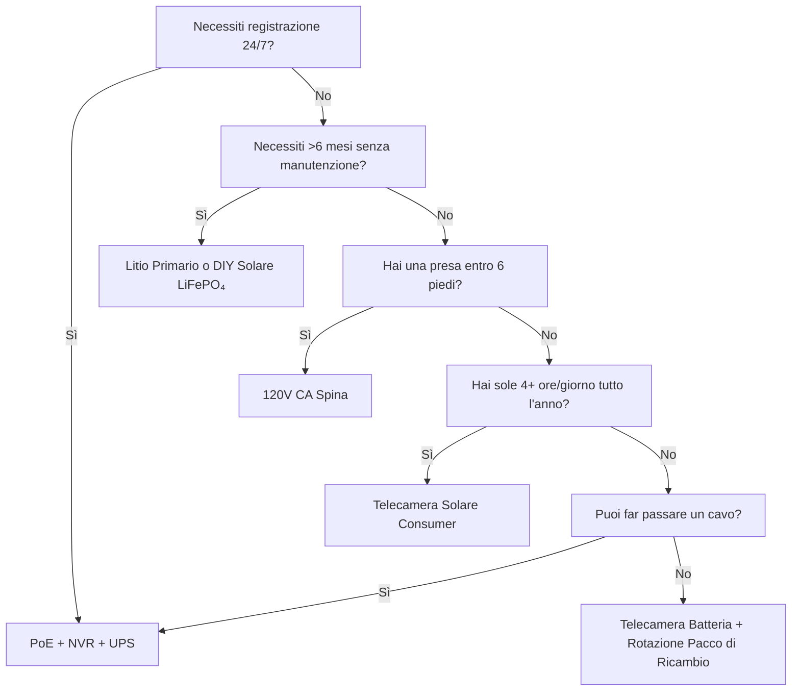

L'alimentazione è la ragione #1 per cui le telecamere di sicurezza si guastano. Batteria scarica alle 3 del mattino. Li-ion congelata a gennaio. Pannello solare sepolto nella neve. Switch PoE scollegato "solo un minuto." Questa guida analizza ogni architettura di alimentazione con fisica reale, dati reali e quadri decisionali in modo da scegliere una volta e far funzionare tutto.

<Badge variant="outline">Prima la Fisica</Badge> **Energia in entrata = Energia
in uscita + Perdite.** Nessun marketing cambia questo. Dimensiona la tua fonte
per il caso peggiore (giorno più corto, temperatura più fredda, attività più
alta), non per il caso migliore.

## Confronto delle Architetture di Alimentazione

| Architettura                          | Sorgente di Tensione       | Distanza Max                      | Affidabilità       | Complessità Installazione | Migliore Per                            |
| ------------------------------------- | -------------------------- | --------------------------------- | ------------------ | ------------------------- | --------------------------------------- |
| **120V CA + Adattatore**              | Presa a muro               | 6 piedi (cavo)                    | ★★★★★ (rete)       | Banale                    | Interno, portico, presa esistente       |
| **PoE (802.3af/at/bt)**               | Switch/Injector PoE        | 328 piedi (100 m)                 | ★★★★★ (UPS)        | Moderato (cavo)           | **Gold standard** — 24/7, NVR, remoto   |
| **12V/24V CC Diretto**                | Banco batterie / PSU       | 50–100 piedi (caduta di tensione) | ★★★★☆              | Moderato                  | Off-grid, camper, bus 12V esistente     |
| **Li-ion Ricaricabile**               | Batteria interna           | N/A (wireless)                    | ★★☆☆☆ (stagionale) | Banale                    | Affittuari, temporaneo, zone senza cavi |
| **Litio Primario (Non ricaricabile)** | Batteria interna           | N/A                               | ★★★☆☆ (1–2 anni)   | Banale                    | Fototrappole, ultra-remoto, senza sole  |
| **Solare + Ricaricabile**             | Sole → Pannello → Batteria | N/A                               | ★★★☆☆ (meteo)      | Facile–Moderato           | Recinto, cancello, capanno, off-grid    |
| **Ibrido: PoE + Backup Batteria**     | PoE + UPS/Interno          | 328 piedi                         | ★★★★★              | Più alto                  | Ingresso critico, targa                 |

<Callout type="warning">

**Marketing vs Realtà:** "Durata batteria 6 mesi" = 10 eventi di
movimento/giorno, clip 10s, 70°F, nessuna vista live. **Mondo reale:** 20–40
eventi/giorno + 5 viste live = **2–6 settimane**. Applica sempre un fattore di
derating 3–5×.

</Callout>

## Approfondimento: Ogni Architettura

### 1. PoE (Power over Ethernet) — La Scelta Professionale

<Accordion type="single" collapsible>
  <AccordionItem value="poe-basics">
    <AccordionTrigger>Come Funziona il PoE e Standard</AccordionTrigger>
    <AccordionContent>

<strong>IEEE 802.3af (PoE):</strong> 15,4W al PSE → 12,95W al PD (telecamera).
Alimenta la maggior parte dei bullet/dome fissi.
<strong>IEEE 802.3at (PoE+):</strong> 30W al PSE → 25,5W al PD. Alimenta PTZ,
riscaldatori, illuminatori IR.
<strong>IEEE 802.3bt (PoE++):</strong> 60W (Type 3) / 90W (Type 4) al PSE → 51W
/ 71W al PD. Alimenta speed dome, multi-sensore, tergicristalli/riscaldatori.

<strong>Cavo:</strong> Cat5e minimo (Cat6/6a per PoE++). Max 100 m (328 piedi)
per segmento.
<strong>Topologia:</strong> Telecamera → Cat5e/6 → Switch PoE (o NVR con porte
PoE) → UPS → Rete.
<strong>Tensione:</strong> 44–57V CC sulle coppie di fili (Mode A: coppie dati /
Mode B: coppie di riserva). La telecamera converte DC-DC internamente in
12V/5V/3.3V.

</AccordionContent>

  </AccordionItem>
  <AccordionItem value="poe-ups">
    <AccordionTrigger>Dimensionamento UPS per PoE (Critico per 24/7)</AccordionTrigger>
    <AccordionContent>

<strong>Regola:</strong> L'UPS deve coprire
<strong>tutte le porte dello switch PoE + NVR + router</strong> per il runtime
target.

| Carico                                          | Watt Tipici            | Runtime 4 Ore (Wh)      | Runtime 12 Ore (Wh)       | Runtime 24 Ore (Wh)       |
| ----------------------------------------------- | ---------------------- | ----------------------- | ------------------------- | ------------------------- |
| Switch PoE+ 8 porte (4 telecamere)              | 45W                    | 180 Wh                  | 540 Wh                    | 1.080 Wh                  |
| Switch PoE+ 16 porte (12 telecamere)            | 120W                   | 480 Wh                  | 1.440 Wh                  | 2.880 Wh                  |
| NVR (8 alloggiamenti, 2 HDD)                    | 35W                    | 140 Wh                  | 420 Wh                    | 840 Wh                    |
| Router/Modem                                    | 15W                    | 60 Wh                   | 180 Wh                    | 360 Wh                    |
| <strong>Totale (sistema 12 telecamere)</strong> | <strong>~170W</strong> | <strong>680 Wh</strong> | <strong>2.040 Wh</strong> | <strong>4.080 Wh</strong> |

<strong>Raccomandazione UPS:</strong>

<ul>
  <li>
    <strong>&lt;4 ore:</strong> CyberPower CP1500PFCLCD (1.500 VA / 1.050 Wh) —
    $200
  </li>
  <li>
    <strong>8–12 ore:</strong> APC SMT1500RM2UC + pacco batteria esterno — $600+
  </li>
  <li>
    <strong>24+ ore:</strong> Batteria rack server 48V LiFePO₄ (5–10 kWh) +
    Victron inverter/charger — $2.000+
  </li>
</ul>

<strong>Consiglio Pro:</strong> Metti switch PoE + NVR + router sullo
<strong>stesso UPS</strong>. L'UPS per singola telecamera esiste ma costa 5× di
più per lo stesso runtime.

</AccordionContent>

  </AccordionItem>
</Accordion>

### 2. Telecamere a Batteria Ricaricabile — La Trappola della Convenienza

<Callout type="note">

**Chimica:** Quasi tutte le telecamere consumer a batteria usano **Li-ion
(NMC/LCO), 3,6–3,7V nominali, 4,2V max**. Non LiFePO₄. Questo conta per il
freddo.

</Callout>

**Durata Batteria nel Mondo Reale (Modelli 2025–2026, 1080p/2K/4K)**

| Telecamera            | Batteria             | Dichiarata | **Reale (Alta Attività)** | **Reale (Bassa Attività)** | Metodo di Ricarica                |
| --------------------- | -------------------- | ---------- | ------------------------- | -------------------------- | --------------------------------- |
| EufyCam 3 S330        | 13.000 mAh           | 365 giorni | 14–21 giorni              | 90–120 giorni              | USB-C (5V) / Solare               |
| Reolink Argus 4 Pro   | 9.600 mAh            | 6 mesi     | 10–18 giorni              | 60–90 giorni               | USB-C (5V) / Solare               |
| Ring Stick Up Cam Pro | 6.000 mAh            | 6 mesi     | 7–14 giorni               | 45–60 giorni               | USB-C (5V) / Solare / Spina       |
| Arlo Pro 5S 2K        | 5.200 mAh            | 6 mesi     | 5–10 giorni               | 30–45 giorni               | Magnetico (proprietario) / Solare |
| Blink Outdoor 4       | 2× AA Li (3.000 mAh) | 2 anni     | 60–90 giorni              | 180–365 giorni             | Sostituisci AA (non ricaricabile) |
| Wyze Cam Outdoor v2   | 5.200 mAh            | 6 mesi     | 10–16 giorni              | 50–75 giorni               | Micro-USB / Solare                |
| Reolink Go PT Plus    | 7.800 mAh            | 3 mesi     | 8–14 giorni               | 40–60 giorni               | USB-C / Solare / 12V              |

**Alta Attività =** 30+ eventi di movimento/giorno + 3 viste live/giorno + IR notturno acceso
**Bassa Attività =** 5 eventi/giorno + 0 viste live + solo giorno

<Accordion type="single" collapsible>
  <AccordionItem value="battery-physics">
    <AccordionTrigger>
      Perché la Durata della Batteria Crolla (Fisica)
    </AccordionTrigger>
    <AccordionContent>

<ol>
  <li>
    <strong>Potenza Tx Domina:</strong> Radio Wi-Fi a +17 dBm = 300–500 mA @
    3,7V. Clip
  </li>
</ol>
<ol>
  <li>
    <strong>LED IR:</strong> IR 850 nm a 100 piedi = 1–2W per 30s/clip. 30 clip
    = 0,25–0,5 Wh = <strong>70–140 mAh @ 3,7V</strong>.
  </li>
  <li>
    <strong>Risveglio PIR + DSP:</strong> 50–100 mA per 2–5s per evento.
    Trascurabile da solo, si accumula.
  </li>
  <li>
    <strong>Freddo:</strong> Li-ion{" "}
    <strong>la resistenza interna raddoppia a 32°F (0°C)</strong>. La tensione
    cala sotto carico Tx → BMS interrompe a 3,0V → batteria "morta" al 40% SoC.{" "}
    <strong>Capacità a 14°F (-10°C) ≈ 50% di 70°F.</strong>
  </li>
  <li>
    <strong>Autoscarica:</strong> 2–5%/mese. Trascurabile vs drenaggio attivo.
  </li>
  <li>
    <strong>Vista Live:</strong> 5 minuti di vista live = energia di 30+ clip.{" "}
    <strong>Evita controlli live quotidiani.</strong>
  </li>
</ol>

    </AccordionContent>

  </AccordionItem>
  <AccordionItem value="charging">
    <AccordionTrigger>Strategie di Ricarica Che Funzionano</AccordionTrigger>
    <AccordionContent>

      <strong>Non aspettare lo 0%.</strong> Li-ion odia lo scaricamento profondo. Ricarica al
        20–30%. <strong>Dimensionamento Pannello Solare:</strong> Pannello (W) ≥ Consumo Medio
      Telecamera (W) × 3 (inverno/nuvoloso) ÷ Ore di Picco Solare (mese
      peggiore). - Esempio: Argus 4 Pro media 1,5W → necessari 4,5W. Mese
      peggiore (Dic, Zona 5) = 1,5 ore di picco → <strong>pannello 3W minimo, 6W
      raccomandato</strong>. <strong>Cavi Trigger USB-C PD:</strong> Reolink/Argus/Eufy accettano
        5V/9V/12V/15V/20V tramite negoziazione PD. Usa cavo trigger 12V→USB-C PD
      per caricare direttamente dal banco 12V del camper/casa (90% efficiente vs
        12V→120V inverter→adattatore 5V al 60%). <strong>Rotazione Doppia Batteria:</strong>
      Compra pacco di ricambio. Scambia carico con scarico. Zero downtime.
      Funziona solo con pacchi rimovibili dall'utente (Reolink, Blink, alcuni
      Ring).

    </AccordionContent>

  </AccordionItem>
</Accordion>

### 3. Litio Primario (Non Ricaricabile) — Lo Specialista a Lungo Termine

| Tipo di Batteria                  | Chimica  | Tensione | Capacità   | Intervallo Temp | Migliore Per                           |
| --------------------------------- | -------- | -------- | ---------- | --------------- | -------------------------------------- |
| **Energizer Ultimate Lithium AA** | Li/FeS₂  | 1,5V     | 3.000 mAh  | -40°F a 140°F   | Blink, fototrappole, operazioni -40°F  |
| **Tadiran TL-5930 (D-cell)**      | Li/SOCl₂ | 3,6V     | 19.000 mAh | -67°F a 185°F   | Tubature, telemetria remota, 5–10 anni |
| **Saft LS 14500 (AA)**            | Li/SOCl₂ | 3,6V     | 2.600 mAh  | -60°F a 185°F   | Industriale, zone ATEX                 |

**Pro:** Densità energetica 10–20× vs alcalina; funziona a -40°F; durata scaffale 10–20 anni; nessun circuito di ricarica necessario
**Contro:** **Non ricaricabile**; $2–10/cella; plateau di tensione rende difficile la misurazione del carburante; passivazione (ritardo di tensione dopo lungo riposo)
**Caso d'Uso:** Fototrappola su sentiero di caccia controllata trimestralmente; sensore di tubature; telecamera di ricerca Antartica. **Non per sicurezza quotidiana.**

### 4. Solare + Batteria — Ingegneria Off-Grid

<Callout type="info">

**Il solare è un caricabatterie, non una fonte di alimentazione.** Dimensiona
la **batteria** per l'autonomia (giorni senza sole). Dimensiona il
**pannello** per ricaricare quella batteria in 1 buona giornata.

</Callout>

**Foglio di Lavoro per il Dimensionamento del Sistema**

```
  1. Potenza media telecamera (W) × 24h = Wh/giorno necessari
   Esempio: Reolink Go PT Plus = 2,5W media → 60 Wh/giorno

  2. Autonomia batteria (giorni senza sole) × Wh/giorno = Batteria Wh
     3 giorni autonomia → 180 Wh
   LiFePO₄ 12,8V → 180 Wh ÷ 12,8V = 14 Ah → **Pacco 20 Ah (margine 20%)**

  3. Ore di picco solare mese peggiore (PSH) × Watt Pannello × 0,75 (perdite) = Wh/giorno raccolto
   Dic, Zona 5: 1,5 PSH × Pannello W × 0,75 = 60 Wh → Pannello = 53W → **Pannello 60W**

  4. Regolatore di Carica: MPPT (95% eff) vs PWM (75% eff). **Sempre MPPT per >20W.**
   Victron SmartSolar 75/10, 75/15, 100/20 — Bluetooth, programmabile, affidabile.

  5. Montaggio: Rivolto a sud (EN), inclinazione latitudine (30–45°), **nessuna ombra 9:00–15:00 21 Dic**.
   Supporto a terra regolabile > tetto > palo di recinzione.
```

**Kit Telecamera Solare nel Mondo Reale (2026)**

| Kit                                                                | Pannello         | Batteria         | Regolatore    | Telecamera                  | Runtime Invernale Zona 5                       |
| ------------------------------------------------------------------ | ---------------- | ---------------- | ------------- | --------------------------- | ---------------------------------------------- |
| Reolink 6W + Argus 4 Pro                                           | 6W (fisso)       | 9,6 Ah (interno) | Interno (PWM) | Argus 4 Pro                 | **Fallisce Dic–Feb** (pannello troppo piccolo) |
| Reolink 20W + Go PT Plus                                           | 20W (regolabile) | 7,8 Ah (interno) | Interno       | Go PT Plus                  | **Marginale** (aggiungi LiFePO₄ 20Ah esterno)  |
| EufyCam 3 + Solare                                                 | 2,4W (integrato) | 13 Ah (interno)  | Interno       | EufyCam 3                   | **Fallisce Nov–Mar** (pannello minuscolo)      |
| **DIY: 60W + 20Ah LiFePO₄ + Victron + Go PT Plus**                 | 60W              | 256 Wh           | MPPT          | Go PT Plus                  | **95% uptime** (ingegnerizzato)                |
| **DIY: 100W + 40Ah LiFePO₄ + Victron + Iniettore PoE + 4K Bullet** | 100W             | 512 Wh           | MPPT          | Reolink RLC-1212A + 12V→PoE | **99% uptime** (vero PoE off-grid)             |

<Accordion type="single" collapsible>
  <AccordionItem value="winter">
    <AccordionTrigger>Verifica Realtà Solare Invernale (Zona 4–6)</AccordionTrigger>
    <AccordionContent>

<strong>Solstizio di Dicembre (Zona 5, 42°N):</strong>

<ul>
  <li>
    Ore di Picco Solare: <strong>1,0–1,5</strong> (vs 5,5 a Giugno)
  </li>
  <li>
    Output pannello a inclinazione 30°: <strong>15–20% del rating STC</strong>
  </li>
  <li>
    Copertura di neve: <strong>0% output</strong> fino alla rimozione (pannelli
    autoriscaldanti esistono: 5–10W parassitici)
  </li>
  <li>
    Batteria a 14°F:{" "}
    <strong>Li-ion = 50% capacità; LiFePO₄ = 80% capacità</strong>
  </li>
</ul>

<strong>Strategie di Sopravvivenza:</strong>

<ol>
  <li>
    <strong>Oversize pannello 3–4×</strong> rispetto al calcolo estivo (60W →
    array 180–240W)
  </li>
  <li>
    <strong>Batteria LiFePO₄</strong> (non Li-ion) — si carica a -4°F con
    riscaldatore BMS
  </li>
  <li>
    <strong>Riduci ciclo di lavoro telecamera:</strong> Solo movimento,
    risoluzione inferiore, clip più corte, disabilita IR (usa luce ambientale)
  </li>
  <li>
    <strong>Ricarica di backup:</strong> Cavo trigger 12V→USB-C PD da
    veicolo/generatore mensilmente
  </li>
  <li>
    <strong>Accetta downtime:</strong> Progetta per 90% uptime, non 100%. 3–5
    giorni di buio/anno è normale.
  </li>
</ol>

              </AccordionContent>

           </AccordionItem>

    </Accordion>

### 5. 12V/24V CC Diretto — Nativo per Camper/Off-Grid

**Perché 12V CC?** Nessuna perdita di inverter (120V CA → 12V CC = 15–25% perdita). La telecamera funziona già internamente a 12V.

**Cablaggio Diretto Telecamera 12V:**

```
Batteria Casa (12V LiFePO₄)
  → Fusibile a Lama 10A
  → Cavo Marittimo Stagnato 18 AWG (rosso/nero)
  → Connettore Deutsch / SAE / Anderson Impermeabile
  → Ingresso 12V Telecamera (verificare polarità!)
  → **Convertitore Buck** se la telecamera necessita di 5V/9V (la maggior parte delle telecamere PoE necessitano 48V → usa Iniettore PoE 12V→48V)
```

**Calcolatore Caduta di Tensione:**

```
Vdrop = (2 × Lunghezza_piedi × Corrente_A × 0,000016) / Filo_CM
  18 AWG (1.624 CM), 50 piedi, 1A → caduta 0,98V (8% su 12V) — ACCETTABILE
  18 AWG, 100 piedi, 1A → caduta 1,96V (16%) — USA 16 AWG (2.583 CM) → 1,2V (10%)
```

**Regola:** Mantieni corse 12V &lt;50 piedi su 18 AWG; &lt;100 piedi su 14 AWG. Oppure usa distribuzione 24V/48V + buck alla telecamera.

**Iniettori 12V→PoE (Esegui Telecamere PoE su Banco 12V):**

- Tycon POE-12-48V (12V in → 48V PoE out, 15W) — $25
- Ubiquiti INJ-12V-48V (12V → 48V PoE+, 30W) — $35
- Industriale: Mean Well NDR-120-48 (120W guida DIN) + splitter PoE — $60
- **Efficienza:** 85–92%. La telecamera vede PoE standard — nessun hack firmware.

### 6. Ibrido: PoE + Backup Batteria (Zero Downtime)

**Architettura:** Telecamera → Switch PoE → UPS (LiFePO₄) → Rete.
**Più:** La telecamera ha batteria interna (Reolink Go PT Plus, Arlo Go 2) OPPURE UPS esterno per telecamera.

| Approccio                                    | Costo      | Runtime (per cam)      | Complessità |
| -------------------------------------------- | ---------- | ---------------------- | ----------- |
| UPS Centrale (switch+NVR)                    | $200–2.000 | Ore–Giorni             | Bassa       |
| UPS per telecamera (APC BE600M1)             | $60×N      | 30–60 min              | Media       |
| Telecamera con batteria interna (Go PT Plus) | $230       | 2–4 settimane (solare) | Bassa       |
| **PoE + 12V LiFePO₄ + Commutazione Auto**    | $150/cam   | Giorni–Settimane       | Alta        |

**Il Meglio di Entrambi i Mondi:** PoE per registrazione 24/7 + NVR. Batteria interna per **registrazione durante blackout** (ultimi 30 min prima che l'UPS muoia). Reolink Go PT Plus lo fa nativamente — registra su microSD quando il PoE viene perso.

## Costo Totale di Proprietà (5 Anni)

| Architettura                                         | Anno 1 | Anni 2–5 (Annuale)                 | Totale 5 Anni | Migliore Per                        |
| ---------------------------------------------------- | ------ | ---------------------------------- | ------------- | ----------------------------------- |
| **PoE + NVR + UPS**                                  | $1.500 | $50 (sostituzione HDD)             | **$1.700**    | Permanente, 24/7, 8+ telecamere     |
| **Batteria + Solare (DIY LiFePO₄)**                  | $800   | $0                                 | **$800**      | Off-grid, 1–4 telecamere, DIY       |
| **Telecamera Batteria + Pannello Solare (Consumer)** | $500   | $50 (sostituzione batteria anno 3) | **$700**      | Affitto, senza cavi, 1–2 telecamere |
| **Litio Primario (Fototrappola)**                    | $300   | $100 (celle/anno)                  | **$700**      | Ultra-remoto, controllo trimestrale |
| **120V CA Spina**                                    | $200   | $10                                | **$240**      | Interno, portico, presa esistente   |

<Callout type="tip">

**Costo Nascosto:** Viaggi. La telecamera a batteria muore alle 3 del mattino
→ guidi 30 minuti per sostituire = $50/volta. PoE + UPS = 0 viaggi per
alimentazione. Considera $50 × guasti previsti/anno.

</Callout>

## Matrice Decisionale: Scegli la Tua Architettura



## Lista di Controllo Rapido Specifiche per la Tua Telecamera

- [ ] **PoE:** 802.3af (15W) / at (30W) / bt (60/90W) — abbina allo switch
- [ ] **12V CC:** Accetta 10–14V? Protezione inversione di polarità? Tipo di connettore?
- [ ] **Batteria:** Rimovibile? Chimica (Li-ion vs LiFePO₄)? mAh @ 3,7V? Ricarica via USB-C PD?
- [ ] **Solare:** Watt pannello? MPPT o PWM? Lunghezza cavo? Regolabilità supporto?
- [ ] **Temp Operativa:** -4°F / -20°C minimo per Li-ion; -40°F per LiFePO₄/primario
- [ ] **Consumo Energetico:** Scheda tecnica "max" vs "tipico" — progetta per tipico × 1,5
- [ ] **Avviso Batteria Scarica:** Notifica app al 20%? Soglia spegnimento automatico?
- [ ] **Compatibilità UPS:** NVR + Switch sullo stesso UPS? Runtime calcolato?

---

## Guide Correlate

- [Migliori Telecamere di Sicurezza Solari (Off-Grid)](/blog/best-solar-powered-security-cameras-offgrid) — Approfondimento dimensionamento pannello/batteria
- [Migliori Telecamere di Sicurezza per Camper e Case Mobili](/blog/best-security-cameras-for-rvs-mobile-homes) — 12V CC, vibrazione, cellulare
- [Confronto PoE vs Wireless vs Solare](/blog/poe-vs-wireless-vs-solar-comparison) — Quadro decisionale
- [Configurazione Telecamera Wireless: Consigli Fai Da Te](/blog/wireless-camera-setup-diy-installation-tips) — Wi-Fi, batteria, montaggio
