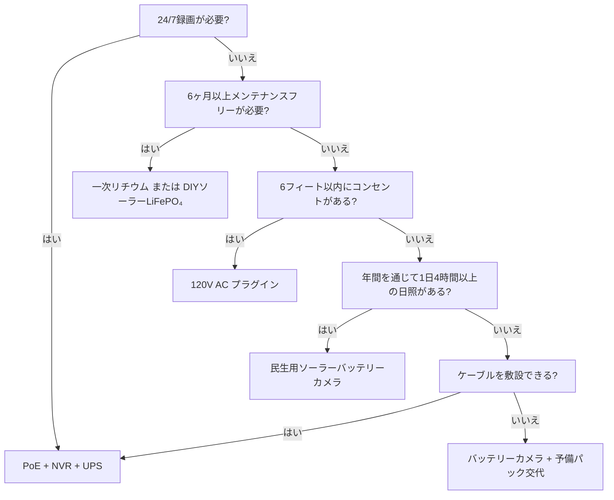

電源は防犯カメラ故障の第1の原因です。午前3時のバッテリー切れ。1月のリチウムイオン凍結。雪に埋もれたソーラーパネル。たった「1分」のために抜かれたPoEスイッチ。このガイドでは、実際の物理法則、実際のデータ、意思決定フレームワークを用いて、すべての電源アーキテクチャを分析し、一度選べば長く使えるようにします。

<Badge variant="outline">物理最優先</Badge> **エネルギー入力 = エネルギー出力 +
損失。** マーケティングでは変えられません。最良の場合ではなく、最悪の場合
(最短日、最低気温、最高活動) に合わせて電源を設計しましょう。

## 電源アーキテクチャ比較

| アーキテクチャ                                 | 電圧ソース                  | 最大距離             | 信頼性                   | 設置の複雑さ      | 最適                                           |
| ---------------------------------------------- | --------------------------- | -------------------- | ------------------------ | ----------------- | ---------------------------------------------- |
| **120V AC + アダプター**                       | 壁コンセント                | 6 ft (コード)        | ★★★★★ (グリッド)         | 簡単              | 屋内、ポーチ、既存コンセント                   |
| **PoE (802.3af/at/bt)**                        | PoE スイッチ/インジェクター | 328 ft (100 m)       | ★★★★★ (UPS バックアップ) | 中程度 (ケーブル) | **ゴールドスタンダード** — 24/7、NVR、リモート |
| **12V/24V DC 直接**                            | バッテリーバンク / PSU      | 50–100 ft (電圧降下) | ★★★★☆                    | 中程度            | オフグリッド、RV、既存12Vバス                  |
| **充電式リチウムイオン**                       | 内蔵バッテリー              | N/A (ワイヤレス)     | ★★☆☆☆ (季節性)           | 簡単              | 賃貸、一時的、ケーブル不要ゾーン               |
| **一次リチウム (非充電式)**                    | 内蔵バッテリー              | N/A                  | ★★★☆☆ (1–2年)            | 簡単              | トレイルカム、超遠隔地、日照なし               |
| **ソーラー + 充電式**                          | 太陽 → パネル → バッテリー  | N/A                  | ★★★☆☆ (天候)             | 簡単〜中程度      | フェンス、ゲート、小屋、オフグリッド           |
| **ハイブリッド: PoE + バッテリーバックアップ** | PoE + UPS/内蔵              | 328 ft               | ★★★★★                    | 高い              | 重要エントリー、ナンバープレート               |

<Callout type="warning">

**マーケティング vs 現実:** 「6ヶ月のバッテリー寿命」=
1日10回のモーションイベント、10秒 クリップ、70°F、ライブビューなし。**現実:**
1日20–40イベント + 5回のライブビュー =
**2–6週間**。常に3–5倍のディレーティングを行ってください。

</Callout>

## 詳細分析: 各アーキテクチャ

### 1. PoE (Power over Ethernet) — プロフェッショナルの選択

<Accordion type="single" collapsible>
  <AccordionItem value="poe-basics">
    <AccordionTrigger>PoEの仕組みと規格</AccordionTrigger>
    <AccordionContent>

<strong>IEEE 802.3af (PoE):</strong> PSE 15.4W → PD (カメラ)
12.95W。ほとんどの固定式銃型/ドーム型に対応。
<strong>IEEE 802.3at (PoE+):</strong> PSE 30W → PD
25.5W。PTZ、ヒーター、IR照明に対応。
<strong>IEEE 802.3bt (PoE++):</strong> 60W (Type 3) / 90W (Type 4) at PSE → 51W
/ 71W at PD。高速ドーム、マルチセンサー、ワイパー/ヒーターに対応。

<strong>ケーブル:</strong> Cat5e以上 (PoE++はCat6/6a)。最大100 m (328 ft) per
セグメント。
<strong>トポロジー:</strong> カメラ → Cat5e/6 → PoE スイッチ
(またはPoEポート付きNVR) → UPS → グリッド。
<strong>電圧:</strong> 線対で44–57V DC (Mode A: データペア / Mode B:
スペアペア)。カメラ内部でDC-DC変換により12V/5V/3.3Vに降圧。

</AccordionContent>

  </AccordionItem>
  <AccordionItem value="poe-ups">
    <AccordionTrigger>PoE用UPSのサイジング (24/7運用に重要)</AccordionTrigger>
    <AccordionContent>

<strong>ルール:</strong> UPSは
<strong>すべてのPoEスイッチポート + NVR + ルーター</strong>
を対象時間カバーする必要があります。

| 負荷                                     | 標準ワット数           | 4時間ランタイム (Wh)    | 12時間ランタイム (Wh)     | 24時間ランタイム (Wh)     |
| ---------------------------------------- | ---------------------- | ----------------------- | ------------------------- | ------------------------- |
| 8ポート PoE+ スイッチ (4台のカメラ)      | 45W                    | 180 Wh                  | 540 Wh                    | 1,080 Wh                  |
| 16ポート PoE+ スイッチ (12台のカメラ)    | 120W                   | 480 Wh                  | 1,440 Wh                  | 2,880 Wh                  |
| NVR (8ベイ、2 HDD)                       | 35W                    | 140 Wh                  | 420 Wh                    | 840 Wh                    |
| ルーター/モデム                          | 15W                    | 60 Wh                   | 180 Wh                    | 360 Wh                    |
| <strong>合計 (12カメラシステム)</strong> | <strong>~170W</strong> | <strong>680 Wh</strong> | <strong>2,040 Wh</strong> | <strong>4,080 Wh</strong> |

<strong>UPS推奨:</strong>

<ul>
  <li>
    <strong>&lt;4時間:</strong> CyberPower CP1500PFCLCD (1,500 VA / 1,050 Wh) —
    $200
  </li>
  <li>
    <strong>8–12時間:</strong> APC SMT1500RM2UC + 外部バッテリーパック — $600+
  </li>
  <li>
    <strong>24+時間:</strong> 48V LiFePO₄ サーバーラックバッテリー (5–10 kWh) +
    Victron インバーター/チャージャー — $2,000+
  </li>
</ul>

<strong>プロのヒント:</strong> PoE スイッチ + NVR + ルーターは
<strong>同一のUPS</strong> に接続しましょう。カメラ側UPS (カメラごと)
もありますが、同じランタイムで5倍のコストがかかります。

</AccordionContent>

  </AccordionItem>
</Accordion>

### 2. 充電式バッテリーカメラ — 便利さの罠

<Callout type="note">

**化学:** ほぼすべての民生用バッテリーカメラは **Li-ion (NMC/LCO)、 3.6–3.7V
公称、4.2V 最大** を使用。LiFePO₄ ではありません。これは低温時に重要です。

</Callout>

**実際のバッテリー寿命 (2025–2026年モデル、1080p/2K/4K)**

| カメラ                | バッテリー           | 公称   | **実際 (高活動)** | **実際 (低活動)** | 充電方法                           |
| --------------------- | -------------------- | ------ | ----------------- | ----------------- | ---------------------------------- |
| EufyCam 3 S330        | 13,000 mAh           | 365 日 | 14–21 日          | 90–120 日         | USB-C (5V) / ソーラー              |
| Reolink Argus 4 Pro   | 9,600 mAh            | 6 ヶ月 | 10–18 日          | 60–90 日          | USB-C (5V) / ソーラー              |
| Ring Stick Up Cam Pro | 6,000 mAh            | 6 ヶ月 | 7–14 日           | 45–60 日          | USB-C (5V) / ソーラー / プラグイン |
| Arlo Pro 5S 2K        | 5,200 mAh            | 6 ヶ月 | 5–10 日           | 30–45 日          | マグネット (専用) / ソーラー       |
| Blink Outdoor 4       | 2× AA Li (3,000 mAh) | 2 年   | 60–90 日          | 180–365 日        | AA交換 (非充電)                    |
| Wyze Cam Outdoor v2   | 5,200 mAh            | 6 ヶ月 | 10–16 日          | 50–75 日          | Micro-USB / ソーラー               |
| Reolink Go PT Plus    | 7,800 mAh            | 3 ヶ月 | 8–14 日           | 40–60 日          | USB-C / ソーラー / 12V             |

**高活動 =** 1日30+回のモーションイベント + 3回のライブビュー + 夜間IRオン  
**低活動 =** 1日5イベント + 0ライブビュー + 昼間のみ

<Accordion type="single" collapsible>
  <AccordionItem value="battery-physics">
    <AccordionTrigger>バッテリー寿命が急減する理由 (物理)</AccordionTrigger>
    <AccordionContent>

<ol>
  <li>
    <strong>Tx電力が支配的:</strong> Wi-Fi無線 +17 dBm = 300–500 mA @ 3.7V。10秒
  </li>
</ol>
<ol>
  <li>
    <strong>IR LED:</strong> 850 nm IR 100 ft = 1–2W で30秒/クリップ。30クリップ
    = 0.25–0.5 Wh = <strong>70–140 mAh @ 3.7V</strong>。3.{" "}
    <strong>PIR起動 + DSP:</strong> イベントあたり50–100 mAで
    2–5秒。単体では無視できるが、積み重なる。4. <strong>低温:</strong> Li-ion{" "}
    <strong>32°F (0°C) で内部抵抗が2倍に</strong>。Tx負荷で電圧降下 →
    BMSが3.0Vで遮断 → 40% SoCで 「バッテリー切れ」。
    <strong>14°F (-10°C) での容量 ≈ 70°F の50%。</strong>
  </li>
  <li>
    <strong>自己放電:</strong> 2–5%/月。アクティブ消費に比べれば無視できる。6.{" "}
    <strong>ライブビュー:</strong> 5分のライブビュー =
    30+クリップ分のエネルギー。
    <strong>毎日のライブ確認は避けてください。</strong>
  </li>
</ol>

    </AccordionContent>

  </AccordionItem>
  <AccordionItem value="charging">
    <AccordionTrigger>効果的な充電戦略</AccordionTrigger>
    <AccordionContent>

      <strong>0%まで待たないでください。</strong>
      Li-ionは深放電を嫌います。20–30%で充電してください。
      <strong>ソーラーパネルのサイジング:</strong> パネル (W) ≥ カメラ平均消費 (W) × 3
      (冬/曇り) ÷ ピーク日照時間 (最悪月)。 - 例: Argus 4 Pro 平均 1.5W →
        4.5W必要。最悪月 (12月、ゾーン5) = 1.5 ピーク時間 → <strong>3Wパネル
      最小、6W推奨</strong>。<strong>USB-C PDトリガーケーブル:</strong> Reolink/Argus/Eufy
      はPDネゴシエーションにより5V/9V/12V/15V/20Vに対応。12V→USB-C PDトリガー
      ケーブルを使用して12V RV/家庭用バッテリーから直接充電 (12V→120V
      インバーター→5Vアダプターの60%効率に対して90%効率)。<strong>デュアルバッテリー交代:</strong>
      予備パックを購入。
      充電済みと交換。ダウンタイムゼロ。ユーザーが取り外し可能なパックでのみ有効
      (Reolink、Blink、一部のRing)。

    </AccordionContent>

  </AccordionItem>
</Accordion>

### 3. 一次リチウム (非充電式) — 長期専用

| バッテリー型                      | 化学     | 電圧 | 容量       | 温度範囲       | 最適                                 |
| --------------------------------- | -------- | ---- | ---------- | -------------- | ------------------------------------ |
| **Energizer Ultimate Lithium AA** | Li/FeS₂  | 1.5V | 3,000 mAh  | -40°F to 140°F | Blink、トレイルカム、-40°F運用       |
| **Tadiran TL-5930 (Dセル)**       | Li/SOCl₂ | 3.6V | 19,000 mAh | -67°F to 185°F | パイプライン、遠隔テレメトリ、5–10年 |
| **Saft LS 14500 (AA)**            | Li/SOCl₂ | 3.6V | 2,600 mAh  | -60°F to 185°F | 産業用、ATEXゾーン                   |

**長所:** アルカリの10–20倍のエネルギー密度;-40°Fで動作;10–20年の保存期間;充電回路不要  
**短所:** **非充電式**; $2–10/セル;電圧プラトーにより燃料計測が困難;不動態化 (長期休止後の電圧遅延)  
**使用例:** 四半期ごとに確認するトレイルカム;パイプラインセンサー;南極調査カメラ。**日常的な防犯には非推奨。**

### 4. ソーラー + バッテリー — オフグリッドエンジニアリング

<Callout type="info">

**ソーラーはバッテリーチャージャーであり、電源ではありません。**
**バッテリー**は 自律日数 (日照なしの日数)
に合わせてサイジングします。**パネル**は、1日の晴天でそのバッテリーを充電できるようにサイジングします。

</Callout>

**システムサイジングワークシート**

```
  1. カメラ平均電力 (W) × 24h = 1日あたりの必要Wh
   例: Reolink Go PT Plus = 2.5W 平均 → 60 Wh/日

  2. バッテリー自律日数 × Wh/日 = バッテリー Wh
     3日間の自律 → 180 Wh
   LiFePO₄ 12.8V → 180 Wh ÷ 12.8V = 14 Ah → **20 Ah パック (20%マージン)**

  3. 最悪月のピーク日照時間 (PSH) × パネルワット数 × 0.75 (損失) = 1日あたりの収穫 Wh
     12月、ゾーン5: 1.5 PSH × パネルW × 0.75 = 60 Wh → パネル = 53W → **60W パネル**

  4. チャージコントローラー: MPPT (95%効率) vs PWM (75%効率)。**20W以上は必ずMPPT。**
   Victron SmartSolar 75/10、75/15、100/20 — Bluetooth、プログラマブル、信頼性◎。

  5. 取り付け: 南向き (北半球)、緯度傾斜 (30–45°)、**12月21日の9時から15時まで日陰なし**。
   調整可能なグラウンドマウント > 屋根 > フェンスポスト。
```

**実際のソーラーカメラキット (2026)**

| キット                                                               | パネル         | バッテリー    | コントローラー | カメラ                      | 冬ゾーン5の稼働時間                         |
| -------------------------------------------------------------------- | -------------- | ------------- | -------------- | --------------------------- | ------------------------------------------- |
| Reolink 6W + Argus 4 Pro                                             | 6W (固定)      | 9.6 Ah (内蔵) | 内部 (PWM)     | Argus 4 Pro                 | **12月–2月は機能せず** (パネルが小さすぎる) |
| Reolink 20W + Go PT Plus                                             | 20W (調整可能) | 7.8 Ah (内蔵) | 内部           | Go PT Plus                  | **限界** (外部20Ah LiFePO₄追加推奨)         |
| EufyCam 3 + ソーラー                                                 | 2.4W (一体型)  | 13 Ah (内蔵)  | 内部           | EufyCam 3                   | **11月–3月は機能せず** (パネルが極小)       |
| **DIY: 60W + 20Ah LiFePO₄ + Victron + Go PT Plus**                   | 60W            | 256 Wh        | MPPT           | Go PT Plus                  | **95% 稼働率** (設計済み)                   |
| **DIY: 100W + 40Ah LiFePO₄ + Victron + PoEインジェクター + 4K 銃型** | 100W           | 512 Wh        | MPPT           | Reolink RLC-1212A + 12V→PoE | **99% 稼働率** (真のオフグリッドPoE)        |

<Accordion type="single" collapsible>
  <AccordionItem value="winter">
    <AccordionTrigger>冬のソーラー現実チェック (ゾーン4–6)</AccordionTrigger>
    <AccordionContent>

<strong>12月冬至 (ゾーン5、42°N):</strong>

<ul>
  <li>
    ピーク日照時間: <strong>1.0–1.5</strong> (6月は5.5)
  </li>
  <li>
    30°傾斜でのパネル出力: <strong>STC定格の15–20%</strong>
  </li>
  <li>
    積雪: <strong>除去するまで0%出力</strong> (自動加熱パネルあり: 5–10W
    寄生消費)
  </li>
  <li>
    14°Fでのバッテリー: <strong>Li-ion = 50%容量; LiFePO₄ = 80%容量</strong>
  </li>
</ul>

<strong>生存戦略:</strong>

<ol>
  <li>
    <strong>パネルを夏の計算の3–4倍に</strong> (60W → 180–240W アレイ)
  </li>
  <li>
    <strong>LiFePO₄ バッテリー</strong> (Li-ionではない) —
    BMSヒーターで-4°Fでも充電可能
  </li>
  <li>
    <strong>カメラのデューティサイクルを低減:</strong>{" "}
    モーションのみ、解像度低下、クリップ短縮、IR無効化 (環境光を使用)
  </li>
  <li>
    <strong>バックアップ充電:</strong> 12V→USB-C
    PDトリガーケーブルで車両/発電機から月1回充電
  </li>
  <li>
    <strong>ダウンタイムを受け入れる:</strong>{" "}
    100%ではなく90%の稼働率を設計。年間3–5日の停止は正常です。
  </li>
</ol>

              </AccordionContent>

           </AccordionItem>

    </Accordion>

### 5. 12V/24V DC 直接 — RV/オフグリッド向け

**なぜ12V DCか:** インバーター損失なし (120V AC → 12V DC = 15–25%損失)。カメラは内部ですでに12Vで動作。

**12Vカメラの直接配線:**

```
ハウスバッテリー (12V LiFePO₄)
  → 10A ブレードヒューズ
  → 18 AWG 錫メッキマリンケーブル (赤/黒)
  → 防水 Deutsch / SAE / Anderson コネクター
  → カメラ 12V 入力 (極性確認!)
  → **降圧コンバーター** カメラが5V/9Vを必要とする場合 (ほとんどのPoEカメラは48Vが必要 → 12V→48V PoEインジェクターを使用)
```

**電圧降下計算:**

```
Vdrop = (2 × 長さ_ft × 電流_A × 0.000016) / 線材_CM
  18 AWG (1,624 CM)、50 ft、1A → 0.98V降下 (12Vの8%) — 許容範囲
  18 AWG、100 ft、1A → 1.96V降下 (16%) — 16 AWG (2,583 CM) を使用 → 1.2V (10%)
```

**ルール:** 12V配線は18 AWGで50 ft未満、14 AWGで100 ft未満に保つ。または24V/48V配電 + カメラ側で降圧を使用。

**12V→PoEインジェクター (12VバッテリーでPoEカメラを動作):**

- Tycon POE-12-48V (12V入力 → 48V PoE出力、15W) — $25
- Ubiquiti INJ-12V-48V (12V → 48V PoE+、30W) — $35
- 産業用: Mean Well NDR-120-48 (120W DINレール) + PoEスプリッター — $60
- **効率:** 85–92%。カメラは標準PoEとして認識 — ファームウェアハック不要。

### 6. ハイブリッド: PoE + バッテリーバックアップ (ダウンタイムゼロ)

**アーキテクチャ:** カメラ → PoE スイッチ → UPS (LiFePO₄) → グリッド。  
**プラス:** カメラに内蔵バッテリー (Reolink Go PT Plus、Arlo Go 2) またはカメラごとの外部UPS。

| アプローチ                            | コスト      | ランタイム (カメラあたり) | 複雑さ |
| ------------------------------------- | ----------- | ------------------------- | ------ |
| 集中UPS (スイッチ+NVR)                | $200–2,000  | 数時間–数日               | 低     |
| カメラごとのUPS (APC BE600M1)         | $60×N       | 30–60分                   | 中程度 |
| 内蔵バッテリー搭載カメラ (Go PT Plus) | $230        | 2–4週間 (ソーラー)        | 低     |
| **PoE + 12V LiFePO₄ + 自動切替**      | $150/カメラ | 日–週間                   | 高     |

**両方の長所:** PoEで24/7録画 + NVR。内蔵バッテリーは **グリッドアウト時の録画** (UPSが切れる前の最後30分) を担当。Reolink Go PT Plusはネイティブ対応 — PoE喪失時にmicroSDに録画。

## 総所有コスト (5年間)

| アーキテクチャ                                 | 1年目  | 2–5年目 (年間)              | 5年合計    | 最適                          |
| ---------------------------------------------- | ------ | --------------------------- | ---------- | ----------------------------- |
| **PoE + NVR + UPS**                            | $1,500 | $50 (HDD交換)               | **$1,700** | 永続的、24/7、8+カメラ        |
| **バッテリー + ソーラー (DIY LiFePO₄)**        | $800   | $0                          | **$800**   | オフグリッド、1–4カメラ、DIY  |
| **バッテリーカメラ + ソーラーパネル (民生用)** | $500   | $50 (3年目にバッテリー交換) | **$700**   | レンタル、配線不要、1–2カメラ |
| **一次リチウム (トレイルカム)**                | $300   | $100 (セル/年)              | **$700**   | 超遠隔地、四半期ごとの点検    |
| **120V AC プラグイン**                         | $200   | $10                         | **$240**   | 屋内、ポーチ、既存コンセント  |

<Callout type="tip">

**隠れたコスト:** 出動コスト。バッテリーカメラが午前3時に停止 → 30分運転して
交換 = $50/回。PoE + UPS = 電源関連の出動0回。$50 ×
予想年間故障回数を見積もりに含めましょう。

</Callout>

## 意思決定マトリックス: アーキテクチャを選ぶ



## カメラ用クイック仕様チェックリスト

- [ ] **PoE:** 802.3af (15W) / at (30W) / bt (60/90W) — スイッチと一致
- [ ] **12V DC:** 10–14V対応? 逆接続保護? コネクタータイプ?
- [ ] **バッテリー:** 取り外し可能? 化学 (Li-ion vs LiFePO₄)? mAh @ 3.7V? USB-C PD充電?
- [ ] **ソーラー:** パネルワット数? MPPTまたはPWM? ケーブル長? マウントの調整可能性?
- [ ] **動作温度:** Li-ion最低-4°F / -20°C; LiFePO₄/一次リチウムは-40°F
- [ ] **消費電力:** 仕様書の「最大」vs「標準」— 標準 × 1.5で設計
- [ ] **バッテリー低下アラート:** 20%でアプリプッシュ? 自動シャットダウン閾値?
- [ ] **UPS互換性:** NVR + スイッチを同一UPSに? ランタイム計算済み?

---

## 関連ガイド

- [最適なソーラー防犯カメラ (オフグリッド)](/blog/best-solar-powered-security-cameras-offgrid) — パネル/バッテリーサイジング詳細
- [RV・モバイルホームに最適な防犯カメラ](/blog/best-security-cameras-for-rvs-mobile-homes) — 12V DC、振動、セルラー
- [PoE vs 無線 vs ソーラー比較](/blog/poe-vs-wireless-vs-solar-comparison) — 意思決定フレームワーク
- [ワイヤレスカメラ設定: DIY設置のコツ](/blog/wireless-camera-setup-diy-installation-tips) — Wi-Fi、バッテリー、マウント
