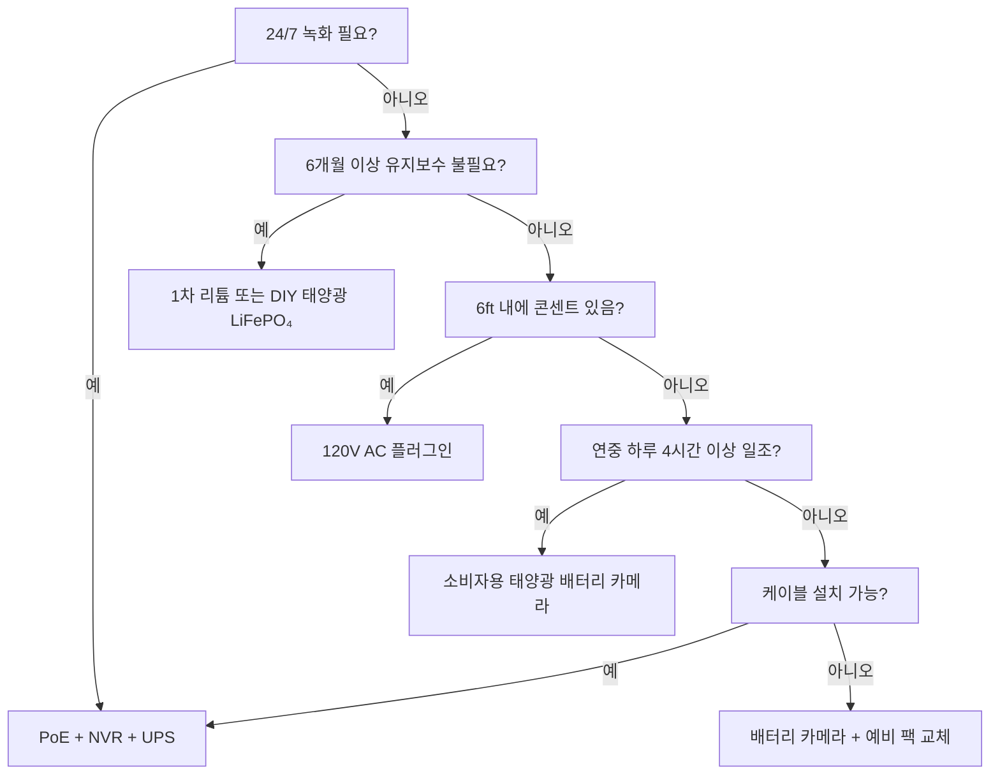

전원은 방범 카메라 고장의 가장 큰 원인입니다. 새벽 3시의 배터리 방전. 1월의 리튬 이온 동결. 눈 속에 묻힌 태양광 패널. 단 "1분"을 위해 뽑힌 PoE 스위치. 이 가이드에서는 실제 물리 법칙, 실제 데이터, 의사 결정 프레임워크를 사용하여 모든 전원 아키텍처를 분석하고, 한 번 선택하면 오래 사용할 수 있도록 도와드립니다.

<Badge variant="outline">물리 우선</Badge> **에너지 입력 = 에너지 출력 + 손실.**
마케팅으로 바꿀 수 없습니다. 최상의 경우가 아닌 최악의 경우 (최단 일조, 최저
온도, 최고 활동)에 맞춰 전원을 설계하세요.

## 전원 아키텍처 비교

| 아키텍처                          | 전압 소스            | 최대 거리             | 신뢰성           | 설치 복잡성   | 최적                           |
| --------------------------------- | -------------------- | --------------------- | ---------------- | ------------- | ------------------------------ |
| **120V AC + 어댑터**              | 벽면 콘센트          | 6 ft (코드)           | ★★★★★ (그리드)   | 쉬움          | 실내, 현관, 기존 콘센트        |
| **PoE (802.3af/at/bt)**           | PoE 스위치/인젝터    | 328 ft (100 m)        | ★★★★★ (UPS 백업) | 중간 (케이블) | **표준** — 24/7, NVR, 원격     |
| **12V/24V DC 직접**               | 배터리 뱅크 / PSU    | 50–100 ft (전압 강하) | ★★★★☆            | 중간          | 오프그리드, RV, 기존 12V 버스  |
| **충전식 리튬 이온**              | 내장 배터리          | N/A (무선)            | ★★☆☆☆ (계절성)   | 쉬움          | 임대, 임시, 케이블 불가 구역   |
| **1차 리튬 (비충전식)**           | 내장 배터리          | N/A                   | ★★★☆☆ (1–2년)    | 쉬움          | 트레일 캠, 초원격지, 일조 부족 |
| **태양광 + 충전식**               | 태양 → 패널 → 배터리 | N/A                   | ★★★☆☆ (날씨)     | 쉬움~중간     | 울타리, 대문, 창고, 오프그리드 |
| **하이브리드: PoE + 배터리 백업** | PoE + UPS/내장       | 328 ft                | ★★★★★            | 높음          | 중요 출입구, 번호판            |

<Callout type="warning">

**마케팅 vs 현실:** "6개월 배터리 수명" = 하루 10회 모션 이벤트, 10초 클립,
70°F, 라이브 뷰 없음. **현실:** 하루 20–40 이벤트 + 5회 라이브 뷰 = **2–6주**.
항상 3–5배 디레이팅하세요.

</Callout>

## 상세 분석: 각 아키텍처

### 1. PoE (Power over Ethernet) — 프로페셔널의 선택

<Accordion type="single" collapsible>
  <AccordionItem value="poe-basics">
    <AccordionTrigger>PoE 작동 방식 및 표준</AccordionTrigger>
    <AccordionContent>

<strong>IEEE 802.3af (PoE):</strong> PSE 15.4W → PD (카메라) 12.95W. 대부분의
고정형 불릿/돔 지원.
<strong>IEEE 802.3at (PoE+):</strong> PSE 30W → PD 25.5W. PTZ, 히터, IR 조명
지원.
<strong>IEEE 802.3bt (PoE++):</strong> 60W (Type 3) / 90W (Type 4) at PSE → 51W
/ 71W at PD. 고속 돔, 멀티센서, 와이퍼/히터 지원.

<strong>케이블:</strong> Cat5e 이상 (PoE++는 Cat6/6a). 최대 100 m (328 ft) per
세그먼트.
<strong>토폴로지:</strong> 카메라 → Cat5e/6 → PoE 스위치 (또는 PoE 포트 NVR) →
UPS → 그리드.
<strong>전압:</strong> 페어에서 44–57V DC (Mode A: 데이터 페어 / Mode B: 스페어
페어). 카메라 내부에서 DC-DC 변환으로 12V/5V/3.3V 강압.

</AccordionContent>

  </AccordionItem>
  <AccordionItem value="poe-ups">
    <AccordionTrigger>PoE용 UPS 용량 산정 (24/7 운영에 필수)</AccordionTrigger>
    <AccordionContent>

<strong>규칙:</strong> UPS는
<strong>모든 PoE 스위치 포트 + NVR + 라우터</strong>를 대상 시간 동안 커버해야
합니다.

| 부하                                    | 표준 와트              | 4시간 런타임 (Wh)       | 12시간 런타임 (Wh)        | 24시간 런타임 (Wh)        |
| --------------------------------------- | ---------------------- | ----------------------- | ------------------------- | ------------------------- |
| 8포트 PoE+ 스위치 (4대 카메라)          | 45W                    | 180 Wh                  | 540 Wh                    | 1,080 Wh                  |
| 16포트 PoE+ 스위치 (12대 카메라)        | 120W                   | 480 Wh                  | 1,440 Wh                  | 2,880 Wh                  |
| NVR (8베이, 2 HDD)                      | 35W                    | 140 Wh                  | 420 Wh                    | 840 Wh                    |
| 라우터/모뎀                             | 15W                    | 60 Wh                   | 180 Wh                    | 360 Wh                    |
| <strong>합계 (12카메라 시스템)</strong> | <strong>~170W</strong> | <strong>680 Wh</strong> | <strong>2,040 Wh</strong> | <strong>4,080 Wh</strong> |

<strong>UPS 추천:</strong>

<ul>
  <li>
    <strong>&lt;4시간:</strong> CyberPower CP1500PFCLCD (1,500 VA / 1,050 Wh) —
    $200
  </li>
  <li>
    <strong>8–12시간:</strong> APC SMT1500RM2UC + 외부 배터리 팩 — $600+
  </li>
  <li>
    <strong>24+시간:</strong> 48V LiFePO₄ 서버 랙 배터리 (5–10 kWh) + Victron
    인버터/충전기 — $2,000+
  </li>
</ul>

<strong>프로 팁:</strong> PoE 스위치 + NVR + 라우터는
<strong>동일한 UPS</strong>에 연결하세요. 카메라 측 UPS (카메라당)도 있지만,
동일 런타임에 5배 비용이 듭니다.

</AccordionContent>

  </AccordionItem>
</Accordion>

### 2. 충전식 배터리 카메라 — 편리함의 함정

<Callout type="note">

**화학:** 거의 모든 소비자용 배터리 카메라는 **Li-ion (NMC/LCO), 3.6–3.7V
공칭, 4.2V 최대**를 사용합니다. LiFePO₄가 아닙니다. 이는 저온에서 중요합니다.

</Callout>

**실제 배터리 수명 (2025–2026년 모델, 1080p/2K/4K)**

| 카메라                | 배터리               | 공칭   | **실제 (고활동)** | **실제 (저활동)** | 충전 방식                      |
| --------------------- | -------------------- | ------ | ----------------- | ----------------- | ------------------------------ |
| EufyCam 3 S330        | 13,000 mAh           | 365 일 | 14–21 일          | 90–120 일         | USB-C (5V) / 태양광            |
| Reolink Argus 4 Pro   | 9,600 mAh            | 6 개월 | 10–18 일          | 60–90 일          | USB-C (5V) / 태양광            |
| Ring Stick Up Cam Pro | 6,000 mAh            | 6 개월 | 7–14 일           | 45–60 일          | USB-C (5V) / 태양광 / 플러그인 |
| Arlo Pro 5S 2K        | 5,200 mAh            | 6 개월 | 5–10 일           | 30–45 일          | 마그네틱 (전용) / 태양광       |
| Blink Outdoor 4       | 2× AA Li (3,000 mAh) | 2 년   | 60–90 일          | 180–365 일        | AA 교체 (비충전)               |
| Wyze Cam Outdoor v2   | 5,200 mAh            | 6 개월 | 10–16 일          | 50–75 일          | Micro-USB / 태양광             |
| Reolink Go PT Plus    | 7,800 mAh            | 3 개월 | 8–14 일           | 40–60 일          | USB-C / 태양광 / 12V           |

**고활동 =** 하루 30+회 모션 이벤트 + 3회 라이브 뷰 + 야간 IR 켜짐  
**저활동 =** 하루 5 이벤트 + 0 라이브 뷰 + 주간만

<Accordion type="single" collapsible>
  <AccordionItem value="battery-physics">
    <AccordionTrigger>배터리 수명이 급감하는 이유 (물리)</AccordionTrigger>
    <AccordionContent>

<ol>
  <li>
    <strong>Tx 전력이 지배적:</strong> Wi-Fi 무선 +17 dBm = 300–500 mA @ 3.7V.
    10초 클립
  </li>
</ol>
<ol>
  <li>
    <strong>IR LED:</strong> 850 nm IR 100 ft = 1–2W for 30초/클립. 30클립 =
    0.25–0.5 Wh = <strong>70–140 mAh @ 3.7V</strong>.
  </li>
  <li>
    <strong>PIR 기동 + DSP:</strong> 이벤트당 50–100 mA for 2–5초. 단독으로는
    무시 가능하지만 누적됨.
  </li>
  <li>
    <strong>저온:</strong> Li-ion <strong>32°F (0°C)에서 내부 저항 2배</strong>.
    Tx 부하에서 전압 강하 → BMS가 3.0V에서 차단 → 40% SoC에서 "배터리 방전".{" "}
    <strong>14°F (-10°C)에서 용량 ≈ 70°F의 50%</strong>.
  </li>
  <li>
    <strong>자기 방전:</strong> 2–5%/월. 능동 소비에 비해 무시 가능.
  </li>
  <li>
    <strong>라이브 뷰:</strong> 5분 라이브 뷰 = 30+클립의 에너지.{" "}
    <strong>매일 라이브 확인은 피하세요.</strong>
  </li>
</ol>

    </AccordionContent>

  </AccordionItem>
  <AccordionItem value="charging">
    <AccordionTrigger>효과적인 충전 전략</AccordionTrigger>
    <AccordionContent>

      <strong>0%까지 기다리지 마세요.</strong> Li-ion은 심방전을 싫어합니다. 20–30%에서
      충전하세요. <strong>태양광 패널 용량 산정:</strong> 패널 (W) ≥ 카메라 평균 소비 (W) × 3
      (겨울/흐림) ÷ 최대 일조 시간 (최악 월). - 예: Argus 4 Pro 평균 1.5W → 4.5W
      필요. 최악 월 (12월, 존 5) = 1.5 최대 시간 → <strong>3W 패널 최소, 6W 권장</strong>.
      <strong>USB-C PD 트리거 케이블:</strong> Reolink/Argus/Eufy 는 PD 협상으로
        5V/9V/12V/15V/20V 지원. 12V→USB-C PD 트리거 케이블을 사용하여 12V
      RV/가정용 배터리에서 직접 충전 (12V→120V 인버터→5V 어댑터의 60% 효율 대비
        90% 효율). <strong>듀얼 배터리 교체:</strong> 예비 팩 구매. 충전된 것과 교체. 다운타임
      제로. 사용자 분리 가능 팩에서만 가능 (Reolink, Blink, 일부 Ring).

    </AccordionContent>

  </AccordionItem>
</Accordion>

### 3. 1차 리튬 (비충전식) — 장기 전용

| 배터리형                          | 화학     | 전압 | 용량       | 온도 범위      | 최적                          |
| --------------------------------- | -------- | ---- | ---------- | -------------- | ----------------------------- |
| **Energizer Ultimate Lithium AA** | Li/FeS₂  | 1.5V | 3,000 mAh  | -40°F to 140°F | Blink, 트레일 캠, -40°F 운영  |
| **Tadiran TL-5930 (D 셀)**        | Li/SOCl₂ | 3.6V | 19,000 mAh | -67°F to 185°F | 파이프라인, 원격 계측, 5–10년 |
| **Saft LS 14500 (AA)**            | Li/SOCl₂ | 3.6V | 2,600 mAh  | -60°F to 185°F | 산업용, ATEX 존               |

**장점:** 알카라인의 10–20배 에너지 밀도; -40°F에서 작동; 10–20년 보관 수명; 충전 회로 불필요  
**단점:** **비충전식**; $2–10/셀; 전압 플래토로 연료 게이징 어려움; 부동태화 (장기 휴면 후 전압 지연)  
**사용처:** 분기별 확인 트레일 캠; 파이프라인 센서; 남극 탐사 카메라. **일상적인 방범에는 비권장.**

### 4. 태양광 + 배터리 — 오프그리드 엔지니어링

<Callout type="info">

**태양광은 배터리 충전기이지 전원이 아닙니다.** **배터리**는 자율 일수 (일조
없는 일수)에 맞춰 용량을 산정합니다. **패널**은 맑은 날 해당 배터리를 충전할
수 있도록 용량을 산정합니다.

</Callout>

**시스템 용량 산정 워크시트**

```
  1. 카메라 평균 전력 (W) × 24h = 일일 필요 Wh
   예: Reolink Go PT Plus = 2.5W 평균 → 60 Wh/일

  2. 배터리 자율 일수 × Wh/일 = 배터리 Wh
     3일 자율 → 180 Wh
   LiFePO₄ 12.8V → 180 Wh ÷ 12.8V = 14 Ah → **20 Ah 팩 (20% 마진)**

  3. 최악 월 최대 일조 시간 (PSH) × 패널 와트 × 0.75 (손실) = 일일 수확 Wh
     12월, 존 5: 1.5 PSH × 패널W × 0.75 = 60 Wh → 패널 = 53W → **60W 패널**

  4. 충전 컨트롤러: MPPT (95% 효율) vs PWM (75% 효율). **20W 이상은 반드시 MPPT.**
   Victron SmartSolar 75/10, 75/15, 100/20 — Bluetooth, 프로그래밍 가능, 신뢰성 높음.

  5. 설치: 남향 (북반구), 위도 경사 (30–45°), **12월 21일 9시~15시 사이 그늘 없음**.
   조절 가능 지상 마운트 > 지붕 > 펜스 기둥.
```

**실제 태양광 카메라 키트 (2026)**

| 키트                                                          | 패널            | 배터리        | 컨트롤러   | 카메라                      | 겨울 존 5 작동 시간                     |
| ------------------------------------------------------------- | --------------- | ------------- | ---------- | --------------------------- | --------------------------------------- |
| Reolink 6W + Argus 4 Pro                                      | 6W (고정)       | 9.6 Ah (내장) | 내부 (PWM) | Argus 4 Pro                 | **12월–2월 작동 불가** (패널 너무 작음) |
| Reolink 20W + Go PT Plus                                      | 20W (조절 가능) | 7.8 Ah (내장) | 내부       | Go PT Plus                  | **한계** (외부 20Ah LiFePO₄ 추가 권장)  |
| EufyCam 3 + 태양광                                            | 2.4W (일체형)   | 13 Ah (내장)  | 내부       | EufyCam 3                   | **11월–3월 작동 불가** (패널 매우 작음) |
| **DIY: 60W + 20Ah LiFePO₄ + Victron + Go PT Plus**            | 60W             | 256 Wh        | MPPT       | Go PT Plus                  | **95% 가동률** (설계 기준)              |
| **DIY: 100W + 40Ah LiFePO₄ + Victron + PoE 인젝터 + 4K 불릿** | 100W            | 512 Wh        | MPPT       | Reolink RLC-1212A + 12V→PoE | **99% 가동률** (진정한 오프그리드 PoE)  |

<Accordion type="single" collapsible>
  <AccordionItem value="winter">
    <AccordionTrigger>겨울 태양광 현실 점검 (존 4–6)</AccordionTrigger>
    <AccordionContent>

<strong>12월 동지 (존 5, 42°N):</strong>

<ul>
  <li>
    최대 일조 시간: <strong>1.0–1.5</strong> (6월은 5.5)
  </li>
  <li>
    30° 경사 패널 출력: <strong>STC 정격의 15–20%</strong>
  </li>
  <li>
    적설: <strong>제거 전까지 0% 출력</strong> (자동 발열 패널 있음: 5–10W 기생
    소비)
  </li>
  <li>
    14°F 배터리: <strong>Li-ion = 50% 용량; LiFePO₄ = 80% 용량</strong>
  </li>
</ul>

<strong>생존 전략:</strong>

<ol>
  <li>
    <strong>패널을 여름 계산의 3–4배로</strong> (60W → 180–240W 어레이)
  </li>
  <li>
    <strong>LiFePO₄ 배터리</strong> (Li-ion 아님) — BMS 히터로 -4°F에서도 충전
    가능
  </li>
  <li>
    <strong>카메라 듀티 사이클 감소:</strong> 모션 전용, 해상도 낮춤, 클립 단축,
    IR 비활성화 (주변광 사용)
  </li>
  <li>
    <strong>백업 충전:</strong> 12V→USB-C PD 트리거 케이블로 차량/발전기에서 월
    1회 충전
  </li>
  <li>
    <strong>다운타임 수용:</strong> 100%가 아닌 90% 가동률 설계. 연간 3–5일
    정지는 정상입니다.
  </li>
</ol>

              </AccordionContent>

           </AccordionItem>

    </Accordion>

### 5. 12V/24V DC 직접 — RV/오프그리드용

**왜 12V DC인가:** 인버터 손실 없음 (120V AC → 12V DC = 15–25% 손실). 카메라는 내부적으로 이미 12V에서 작동.

**12V 카메라 직접 배선:**

```
하우스 배터리 (12V LiFePO₄)
  → 10A 블레이드 퓨즈
  → 18 AWG 주석 도금 마린 케이블 (빨강/검정)
  → 방수 Deutsch / SAE / Anderson 커넥터
  → 카메라 12V 입력 (극성 확인!)
  → **강압 컨버터** 카메라가 5V/9V를 필요로 하는 경우 (대부분 PoE 카메라는 48V 필요 → 12V→48V PoE 인젝터 사용)
```

**전압 강하 계산:**

```
Vdrop = (2 × 길이_ft × 전류_A × 0.000016) / 와이어_CM
  18 AWG (1,624 CM), 50 ft, 1A → 0.98V 강하 (12V의 8%) — 허용 범위
  18 AWG, 100 ft, 1A → 1.96V 강하 (16%) — 16 AWG (2,583 CM) 사용 → 1.2V (10%)
```

**규칙:** 12V 배선은 18 AWG에서 50 ft 미만, 14 AWG에서 100 ft 미만 유지. 또는 24V/48V 배전 + 카메라 측 강압 사용.

**12V→PoE 인젝터 (12V 배터리로 PoE 카메라 작동):**

- Tycon POE-12-48V (12V 입력 → 48V PoE 출력, 15W) — $25
- Ubiquiti INJ-12V-48V (12V → 48V PoE+, 30W) — $35
- 산업용: Mean Well NDR-120-48 (120W DIN 레일) + PoE 스플리터 — $60
- **효율:** 85–92%. 카메라는 표준 PoE로 인식 — 펌웨어 해킹 불필요.

### 6. 하이브리드: PoE + 배터리 백업 (제로 다운타임)

**아키텍처:** 카메라 → PoE 스위치 → UPS (LiFePO₄) → 그리드.  
**플러스:** 카메라에 내장 배터리 (Reolink Go PT Plus, Arlo Go 2) 또는 카메라별 외부 UPS.

| 접근 방식                         | 비용        | 런타임 (카메라당) | 복잡성 |
| --------------------------------- | ----------- | ----------------- | ------ |
| 중앙 UPS (스위치+NVR)             | $200–2,000  | 몇 시간–며칠      | 낮음   |
| 카메라당 UPS (APC BE600M1)        | $60×N       | 30–60분           | 중간   |
| 내장 배터리 카메라 (Go PT Plus)   | $230        | 2–4주 (태양광)    | 낮음   |
| **PoE + 12V LiFePO₄ + 자동 전환** | $150/카메라 | 일–주             | 높음   |

**장점 결합:** PoE로 24/7 녹화 + NVR. 내장 배터리는 **정전 시 녹화** (UPS가 꺼지기 전 마지막 30분)를 담당. Reolink Go PT Plus는 네이티브 지원 — PoE 손실 시 microSD에 녹화.

## 총소유비용 (5년)

| 아키텍처                                   | 1년차  | 2–5년차 (연간)          | 5년 합계   | 최적                         |
| ------------------------------------------ | ------ | ----------------------- | ---------- | ---------------------------- |
| **PoE + NVR + UPS**                        | $1,500 | $50 (HDD 교체)          | **$1,700** | 영구적, 24/7, 8+카메라       |
| **배터리 + 태양광 (DIY LiFePO₄)**          | $800   | $0                      | **$800**   | 오프그리드, 1–4카메라, DIY   |
| **배터리 카메라 + 태양광 패널 (소비자용)** | $500   | $50 (3년차 배터리 교체) | **$700**   | 임대, 배선 불필요, 1–2카메라 |
| **1차 리튬 (트레일 캠)**                   | $300   | $100 (셀/년)            | **$700**   | 초원격지, 분기별 점검        |
| **120V AC 플러그인**                       | $200   | $10                     | **$240**   | 실내, 현관, 기존 콘센트      |

<Callout type="tip">

**숨은 비용:** 출동 비용. 배터리 카메라가 새벽 3시에 중단 → 30분 운전해서 교체
= $50/회. PoE + UPS = 전원 관련 출동 0회. $50 × 예상 연간 고장 횟수를 비용에
포함하세요.

</Callout>

## 의사 결정 매트릭스: 아키텍처 선택



## 카메라용 빠른 사양 체크리스트

- [ ] **PoE:** 802.3af (15W) / at (30W) / bt (60/90W) — 스위치와 일치
- [ ] **12V DC:** 10–14V 지원? 역극성 보호? 커넥터 유형?
- [ ] **배터리:** 분리 가능? 화학 (Li-ion vs LiFePO₄)? mAh @ 3.7V? USB-C PD 충전?
- [ ] **태양광:** 패널 와트? MPPT 또는 PWM? 케이블 길이? 마운트 조절 가능?
- [ ] **작동 온도:** Li-ion 최저 -4°F / -20°C; LiFePO₄/1차 리튬 -40°F
- [ ] **소비 전력:** 사양서의 "최대" vs "표준" — 표준 × 1.5로 설계
- [ ] **배터리 부족 알림:** 20%에서 앱 푸시? 자동 종료 임계값?
- [ ] **UPS 호환성:** NVR + 스위치 동일 UPS에? 런타임 계산 완료?

---

## 관련 가이드

- [최고의 태양광 방범 카메라 (오프그리드)](/blog/best-solar-powered-security-cameras-offgrid) — 패널/배터리 용량 산정 상세
- [RV·모바일 홈 최고의 방범 카메라](/blog/best-security-cameras-for-rvs-mobile-homes) — 12V DC, 진동, 셀룰러
- [PoE vs 무선 vs 태양광 비교](/blog/poe-vs-wireless-vs-solar-comparison) — 의사 결정 프레임워크
- [무선 카메라 설정: DIY 설치 팁](/blog/wireless-camera-setup-diy-installation-tips) — Wi-Fi, 배터리, 마운트
