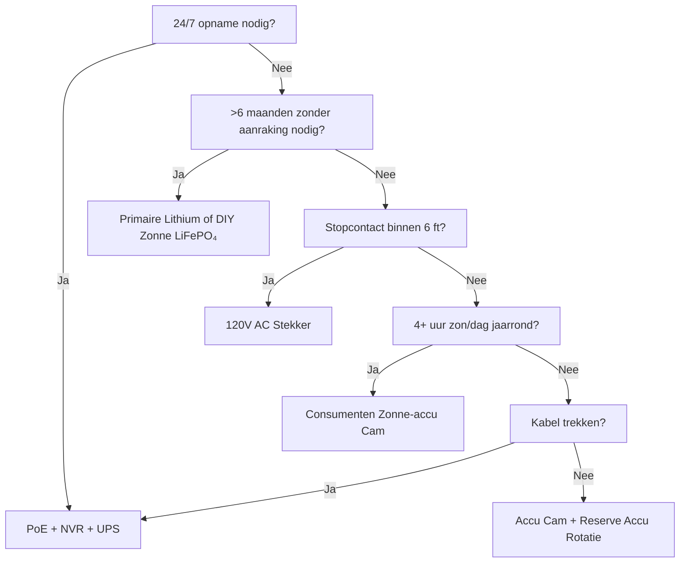

Stroom is de #1 reden waarom beveiligingscamera's falen. Dode accu om 3 uur 's nachts. Bevroren Li-ion in januari. Zonnepaneel bedolven onder sneeuw. PoE-switch losgekoppeld voor "even maar." Deze gids ontleedt elke stroomarchitectuur met echte natuurkunde, echte data en beslissingskaders zodat u één keer kiest en het werkt.

<Badge variant="outline">Natuurkunde Eerst</Badge> **Energie in = Energie uit +
Verliezen.** Geen marketing verandert dit. Bepaal uw bron voor het slechtste
geval (kortste dag, koudste temp, hoogste activiteit), niet het beste geval.

## Vergelijking Stroomarchitecturen

| Architectuur                           | Spanningsbron       | Maximale Afstand         | Betrouwbaarheid    | Installatiecomplexiteit | Het Beste Voor                           |
| -------------------------------------- | ------------------- | ------------------------ | ------------------ | ----------------------- | ---------------------------------------- |
| **120V AC + Adapter**                  | Wandcontactdoos     | 6 ft (snoer)             | ★★★★★ (net)        | Triviaal                | Binnen, veranda, bestaand stopcontact    |
| **PoE (802.3af/at/bt)**                | PoE Switch/Injector | 328 ft (100 m)           | ★★★★★ (UPS-backup) | Matig (kabel)           | **Gouden standaard** — 24/7, NVR, extern |
| **12V/24V DC Direct**                  | Accubank / PSU      | 50–100 ft (spanningsval) | ★★★★☆              | Matig                   | Off-grid, camper, bestaande 12V-bus      |
| **Oplaadbare Li-ion**                  | Interne accu        | N.v.t. (draadloos)       | ★★☆☆☆ (seizoens)   | Triviaal                | Huurders, tijdelijk, geen-kabel zones    |
| **Primaire Lithium (Niet-oplaadbaar)** | Interne accu        | N.v.t.                   | ★★★☆☆ (1–2 jr)     | Triviaal                | Wildcamera's, ultra-afgelegen, geen zon  |
| **Zonne-energie + Oplaadbaar**         | Zon → Paneel → Accu | N.v.t.                   | ★★★☆☆ (weer)       | Makkelijk–Matig         | Hek, poort, schuur, off-grid             |
| **Hybride: PoE + Accu-backup**         | PoE + UPS/Intern    | 328 ft                   | ★★★★★              | Hoger                   | Kritieke ingang, kenteken                |

<Callout type="warning">

**Marketing vs Realiteit:** "6 maanden accuduur" = 10
bewegingsgebeurtenissen/dag, 10s clips, 70°F, geen live weergave. **Echte
wereld:** 20–40 gebeurtenissen/dag + 5 live weergaven = **2–6 weken**. Altijd
3–5× lagere inschatting maken.

</Callout>

## Diepgaand: Elke Architectuur

### 1. PoE (Power over Ethernet) — De Professionele Keuze

<Accordion type="single" collapsible>
  <AccordionItem value="poe-basics">
    <AccordionTrigger>Hoe PoE Werkt & Standaarden</AccordionTrigger>
    <AccordionContent>

<strong>IEEE 802.3af (PoE):</strong> 15.4W bij PSE → 12.95W bij PD (camera).
Voedt de meeste vaste bullet/domes.
<strong>IEEE 802.3at (PoE+):</strong> 30W bij PSE → 25.5W bij PD. Voedt PTZ,
verwarming, IR-verlichting.
<strong>IEEE 802.3bt (PoE++):</strong> 60W (Type 3) / 90W (Type 4) bij PSE → 51W
/ 71W bij PD. Voedt speed domes, multi-sensor, ruitenwissers/verwarming.

<strong>Kabel:</strong> Cat5e minimum (Cat6/6a voor PoE++). Max 100 m (328 ft)
per segment.
<strong>Topologie:</strong> Camera → Cat5e/6 → PoE Switch (of NVR met
PoE-poorten) → UPS → Net.
<strong>Spanning:</strong> 44–57V DC op aderparen (Mode A: data paren / Mode B:
reserve paren). Camera DC-DC converteert intern naar 12V/5V/3.3V.

</AccordionContent>

  </AccordionItem>
  <AccordionItem value="poe-ups">
    <AccordionTrigger>UPS Bepaling voor PoE (Cruciaal voor 24/7)</AccordionTrigger>
    <AccordionContent>

<strong>Regel:</strong> UPS moet
<strong>alle PoE-switchpoorten + NVR + router</strong> dekken voor de beoogde
looptijd.

| Belasting                                | Typische Watts         | 4-uur Looptijd (Wh)     | 12-uur Looptijd (Wh)      | 24-uur Looptijd (Wh)      |
| ---------------------------------------- | ---------------------- | ----------------------- | ------------------------- | ------------------------- |
| 8-poorts PoE+ Switch (4 cams)            | 45W                    | 180 Wh                  | 540 Wh                    | 1.080 Wh                  |
| 16-poorts PoE+ Switch (12 cams)          | 120W                   | 480 Wh                  | 1.440 Wh                  | 2.880 Wh                  |
| NVR (8-bay, 2 HDD)                       | 35W                    | 140 Wh                  | 420 Wh                    | 840 Wh                    |
| Router/Modem                             | 15W                    | 60 Wh                   | 180 Wh                    | 360 Wh                    |
| <strong>Totaal (12-cam systeem)</strong> | <strong>~170W</strong> | <strong>680 Wh</strong> | <strong>2.040 Wh</strong> | <strong>4.080 Wh</strong> |

<strong>UPS Aanbeveling:</strong>

<ul>
  <li>
    <strong>&lt;4 uur:</strong> CyberPower CP1500PFCLCD (1.500 VA / 1.050 Wh) —
    $200
  </li>
  <li>
    <strong>8–12 uur:</strong> APC SMT1500RM2UC + externe accu — $600+
  </li>
  <li>
    <strong>24+ uur:</strong> 48V LiFePO₄ serverrekaccu (5–10 kWh) + Victron
    omvormer/lader — $2.000+
  </li>
</ul>

<strong>Pro Tip:</strong> Zet PoE-switch + NVR + router op
<strong>dezelfde UPS</strong>. Camera-zijde UPS (per camera) bestaat maar kost
5× meer voor dezelfde looptijd.

</AccordionContent>

  </AccordionItem>
</Accordion>

### 2. Oplaadbare Accu Camera's — Het Gemaksval

<Callout type="note">

**Chemie:** Bijna alle consumenten-accucams gebruiken **Li-ion (NMC/LCO),
3.6–3.7V nominaal, 4.2V max**. Niet LiFePO₄. Dit is belangrijk voor kou.

</Callout>

**Echte Accuduur (2025–2026 Modellen, 1080p/2K/4K)**

| Camera                | Accu                 | Claim     | **Echt (Hoge Activiteit)** | **Echt (Lage Activiteit)** | Oplaadmethode                        |
| --------------------- | -------------------- | --------- | -------------------------- | -------------------------- | ------------------------------------ |
| EufyCam 3 S330        | 13.000 mAh           | 365 dagen | 14–21 dagen                | 90–120 dagen               | USB-C (5V) / Zonne-energie           |
| Reolink Argus 4 Pro   | 9.600 mAh            | 6 maanden | 10–18 dagen                | 60–90 dagen                | USB-C (5V) / Zonne-energie           |
| Ring Stick Up Cam Pro | 6.000 mAh            | 6 maanden | 7–14 dagen                 | 45–60 dagen                | USB-C (5V) / Zonne-energie / Stekker |
| Arlo Pro 5S 2K        | 5.200 mAh            | 6 maanden | 5–10 dagen                 | 30–45 dagen                | Magnetisch (eigen) / Zonne-energie   |
| Blink Outdoor 4       | 2× AA Li (3.000 mAh) | 2 jaar    | 60–90 dagen                | 180–365 dagen              | Vervang AA (niet-oplaadbaar)         |
| Wyze Cam Outdoor v2   | 5.200 mAh            | 6 maanden | 10–16 dagen                | 50–75 dagen                | Micro-USB / Zonne-energie            |
| Reolink Go PT Plus    | 7.800 mAh            | 3 maanden | 8–14 dagen                 | 40–60 dagen                | USB-C / Zonne-energie / 12V          |

**Hoge Activiteit =** 30+ bewegingsgebeurtenissen/dag + 3 live weergaven/dag + nacht IR aan  
**Lage Activiteit =** 5 gebeurtenissen/dag + 0 live weergaven + alleen overdag

<Accordion type="single" collapsible>
  <AccordionItem value="battery-physics">
    <AccordionTrigger>Waarom Accuduur Instort (Natuurkunde)</AccordionTrigger>
    <AccordionContent>

<ol>
  <li>
    <strong>Tx Vermogen Domineert:</strong> Wi-Fi radio op +17 dBm = 300–500 mA
    @ 3.7V.
  </li>
</ol>
<ol>
  <li>
    <strong>IR LED's:</strong> 850 nm IR op 100 ft = 1–2W voor 30s/clip. 30
    clips = 0.25–0.5 Wh = <strong>70–140 mAh @ 3.7V</strong>.
  </li>
  <li>
    <strong>PIR Wake + DSP:</strong> 50–100 mA voor 2–5s per gebeurtenis.
    Afzonderlijk verwaarloosbaar, telt op.
  </li>
  <li>
    <strong>Koude Temp:</strong> Li-ion{" "}
    <strong>interne weerstand verdubbelt bij 32°F (0°C)</strong>. Spanning zakt
    onder Tx-belasting → BMS schakelt uit bij 3.0V → "dode" accu bij 40% SoC.{" "}
    <strong>Capaciteit bij 14°F (-10°C) ≈ 50% van 70°F.</strong>
  </li>
  <li>
    <strong>Zelfontlading:</strong> 2–5%/maand. Verwaarloosbaar vs actief
    verbruik.
  </li>
  <li>
    <strong>Live Weergave:</strong> 5 min live weergave = 30+ clips aan energie.{" "}
    <strong>Vermijd dagelijkse live checks.</strong>
  </li>
</ol>

    </AccordionContent>

  </AccordionItem>
  <AccordionItem value="charging">
    <AccordionTrigger>Oplaadstrategieën Die Werken</AccordionTrigger>
    <AccordionContent>

      <strong>Wacht niet op 0%.</strong> Li-ion houdt niet van diepe ontlading. Laad op bij
        20–30%. <strong>Zonnepaneel Bepaling:</strong> Paneel (W) ≥ Camera Gemiddeld Verbruik
      (W) × 3 (winter/bewolkt) ÷ Piekzonuren (slechtste maand). - Voorbeeld:
      Argus 4 Pro gem. 1.5W → 4.5W nodig. Slechtste maand (dec, Zone 5) = 1.5
      piekuren → <strong>3W paneel minimum, 6W aanbevolen</strong>. <strong>USB-C PD Trigger
      Kabels:</strong> Reolink/Argus/Eufy accepteren 5V/9V/12V/15V/20V via
      PD-onderhandeling. Gebruik 12V→USB-C PD trigger kabel om direct vanuit 12V
      camper/huisaccu te laden (90% efficiënt vs 12V→120V omvormer→5V adapter op
        60%). <strong>Dubbel Accu Rotatie:</strong> Koop reservepakket. Wissel opgeladen voor
      leeg. Nul downtime. Werkt alleen met door gebruiker verwijderbare
      pakketten (Reolink, Blink, sommige Ring).

    </AccordionContent>

  </AccordionItem>
</Accordion>

### 3. Primaire Lithium (Niet-Oplaadbaar) — De Lange-Afstand Specialist

| Accutype                          | Chemie   | Spanning | Capaciteit | Temp. Bereik    | Het Beste Voor                           |
| --------------------------------- | -------- | -------- | ---------- | --------------- | ---------------------------------------- |
| **Energizer Ultimate Lithium AA** | Li/FeS₂  | 1.5V     | 3.000 mAh  | -40°F tot 140°F | Blink, wildcamera's, -40°F operatie      |
| **Tadiran TL-5930 (D-cell)**      | Li/SOCl₂ | 3.6V     | 19.000 mAh | -67°F tot 185°F | Pijpleiding, afstandstelemetrie, 5–10 jr |
| **Saft LS 14500 (AA)**            | Li/SOCl₂ | 3.6V     | 2.600 mAh  | -60°F tot 185°F | Industrieel, ATEX-zones                  |

**Voordelen:** 10–20× energiedichtheid vs alkaline; werkt bij -40°F; 10–20 jr houdbaarheid; geen laadcircuit nodig  
**Nadelen:** **Niet-oplaadbaar**; $2–10/cel; spanningsplateau maakt brandstofmeting lastig; passivering (spanningsvertraging na lange rust)  
**Gebruik:** Wildcamera op wildpad, elk kwartaal gecontroleerd; pijpleidingsensor; Antarctica onderzoekscamera. **Niet voor dagelijkse beveiliging.**

### 4. Zonne-energie + Accu — Off-Grid Techniek

<Callout type="info">

**Zonne-energie is een acculader, geen stroombron.** Bepaal de **accu** voor
autonomie (dagen zonder zon). Bepaal het **paneel** om die accu op te laden in
1 goede dag.

</Callout>

**Systeem Bepalings Werkblad**

```

  1. Camera gem. vermogen (W) × 24h = Wh/dag nodig
   Voorbeeld: Reolink Go PT Plus = 2.5W gem → 60 Wh/dag

  2. Accu autonomie (dagen zonder zon) × Wh/dag = Accu Wh
     3 dagen autonomie → 180 Wh
   LiFePO₄ 12.8V → 180 Wh ÷ 12.8V = 14 Ah → **20 Ah pack (20% marge)**

  3. Slechtste-maand piekzonuren (PSH) × Paneel Watts × 0.75 (verliezen) = Wh/dag oogst
   Dec, Zone 5: 1.5 PSH × Paneel W × 0.75 = 60 Wh → Paneel = 53W → **60W paneel**

  4. Laadcontroller: MPPT (95% eff) vs PWM (75% eff). **Altijd MPPT voor >20W.**
   Victron SmartSolar 75/10, 75/15, 100/20 — Bluetooth, programmeerbaar, betrouwbaar.

  5. Montage: Zuidgericht (NH), breedtegraad helling (30–45°), **geen schaduw 9am–3pm 21 dec**.
   Verstelbare grondmontage > dak > hekpaal.
```

**Echte Zonne-Camera Kits (2026)**

| Kit                                                               | Paneel              | Accu            | Controller   | Camera                      | Winter Zone 5 Looptijd                     |
| ----------------------------------------------------------------- | ------------------- | --------------- | ------------ | --------------------------- | ------------------------------------------ |
| Reolink 6W + Argus 4 Pro                                          | 6W (vast)           | 9.6 Ah (intern) | Intern (PWM) | Argus 4 Pro                 | **Faalt dec–feb** (paneel te klein)        |
| Reolink 20W + Go PT Plus                                          | 20W (verstelbaar)   | 7.8 Ah (intern) | Intern       | Go PT Plus                  | **Marginaal** (voeg ext. 20Ah LiFePO₄ toe) |
| EufyCam 3 + Zonne-energie                                         | 2.4W (geïntegreerd) | 13 Ah (intern)  | Intern       | EufyCam 3                   | **Faalt nov–mrt** (paneel klein)           |
| **DIY: 60W + 20Ah LiFePO₄ + Victron + Go PT Plus**                | 60W                 | 256 Wh          | MPPT         | Go PT Plus                  | **95% uptime** (ontworpen)                 |
| **DIY: 100W + 40Ah LiFePO₄ + Victron + PoE Injector + 4K Bullet** | 100W                | 512 Wh          | MPPT         | Reolink RLC-1212A + 12V→PoE | **99% uptime** (echte off-grid PoE)        |

<Accordion type="single" collapsible>
  <AccordionItem value="winter">
    <AccordionTrigger>Winter Zonne-energie Realiteitscheck (Zone 4–6)</AccordionTrigger>
    <AccordionContent>

<strong>December Zonnewende (Zone 5, 42°N):</strong>

<ul>
  <li>
    Piekzonuren: <strong>1.0–1.5</strong> (vs 5.5 in juni)
  </li>
  <li>
    Paneeloutput bij 30° helling: <strong>15–20% van STC-classificatie</strong>
  </li>
  <li>
    Sneeuwbedekking: <strong>0% output</strong> tot verwijderd (zelfverwarmende
    panelen bestaan: 5–10W parasitair)
  </li>
  <li>
    Accu bij 14°F:{" "}
    <strong>Li-ion = 50% capaciteit; LiFePO₄ = 80% capaciteit</strong>
  </li>
</ul>

<strong>Overlevingsstrategieën:</strong>

<ol>
  <li>
    <strong>Paneel 3–4× overdimensioneren</strong> zomerberekening (60W →
    180–240W array)
  </li>
  <li>
    <strong>LiFePO₄ accu</strong> (niet Li-ion) — laadt bij -4°F met
    BMS-verwarming
  </li>
  <li>
    <strong>Verminder camera-dutycycle:</strong> Alleen beweging, lagere
    resolutie, kortere clips, IR uitschakelen (gebruik omgevingslicht)
  </li>
  <li>
    <strong>Back-up lading:</strong> 12V→USB-C PD triggerkabel van
    voertuig/generator maandelijks
  </li>
  <li>
    <strong>Accepteer downtime:</strong> Ontwerp voor 90% uptime, niet 100%. 3–5
    donkere dagen/jaar is normaal.
  </li>
</ol>

              </AccordionContent>

           </AccordionItem>

    </Accordion>

### 5. 12V/24V DC Direct — De Camper/Off-Grid Native

**Waarom 12V DC?** Geen omvormerverlies (120V AC → 12V DC = 15–25% verlies). Camera draait intern al op 12V.

**Bedrading van een 12V Camera Direct:**

```
Huisaccu (12V LiFePO₄)
  → 10A Meszekering
  → 18 AWG Getind Marien Draad (rood/zwart)
  → Waterdichte Deutsch / SAE / Anderson Connector
  → Camera 12V Ingang (controleer polariteit!)
  → **Buck Converter** als camera 5V/9V nodig heeft (de meeste PoE-cams hebben 48V nodig → gebruik 12V→48V PoE Injector)
```

**Spanningsval Calculator:**

```
Vdrop = (2 × Lengte_ft × Stroom_A × 0.000016) / Draad_CM
  18 AWG (1.624 CM), 50 ft, 1A → 0.98V val (8% op 12V) — AANVAARDBAAR
  18 AWG, 100 ft, 1A → 1.96V val (16%) — GEBRUIK 16 AWG (2.583 CM) → 1.2V (10%)
```

**Regel:** Houd 12V runs &lt;50 ft op 18 AWG; &lt;100 ft op 14 AWG. Of gebruik 24V/48V distributie + buck bij camera.

**12V→PoE Injectoren (Draai PoE Cams op 12V Bank):**

- Tycon POE-12-48V (12V in → 48V PoE uit, 15W) — $25
- Ubiquiti INJ-12V-48V (12V → 48V PoE+, 30W) — $35
- Industrieel: Mean Well NDR-120-48 (120W DIN rail) + PoE splitter — $60
- **Efficiëntie:** 85–92%. Camera ziet standaard PoE — geen firmware-hacks.

### 6. Hybride: PoE + Accu Backup (Nul Downtime)

**Architectuur:** Camera → PoE Switch → UPS (LiFePO₄) → Net.  
**Plus:** Camera heeft interne accu (Reolink Go PT Plus, Arlo Go 2) OF externe UPS per camera.

| Benadering                              | Kosten     | Looptijd (per cam) | Complexiteit |
| --------------------------------------- | ---------- | ------------------ | ------------ |
| Centrale UPS (switch+NVR)               | $200–2.000 | Uren–Dagen         | Laag         |
| Per-camera UPS (APC BE600M1)            | $60×N      | 30–60 min          | Medium       |
| Camera met interne accu (Go PT Plus)    | $230       | 2–4 weken (zon)    | Laag         |
| **PoE + 12V LiFePO₄ + Auto-schakelaar** | $150/cam   | Dagen–Weken        | Hoog         |

**Het Beste van Beide Werelden:** PoE voor 24/7 opname + NVR. Interne accu voor **opname bij stroomuitval** (laatste 30 min voordat UPS sterft). Reolink Go PT Plus doet dit native — neemt op naar microSD wanneer PoE wegvalt.

## Totale Eigendomskosten (5-Jaar)

| Architectuur                           | Jaar 1 | Jaar 2–5 (Jaarlijks)      | 5-Jr Totaal | Het Beste Voor                       |
| -------------------------------------- | ------ | ------------------------- | ----------- | ------------------------------------ |
| **PoE + NVR + UPS**                    | $1.500 | $50 (HDD vervangen)       | **$1.700**  | Permanent, 24/7, 8+ cams             |
| **Accu + Zon (DIY LiFePO₄)**           | $800   | $0                        | **$800**    | Off-grid, 1–4 cams, DIY              |
| **Accu Cam + Zonnepaneel (Consument)** | $500   | $50 (accu vervangen jr 3) | **$700**    | Huur, geen draden, 1–2 cams          |
| **Primaire Lithium (Wildcamera)**      | $300   | $100 (cellen/jr)          | **$700**    | Ultra-afgelegen, kwartaalcheck       |
| **120V AC Stekker**                    | $200   | $10                       | **$240**    | Binnen, veranda, stopcontact bestaat |

<Callout type="tip">

**Verborgen Kosten:** Ritjes. Accu cam sterft om 3 AM → u rijdt 30 min om te
wisselen = $50/keer. PoE + UPS = 0 ritten voor stroom. Factor $50 × verwachte
storingen/jr.

</Callout>

## Beslissingsmatrix: Kies Uw Architectuur



## Snelle Specificatie Checklist voor Uw Camera

- [ ] **PoE:** 802.3af (15W) / at (30W) / bt (60/90W) — match switch
- [ ] **12V DC:** Accepteert 10–14V? Omgekeerde polariteit bescherming? Connectortype?
- [ ] **Accu:** Verwijderbaar? Chemie (Li-ion vs LiFePO₄)? mAh @ 3.7V? Opladen via USB-C PD?
- [ ] **Zon:** Paneel watts? MPPT of PWM? Kabellengte? Bevestiging verstelbaar?
- [ ] **Bedrijfstemp:** -4°F / -20°C minimum voor Li-ion; -40°F voor LiFePO₄/primair
- [ ] **Stroomverbruik:** Specblad "max" vs "typisch" — ontwerp voor typisch × 1.5
- [ ] **Lage Accu Melding:** App push bij 20%? Automatische uitschakeldrempel?
- [ ] **UPS Compatibiliteit:** NVR + Switch op dezelfde UPS? Looptijd berekend?

---

## Gerelateerde Gidsen

- [Best Solar-Powered Security Cameras (Off-Grid)](/blog/best-solar-powered-security-cameras-offgrid) — Paneel/accu bepaling diepgaand
- [Best Security Cameras for RVs & Mobile Homes](/blog/best-security-cameras-for-rvs-mobile-homes) — 12V DC, trilling, mobiel netwerk
- [PoE vs Wireless vs Solar Comparison](/blog/poe-vs-wireless-vs-solar-comparison) — Beslissingskader
- [Wireless Camera Setup: DIY Installation Tips](/blog/wireless-camera-setup-diy-installation-tips) — Wi-Fi, accu, montage
