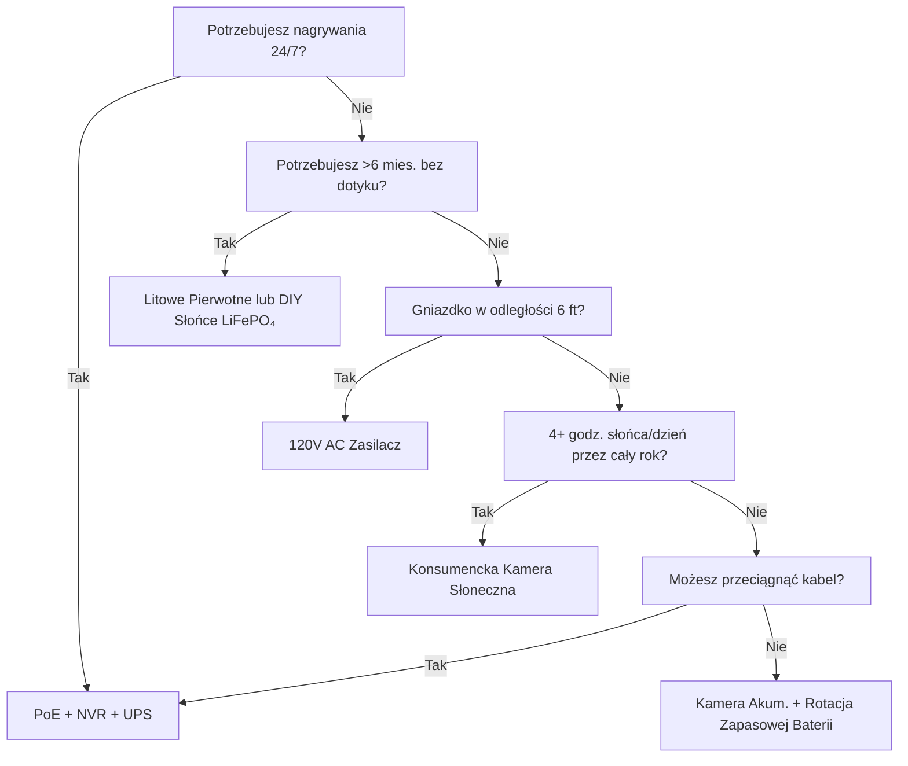

Zasilanie jest powodem #1, dla którego kamery bezpieczeństwa zawodzą. Rozładowana bateria o 3 nad ranem. Zamrożony Li-ion w styczniu. Panel słoneczny zasypany śniegiem. Przełącznik PoE odłączony "tylko na chwilę." Ten poradnik rozkłada na części każdą architekturę zasilania z rzeczywistą fizyką, prawdziwymi danymi i ramami decyzyjnymi, abyś wybrał raz i działało.

<Badge variant="outline">Fizyka Najpierw</Badge> **Energia w = Energia wyjście +
Straty.** Żaden marketing tego nie zmieni. Projektuj dla najgorszego przypadku
(najkrótszy dzień, najniższa temp., najwyższa aktywność), nie najlepszego.

## Porównanie Architektur Zasilania

| Architektura                        | Źródło Napięcia          | Maks. Dystans               | Niezawodność   | Złożoność Instalacji | Najlepsze Dla                            |
| ----------------------------------- | ------------------------ | --------------------------- | -------------- | -------------------- | ---------------------------------------- |
| **120V AC + Adapter**               | Gniazdko ścienne         | 6 ft (przewód)              | ★★★★★ (sieć)   | Trywialny            | Wewnątrz, weranda, istniejące gniazdko   |
| **PoE (802.3af/at/bt)**             | PoE Switch/Injector      | 328 ft (100 m)              | ★★★★★ (UPS)    | Średni (kabel)       | **Złoty standard** — 24/7, NVR, zewn.    |
| **12V/24V DC Bezpośrednio**         | Bank akum./zasilacz      | 50–100 ft (spadek napięcia) | ★★★★☆          | Średni               | Off-grid, camper, istniejąca szyna 12V   |
| **Akumulator Li-ion**               | Wbudowany akumulator     | N/A (bezprzewodowy)         | ★★☆☆☆ (sezon)  | Trywialny            | Najemcy, tymczasowe, strefy bez kabli    |
| **Litowe Pierwotne (Nieładowalne)** | Wbudowana bateria        | N/A                         | ★★★☆☆ (1–2 l.) | Trywialny            | Fotopułapki, ultra-oddalone, brak słońca |
| **Słoneczne + Ładowalne**           | Słońce → Panel → Bateria | N/A                         | ★★★☆☆ (pogoda) | Łatwy–Średni         | Płot, brama, szopa, off-grid             |
| **Hybryda: PoE + Bateria**          | PoE + UPS/Wbudowany      | 328 ft                      | ★★★★★          | Wyższy               | Krytyczne wejścia, tablice rejestracyjne |

<Callout type="warning">

**Marketing vs Rzeczywistość:** "6 miesięcy żywotności baterii" = 10 zdarzeń
ruchu/dzień, 10-sekundowe klipy, 70°F, brak podglądu na żywo.
**Rzeczywistość:** 20–40 zdarzeń/dzień + 5 podglądów na żywo = **2–6
tygodni**. Zawsze zakładaj 3–5× mniej.

</Callout>

## Szczegółowo: Każda Architektura

### 1. PoE (Power over Ethernet) — Profesjonalny Wybór

<Accordion type="single" collapsible>
  <AccordionItem value="poe-basics">
    <AccordionTrigger>Jak Działa PoE i Standardy</AccordionTrigger>
    <AccordionContent>

<strong>IEEE 802.3af (PoE):</strong> 15.4W przy PSE → 12.95W przy PD (kamera).
Zasila większość stałych bullet/dome.
<strong>IEEE 802.3at (PoE+):</strong> 30W przy PSE → 25.5W przy PD. Zasila PTZ,
grzałki, oświetlenie IR.
<strong>IEEE 802.3bt (PoE++):</strong> 60W (Type 3) / 90W (Type 4) przy PSE →
51W / 71W przy PD. Zasila speed dome, multi-sensor, wycieraczki/grzałki.

<strong>Kabel:</strong> Cat5e minimum (Cat6/6a dla PoE++). Max 100 m (328 ft) na
segment.
<strong>Topologia:</strong> Kamera → Cat5e/6 → PoE Switch (lub NVR z portami
PoE) → UPS → Sieć.
<strong>Napięcie:</strong> 44–57V DC na parach (Mode A: pary danych / Mode B:
pary zapasowe). Kamera konwertuje DC-DC wewnętrznie na 12V/5V/3.3V.

</AccordionContent>

  </AccordionItem>
  <AccordionItem value="poe-ups">
    <AccordionTrigger>Wymiarowanie UPS dla PoE (Krytyczne dla 24/7)</AccordionTrigger>
    <AccordionContent>

<strong>Zasada:</strong> UPS musi pokrywać
<strong>wszystkie porty PoE switcha + NVR + router</strong> przez zamierzony
czas.

| Obciążenie                                  | Typowe Waty            | 4-godz. Czas (Wh)       | 12-godz. Czas (Wh)        | 24-godz. Czas (Wh)        |
| ------------------------------------------- | ---------------------- | ----------------------- | ------------------------- | ------------------------- |
| 8-portowy PoE+ Switch (4 kamery)            | 45W                    | 180 Wh                  | 540 Wh                    | 1,080 Wh                  |
| 16-portowy PoE+ Switch (12 kamer)           | 120W                   | 480 Wh                  | 1,440 Wh                  | 2,880 Wh                  |
| NVR (8-bay, 2 HDD)                          | 35W                    | 140 Wh                  | 420 Wh                    | 840 Wh                    |
| Router/Modem                                | 15W                    | 60 Wh                   | 180 Wh                    | 360 Wh                    |
| <strong>Razem (12-kamerowy system)</strong> | <strong>~170W</strong> | <strong>680 Wh</strong> | <strong>2,040 Wh</strong> | <strong>4,080 Wh</strong> |

<strong>Rekomendacja UPS:</strong>

<ul>
  <li>
    <strong>&lt;4 godz.:</strong> CyberPower CP1500PFCLCD (1,500 VA / 1,050 Wh)
    — $200
  </li>
  <li>
    <strong>8–12 godz.:</strong> APC SMT1500RM2UC + zewnętrzny akumulator —
    $600+
  </li>
  <li>
    <strong>24+ godz.:</strong> 48V LiFePO₄ akumulator serwerowy (5–10 kWh) +
    Victron inwerter/ładowarka — $2,000+
  </li>
</ul>

</AccordionContent>
</AccordionItem>
</Accordion>

### 2. Kamery z Akumulatorem — Pułapka Wygody

<Callout type="note">

**Chemia:** Prawie wszystkie konsumenckie kamery akumulatorowe używają
**Li-ion (NMC/LCO), 3.6–3.7V nominalnie, 4.2V max**. Nie LiFePO₄. To ważne na
zimno.

</Callout>

**Rzeczywista Żywotność Baterii (Modele 2025–2026, 1080p/2K/4K)**

| Kamera                | Bateria              | Deklarowany | **Rzecz. (Wysoka Aktywność)** | **Rzecz. (Niska Aktywność)** | Ładowanie                      |
| --------------------- | -------------------- | ----------- | ----------------------------- | ---------------------------- | ------------------------------ |
| EufyCam 3 S330        | 13,000 mAh           | 365 dni     | 14–21 dni                     | 90–120 dni                   | USB-C (5V) / Słońce            |
| Reolink Argus 4 Pro   | 9,600 mAh            | 6 mies.     | 10–18 dni                     | 60–90 dni                    | USB-C (5V) / Słońce            |
| Ring Stick Up Cam Pro | 6,000 mAh            | 6 mies.     | 7–14 dni                      | 45–60 dni                    | USB-C (5V) / Słońce / Zasilacz |
| Arlo Pro 5S 2K        | 5,200 mAh            | 6 mies.     | 5–10 dni                      | 30–45 dni                    | Magnetyczny / Słońce           |
| Blink Outdoor 4       | 2× AA Li (3,000 mAh) | 2 lata      | 60–90 dni                     | 180–365 dni                  | Wymień AA (nieładowalne)       |
| Wyze Cam Outdoor v2   | 5,200 mAh            | 6 mies.     | 10–16 dni                     | 50–75 dni                    | Micro-USB / Słońce             |
| Reolink Go PT Plus    | 7,800 mAh            | 3 mies.     | 8–14 dni                      | 40–60 dni                    | USB-C / Słońce / 12V           |

**Wysoka Aktywność =** 30+ zdarzeń ruchu/dzień + 3 podglądy na żywo/dzień + IR nocą włączone
**Niska Aktywność =** 5 zdarzeń/dzień + 0 podglądów na żywo + tylko w dzień

<Accordion type="single" collapsible>
  <AccordionItem value="battery-physics">
    <AccordionTrigger>
      Dlaczego Żywotność Baterii Spada (Fizyka)
    </AccordionTrigger>
    <AccordionContent>

<ol>
  <li>
    <strong>Moc Tx Dominuje:</strong> Radio Wi-Fi na +17 dBm = 300–500 mA @
    3.7V. 10s
  </li>
</ol>
<ol>
  <li>
    <strong>Diody IR:</strong> 850 nm IR na 100 ft = 1–2W przez 30s/klip. 30
    klipów = 0.25–0.5 Wh = <strong>70–140 mAh @ 3.7V</strong>.
  </li>
  <li>
    <strong>PIR Wake + DSP:</strong> 50–100 mA przez 2–5s na zdarzenie.
    Pomijalne osobno, sumuje się.
  </li>
  <li>
    <strong>Niska Temperatura:</strong> Li-ion{" "}
    <strong>opór wewnętrzny podwaja się przy 0°C (32°F)</strong>. Napięcie spada
    pod obciążeniem Tx → BMS wyłącza przy 3.0V → "martwa" bateria przy 40% SoC.{" "}
    <strong>Pojemność przy -10°C (14°F) ≈ 50% z 70°F.</strong>
  </li>
  <li>
    <strong>Samorozładowanie:</strong> 2–5%/miesiąc. Pomijalne vs aktywne
    zużycie.
  </li>
  <li>
    <strong>Podgląd na Żywo:</strong> 5 min podglądu na żywo = 30+ klipów
    energii. <strong>Unikaj codziennych podglądów na żywo.</strong>
  </li>
</ol>

    </AccordionContent>

  </AccordionItem>
  <AccordionItem value="charging">
    <AccordionTrigger>Strategie Ładowania, Które Działają</AccordionTrigger>
    <AccordionContent>

      <strong>Nie czekaj na 0%.</strong> Li-ion nie lubi głębokiego rozładowania. Ładuj przy
        20–30%. <strong>Wymiarowanie Panelu Słonecznego:</strong> Panel (W) ≥ Średni Pobór
      Kamery (W) × 3 (zima/zachmurzenie) ÷ Godziny szczytowe słońca (najgorszy
      miesiąc). - Przykład: Argus 4 Pro średnio 1.5W → potrzeba 4.5W. Najgorszy
      miesiąc (grudzień, Strefa 5) = 1.5 godz. szczyt. → <strong>minimum 3W panel,
      zalecane 6W</strong>. <strong>Kable USB-C PD Trigger:</strong> Reolink/Argus/Eufy akceptują
        5V/9V/12V/15V/20V przez negocjację PD. Użyj kabla 12V→USB-C PD trigger do
      ładowania bezpośrednio z akumulatora 12V campera/domowego (90% sprawności
      vs 12V→120V inwerter→5V adapter na 60%). <strong>Rotacja Podwójnej Baterii:</strong>
      Kup zapasowy pakiet. Wymień naładowany za rozładowany. Zero przestojów.
      Działa tylko z wymiennymi pakietami (Reolink, Blink, niektóre Ring).

    </AccordionContent>

  </AccordionItem>
</Accordion>

### 3. Litowe Pierwotne (Nieładowalne) — Specjalista Dalekiego Zasięgu

| Typ Baterii                       | Chemia   | Napięcie | Pojemność  | Zakres Temp.   | Najlepsze Dla                          |
| --------------------------------- | -------- | -------- | ---------- | -------------- | -------------------------------------- |
| **Energizer Ultimate Lithium AA** | Li/FeS₂  | 1.5V     | 3,000 mAh  | -40°F do 140°F | Blink, fotopułapki, praca w -40°F      |
| **Tadiran TL-5930 (D-cell)**      | Li/SOCl₂ | 3.6V     | 19,000 mAh | -67°F do 185°F | Rurociągi, telemetria zdalna, 5–10 lat |
| **Saft LS 14500 (AA)**            | Li/SOCl₂ | 3.6V     | 2,600 mAh  | -60°F do 185°F | Przemysłowe, strefy ATEX               |

**Zalety:** 10–20× gęstość energii vs alkaliczne; działa w -40°F; trwałość 10–20 lat; brak układu ładowania
**Wady:** **Nieładowalne**; $2–10/szt.; plateau napięciowe utrudnia pomiar stanu; pasywacja (opóźnienie napięcia po długim spoczynku)
**Zastosowanie:** Fotopułapka na szlaku dzikich zwierząt, sprawdzana kwartalnie; czujnik rurociągu; kamera badawcza na Antarktydzie. **Nie do codziennego bezpieczeństwa.**

### 4. Słoneczne + Akumulator — Inżynieria Off-Grid

<Callout type="info">

**Słońce to ładowarka akumulatora, nie źródło zasilania.** Wymiaruj
**akumulator** dla autonomii (dni bez słońca). Wymiaruj **panel**, aby
naładować ten akumulator w 1 dobrym dniu.

</Callout>

**Arkusz Wymiarowania Systemu**

```
  1. Średni pobór kamery (W) × 24h = Wh/dzień potrzeba
   Przykład: Reolink Go PT Plus = 2.5W średnio → 60 Wh/dzień

  2. Autonomia akumulatora (dni bez słońca) × Wh/dzień = Wh akumulatora
     3 dni autonomii → 180 Wh
   LiFePO₄ 12.8V → 180 Wh ÷ 12.8V = 14 Ah → **pakiet 20 Ah (20% margines)**

  3. Godziny szczytowe słońca (PSH) najgorszego miesiąca × Waty panelu × 0.75 (straty) = Wh/dzień
   Grudzień, Strefa 5: 1.5 PSH × Panel W × 0.75 = 60 Wh → Panel = 53W → **panel 60W**

  4. Kontroler ładowania: MPPT (95% sprawności) vs PWM (75% sprawności). **Zawsze MPPT dla >20W.**
   Victron SmartSolar 75/10, 75/15, 100/20 — Bluetooth, programowalny, niezawodny.

  5. Montaż: Skierowany na południe (NP), nachylenie szerokości geograficznej (30–45°),
   **bez cienia 9:00–15:00 21 grudnia**. Regulowany montaż naziemny > dach > słupek ogrodzenia.
```

**Rzeczywiste Zestawy Słoneczne z Kamerą (2026)**

| Zestaw                                                            | Panel             | Akumulator         | Sterownik   | Kamera                      | Czas Działania Zima Strefa 5            |
| ----------------------------------------------------------------- | ----------------- | ------------------ | ----------- | --------------------------- | --------------------------------------- |
| Reolink 6W + Argus 4 Pro                                          | 6W (stały)        | 9.6 Ah (wbudowany) | Wbud. (PWM) | Argus 4 Pro                 | **Zawodzi gru–lut** (panel za mały)     |
| Reolink 20W + Go PT Plus                                          | 20W (regulowany)  | 7.8 Ah (wbudowany) | Wbud.       | Go PT Plus                  | **Graniczny** (dodaj zew. 20Ah LiFePO₄) |
| EufyCam 3 + Słoneczny                                             | 2.4W (zintegrow.) | 13 Ah (wbudowany)  | Wbud.       | EufyCam 3                   | **Zawodzi lis–mar** (panel mały)        |
| **DIY: 60W + 20Ah LiFePO₄ + Victron + Go PT Plus**                | 60W               | 256 Wh             | MPPT        | Go PT Plus                  | **95% czasu** (zaprojektowany)          |
| **DIY: 100W + 40Ah LiFePO₄ + Victron + PoE Injector + 4K Bullet** | 100W              | 512 Wh             | MPPT        | Reolink RLC-1212A + 12V→PoE | **99% czasu** (prawdziwy off-grid PoE)  |

<Accordion type="single" collapsible>
  <AccordionItem value="winter">
    <AccordionTrigger>Zimowa Rzeczywistość Słońca (Strefa 4–6)</AccordionTrigger>
    <AccordionContent>

<strong>Przesilenie Grudniowe (Strefa 5, 42°N):</strong>

<ul>
  <li>
    Godziny szczytowe słońca: <strong>1.0–1.5</strong> (vs 5.5 w czerwcu)
  </li>
  <li>
    Moc panelu przy nachyleniu 30°: <strong>15–20% klasyfikacji STC</strong>
  </li>
  <li>
    Pokrywa śnieżna: <strong>0% mocy</strong> do usunięcia (istnieją panele
    samogrzejne: 5–10W pasożytnicze)
  </li>
  <li>
    Akumulator przy -10°C:{" "}
    <strong>Li-ion = 50% pojemności; LiFePO₄ = 80% pojemności</strong>
  </li>
</ul>

<strong>Strategie Przetrwania:</strong>

<ol>
  <li>
    <strong>Przewymiaruj panel 3–4×</strong> (60W → 180–240W array)
  </li>
  <li>
    <strong>Akumulator LiFePO₄</strong> (nie Li-ion) — ładuje się przy -20°C z
    grzałką BMS
  </li>
  <li>
    <strong>Zmniejsz cykl pracy kamery:</strong> Tylko ruch, niższa
    rozdzielczość, krótsze klipy, wyłącz IR (użyj światła otoczenia)
  </li>
  <li>
    <strong>Ładowanie zapasowe:</strong> Kabel 12V→USB-C PD trigger z
    pojazdu/generatora miesięcznie
  </li>
  <li>
    <strong>Zaakceptuj przestoje:</strong> Projektuj na 90% czasu, nie 100%. 3–5
    ciemnych dni/rok to normalne.
  </li>
</ol>

              </AccordionContent>

        </AccordionItem>

    </Accordion>

### 5. 12V/24V DC Bezpośrednio — Camper/Off-Grid Natywnie

**Dlaczego 12V DC?** Brak strat inwertera (120V AC → 12V DC = 15–25% strat). Kamera i tak działa wewnętrznie na 12V.

**Okablowanie Kamery 12V Bezpośrednio:**

```
Akumulator domowy (12V LiFePO₄)
  → Bezpiecznik nożowy 10A
  → 18 AWG Cynowany Przewód Morski (czerwony/czarny)
  → Wodoszczelne Złącze Deutsch / SAE / Anderson
  → Wejście Kamery 12V (sprawdź polaryzację!)
  → **Buck Converter** jeśli kamera potrzebuje 5V/9V (większość PoE potrzebuje 48V → użyj 12V→48V PoE Injector)
```

**Kalkulator Spadku Napięcia:**

```
Vdrop = (2 × Długość_ft × Prąd_A × 0.000016) / Przekrój_CM
  18 AWG (1,624 CM), 50 ft, 1A → 0.98V spadek (8% na 12V) — AKCEPTOWALNY
  18 AWG, 100 ft, 1A → 1.96V spadek (16%) — UŻYJ 16 AWG (2,583 CM) → 1.2V (10%)
```

**Zasada:** Utrzymuj odcinki 12V &lt;50 ft na 18 AWG; &lt;100 ft na 14 AWG. Lub użyj dystrybucji 24V/48V + buck przy kamerze.

**Injectory 12V→PoE (Uruchamianie Kamer PoE na Banku 12V):**

- Tycon POE-12-48V (12V wej. → 48V PoE wyj., 15W) — $25
- Ubiquiti INJ-12V-48V (12V → 48V PoE+, 30W) — $35
- Przemysłowy: Mean Well NDR-120-48 (120W szyna DIN) + rozdzielacz PoE — $60
- **Sprawność:** 85–92%. Kamera widzi standardowe PoE — brak hacków firmware.

### 6. Hybryda: PoE + Zapasowy Akumulator (Zero Przestojów)

**Architektura:** Kamera → PoE Switch → UPS (LiFePO₄) → Sieć.
**Plus:** Kamera ma wbudowany akumulator (Reolink Go PT Plus, Arlo Go 2) LUB zewnętrzny UPS na kamerę.

| Podejście                                | Koszt       | Czas (na kamerę)  | Złożoność |
| ---------------------------------------- | ----------- | ----------------- | --------- |
| Centralny UPS (switch+NVR)               | $200–2,000  | Godziny–Dni       | Niska     |
| UPS na kamerę (APC BE600M1)              | $60×N       | 30–60 min         | Średnia   |
| Kamera z wbud. akumulatorem (Go PT Plus) | $230        | 2–4 tyg. (słońce) | Niska     |
| **PoE + 12V LiFePO₄ + Przełącznik Auto** | $150/kamera | Dni–Tygodnie      | Wysoka    |

**Najlepsze z Obu Światów:** PoE do nagrywania 24/7 + NVR. Wbudowany akumulator do **nagrywania przy awarii zasilania** (ostatnie 30 min przed wyczerpaniem UPS). Reolink Go PT Plus robi to natywnie — nagrywa na microSD gdy PoE znika.

## Całkowity Koszt Posiadania (5 Lat)

| Architektura                           | Rok 1  | Lata 2–5 (Rocznie)     | 5-letni Koszt | Najlepsze Dla                        |
| -------------------------------------- | ------ | ---------------------- | ------------- | ------------------------------------ |
| **PoE + NVR + UPS**                    | $1,500 | $50 (wymiana HDD)      | **$1,700**    | Stały, 24/7, 8+ kamer                |
| **Akumulator + Słońce (DIY LiFePO₄)**  | $800   | $0                     | **$800**      | Off-grid, 1–4 kamery, DIY            |
| **Kamera akum. + Panel (Konsumencki)** | $500   | $50 (akum. wym. rok 3) | **$700**      | Wynajem, brak kabli, 1–2 kam.        |
| **Litowe Pierwotne (Fotopułapka)**     | $300   | $100 (ogniwa/rok)      | **$700**      | Ultra-oddalone, kontrola kwart.      |
| **120V AC Zasilacz**                   | $200   | $10                    | **$240**      | Wewnątrz, weranda, gniazdko istnieje |

<Callout type="tip">

**Ukryte Koszty:** Dojazdy. Kamera na baterię pada o 3 nad ranem → jedziesz 30
min wymienić = $50/raz. PoE + UPS = 0 dojazdów dla zasilania. Uwzględnij $50 ×
oczekiwane awarie/rok.

</Callout>

## Macierz Decyzyjna: Wybierz Swoją Architekturę



## Szybka Lista Kontrolna dla Twojej Kamery

- [ ] **PoE:** 802.3af (15W) / at (30W) / bt (60/90W) — dopasuj switch
- [ ] **12V DC:** Akceptuje 10–14V? Ochrona przed odwrotną polaryzacją? Typ złącza?
- [ ] **Akumulator:** Wymienny? Chemia (Li-ion vs LiFePO₄)? mAh @ 3.7V? Ładowanie przez USB-C PD?
- [ ] **Słońce:** Waty panelu? MPPT czy PWM? Długość kabla? Regulowany uchwyt?
- [ ] **Temp. pracy:** -20°C minimum dla Li-ion; -40°C dla LiFePO₄/pierwotnych
- [ ] **Pobór mocy:** "Max" vs "typowy" w specyfikacji — projektuj dla typowego × 1.5
- [ ] **Powiadomienie o niskim akumulatorze:** Push w aplikacji przy 20%? Próg automatycznego wyłączenia?
- [ ] **Kompatybilność z UPS:** NVR + Switch na tym samym UPS? Obliczony czas podtrzymania?

---

## Powiązane Poradniki

- [Best Solar-Powered Security Cameras (Off-Grid)](/blog/best-solar-powered-security-cameras-offgrid)
- [Best Security Cameras for RVs & Mobile Homes](/blog/best-security-cameras-for-rvs-mobile-homes)
- [PoE vs Wireless vs Solar Comparison](/blog/poe-vs-wireless-vs-solar-comparison)
- [Wireless Camera Setup: DIY Installation Tips](/blog/wireless-camera-setup-diy-installation-tips)
