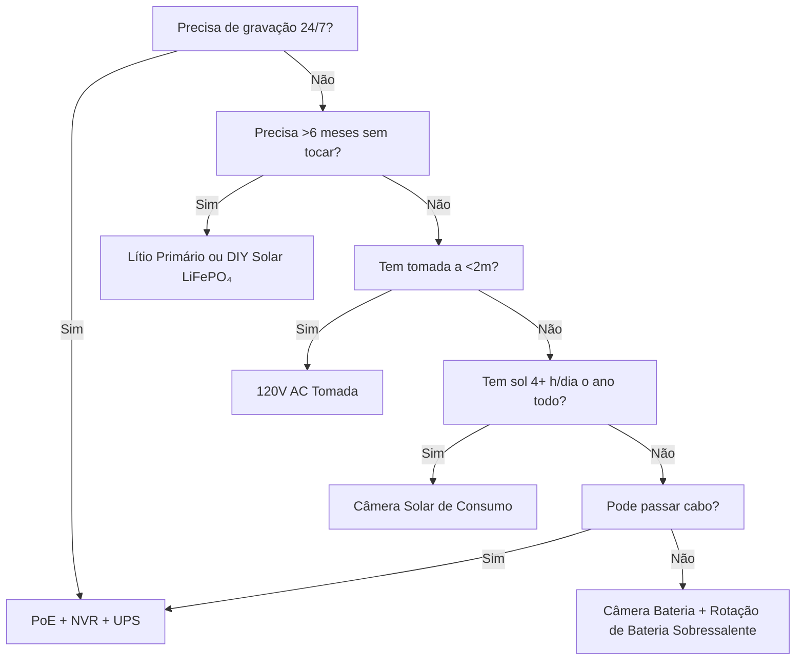

A energia é a razão #1 pela qual câmeras de segurança falham. Bateria descarregada às 3 AM. Li-ion congelado em janeiro. Painel solar enterrado na neve. Switch PoE desconectado "por um minuto." Este guia detalha cada arquitetura de energia com física real, dados reais e estruturas de decisão para você escolher uma vez e funcionar.

<Badge variant="outline">Física Primeiro</Badge> **Energia entrada = Energia
saída + Perdas.** Nenhum marketing muda isso. Dimensione sua fonte para o pior
caso (dia mais curto, temperatura mais fria, maior atividade), não para o melhor
caso.

## Comparação de Arquiteturas de Energia

| Arquitetura                           | Fonte de Tensão        | Distância Máxima       | Confiabilidade   | Complexidade de Instalação | Melhor Para                            |
| ------------------------------------- | ---------------------- | ---------------------- | ---------------- | -------------------------- | -------------------------------------- |
| **120V AC + Adaptador**               | Tomada de parede       | 1,8 m (cabo)           | ★★★★★ (rede)     | Trivial                    | Interno, varanda, tomada existente     |
| **PoE (802.3af/at/bt)**               | Switch/Injetor PoE     | 100 m                  | ★★★★★ (com UPS)  | Moderado (cabo)            | **Padrão ouro** — 24/7, NVR, remoto    |
| **12V/24V DC Direto**                 | Banco de baterias/PSU  | 15–30 m (queda tensão) | ★★★★☆            | Moderado                   | Off-grid, RV, barramento 12V existente |
| **Li-ion Recarregável**               | Bateria interna        | N/A (sem fio)          | ★★☆☆☆ (sazonal)  | Trivial                    | Inquilinos, temporário, sem cabos      |
| **Lítio Primário (Não recarregável)** | Bateria interna        | N/A                    | ★★★☆☆ (1–2 anos) | Trivial                    | Câmeras de trilha, remoto, sem sol     |
| **Solar + Recarregável**              | Sol → Painel → Bateria | N/A                    | ★★★☆☆ (clima)    | Fácil–Moderado             | Cerca, portão, galpão, off-grid        |
| **Híbrido: PoE + Backup de Bateria**  | PoE + UPS/Interna      | 100 m                  | ★★★★★            | Maior                      | Entrada crítica, placa de licença      |

<Callout type="warning">

**Marketing vs Realidade:** "6 meses de bateria" = 10 eventos de
movimento/dia, clipes de 10s, 21°C, sem visualização ao vivo. **Mundo real:**
20–40 eventos/dia + 5 visualizações ao vivo = **2–6 semanas**. Sempre reduza
3–5×.

</Callout>

## Análise Detalhada: Cada Arquitetura

### 1. PoE (Power over Ethernet) — A Escolha Profissional

<Accordion type="single" collapsible>
  <AccordionItem value="poe-basics">
    <AccordionTrigger>Como o PoE Funciona e Padrões</AccordionTrigger>
    <AccordionContent>

<strong>IEEE 802.3af (PoE):</strong> 15,4W no PSE → 12,95W no PD (câmera).
Alimenta a maioria das balas/domos fixos.
<strong>IEEE 802.3at (PoE+):</strong> 30W no PSE → 25,5W no PD. Alimenta PTZ,
aquecedores, iluminadores IR.
<strong>IEEE 802.3bt (PoE++):</strong> 60W (Tipo 3) / 90W (Tipo 4) no PSE → 51W
/ 71W no PD. Alimenta speed domes, multisensor, limpadores/aquecedores.

<strong>Cabo:</strong> Cat5e mínimo (Cat6/6a para PoE++). Máx. 100 m por
segmento.
<strong>Topologia:</strong> Câmera → Cat5e/6 → Switch PoE (ou NVR com portas
PoE) → UPS → Rede.
<strong>Tensão:</strong> 44–57V DC nos pares do cabo (Modo A: pares de dados /
Modo B: pares sobressalentes). A câmera converte DC-DC para 12V/5V/3,3V
internamente.

</AccordionContent>

  </AccordionItem>
  <AccordionItem value="poe-ups">
    <AccordionTrigger>Dimensionamento de UPS para PoE (Crítico para 24/7)</AccordionTrigger>
    <AccordionContent>

<strong>Regra:</strong> O UPS deve cobrir
<strong>todas as portas do switch PoE + NVR + roteador</strong> para o tempo de
execução desejado.

| Carga                               | Watts Típicos          | 4h (Wh)                 | 12h (Wh)                  | 24h (Wh)                  |
| ----------------------------------- | ---------------------- | ----------------------- | ------------------------- | ------------------------- |
| Switch PoE+ 8 portas (4 cams)       | 45W                    | 180 Wh                  | 540 Wh                    | 1.080 Wh                  |
| Switch PoE+ 16 portas (12 cams)     | 120W                   | 480 Wh                  | 1.440 Wh                  | 2.880 Wh                  |
| NVR (8 baias, 2 HDD)                | 35W                    | 140 Wh                  | 420 Wh                    | 840 Wh                    |
| Roteador/Modem                      | 15W                    | 60 Wh                   | 180 Wh                    | 360 Wh                    |
| <strong>Total (12 câmeras)</strong> | <strong>~170W</strong> | <strong>680 Wh</strong> | <strong>2.040 Wh</strong> | <strong>4.080 Wh</strong> |

<strong>Recomendação de UPS:</strong>

<ul>
  <li>
    <strong>&lt;4h:</strong> CyberPower CP1500PFCLCD (1.500 VA / 1.050 Wh) —
    ~$200
  </li>
  <li>
    <strong>8–12h:</strong> APC SMT1500RM2UC + pacote de bateria externo —
    ~$600+
  </li>
  <li>
    <strong>24h+:</strong> Bateria de rack 48V LiFePO₄ (5–10 kWh) +
    inversor/carregador Victron — ~$2.000+
  </li>
</ul>

<strong>Dica Profissional:</strong> Coloque switch PoE + NVR + roteador no
<strong>mesmo UPS</strong>. UPS por câmera existe mas custa 5× mais para o mesmo
tempo.

</AccordionContent>

  </AccordionItem>
</Accordion>

### 2. Câmeras com Bateria Recarregável — A Armadilha da Conveniência

<Callout type="note">

**Química:** Quase todas as câmeras de bateria de consumo usam **Li-ion
(NMC/LCO), 3,6–3,7V nominal, 4,2V máx**. Não LiFePO₄. Isso importa para o
frio.

</Callout>

**Vida Real da Bateria (Modelos 2025–2026, 1080p/2K/4K)**

| Câmera                | Bateria              | Alegado  | **Real (Alta Atividade)** | **Real (Baixa Atividade)** | Método de Carga                  |
| --------------------- | -------------------- | -------- | ------------------------- | -------------------------- | -------------------------------- |
| EufyCam 3 S330        | 13.000 mAh           | 365 dias | 14–21 dias                | 90–120 dias                | USB-C (5V) / Solar               |
| Reolink Argus 4 Pro   | 9.600 mAh            | 6 meses  | 10–18 dias                | 60–90 dias                 | USB-C (5V) / Solar               |
| Ring Stick Up Cam Pro | 6.000 mAh            | 6 meses  | 7–14 dias                 | 45–60 dias                 | USB-C (5V) / Solar / Tomada      |
| Arlo Pro 5S 2K        | 5.200 mAh            | 6 meses  | 5–10 dias                 | 30–45 dias                 | Magnético (proprietário) / Solar |
| Blink Outdoor 4       | 2× AA Li (3.000 mAh) | 2 anos   | 60–90 dias                | 180–365 dias               | Substituir AA (não recarregável) |
| Wyze Cam Outdoor v2   | 5.200 mAh            | 6 meses  | 10–16 dias                | 50–75 dias                 | Micro-USB / Solar                |
| Reolink Go PT Plus    | 7.800 mAh            | 3 meses  | 8–14 dias                 | 40–60 dias                 | USB-C / Solar / 12V              |

**Alta Atividade =** 30+ eventos de movimento/dia + 3 visualizações ao vivo/dia + IR noturno ligado
**Baixa Atividade =** 5 eventos/dia + 0 visualizações ao vivo + apenas diurno

<Accordion type="single" collapsible>
  <AccordionItem value="battery-physics">
    <AccordionTrigger>
      Por que a Vida da Bateria Colapsa (Física)
    </AccordionTrigger>
    <AccordionContent>

<ol>
  <li>
    <strong>Potência de Tx Domina:</strong> Rádio Wi-Fi a +17 dBm = 300–500 mA @
    3,7V.
  </li>
</ol>
<ol>
  <li>
    <strong>LEDs IR:</strong> IR 850 nm a 30m = 1–2W por 30s/clipe. 30 clipes =
    0,25–0,5 Wh = <strong>70–140 mAh @ 3,7V</strong>.
  </li>
  <li>
    <strong>PIR Wake + DSP:</strong> 50–100 mA por 2–5s por evento.
    Negligenciável sozinho, mas soma.
  </li>
  <li>
    <strong>Temperatura Fria:</strong> Li-ion{" "}
    <strong>resistência interna dobra a 0°C</strong>. Tensão cai sob carga de Tx
    → BMS desliga a 3,0V → bateria "morta" com 40% de carga.{" "}
    <strong>Capacidade a -10°C ≈ 50% de 21°C.</strong>
  </li>
  <li>
    <strong>Autodescarga:</strong> 2–5%/mês. Negligenciável vs dreno ativo.
  </li>
  <li>
    <strong>Visualização ao Vivo:</strong> 5 min de visualização ao vivo =
    energia de 30+ clipes. <strong>Evite verificações diárias.</strong>
  </li>
</ol>

    </AccordionContent>

  </AccordionItem>
  <AccordionItem value="charging">
    <AccordionTrigger>
      Estratégias de Carregamento que Funcionam
    </AccordionTrigger>
    <AccordionContent>

      <strong>Não espere até 0%.</strong> Li-ion odeia descarga profunda. Carregue a 20–30%.
      <strong>Dimensionamento do Painel Solar:</strong> Painel (W) ≥ Consumo Médio da Câmera
      (W) × 3 (inverno/nublado) ÷ Horas de Pico Solar (pior mês). - Exemplo:
      Argus 4 Pro média 1,5W → 4,5W necessários. Pior mês (Dez, Zona 5) = 1,5h
      pico → <strong>painel mínimo de 3W, recomendado 6W</strong>. <strong>Cabos USB-C PD
      Trigger:</strong> Reolink/Argus/Eufy aceitam 5V/9V/12V/15V/20V via negociação PD.
      Use cabo 12V→USB-C PD trigger para carregar do banco 12V do RV/casa
      diretamente (90% eficiente vs inversor 12V→120V→adaptador 5V a 60%).
      <strong>Rotação de Bateria Dupla:</strong> Compre bateria sobressalente. Troque
      carregada por descarregada. Zero downtime. Funciona apenas com baterias
      removíveis (Reolink, Blink, alguns Ring).

    </AccordionContent>

  </AccordionItem>
</Accordion>

### 3. Lítio Primário (Não Recarregável) — O Especialista de Longo Prazo

| Tipo de Bateria                   | Química  | Tensão | Capacidade | Faixa de Temp. | Melhor Para                         |
| --------------------------------- | -------- | ------ | ---------- | -------------- | ----------------------------------- |
| **Energizer Ultimate Lithium AA** | Li/FeS₂  | 1,5V   | 3.000 mAh  | -40°C a 60°C   | Blink, câmeras de trilha, -40°C     |
| **Tadiran TL-5930 (D-cell)**      | Li/SOCl₂ | 3,6V   | 19.000 mAh | -55°C a 85°C   | Dutos, telemetria remota, 5–10 anos |
| **Saft LS 14500 (AA)**            | Li/SOCl₂ | 3,6V   | 2.600 mAh  | -51°C a 85°C   | Industrial, zonas ATEX              |

**Prós:** 10–20× densidade energética vs alcalina; funciona a -40°C; vida útil 10–20 anos; sem circuito de carga
**Contras:** **Não recarregável**; $2–10/célula; platô de tensão dificulta medição; passivação (atraso de tensão após longo repouso)
**Uso:** Câmera de trilha verificada trimestralmente; sensor de duto; câmera de pesquisa antártica. **Não para segurança diária.**

### 4. Solar + Bateria — Engenharia Off-Grid

<Callout type="info">

**Solar é um carregador de bateria, não uma fonte de energia.** Dimensione a
**bateria** para autonomia (dias sem sol). Dimensione o **painel** para
recarregar essa bateria em 1 dia bom.

</Callout>

**Planilha de Dimensionamento**

```
  1. Potência média da câmera (W) × 24h = Wh/dia necessários
   Exemplo: Reolink Go PT Plus = 2,5W média → 60 Wh/dia

  2. Autonomia da bateria (dias sem sol) × Wh/dia = Wh da bateria
     3 dias de autonomia → 180 Wh
   LiFePO₄ 12,8V → 180 Wh ÷ 12,8V = 14 Ah → **Bateria de 20 Ah (margem de 20%)**

  3. Horas de pico solar do pior mês (HPS) × Watts do painel × 0,75 (perdas) = Wh/dia
   Dez, Zona 5: 1,5 HPS × Painel W × 0,75 = 60 Wh → Painel = 53W → **Painel de 60W**

  4. Controlador de Carga: MPPT (95% ef.) vs PWM (75% ef.). **Sempre MPPT para >20W.**
   Victron SmartSolar 75/10, 75/15, 100/20 — Bluetooth, programável, confiável.

  5. Montagem: Virado para norte (HS), inclinação da latitude (30–45°), **sem sombra 9h–15h em 21 Dez**.
   Suporte de solo ajustável > telhado > poste de cerca.
```

**Kits de Câmera Solar Reais (2026)**

| Kit                                                            | Painel           | Bateria          | Controlador   | Câmera                      | Autonomia Inverno Zona 5                     |
| -------------------------------------------------------------- | ---------------- | ---------------- | ------------- | --------------------------- | -------------------------------------------- |
| Reolink 6W + Argus 4 Pro                                       | 6W (fixo)        | 9,6 Ah (interno) | Interno (PWM) | Argus 4 Pro                 | **Falha Dez–Fev** (painel muito pequeno)     |
| Reolink 20W + Go PT Plus                                       | 20W (ajustável)  | 7,8 Ah (interno) | Interno       | Go PT Plus                  | **Marginal** (adicione LiFePO₄ externo 20Ah) |
| EufyCam 3 + Solar                                              | 2,4W (integrado) | 13 Ah (interno)  | Interno       | EufyCam 3                   | **Falha Nov–Mar** (painel minúsculo)         |
| **DIY: 60W + 20Ah LiFePO₄ + Victron + Go PT Plus**             | 60W              | 256 Wh           | MPPT          | Go PT Plus                  | **95% operante** (projetado)                 |
| **DIY: 100W + 40Ah LiFePO₄ + Victron + Injetor PoE + Bala 4K** | 100W             | 512 Wh           | MPPT          | Reolink RLC-1212A + 12V→PoE | **99% operante** (PoE off-grid real)         |

<Accordion type="single" collapsible>
  <AccordionItem value="winter">
    <AccordionTrigger>Realidade Solar no Inverno (Zonas 4–6)</AccordionTrigger>
    <AccordionContent>

<strong>Solstício de Dezembro (Zona 5, 42°N):</strong>

<ul>
  <li>
    Horas de Pico Solar: <strong>1,0–1,5</strong> (vs 5,5 em Junho)
  </li>
  <li>
    Saída do painel a 30°: <strong>15–20% da classificação STC</strong>
  </li>
  <li>
    Cobertura de neve: <strong>0% de saída</strong> até limpar (painéis com
    aquecimento automático existem: 5–10W parasita)
  </li>
  <li>
    Bateria a -10°C:{" "}
    <strong>Li-ion = 50% capacidade; LiFePO₄ = 80% capacidade</strong>
  </li>
</ul>

<strong>Estratégias de Sobrevivência:</strong>

<ol>
  <li>
    <strong>Superdimensione o painel 3–4×</strong> o cálculo de verão (60W →
    180–240W)
  </li>
  <li>
    <strong>Bateria LiFePO₄</strong> (não Li-ion) — carrega a -20°C com
    aquecedor BMS
  </li>
  <li>
    <strong>Reduza o ciclo de trabalho:</strong> Só movimento, resolução menor,
    clipes mais curtos, desligue IR (use luz ambiente)
  </li>
  <li>
    <strong>Carga de backup:</strong> Cabo 12V→USB-C PD trigger do
    veículo/gerador mensalmente
  </li>
  <li>
    <strong>Aceite indisponibilidade:</strong> Projete para 90% operante, não
    100%. 3–5 dias sem sol/ano é normal.
  </li>
</ol>

              </AccordionContent>

           </AccordionItem>

    </Accordion>

### 5. 12V/24V DC Direto — O Nativo para RV/Off-Grid

**Por que 12V DC?** Sem perda de inversor (120V AC → 12V DC = 15–25% de perda). A câmera já funciona internamente em 12V.

**Conexão de Câmera 12V Direta:**

```
Bateria da Casa (12V LiFePO₄)
  → Fusível Lâmina 10A
  → Fio Marinho Estanhado 18 AWG (vermelho/preto)
  → Conector Deutsch / SAE / Anderson à prova d'água
  → Entrada 12V da Câmera (verifique polaridade!)
  → **Conversor Buck** se câmera precisar de 5V/9V (câmeras PoE precisam de 48V → use injetor PoE 12V→48V)
```

**Calculadora de Queda de Tensão:**

```
Vqueda = (2 × Comprimento_pés × Corrente_A × 0,000016) / CM_do_fio
  18 AWG (1.624 CM), 15m, 1A → 0,98V queda (8% em 12V) — ACEITÁVEL
  18 AWG, 30m, 1A → 1,96V queda (16%) — USE 16 AWG (2.583 CM) → 1,2V (10%)
```

**Regra:** Mantenha cabos de 12V &lt;15m em 18 AWG; &lt;30m em 14 AWG. Ou use distribuição 24V/48V + buck na câmera.

**Injetores 12V→PoE (Execute Câmeras PoE em Banco 12V):**

- Tycon POE-12-48V (12V in → 48V PoE out, 15W) — $25
- Ubiquiti INJ-12V-48V (12V → 48V PoE+, 30W) — $35
- Industrial: Mean Well NDR-120-48 (120W trilho DIN) + divisor PoE — $60
- **Eficiência:** 85–92%. A câmera vê PoE padrão — sem hacks de firmware.

### 6. Híbrido: PoE + Backup de Bateria (Zero Indisponibilidade)

**Arquitetura:** Câmera → Switch PoE → UPS (LiFePO₄) → Rede.
**Mais:** Câmera com bateria interna (Reolink Go PT Plus, Arlo Go 2) OU UPS externo por câmera.

| Abordagem                                | Custo       | Autonomia (por câmera) | Complexidade |
| ---------------------------------------- | ----------- | ---------------------- | ------------ |
| UPS central (switch+NVR)                 | $200–2.000  | Horas–Dias             | Baixa        |
| UPS por câmera (APC BE600M1)             | $60×N       | 30–60 min              | Média        |
| Câmera com bateria interna (Go PT Plus)  | $230        | 2–4 semanas (solar)    | Baixa        |
| **PoE + 12V LiFePO₄ + Chave Automática** | $150/câmera | Dias–Semanas           | Alta         |

**Melhor dos Dois Mundos:** PoE para gravação 24/7 + NVR. Bateria interna para gravação **durante queda de energia** (últimos 30 min antes do UPS morrer). Reolink Go PT Plus faz isso nativamente — grava em microSD quando PoE é perdido.

## Custo Total de Propriedade (5 Anos)

| Arquitetura                           | Ano 1  | Anos 2–5 (Anual)     | Total 5 Anos | Melhor Para                          |
| ------------------------------------- | ------ | -------------------- | ------------ | ------------------------------------ |
| **PoE + NVR + UPS**                   | $1.500 | $50 (substituir HDD) | **$1.700**   | Permanente, 24/7, 8+ câmeras         |
| **Bateria + Solar (DIY LiFePO₄)**     | $800   | $0                   | **$800**     | Off-grid, 1–4 câmeras, DIY           |
| **Câmera Bateria + Painel (Consumo)** | $500   | $50 (bateria ano 3)  | **$700**     | Aluguel, sem fios, 1–2 câmeras       |
| **Lítio Primário (Câmera Trilha)**    | $300   | $100 (células/ano)   | **$700**     | Ultra remoto, verificação trimestral |
| **120V AC Tomada**                    | $200   | $10                  | **$240**     | Interno, varanda, tomada existe      |

<Callout type="tip">

**Custo Oculto:** Deslocamentos. Bateria da câmera morre às 3 AM → você dirige
30 min para trocar = $50/vez. PoE + UPS = zero deslocamentos por energia.
Considere $50 × falhas esperadas/ano.

</Callout>

## Matriz de Decisão: Escolha Sua Arquitetura



## Lista de Verificação Rápida para Sua Câmera

- [ ] **PoE:** 802.3af (15W) / at (30W) / bt (60/90W) — compatível com switch
- [ ] **12V DC:** Aceita 10–14V? Proteção contra inversão de polaridade? Tipo de conector?
- [ ] **Bateria:** Removível? Química (Li-ion vs LiFePO₄)? mAh @ 3,7V? Carregamento via USB-C PD?
- [ ] **Solar:** Watts do painel? MPPT ou PWM? Comprimento do cabo? Ajuste de montagem?
- [ ] **Temperatura Operacional:** -20°C mínimo para Li-ion; -40°C para LiFePO₄/primário
- [ ] **Consumo:** "Máx" vs "típico" na folha de dados — projete para típico × 1,5
- [ ] **Alerta de Bateria Fraca:** Push no app a 20%? Limiar de desligamento automático?
- [ ] **Compatibilidade com UPS:** NVR + Switch no mesmo UPS? Tempo calculado?

---

## Guias Relacionados

- [Melhores Câmeras de Segurança Solares (Off-Grid)](/blog/best-solar-powered-security-cameras-offgrid) — Análise detalhada de dimensionamento
- [Melhores Câmeras de Segurança para RVs e Casas Móveis](/blog/best-security-cameras-for-rvs-mobile-homes) — 12V DC, vibração, celular
- [Comparação PoE vs Wireless vs Solar](/blog/poe-vs-wireless-vs-solar-comparison) — Estrutura de decisão
- [Instalação de Câmera Sem Fio: Dicas DIY](/blog/wireless-camera-setup-diy-installation-tips) — Wi-Fi, bateria, montagem
