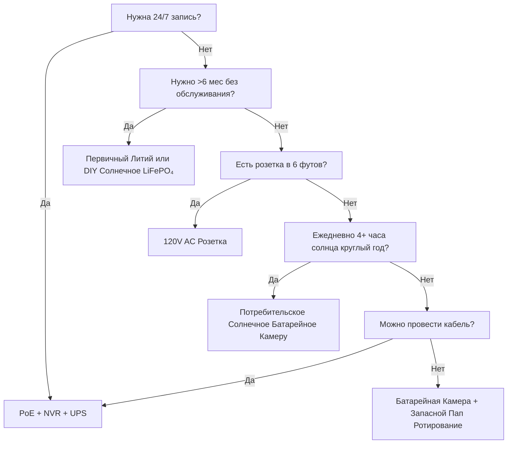

import { Callout } from "@/components/ui/callout"
import { Badge } from "@/components/ui/badge"
import { Accordion, AccordionItem, AccordionTrigger, AccordionContent } from "@/components/ui/accordion"

Питание — причина №1 отказа камер безопасности. Мертвая батарея в 3 часа ночи. Замерзший Li-ion в январе. Солнечная панель, заваленная снегом. PoE коммутатор выдернули «на минутку». Это руководство разбирает каждую энерго-архитектуру с реальной физикой, реальными данными и фреймворками решений, чтобы вы выбрали раз и навсегда.

<Badge variant="outline">Сначала физика</Badge> **Энергия в = Энергия вы + Потери.** Никакой маркетинг не изменит этого. Размеряйте источник под худший случай (самый короткий день, самая холодная температура, высокая активность), а не лучший.

## Сравнение энерго-архитектур

| Архитектура | Источник напряжения | Макс. дистанция | Надежность | Сложность установки | Лучше для |
|--------------|----------------|--------------|-------------|-------------------|----------|
| **120V AC + Адаптер** | Розетка | 6 футов (шнур) | ★★★★★ (сеть) | Тривиальная | Внутренние, крыльцо, есть розетка |
| **PoE (802.3af/at/bt)** | PoE коммутатор/Инжектор | 328 футов (100 м) | ★★★★★ (с UPS) | Средняя (кабель) | **Золотой стандарт** — 24/7, NVR, удаленно |
| **12V/24V DC Прямое** | Батарейный банк / БП | 50–100 футов (падение напряжения) | ★★★★☆ | Средняя | Офф-грид, RV, существующая 12V шина |
| **Перезаряжаемый Li-ion** | Внутренняя батарея | N/A (беспроводно) | ★★☆☆☆ (сезонно) | Тривиальная | Арендаторы, временно, зоны без кабелей |
| **Первичный Литий (Неперезаряжаемый)** | Внутренняя батарея | N/A | ★★★☆☆ (1–2 года) | Тривиальная | Трейл камеры, ультра-удалённые, нет солнца |
| **Солнечное + Перезаряжаемое** | Солнце → Панель → Батарея | N/A | ★★★☆☆ (погода) | Легко–Средняя | Забор, ворота, сарай, офф-грид |
| **Гибрид: PoE + Батарея Бэкап** | PoE + UPS/Внутренняя | 328 футов | ★★★★★ | Выше | Критические входы, номера |

<Callout type="warning">
**Маркетинг vs Реальность:** «6 месяцев жизни батареи» = 10 событий движения/день, 10с клипы, 70°F, никакого живого просмотра. **Реальный мир:** 20–40 событий/день + 5 живых просмотров = **2–6 недель**. Всегда занижайте 3–5×.
</Callout>

## Глубокий разбор: Каждая архитектура

### 1. PoE (Power over Ethernet) — Профессиональный выбор

<Accordion type="single" collapsible>
  <AccordionItem value="poe-basics">
    <AccordionTrigger>Как работает PoE и стандарты</AccordionTrigger>
    <AccordionContent>
**IEEE 802.3af (PoE):** 15.4W на PSE → 12.95W на PD (камера). Питание большинства фиксированных пуль/куполов.  
**IEEE 802.3at (PoE+):** 30W на PSE → 25.5W на PD. Питание PTZ, обогреватели, IR подсветки.  
**IEEE 802.3bt (PoE++):** 60W (Type 3) / 90W (Type 4) на PSE → 51W / 71W на PD. Питание спид-домов, мульти-сенсорных, виперов/обогревателей.

**Кабель:** Cat5e минимум (Cat6/6a для PoE++). Макс 100 м (328 футов) на сегмент.  
**Топология:** Камера → Cat5e/6 → PoE Коммутатор (или NVR с PoE портами) → UPS → Сеть.  
**Напряжение:** 44–57V DC на парах проводов (Mode A: пары данных / Mode B: запасные пары). Камера DC-DC преобразует в 12V/5V/3.3V внутри.
    </AccordionContent>
  </AccordionItem>
  <AccordionItem value="poe-ups">
    <AccordionTrigger>Размер UPS для PoE (Критично для 24/7)</AccordionTrigger>
    <AccordionContent>
**Правило:** UPS должен покрывать **все PoE порты коммутатора + NVR + роутер** на целевое время работы.

| Нагрузка | Типичные Ватты | 4-ч Runtime (Wh) | 12-ч Runtime (Wh) | 24-ч Runtime (Wh) |
|------|---------------|-------------------|--------------------|--------------------|
| 8-порт PoE+ Коммутатор (4 камеры) | 45W | 180 Wh | 540 Wh | 1,080 Wh |
| 16-порт PoE+ Коммутатор (12 камер) | 120W | 480 Wh | 1,440 Wh | 2,880 Wh |
| NVR (8-отсек, 2 HDD) | 35W | 140 Wh | 420 Wh | 840 Wh |
| Роутер/Модем | 15W | 60 Wh | 180 Wh | 360 Wh |
| **Итого (12-камерная система)** | **~170W** | **680 Wh** | **2,040 Wh** | **4,080 Wh** |

**Рекомендации UPS:** 
- **<4 ч:** CyberPower CP1500PFCLCD (1,500 VA / 1,050 Wh) — $200
- **8–12 ч:** APC SMT1500RM2UC + внешний батарейный пак — $600+
- **24+ ч:** 48V LiFePO₄ серверный стойочный аккумулятор (5–10 kWh) + Victron инвертор/зарядка — $2,000+

**Про Совет:** Поставьте PoE коммутатор + NVR + роутер на **один UPS**. Камерный UPS (на каждую камеру) существует, но стоит в 5 раз дороже за то же время работы.
    </AccordionContent>
  </AccordionItem>
</Accordion>

### 2. Перезаряжаемые батарейные камеры — Ловушка удобства

<Callout type="note">
**Химия:** Почти все потребительские батарейные камеры используют **Li-ion (NMC/LCO), 3.6–3.7V номинал, 4.2V макс**. Не LiFePO₄. Это важно для холода.
</Callout>

**Реальная жизнь батареи (2025–2026 Модели, 1080p/2K/4K)**

| Камера | Батарея | Заявлено | **Реально (Высокая активность)** | **Реально (Низкая активность)** | Метод зарядки |
|--------|---------|---------|--------------------------|-------------------------|---------------|
| EufyCam 3 S330 | 13,000 mAh | 365 дней | 14–21 день | 90–120 дней | USB-C (5V) / Солнечная |
| Reolink Argus 4 Pro | 9,600 mAh | 6 месяцев | 10–18 дней | 60–90 дней | USB-C (5V) / Солнечная |
| Ring Stick Up Cam Pro | 6,000 mAh | 6 месяцев | 7–14 дней | 45–60 дней | USB-C (5V) / Солнечная / Розетка |
| Arlo Pro 5S 2K | 5,200 mAh | 6 месяцев | 5–10 дней | 30–45 дней | Магнитная (проприетарная) / Солнечная |
| Blink Outdoor 4 | 2× AA Li (3,000 mAh) | 2 года | 60–90 дней | 180–365 дней | Замена AA (неперезаряжаемые) |
| Wyze Cam Outdoor v2 | 5,200 mAh | 6 месяцев | 10–16 дней | 50–75 дней | Micro-USB / Солнечная |
| Reolink Go PT Plus | 7,800 mAh | 3 месяца | 8–14 дней | 40–60 дней | USB-C / Солнечная / 12V |

**Высокая активность =** 30+ событий движения/день + 3 живых просмотра/день + ночной IR включен  
**Низкая активность =** 5 событий/день + 0 живых просмотров + только день

<Accordion type="single" collapsible>
  <AccordionItem value="battery-physics">
    <AccordionTrigger>Почему жизнь батареи рушится (Физика)</AccordionTrigger>
    <AccordionContent>
1. **Tx Мощность доминирует:** Wi-Fi радио на +17 dBm = 300–500 mA @ 3.7V. 10с клип = 5–10 mAh. 30 клипов = 150–300 mAh/день = **3–6% от 5,000 mAh/день**.
2. **IR LED:** 850 nm IR на 100 футах = 1–2W на 30с/клип. 30 клипов = 0.25–0.5 Wh = **70–140 mAh @ 3.7V**.
3. **PIR Пробуждение + DSP:** 50–100 mA на 2–5с на событие. Пренебрежимо поодиночке, накапливается.
4. **Холод:** Li-ion **внутреннее сопротивление удваивается при 32°F (0°C)**. Напряжение проседает под Tx нагрузкой → BMS отключает на 3.0V → «мертвая» батарея на 40% SoC. **Емкость при 14°F (-10°C) ≈ 50% от 70°F.**
5. **Саморазряд:** 2–5%/мес. Пренебрежимо мало по сравнению с активным разрядом.
6. **Живой просмотр:** 5 мин живого просмотра = 30+ клипов по энергии. **Избегайте ежедневных живых проверок.**
    </AccordionContent>
  </AccordionItem>
  <AccordionItem value="charging">
    <AccordionTrigger>Зарядные стратегии, которые работают</AccordionTrigger>
    <AccordionContent>
**Не ждите 0%.** Li-ion ненавидит глубокий разряд. Заряжайте на 20–30%.  
**Размер солнечной панели:** Панель (W) ≥ Камера Ср. Потребление (W) × 3 (зима/облачно) ÷ Пиковые солнечные часы (худший месяц).  
- Пример: Argus 4 Pro ср. 1.5W → нужно 4.5W. Худший месяц (Дек, Зона 5) = 1.5 пиковых часов → **3W панель минимум, 6W рекомендуется**.  
**USB-C PD Trigger Кабели:** Reolink/Argus/Eufy принимают 5V/9V/12V/15V/20V через PD переговоры. Используйте 12V→USB-C PD trigger кабель для заряда от 12V RV/домового банка напрямую (90% эфф. vs 12V→120V инвертор→5V адаптер на 60%).  
**Двух-батарейная ротация:** Купите запасной пак. Меняйте заряженный на разряженный. Ноль простоя. Работает только с пользовательски-съемными паками (Reolink, Blink, некоторые Ring).
    </AccordionContent>
  </AccordionItem>
</Accordion>

### 3. Первичный Литий (Неперезаряжаемый) — Специалист долгого хода

| Тип батареи | Химия | Напряжение | Емкость | Темп. диапазон | Лучше для |
|--------------|-----------|---------|----------|------------|----------|
| **Energizer Ultimate Lithium AA** | Li/FeS₂ | 1.5V | 3,000 mAh | -40°F до 140°F | Blink, trail cams, -40°F ops |
| **Tadiran TL-5930 (D-cell)** | Li/SOCl₂ | 3.6V | 19,000 mAh | -67°F до 185°F | Трубопровод, удаленная телеметрия, 5–10 год |
| **Saft LS 14500 (AA)** | Li/SOCl₂ | 3.6V | 2,600 mAh | -60°F до 185°F | Промышленное, ATEX зоны |

**Плюсы:** 10–20× плотность энергии vs щелочные; работает при -40°F; 10–20 год хранения; нет цепи зарядки  
**Минусы:** **Неперезаряжаемые**; $2–10/ячейка; плато напряжения усложняет fuel gauging; пассивация (задержка напряжения после долгого отдыха)  
**Сценарий использования:** Трейл камера на тропе, проверяемая ежеквартально; датчик трубопровода; антарктическая исследовательская камера. **Не для ежедневной охраны.**

### 4. Солнечное + Батарея — Инженерия Off-Grid

<Callout type="info">
**Солнечное — зарядное устройство батареи, не источник питания.** Размерьте **батарею** за автономию (дней без солнца). Размерьте **панель** на перезарядку этой батареи за 1 хороший день.
</Callout>

**Рабочий лист определения размеров системы**

```
1. Камера средняя мощность (W) × 24ч = Wh/день нужно
   Пример: Reolink Go PT Plus = 2.5W среднее → 60 Wh/день

2. Дни автономии батареи × Wh/день = Батарея Wh
   3 дня автономии → 180 Wh
   LiFePO₄ 12.8V → 180 Wh ÷ 12.8V = 14 Ah → **20 Ah пак (20% запас)**

3. Худший-месяц пиковые солнечные часы (PSH) × Панель Ватты × 0.75 (потери) = Wh/день сбор
   Дек, Зона 5: 1.5 PSH × Панель W × 0.75 = 60 Wh → Панель = 53W → **60W панель**

4. Контроллер заряда: MPPT (95% коэф.) vs PWM (75% коэф.). **Всегда MPPT для >20W.**
   Victron SmartSolar 75/10, 75/15, 100/20 — Bluetooth, программируемый, надежный.

5. Монтаж: Лицо на истинный юг (азимут 180°), наклон = широта + 15° для зимней оптимизации
   RV портативный: Нацеливайте вручную 2–3× в день; используйте Sun Surveyor / SolarWatch приложение для реального азимута
```

**Реальные солнечные комплекты камер (2026)**

| Комплект | Панель | Батарея | Контроллер | Камера | Зимний Runtime Зона 5 |
|-----|-------|---------|------------|--------|----------------------|
| Reolink 6W + Argus 4 Pro | 6W (фикс) | 9.6 Ah (внутренняя) | Внутренний (PWM) | Argus 4 Pro | **Проваливается дек–фев** (панель мала) |
| Reolink 20W + Go PT Plus | 20W (рег) | 7.8 Ah (внутренняя) | Внутренний | Go PT Plus | **На грани** (добавьте внешнюю 20Ah LiFePO₄) |
| EufyCam 3 + Солнечная | 2.4W (интегрированная) | 13 Ah (внутренняя) | Внутренняя | EufyCam 3 | **Проваливается ноя–мар** (панель крошечная) |
| **DIY: 60W + 20Ah LiFePO₄ + Victron + Go PT Plus** | 60W | 256 Wh | MPPT | Go PT Plus | **95% аптайм** (инженерный) |
| **DIY: 100W + 40Ah LiFePO₄ + Victron + PoE Инжектор + 4K Пуля** | 100W | 512 Wh | MPPT | Reolink RLC-1212A + 12V→PoE | **99% аптайм** (настоящий off-grid PoE) |

<Accordion type="single" collapsible>
  <AccordionItem value="winter">
    <AccordionTrigger>Зимняя реальность солнечного (Зоны 4–6)</AccordionTrigger>
    <AccordionContent>
**День зимнего солнцестояния (Зона 5, 42°N):**
- Пиковые солнечные часы: **1.0–1.5** (против 5.5 в июне)
- Выход панели при 30° наклон: **15–20% от STC рейтинга**
- Снежный покров: **0% выхода** до очистки (авто-нагревательные панели существуют: 5–10W паразитных)
- Батарея на 14°F: **Li-ion = 50% емкости; LiFePO₄ = 80% емкости**

**Стратегии выживания:**
1. **Переувеличьте панель 3–4×** летним расчетом (60W → 180–240W массив)
2. **LiFePO₄ батарея** (не Li-ion) — заряжает до -4°F с BMS нагревателем
3. **Снизьте камерный duty cycle:** Только движение, ниже разрешение, короче клипы, выкл IR (используйте внешний свет)
4. **Резервная зарядка:** 12V→USB-C PD trigger кабель от авто/генератора раз в месяц
5. **Примите простой:** Проектируйте на 90% аптайм, не 100%. 3–5 темных дней/год нормально.
    </AccordionContent>
  </AccordionItem>
</Accordion>

### 5. 12V/24V DC Прямой — Родной RV/Off-Grid

**Зачем 12V DC?** Нет потерь инвертора (120V AC → 12V DC = 15–25% потери). Камера и так работает на 12V внутри.

**Прямая проводка 12V камеры:**
```
Домовая батарея (12V LiFePO₄) 
  → 10A Ламельный предохранитель 
  → 18 AWG Оловянный морской провод (красный/черный) 
  → Водонепроницаемые Deutsch / SAE / Anderson Коннекторы 
  → Камера 12V Вход (проверьте полярность!)
  → **Buck конвертер** если камера нуждается в 5V/9V (большинство PoE камер нуждаются в 48V → используйте 12V→48V PoE Инжектор)
```

**Калькулятор падения напряжения:**
```
Vdrop = (2 × Длина_фут × Ток_A × 0.000016) / Провод_CM
18 AWG (1,624 CM), 50 футов, 1A → 0.98V падение (8% на 12V) — ПРИЕМЛЕМО
18 AWG, 100 футов, 1A → 1.96V падение (16%) — ИСПОЛЬЗУЙТЕ 16 AWG (2,583 CM) → 1.2V (10%)
```
**Правило:** Держите 12V прогон <50 футов на 18 AWG; <100 футов на 14 AWG. Или используйте 24V/48V распределение + бак на камере.

**12V→PoE Инжекторы (Запуск PoE камер на 12V банке):**
- Tycon POE-12-48V (12V вх → 48V PoE вых, 15W) — $25
- Ubiquiti INJ-12V-48V (12V → 48V PoE+, 30W) — $35
- Промышленный: Mean Well NDR-120-48 (120W DIN рельса) + PoE сплиттер — $60
- **Эффективность:** 85–92%. Камера видит стандартный PoE — никаких прошивок-хаков.

### 6. Гибрид: PoE + Батарея Бэкап (Ноль простоя)

**Архитектура:** Камера → PoE Коммутатор → UPS (LiFePO₄) → Сеть.  
**Плюс:** Камера с внутренней батареей (Reolink Go PT Plus, Arlo Go 2) ИЛИ внешний UPS на камеру.

| Подход | Стоимость | Runtime (на камеру) | Сложность |
|----------|------|-------------------|------------|
| Центральный UPS (коммутатор+NVR) | $200–2,000 | Часы–Дни | Низкая |
| На-камеру UPS (APC BE600M1) | $60×N | 30–60 мин | Средняя |
| Камера с внутренней батареей (Go PT Plus) | $230 | 2–4 недели (солнечная) | Низкая |
| **PoE + 12V LiFePO₄ + Авто-переключение** | $150/кам | Дни–Недели | Высокая |

**Лучшее из двух миров:** PoE для 24/7 записи + NVR. Внутренняя батарея для **записи при отключении сети** (последние 30 мин до смерти UPS). Reolink Go PT Plus делает это нативно — записывает на microSD при потере PoE.

## TCO за 5 лет (8 камер, 4K, 30-дневное хранение)

| Архитектура | Год 1 | Годы 2–5 (год) | 5-лет Итого | Лучше для |
|--------------|--------|-------------------|------------|----------|
| **PoE + NVR + UPS** | $1,500 | $50 (замена HDD) | **$1,700** | Постоянно, 24/7, 8+ камер |
| **Батарея + Солнечное (DIY LiFePO₄)** | $800 | $0 | **$800** | Офф-грид, 1–4 камеры, DIY |
| **Батарейная Кам + Солнечная Панель (Потребительская)** | $500 | $50 (замена батареи 3 год) | **$700** | Аренда, нет проводов, 1–2 камеры |
| **Первичный Литий (Трейл Кам)** | $300 | $100 (ячейки/год) | **$700** | Ультра-удалённые, ежеквартально |
| **120V AC Розетка** | $200 | $10 | **$240** | Внутренние, крыльцо, есть розетка |

<Callout type="tip">
**Скрытая стоимость:** Выезды. Батарейная камер умирает в 3 ночи → едете 30 мин менять = $50/раз. PoE + UPS = 0 выездов за питанием. Считайте $50 × ожидаемые сбои/год.
</Callout>

## Матрица решений: Выберите свою архитектуру



## Быстрая шпаргалка спецификаций камеры (Распечатайте для фургона)

```
┌─────────────────────────────────────────────────────────────┐
│                  CCTV ПИТАНИЕ БЫСТРЫЙ КАЛЬК                 │
├─────────────────────────────────────────────────────────────┤
│  ЕЖЕДНЕВНЫЕ GB = КАМЕРЫ × MBPS × 108        (H.265)         │
│  ЕЖЕДНЕВНЫЕ GB = КАМЕРЫ × MBPS × 216        (H.264)         │
├─────────────────────────────────────────────────────────────┤
│  4K @ 15fps H.265 ≈ 4 Mbps    │  2K @ 15fps H.265 ≈ 3 Mbps │
│  1080p @ 30fps H.265 ≈ 2 Mbps │  1080p @ 30fps H.264 ≈ 5 Mbps│
├─────────────────────────────────────────────────────────────┤
│  TB НА N ДНЕЙ = ЕЖЕДНЕВНЫЕ_GB × N / 1000                    │
│  MOTION-ONLY ≈ ×0.3 (тихо) до ×0.75 (шумя)                 │
│  RAID 1 = 50%  │  RAID 5 = 75% (3-диск)  │  RAID 6 = 60%   │
├─────────────────────────────────────────────────────────────┤
│  DRIVES: WD Purple / Seagate SkyHawk (только surveillance)  │
│  8TB/10TB = сладкое место для 4–8 бэй RAID 5/6             │
│  RAID 1 для 2-бэй  │  RAID 6 для 6+ бэй  │  SHR для смешанных│
├─────────────────────────────────────────────────────────────┤
│  DRIVES: WD Purple / Seagate SkyHawk (surveillance ONLY)    │
│  8TB/10TB = sweet spot for 4–8 bay RAID 5/6                 │
│  RAID 1 = 50%  │  RAID 5 = 75% (3-disk)  │  RAID 6 = 60%   │
├─────────────────────────────────────────────────────────────┤
│  VOLTAGE CHECK (ночь, IR включен):                          │
│  PoE: >48V (af) / >50V (at) / >52V (bt)                     │
│  12V: >11.5V у камеры                                       │
└─────────────────────────────────────────────────────────────┘
```

---

## Связанные руководства

- [Лучшие солнечные камеры (оффгрид)](/blog/best-solar-powered-security-cameras-offgrid) — Глубина размеров панелей/батарей
- [Лучшие камеры для RV и подвижных домов](/blog/best-security-cameras-for-rvs-mobile-homes) — 12V DC, вибрация, сотовая связь
- [Сравнение PoE vs Беспроводное vs Солнечное](/blog/poe-vs-wireless-vs-solar-comparison) — Фреймворк решений
- [DIY установка беспроводных камер](/blog/wireless-camera-setup-diy-installation-tips) — Wi-Fi, батарея, монтаж оптимизация

---

*Последнее обновление: Июль 2026. Цены и модели камер меняются — проверяйте текущие спеки перед покупкой. H.265/HEVC лицензирование стало бесплатным для аппаратного кодирования с 2024.*