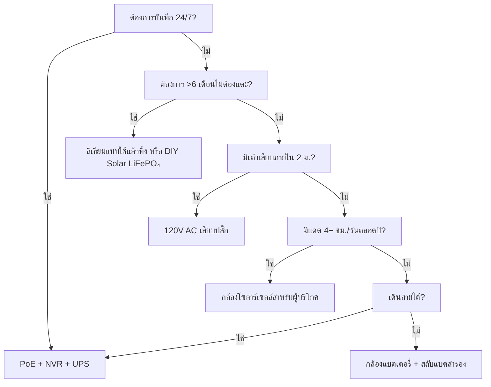

พลังงานคือสาเหตุอันดับ 1 ที่ทำให้กล้องวงจรปิดล้มเหลว แบตเตอรี่หมดตอนตี 3 แบต Li-ion แข็งตัวในเดือนมกราคม แผงโซลาร์เซลล์ถูกหิมะทับ สวิตช์ PoE ถูกถอด "แค่แป๊บเดียว" คู่มือนี้จะอธิบายสถาปัตยกรรมพลังงานทุกรูปแบบด้วยฟิสิกส์จริง ข้อมูลจริง และกรอบการตัดสินใจ เพื่อให้คุณเลือกครั้งเดียวแล้วใช้งานได้เลย

<Badge variant="outline">ฟิสิกส์ต้องมาก่อน</Badge> **พลังงานเข้า = พลังงานออก +
การสูญเสีย** ไม่มีการตลาดใดเปลี่ยนสิ่งนี้ได้ ออกแบบขนาดแหล่งจ่ายสำหรับ
*กรณีแย่ที่สุด* (วันที่สั้นที่สุด อุณหภูมิต่ำสุด กิจกรรมสูงสุด)
ไม่ใช่กรณีดีที่สุด

## เปรียบเทียบสถาปัตยกรรมพลังงาน

| สถาปัตยกรรม                      | แหล่งจ่ายแรงดัน       | ระยะทางสูงสุด       | ความน่าเชื่อถือ   | ความซับซ้อนในการติดตั้ง | เหมาะที่สุด                             |
| -------------------------------- | --------------------- | ------------------- | ----------------- | ----------------------- | --------------------------------------- |
| **120V AC + อะแดปเตอร์**         | เต้าเสียบผนัง         | 1.8 ม. (สาย)        | ★★★★★ (กริด)      | ง่ายมาก                 | ในร่ม, ระเบียง, เต้าเสียบที่มีอยู่      |
| **PoE (802.3af/at/bt)**          | สวิตช์ PoE/หัวฉีด     | 100 ม.              | ★★★★★ (UPS สำรอง) | ปานกลาง (สายสัญญาณ)     | **มาตรฐานทองคำ** — 24/7, NVR, ระยะไกล   |
| **12V/24V DC โดยตรง**            | ชุดแบตเตอรี่ / PSU    | 15–30 ม. (แรงดันตก) | ★★★★☆             | ปานกลาง                 | Off-grid, RV, บัส 12V ที่มีอยู่         |
| **Li-ion แบบชาร์จได้**           | แบตเตอรี่ภายใน        | N/A (ไร้สาย)        | ★★☆☆☆ (ตามฤดูกาล) | ง่ายมาก                 | ผู้เช่า, ชั่วคราว, พื้นที่ไม่มีสาย      |
| **ลิเธียมแบบใช้แล้วทิ้ง**        | แบตเตอรี่ภายใน        | N/A                 | ★★★☆☆ (1–2 ปี)    | ง่ายมาก                 | กล้องดักสัตว์, พื้นที่ห่างไกล, ไม่มีแดด |
| **โซลาร์เซลล์ + แบบชาร์จได้**    | แดด → แผง → แบตเตอรี่ | N/A                 | ★★★☆☆ (สภาพอากาศ) | ง่าย–ปานกลาง            | รั้ว, ประตู, โรงเก็บของ, off-grid       |
| **ไฮบริด: PoE + แบตเตอรี่สำรอง** | PoE + UPS/ภายใน       | 100 ม.              | ★★★★★             | สูงกว่า                 | ทางเข้าสำคัญ, ป้ายทะเบียน               |

<Callout type="warning">

**การตลาด vs ความจริง:** "อายุแบตเตอรี่ 6 เดือน" = 10
เหตุการณ์การเคลื่อนไหว/วัน คลิป 10 วินาที 21°C ไม่ดูสด **โลกจริง:** 20–40
เหตุการณ์/วัน + ดูสด 5 ครั้ง = **2–6 สัปดาห์** ควรลดเหลือ 3–5× เสมอ

</Callout>

## เจาะลึก: แต่ละสถาปัตยกรรม

### 1. PoE (Power over Ethernet) — ตัวเลือกมืออาชีพ

<Accordion type="single" collapsible>
  <AccordionItem value="poe-basics">
    <AccordionTrigger>วิธีการทำงานของ PoE และมาตรฐาน</AccordionTrigger>
    <AccordionContent>

<strong>IEEE 802.3af (PoE):</strong> 15.4W ที่ PSE → 12.95W ที่ PD (กล้อง)
จ่ายไฟให้กล้องแบบตายตัว/โดมส่วนใหญ่
<strong>IEEE 802.3at (PoE+):</strong> 30W ที่ PSE → 25.5W ที่ PD จ่ายไฟให้ PTZ,
เครื่องทำความร้อน, IR illuminator
<strong>IEEE 802.3bt (PoE++):</strong> 60W (Type 3) / 90W (Type 4) ที่ PSE → 51W
/ 71W ที่ PD จ่ายไฟให้ speed dome, หลายเซนเซอร์, ที่ปัดน้ำฝน/เครื่องทำความร้อน

<strong>สายสัญญาณ:</strong> Cat5e ขั้นต่ำ (Cat6/6a สำหรับ PoE++) สูงสุด 100 ม.
ต่อเซกเมนต์
<strong>โทโพโลยี:</strong> กล้อง → Cat5e/6 → สวิตช์ PoE (หรือ NVR ที่มีพอร์ต
PoE) → UPS → กริด
<strong>แรงดัน:</strong> 44–57V DC บนคู่สาย (โหมด A: คู่ข้อมูล / โหมด B:
คู่สำรอง) กล้องแปลง DC-DC เป็น 12V/5V/3.3V ภายใน

</AccordionContent>

  </AccordionItem>
  <AccordionItem value="poe-ups">
    <AccordionTrigger>การเลือกขนาด UPS สำหรับ PoE (สำคัญสำหรับ 24/7)</AccordionTrigger>
    <AccordionContent>

<strong>กฎ:</strong> UPS ต้องครอบคลุม
<strong>พอร์ตสวิตช์ PoE ทั้งหมด + NVR + เราเตอร์</strong> ตามระยะเวลาที่ต้องการ

| โหลด                                 | วัตต์ทั่วไป            | 4 ชม. (Wh)              | 12 ชม. (Wh)               | 24 ชม. (Wh)               |
| ------------------------------------ | ---------------------- | ----------------------- | ------------------------- | ------------------------- |
| สวิตช์ PoE+ 8 พอร์ต (4 กล้อง)        | 45W                    | 180 Wh                  | 540 Wh                    | 1,080 Wh                  |
| สวิตช์ PoE+ 16 พอร์ต (12 กล้อง)      | 120W                   | 480 Wh                  | 1,440 Wh                  | 2,880 Wh                  |
| NVR (8 ช่อง, 2 HDD)                  | 35W                    | 140 Wh                  | 420 Wh                    | 840 Wh                    |
| เราเตอร์/โมเด็ม                      | 15W                    | 60 Wh                   | 180 Wh                    | 360 Wh                    |
| <strong>รวม (ระบบ 12 กล้อง)</strong> | <strong>~170W</strong> | <strong>680 Wh</strong> | <strong>2,040 Wh</strong> | <strong>4,080 Wh</strong> |

<strong>คำแนะนำ UPS:</strong>

<ul>
  <li>
    <strong>&lt;4 ชม.:</strong> CyberPower CP1500PFCLCD (1,500 VA / 1,050 Wh) —
    ~$200
  </li>
  <li>
    <strong>8–12 ชม.:</strong> APC SMT1500RM2UC + ชุดแบตเตอรี่ภายนอก — ~$600+
  </li>
  <li>
    <strong>24+ ชม.:</strong> แบตเตอรี่แบบแร็ค 48V LiFePO₄ (5–10 kWh) +
    อินเวอร์เตอร์/ชาร์จเจอร์ Victron — ~$2,000+
  </li>
</ul>

<strong>เคล็ดลับมือโปร:</strong> วางสวิตช์ PoE + NVR + เราเตอร์บน
<strong>UPS เดียวกัน</strong> UPS ต่อกล้องมีแต่แพงกว่า 5× สำหรับระยะเวลาเท่ากัน

</AccordionContent>

  </AccordionItem>
</Accordion>

### 2. กล้องแบตเตอรี่แบบชาร์จได้ — กับดักความสะดวก

<Callout type="note">

**เคมี:** กล้องแบตเตอรี่สำหรับผู้บริโภคเกือบทั้งหมดใช้ **Li-ion (NMC/LCO)
3.6–3.7V ปกติ 4.2V สูงสุด** ไม่ใช่ LiFePO₄ เรื่องนี้สำคัญสำหรับอากาศหนาว

</Callout>

**อายุแบตเตอรี่จริง (รุ่น 2025–2026, 1080p/2K/4K)**

| กล้อง                 | แบตเตอรี่            | ที่เคลม | **จริง (กิจกรรมสูง)** | **จริง (กิจกรรมต่ำ)** | วิธีชาร์จ                        |
| --------------------- | -------------------- | ------- | --------------------- | --------------------- | -------------------------------- |
| EufyCam 3 S330        | 13,000 mAh           | 365 วัน | 14–21 วัน             | 90–120 วัน            | USB-C (5V) / โซลาร์เซลล์         |
| Reolink Argus 4 Pro   | 9,600 mAh            | 6 เดือน | 10–18 วัน             | 60–90 วัน             | USB-C (5V) / โซลาร์เซลล์         |
| Ring Stick Up Cam Pro | 6,000 mAh            | 6 เดือน | 7–14 วัน              | 45–60 วัน             | USB-C (5V) / โซลาร์เซลล์ / เสียบ |
| Arlo Pro 5S 2K        | 5,200 mAh            | 6 เดือน | 5–10 วัน              | 30–45 วัน             | แม่เหล็ก (ของเฉพาะ) / โซลาร์ฯ    |
| Blink Outdoor 4       | 2× AA Li (3,000 mAh) | 2 ปี    | 60–90 วัน             | 180–365 วัน           | เปลี่ยน AA (ไม่ชาร์จ)            |
| Wyze Cam Outdoor v2   | 5,200 mAh            | 6 เดือน | 10–16 วัน             | 50–75 วัน             | Micro-USB / โซลาร์เซลล์          |
| Reolink Go PT Plus    | 7,800 mAh            | 3 เดือน | 8–14 วัน              | 40–60 วัน             | USB-C / โซลาร์เซลล์ / 12V        |

**กิจกรรมสูง =** เหตุการณ์เคลื่อนไหว 30+/วัน + ดูสด 3 ครั้ง/วัน + IR กลางคืนเปิด
**กิจกรรมต่ำ =** 5 เหตุการณ์/วัน + ดูสด 0 ครั้ง + กลางวันเท่านั้น

<Accordion type="single" collapsible>
  <AccordionItem value="battery-physics">
    <AccordionTrigger>ทำไมอายุแบตเตอรี่ถึงลดลงฮวบ (ฟิสิกส์)</AccordionTrigger>
    <AccordionContent>

<ol>
  <li>
    <strong>กำลังส่ง Tx ครอบงำ:</strong> วิทยุ Wi-Fi ที่ +17 dBm = 300–500 mA @
    3.7V
  </li>
</ol>
<ol>
  <li>
    <strong>LED IR:</strong> IR 850 nm ที่ 30 ม. = 1–2W ต่อ 30 วินาที/คลิป 30
    คลิป = 0.25–0.5 Wh = <strong>70–140 mAh @ 3.7V</strong>
  </li>
  <li>
    <strong>PIR Wake + DSP:</strong> 50–100 mA นาน 2–5 วินาทีต่อเหตุการณ์
    เรื่องเล็กน้อยแต่รวมกันแล้วเยอะ
  </li>
  <li>
    <strong>อุณหภูมิต่ำ:</strong> Li-ion{" "}
    <strong>ความต้านทานภายในเพิ่มขึ้น 2 เท่าที่ 0°C</strong>{" "}
    แรงดันตกเมื่อส่งโหลด → BMS ตัดที่ 3.0V → แบตเตอรี่ "หมด" ที่ 40% SoC{" "}
    <strong>ความจุที่ -10°C ≈ 50% ของ 21°C</strong>
  </li>
  <li>
    <strong>การคายประจุเอง:</strong> 2–5%/เดือน เทียบกับการใช้งานแล้วเล็กน้อย
  </li>
  <li>
    <strong>ดูสด:</strong> ดูสด 5 นาที = พลังงานเท่ากับ 30+ คลิป{" "}
    <strong>หลีกเลี่ยงการตรวจสอบสดทุกวัน</strong>
  </li>
</ol>

    </AccordionContent>

  </AccordionItem>
  <AccordionItem value="charging">
    <AccordionTrigger>กลยุทธ์การชาร์จที่ได้ผล</AccordionTrigger>
    <AccordionContent>

      <strong>อย่ารอจน 0%</strong> Li-ion ไม่ชอบการคายประจุลึก ชาร์จที่ 20–30%
      <strong>การเลือกขนาดแผงโซลาร์เซลล์:</strong> แผง (W) ≥ การดึงกระแสเฉลี่ยของกล้อง (W) ×
        3 (หน้าหนาว/มีเมฆ) ÷ ชั่วโมงแสงแดดสูงสุด (เดือนแย่ที่สุด) - ตัวอย่าง:
      Argus 4 Pro เฉลี่ย 1.5W → ต้องใช้ 4.5W เดือนแย่ที่สุด (ธ.ค., Zone 5) = 1.5
      ชม. สูงสุด → <strong>แผงขั้นต่ำ 3W, แนะนำ 6W</strong> <strong>สาย USB-C PD Trigger:</strong>
      Reolink/Argus/Eufy รองรับ 5V/9V/12V/15V/20V ผ่านการเจรจา PD ใช้สาย
        12V→USB-C PD trigger เพื่อชาร์จ จากแบงก์ 12V RV/บ้านโดยตรง (มีประสิทธิภาพ
        90% vs อินเวอร์เตอร์ 12V→120V→อะแดปเตอร์ 5V ที่ 60%)
      <strong>สลับแบตเตอรี่สองก้อน:</strong> ซื้อแบตเตอรี่สำรอง สลับก้อนที่ชาร์จแล้วแทน
      ก้อนที่หมด ไม่มีเวลาหยุดทำงาน ใช้ได้เฉพาะแบตเตอรี่ที่ถอดออกได้ (Reolink,
      Blink, บางรุ่น Ring)

    </AccordionContent>

  </AccordionItem>
</Accordion>

### 3. ลิเธียมแบบใช้แล้วทิ้ง — ผู้เชี่ยวชาญระยะยาว

| ประเภทแบตเตอรี่                   | เคมี     | แรงดัน | ความจุ     | ช่วงอุณหภูมิ   | เหมาะที่สุด                  |
| --------------------------------- | -------- | ------ | ---------- | -------------- | ---------------------------- |
| **Energizer Ultimate Lithium AA** | Li/FeS₂  | 1.5V   | 3,000 mAh  | -40°C ถึง 60°C | Blink, กล้องดักสัตว์, -40°C  |
| **Tadiran TL-5930 (D-cell)**      | Li/SOCl₂ | 3.6V   | 19,000 mAh | -55°C ถึง 85°C | ท่อส่ง, มาตรระยะไกล, 5–10 ปี |
| **Saft LS 14500 (AA)**            | Li/SOCl₂ | 3.6V   | 2,600 mAh  | -51°C ถึง 85°C | อุตสาหกรรม, พื้นที่ ATEX     |

**ข้อดี:** ความหนาแน่นพลังงาน 10–20× เทียบกับอัลคาไลน์ ทำงานได้ที่ -40°C อายุการเก็บ 10–20 ปี ไม่ต้องใช้วงจรชาร์จ
**ข้อเสีย:** **ชาร์จใหม่ไม่ได้**; $2–10/ก้อน; แรงดัน plateau ทำให้วัดระดับได้ยาก; passivation (แรงดันล่าช้าหลังพักนาน)
**การใช้งาน:** กล้องดักสัตว์ตรวจสอบรายไตรมาส เซนเซอร์ท่อส่ง กล้องวิจัยแอนตาร์กติก **ไม่เหมาะสำหรับการรักษาความปลอดภัยรายวัน**

### 4. โซลาร์เซลล์ + แบตเตอรี่ — วิศวกรรม Off-Grid

<Callout type="info">

**โซลาร์เซลล์คือเครื่องชาร์จแบตเตอรี่ ไม่ใช่แหล่งจ่ายไฟ** ออกแบบขนาด
**แบตเตอรี่** สำหรับการทำงานอัตโนมัติ (วันที่ไม่มีแดด) ออกแบบขนาด **แผง**
เพื่อชาร์จแบตเตอรี่นั้นใน 1 วันที่แดดดี

</Callout>

**แผ่นงานการเลือกขนาด**

```
  1. กำลังไฟเฉลี่ยของกล้อง (W) × 24h = Wh/วันที่ต้องการ
   ตัวอย่าง: Reolink Go PT Plus = 2.5W เฉลี่ย → 60 Wh/วัน

  2. การทำงานอัตโนมัติของแบตเตอรี่ (วันที่ไม่มีแดด) × Wh/วัน = Wh ของแบตเตอรี่
   อัตโนมัติ 3 วัน → 180 Wh
   LiFePO₄ 12.8V → 180 Wh ÷ 12.8V = 14 Ah → **ชุดแบตเตอรี่ 20 Ah (เผื่อ 20%)**

  3. ชั่วโมงแสงแดดสูงสุดเดือนแย่ที่สุด (PSH) × วัตต์แผง × 0.75 (สูญเสีย) = Wh/วันที่เก็บได้
   ธ.ค., Zone 5: 1.5 PSH × แผง W × 0.75 = 60 Wh → แผง = 53W → **แผง 60W**

  4. ตัวควบคุมการชาร์จ: MPPT (ประสิทธิภาพ 95%) vs PWM (ประสิทธิภาพ 75%) **ใช้ MPPT เสมอสำหรับ >20W**
   Victron SmartSolar 75/10, 75/15, 100/20 — Bluetooth, ตั้งโปรแกรมได้, เชื่อถือได้

  5. การติดตั้ง: หันไปทางทิศใต้ (ซีกโลกเหนือ) เอียงตามละติจูด (30–45°) **ไม่มีร่มเงา 9:00–15:00 น. 21 ธ.ค.**
   ขาตั้งพื้นปรับได้ > หลังคา > เสารั้ว
```

**ชุดกล้องโซลาร์เซลล์จริง (2026)**

| ชุด                                                             | แผง             | แบตเตอรี่      | ตัวควบคุม   | กล้อง                       | การทำงานหน้าหนาว Zone 5                |
| --------------------------------------------------------------- | --------------- | -------------- | ----------- | --------------------------- | -------------------------------------- |
| Reolink 6W + Argus 4 Pro                                        | 6W (ติดตั้งที่) | 9.6 Ah (ภายใน) | ภายใน (PWM) | Argus 4 Pro                 | **ล้มเหลว ธ.ค.–ก.พ.** (แผงเล็กเกินไป)  |
| Reolink 20W + Go PT Plus                                        | 20W (ปรับได้)   | 7.8 Ah (ภายใน) | ภายใน       | Go PT Plus                  | **เสี่ยง** (เพิ่ม LiFePO₄ ภายนอก 20Ah) |
| EufyCam 3 + Solar                                               | 2.4W (ในตัว)    | 13 Ah (ภายใน)  | ภายใน       | EufyCam 3                   | **ล้มเหลว พ.ย.–มี.ค.** (แผงเล็กมาก)    |
| **DIY: 60W + 20Ah LiFePO₄ + Victron + Go PT Plus**              | 60W             | 256 Wh         | MPPT        | Go PT Plus                  | **ทำงาน 95%** (ออกแบบ)                 |
| **DIY: 100W + 40Ah LiFePO₄ + Victron + หัวฉีด PoE + 4K Bullet** | 100W            | 512 Wh         | MPPT        | Reolink RLC-1212A + 12V→PoE | **ทำงาน 99%** (PoE off-grid จริง)      |

<Accordion type="single" collapsible>
  <AccordionItem value="winter">
    <AccordionTrigger>ความจริงของโซลาร์เซลล์ในหน้าหนาว (Zone 4–6)</AccordionTrigger>
    <AccordionContent>

<strong>ครีษมายันธันวาคม (Zone 5, 42°N):</strong>

<ul>
  <li>
    ชั่วโมงแสงแดดสูงสุด: <strong>1.0–1.5</strong> (เทียบกับ 5.5 ในมิถุนายน)
  </li>
  <li>
    กำลังไฟฟ้าแผงที่เอียง 30°: <strong>15–20% ของพิกัด STC</strong>
  </li>
  <li>
    หิมะปกคลุม: <strong>กำลังไฟฟ้า 0%</strong> จนกว่าจะปัดออก
    (มีแผงระบบทำความร้อนอัตโนมัติ: 5–10W สูญเสีย)
  </li>
  <li>
    แบตเตอรี่ที่ -10°C:{" "}
    <strong>Li-ion = 50% ความจุ; LiFePO₄ = 80% ความจุ</strong>
  </li>
</ul>

<strong>กลยุทธ์การอยู่รอด:</strong>

<ol>
  <li>
    <strong>ขยายขนาดแผง 3–4×</strong> เทียบกับที่คำนวณในฤดูร้อน (60W → 180–240W)
  </li>
  <li>
    <strong>แบตเตอรี่ LiFePO₄</strong> (ไม่ใช่ Li-ion) — ชาร์จได้ที่ -20°C
    พร้อมเครื่องทำความร้อน BMS
  </li>
  <li>
    <strong>ลดรอบการทำงานของกล้อง:</strong> เฉพาะการเคลื่อนไหว,
    ความละเอียดต่ำลง, คลิปสั้นลง, ปิด IR (ใช้แสงแวดล้อม)
  </li>
  <li>
    <strong>การชาร์จสำรอง:</strong> สาย 12V→USB-C PD trigger
    จากรถ/เครื่องปั่นไฟทุกเดือน
  </li>
  <li>
    <strong>ยอมรับการหยุดทำงาน:</strong> ออกแบบสำหรับการทำงาน 90% ไม่ใช่ 100%
    การไม่มีแดด 3–5 วัน/ปีเป็นเรื่องปกติ
  </li>
</ol>

              </AccordionContent>

           </AccordionItem>

    </Accordion>

### 5. 12V/24V DC โดยตรง — สำหรับ RV/Off-Grid

**ทำไม 12V DC?** ไม่มีการสูญเสียจากอินเวอร์เตอร์ (120V AC → 12V DC = สูญเสีย 15–25%) กล้องใช้ 12V อยู่แล้วภายใน

**การเดินสายกล้อง 12V โดยตรง:**

```
แบตเตอรี่บ้าน (12V LiFePO₄)
  → ฟิวส์ใบมีด 10A
  → สายเดินเรือชุบดีบุก 18 AWG (แดง/ดำ)
  → ขั้วต่อกันน้ำ Deutsch / SAE / Anderson
  → อินพุต 12V ของกล้อง (ตรวจสอบขั้ว!)
  → **Buck Converter** ถ้ากล้องต้องการ 5V/9V (กล้อง PoE ส่วนใหญ่ต้องการ 48V → ใช้หัวฉีด PoE 12V→48V)
```

**เครื่องคำนวณแรงดันตก:**

```
Vdrop = (2 × ความยาว_ฟุต × กระแส_A × 0.000016) / พื้นที่หน้าตัดสาย_CM
  18 AWG (1,624 CM), 15 ม., 1A → 0.98V ตก (8% ที่ 12V) — ยอมรับได้
  18 AWG, 30 ม., 1A → 1.96V ตก (16%) — ใช้ 16 AWG (2,583 CM) → 1.2V (10%)
```

**กฎ:** เก็บระยะ 12V &lt;15 ม. ที่ 18 AWG; &lt;30 ม. ที่ 14 AWG หรือใช้ระบบกระจาย 24V/48V + buck ที่กล้อง

**หัวฉีด 12V→PoE (ใช้กล้อง PoE กับแบงก์ 12V):**

- Tycon POE-12-48V (12V เข้า → 48V PoE ออก, 15W) — $25
- Ubiquiti INJ-12V-48V (12V → 48V PoE+, 30W) — $35
- อุตสาหกรรม: Mean Well NDR-120-48 (120W ราง DIN) + ตัวแยก PoE — $60
- **ประสิทธิภาพ:** 85–92% กล้องเห็น PoE มาตรฐาน — ไม่ต้องแก้เฟิร์มแวร์

### 6. ไฮบริด: PoE + แบตเตอรี่สำรอง (ไม่มีการหยุดทำงาน)

**สถาปัตยกรรม:** กล้อง → สวิตช์ PoE → UPS (LiFePO₄) → กริด
**เพิ่มเติม:** กล้องมีแบตเตอรี่ภายใน (Reolink Go PT Plus, Arlo Go 2) หรือ UPS ภายนอกต่อกล้อง

| วิธีการ                                 | ต้นทุน     | การทำงานอัตโนมัติ (ต่อกล้อง) | ความซับซ้อน |
| --------------------------------------- | ---------- | ---------------------------- | ----------- |
| UPS กลาง (สวิตช์+NVR)                   | $200–2,000 | ชั่วโมง–วัน                  | ต่ำ         |
| UPS ต่อกล้อง (APC BE600M1)              | $60×N      | 30–60 นาที                   | ปานกลาง     |
| กล้องที่มีแบตเตอรี่ภายใน (Go PT Plus)   | $230       | 2–4 สัปดาห์ (โซลาร์)         | ต่ำ         |
| **PoE + 12V LiFePO₄ + สวิตช์อัตโนมัติ** | $150/กล้อง | วัน–สัปดาห์                  | สูง         |

**สิ่งที่ดีที่สุดของทั้งสองโลก:** PoE สำหรับบันทึก 24/7 + NVR แบตเตอรี่ภายในสำหรับบันทึก **ตอนไฟดับ** (30 นาทีสุดท้ายก่อน UPS ดับ) Reolink Go PT Plus ทำสิ่งนี้ได้โดยธรรมชาติ — บันทึกไปยัง microSD เมื่อ PoE หายไป

## ต้นทุนรวมในการเป็นเจ้าของ (5 ปี)

| สถาปัตยกรรม                                | ปีที่ 1 | ปีที่ 2–5 (รายปี)       | รวม 5 ปี   | เหมาะที่สุด                  |
| ------------------------------------------ | ------- | ----------------------- | ---------- | ---------------------------- |
| **PoE + NVR + UPS**                        | $1,500  | $50 (เปลี่ยน HDD)       | **$1,700** | ถาวร, 24/7, 8+ กล้อง         |
| **แบตเตอรี่ + โซลาร์ (DIY LiFePO₄)**       | $800    | $0                      | **$800**   | Off-grid, 1–4 กล้อง, DIY     |
| **กล้องแบตเตอรี่ + แผงโซลาร์ (ผู้บริโภค)** | $500    | $50 (เปลี่ยนแบตปีที่ 3) | **$700**   | เช่า, ไม่มีสาย, 1–2 กล้อง    |
| **ลิเธียมแบบใช้แล้วทิ้ง (กล้องดักสัตว์)**  | $300    | $100 (เซลล์/ปี)         | **$700**   | ห่างไกลมาก, ตรวจสอบรายไตรมาส |
| **120V AC เสียบปลั๊ก**                     | $200    | $10                     | **$240**   | ในร่ม, ระเบียง, มีเต้าเสียบ  |

<Callout type="tip">

**ต้นทุนแฝง:** การเดินทางไปเปลี่ยนแบตเตอรี่ แบตเตอรี่กล้องหมดตอนตี 3 →
คุณขับรถ 30 นาทีไปเปลี่ยน = $50/ครั้ง PoE + UPS =
ไม่ต้องเดินทางเนื่องจากพลังงาน คิด $50 × จำนวนครั้งที่คาดว่าจะล้มเหลว/ปี

</Callout>

## เมทริกซ์การตัดสินใจ: เลือกสถาปัตยกรรมของคุณ



## รายการตรวจสอบด่วนสำหรับกล้องของคุณ

- [ ] **PoE:** 802.3af (15W) / at (30W) / bt (60/90W) — ตรงกับสวิตช์
- [ ] **12V DC:** รองรับ 10–14V? ป้องกันการกลับขั้ว? ชนิดขั้วต่อ?
- [ ] **แบตเตอรี่:** ถอดได้? เคมี (Li-ion vs LiFePO₄)? mAh @ 3.7V? ชาร์จผ่าน USB-C PD?
- [ ] **โซลาร์เซลล์:** วัตต์แผง? MPPT หรือ PWM? ความยาวสาย? การปรับตั้งขาตั้ง?
- [ ] **อุณหภูมิการทำงาน:** -20°C ขั้นต่ำสำหรับ Li-ion; -40°C สำหรับ LiFePO₄/แบตเตอรี่หลัก
- [ ] **การใช้พลังงาน:** "สูงสุด" vs "ทั่วไป" ในสเปก — ออกแบบสำหรับทั่วไป × 1.5
- [ ] **การแจ้งเตือนแบตเตอรี่ต่ำ:** Push แจ้งที่ 20%? เกณฑ์การปิดอัตโนมัติ?
- [ ] **ความเข้ากันได้กับ UPS:** NVR + สวิตช์บน UPS เดียวกัน? คำนวณเวลาแล้ว?

---

## คู่มือที่เกี่ยวข้อง

- [กล้องรักษาความปลอดภัยพลังงานแสงอาทิตย์ที่ดีที่สุด (Off-Grid)](/blog/best-solar-powered-security-cameras-offgrid) — การเลือกขนาดแผง/แบตเตอรี่
- [กล้องรักษาความปลอดภัยที่ดีที่สุดสำหรับ RV และบ้านเคลื่อนที่](/blog/best-security-cameras-for-rvs-mobile-homes) — 12V DC, การสั่นสะเทือน, cellular
- [เปรียบเทียบ PoE vs ไร้สาย vs โซลาร์เซลล์](/blog/poe-vs-wireless-vs-solar-comparison) — กรอบการตัดสินใจ
- [การติดตั้งกล้องไร้สาย: เคล็ดลับ DIY](/blog/wireless-camera-setup-diy-installation-tips) — Wi-Fi, แบตเตอรี่, การติดตั้ง
