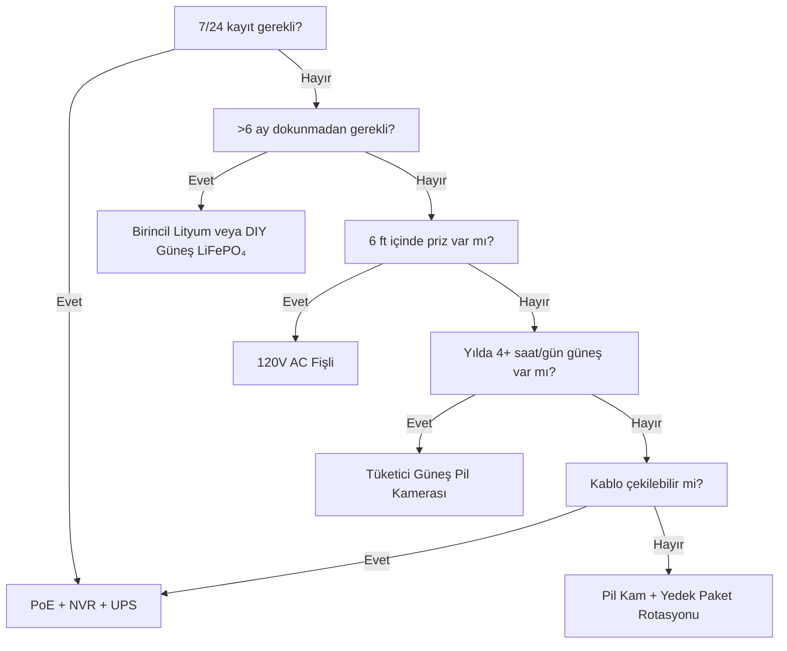

Güç, güvenlik kameralarının arızalanmasının 1 numaralı nedenidir. Sabah 3'te biten pil. Ocak ayında donmuş Li-ion. Kar altında kalmış güneş paneli. "Bir dakikalığına" fişten çekilmiş PoE anahtarı. Bu kılavuz, her güç mimarisini gerçek fizik, gerçek veri ve karar çerçeveleriyle ele alıyor, böylece bir kez seçip sorunsuz kullanırsınız.

<Badge variant="outline">Önce Fizik</Badge> **Giren Enerji = Çıkan Enerji +
Kayıplar.** Hiçbir pazarlama bunu değiştirmez. Kaynağınızı en kötü duruma (en
kısa gün, en soğuk sıcaklık, en yüksek aktivite) göre boyutlandırın, en iyi
duruma göre değil.

## Güç Mimarisi Karşılaştırması

| Mimari                              | Voltaj Kaynağı        | Maks. Mesafe               | Güvenilirlik      | Kurulum Karmaşıklığı | En İyi                                |
| ----------------------------------- | --------------------- | -------------------------- | ----------------- | -------------------- | ------------------------------------- |
| **120V AC + Adaptör**               | Duvar prizi           | 6 ft (kablo)               | ★★★★★ (şebeke)    | Basit                | İç mekan, sundurma, mevcut priz       |
| **PoE (802.3af/at/bt)**             | PoE Anahtarı/Enjektör | 328 ft (100 m)             | ★★★★★ (UPS'li)    | Orta (kablo)         | **Altın standart** — 7/24, NVR, uzak  |
| **12V/24V DC Doğrudan**             | Pil bankası / PSÜ     | 50–100 ft (gerilim düşüşü) | ★★★★☆             | Orta                 | Şebekeden bağımsız, RV, mevcut 12V    |
| **Şarj Edilebilir Li-ion**          | Dahili pil            | Yok (kablosuz)             | ★★☆☆☆ (mevsimsel) | Basit                | Kiracılar, geçici, kablo olmayan yer  |
| **Birincil Lityum (Şarj Edilemez)** | Dahili pil            | Yok                        | ★★★☆☆ (1–2 yıl)   | Basit                | Av kameraları, çok uzak, güneş yok    |
| **Güneş + Şarj Edilebilir**         | Güneş → Panel → Pil   | Yok                        | ★★★☆☆ (hava)      | Kolay–Orta           | Çit, kapı, kulübe, şebekeden bağımsız |
| **Hibrit: PoE + Pil Yedek**         | PoE + UPS/Dahili      | 328 ft                     | ★★★★★             | Daha yüksek          | Kritik giriş, plaka                   |

<Callout type="warning">

**Pazarlama vs Gerçeklik:** "6 ay pil ömrü" = 10 hareket olayı/gün, 10s
klipler, 70°F, canlı izleme yok. **Gerçek dünya:** 20–40 olay/gün + 5 canlı
izleme = **2–6 hafta**. Her zaman 3–5 kat düşük hesaplayın.

</Callout>

## Derinlemesine İnceleme: Her Mimari

### 1. PoE (Power over Ethernet) — Profesyonel Seçim

<Accordion type="single" collapsible>
  <AccordionItem value="poe-basics">
    <AccordionTrigger>PoE Nasıl Çalışır ve Standartlar</AccordionTrigger>
    <AccordionContent>

<strong>IEEE 802.3af (PoE):</strong> PSE'de 15.4W → PD'de (kamera) 12.95W. Çoğu
sabit bullet/domes'u çalıştırır.
<strong>IEEE 802.3at (PoE+):</strong> PSE'de 30W → PD'de 25.5W. PTZ, ısıtıcılar,
IR aydınlatıcıları çalıştırır.
<strong>IEEE 802.3bt (PoE++):</strong> PSE'de 60W (Tip 3) / 90W (Tip 4) → PD'de
51W / 71W. Hızlı domes, çoklu sensör, silecek/ısıtıcı çalıştırır.

<strong>Kablo:</strong> Minimum Cat5e (PoE++ için Cat6/6a). Segment başına maks.
100 m (328 ft).
<strong>Topoloji:</strong> Kamera → Cat5e/6 → PoE Anahtarı (veya PoE bağlantı
noktalı NVR) → UPS → Şebeke.
<strong>Gerilim:</strong> Kablo çiftlerinde 44–57V DC (Mod A: veri çiftleri /
Mod B: yedek çiftler). Kamera DC-DC dahili olarak 12V/5V/3.3V'ye dönüştürür.

</AccordionContent>

  </AccordionItem>
  <AccordionItem value="poe-ups">
    <AccordionTrigger>PoE için UPS Boyutlandırma (7/24 Kritik)</AccordionTrigger>
    <AccordionContent>

<strong>Kural:</strong> UPS, hedef çalışma süresi için
<strong>tüm PoE anahtar bağlantı noktalarını + NVR + yönlendiriciyi</strong>
kapsamalıdır.

| Yük                                       | Tipik Watt             | 4-saat Çalışma (Wh)     | 12-saat Çalışma (Wh)      | 24-saat Çalışma (Wh)      |
| ----------------------------------------- | ---------------------- | ----------------------- | ------------------------- | ------------------------- |
| 8 bağlantı noktalı PoE+ Anahtar (4 kam)   | 45W                    | 180 Wh                  | 540 Wh                    | 1,080 Wh                  |
| 16 bağlantı noktalı PoE+ Anahtar (12 kam) | 120W                   | 480 Wh                  | 1,440 Wh                  | 2,880 Wh                  |
| NVR (8 yuva, 2 HDD)                       | 35W                    | 140 Wh                  | 420 Wh                    | 840 Wh                    |
| Yönlendirici/Modem                        | 15W                    | 60 Wh                   | 180 Wh                    | 360 Wh                    |
| <strong>Toplam (12 kam sistemi)</strong>  | <strong>~170W</strong> | <strong>680 Wh</strong> | <strong>2,040 Wh</strong> | <strong>4,080 Wh</strong> |

<strong>UPS Önerisi:</strong>

<ul>
  <li>
    <strong>&lt;4 saat:</strong> CyberPower CP1500PFCLCD (1,500 VA / 1,050 Wh) —
    $200
  </li>
  <li>
    <strong>8–12 saat:</strong> APC SMT1500RM2UC + harici batarya paketi — $600+
  </li>
  <li>
    <strong>24+ saat:</strong> 48V LiFePO₄ sunucu raf bataryası (5–10 kWh) +
    Victron invertör/şarj cihazı — $2,000+
  </li>
</ul>

<strong>Profesyonel İpucu:</strong> PoE anahtarı + NVR + yönlendiriciyi
<strong>aynı UPS'e</strong> bağlayın. Kamera tarafı UPS (kamara başına)
mevcuttur ancak aynı çalışma süresi için 5 kat daha pahalıdır.

</AccordionContent>

  </AccordionItem>
</Accordion>

### 2. Şarj Edilebilir Pil Kameraları — Kolaylık Tuzağı

<Callout type="note">

**Kimya:** Neredeyse tüm tüketici pil kameraları **Li-ion (NMC/LCO), 3.6–3.7V
nominal, 4.2V maks** kullanır. LiFePO₄ değil. Bu soğuk için önemlidir.

</Callout>

**Gerçek Dünya Pil Ömrü (2025–2026 Modelleri, 1080p/2K/4K)**

| Kamera                | Pil                  | Beyan Edilen | **Gerçek (Yüksek Aktivite)** | **Gerçek (Düşük Aktivite)** | Şarj Yöntemi               |
| --------------------- | -------------------- | ------------ | ---------------------------- | --------------------------- | -------------------------- |
| EufyCam 3 S330        | 13,000 mAh           | 365 gün      | 14–21 gün                    | 90–120 gün                  | USB-C (5V) / Güneş         |
| Reolink Argus 4 Pro   | 9,600 mAh            | 6 ay         | 10–18 gün                    | 60–90 gün                   | USB-C (5V) / Güneş         |
| Ring Stick Up Cam Pro | 6,000 mAh            | 6 ay         | 7–14 gün                     | 45–60 gün                   | USB-C (5V) / Güneş / Fişli |
| Arlo Pro 5S 2K        | 5,200 mAh            | 6 ay         | 5–10 gün                     | 30–45 gün                   | Manyetik (özel) / Güneş    |
| Blink Outdoor 4       | 2× AA Li (3,000 mAh) | 2 yıl        | 60–90 gün                    | 180–365 gün                 | AA Değiştir (şarjsız)      |
| Wyze Cam Outdoor v2   | 5,200 mAh            | 6 ay         | 10–16 gün                    | 50–75 gün                   | Micro-USB / Güneş          |
| Reolink Go PT Plus    | 7,800 mAh            | 3 ay         | 8–14 gün                     | 40–60 gün                   | USB-C / Güneş / 12V        |

**Yüksek Aktivite =** 30+ hareket olayı/gün + 3 canlı izleme/gün + gece IR açık
**Düşük Aktivite =** 5 olay/gün + 0 canlı izleme + sadece gündüz

<Accordion type="single" collapsible>
  <AccordionItem value="battery-physics">
    <AccordionTrigger>Pil Ömrü Neden Çöker (Fizik)</AccordionTrigger>
    <AccordionContent>

<ol>
  <li>
    <strong>Tx Gücü Baskındır:</strong> Wi-Fi radyosu +17 dBm'de = 3.7V'de
    300–500 mA.
  </li>
  <li>
    <strong>IR LED'ler:</strong> 100 ft'de 850 nm IR = 30s/klip için 1–2W. 30
    klip = 0.25–0.5 Wh = <strong>3.7V'de 70–140 mAh</strong>.
  </li>
  <li>
    <strong>PIR Uyandırma + DSP:</strong> Olay başına 50–100 mA, 2–5s. Tek
    başına ihmal edilebilir, birikir.
  </li>
  <li>
    <strong>Soğuk Sıcaklık:</strong> Li-ion{" "}
    <strong>32°F'de (0°C) iç direnç iki katına</strong> çıkar. Tx yükü altında
    gerilim düşer → BMS 3.0V'de keser → %40 SoC'de "ölü" pil.{" "}
    <strong>14°F'de (-10°C) kapasite ≈ 70°F'dekinin %50'si.</strong>
  </li>
</ol>

<p>
  <strong>Kendinden Deşarj:</strong> Ayda %2–5. Aktif tüketime kıyasla ihmal
  edilebilir.
</p>

<ol>
  <li>
    <strong>Canlı İzleme:</strong> 5 dk canlı izleme = 30+ klip enerjisi.{" "}
    <strong>Günlük canlı kontrollerden kaçının.</strong>
  </li>
</ol>

    </AccordionContent>

  </AccordionItem>
  <AccordionItem value="charging">
    <AccordionTrigger>İşe Yarayan Şarj Stratejileri</AccordionTrigger>
    <AccordionContent>

      <strong>%0'ı beklemeyin.</strong> Li-ion derin deşarjı sevmez. %20–30'da şarj edin.
      <strong>Güneş Paneli Boyutlandırma:</strong> Panel (W) ≥ Kamera Ort. Çekiş (W) × 3
      (kış/bulutlu) ÷ Zirve Güneş Saati (en kötü ay). - Örnek: Argus 4 Pro ort.
        1.5W → 4.5W gerekli. En kötü ay (Aralık, Bölge 5) = 1.5 zirve saat → <strong>3W
      panel minimum, 6W önerilen</strong>. <strong>USB-C PD Tetikleme Kabloları:</strong>
      Reolink/Argus/Eufy PD anlaşması yoluyla 5V/9V/12V/15V/20V kabul eder.
        12V'den doğrudan şarj etmek için 12V→USB-C PD tetikleme kablosu kullanın
      (%90 verim, %60'taki 12V→120V invertör→5V adaptöre karşı). <strong>Çift Pil
      Rotasyonu:</strong> Yedek paket satın alın. Bitmişi şarjlıyla değiştirin. Sıfır
      kesinti. Yalnızca kullanıcı tarafından çıkarılabilir paketlerle çalışır
      (Reolink, Blink, bazı Ring).

    </AccordionContent>

  </AccordionItem>
</Accordion>

### 3. Birincil Lityum (Şarj Edilemez) — Uzun Mesafe Uzmanı

| Pil Türü                          | Kimya    | Gerilim | Kapasite   | Sıcaklık Aralığı | En İyi                               |
| --------------------------------- | -------- | ------- | ---------- | ---------------- | ------------------------------------ |
| **Energizer Ultimate Lithium AA** | Li/FeS₂  | 1.5V    | 3,000 mAh  | -40°F ila 140°F  | Blink, av kameraları, -40°F işlem    |
| **Tadiran TL-5930 (D-hücre)**     | Li/SOCl₂ | 3.6V    | 19,000 mAh | -67°F ila 185°F  | Boru hattı, uzak telemetri, 5–10 yıl |
| **Saft LS 14500 (AA)**            | Li/SOCl₂ | 3.6V    | 2,600 mAh  | -60°F ila 185°F  | Endüstriyel, ATEX bölgeleri          |

**Artıları:** Alkaline göre 10–20× enerji yoğunluğu; -40°F'de çalışır; 10–20 yıl raf ömrü; şarj devresi gerekmez
**Eksileri:** **Şarj edilemez**; hücre başına $2–10; gerilim platosu yakıt ölçümünü zorlaştırır; pasivasyon (uzun dinlenme sonrası gerilim gecikmesi)
**Kullanım Alanı:** Üç ayda bir kontrol edilen av kamerası; boru hattı sensörü; Antarktika araştırma kamerası. **Günlük güvenlik kullanımı için değil.**

### 4. Güneş + Pil — Şebekeden Bağımsız Mühendislik

<Callout type="info">

**Güneş bir pil şarj cihazıdır, güç kaynağı değil.** Pili otonomi (güneşsiz
günler) için boyutlandırın. Paneli, pili 1 iyi günde şarj edecek şekilde
boyutlandırın.

</Callout>

**Sistem Boyutlandırma Çalışma Sayfası**

```
  1. Kamera ort. gücü (W) × 24h = Günlük Wh ihtiyacı
   Örnek: Reolink Go PT Plus = 2.5W ort → 60 Wh/gün

  2. Pil otonomisi (güneşsiz gün) × Wh/gün = Pil Wh
     3 gün otonomi → 180 Wh
   LiFePO₄ 12.8V → 180 Wh ÷ 12.8V = 14 Ah → **20 Ah paket (%20 marj)**

  3. En kötü ay zirve güneş saati (PSH) × Panel Watt × 0.75 (kayıplar) = Günlük Wh hasat
   Aralık, Bölge 5: 1.5 PSH × Panel W × 0.75 = 60 Wh → Panel = 53W → **60W panel**

  4. Şarj Kontrolörü: MPPT (%95 verim) vs PWM (%75 verim). **>20W için her zaman MPPT.**
   Victron SmartSolar 75/10, 75/15, 100/20 — Bluetooth, programlanabilir, güvenilir.

  5. Montaj: Güneye bakan (KK), enlem eğimi (30–45°), **21 Aralık 9:00–15:00 arası gölge yok**.
   Ayarlanabilir zemin montajı > çatı > çit direği.
```

**Gerçek Dünya Güneş Kamera Kitleri (2026)**

| Kit                                                               | Panel               | Pil             | Kontrolör    | Kamera                      | Kış Bölge 5 Çalışma Süresi                         |
| ----------------------------------------------------------------- | ------------------- | --------------- | ------------ | --------------------------- | -------------------------------------------------- |
| Reolink 6W + Argus 4 Pro                                          | 6W (sabit)          | 9.6 Ah (dahili) | Dahili (PWM) | Argus 4 Pro                 | **Aralık–Şubat arası başarısız** (panel çok küçük) |
| Reolink 20W + Go PT Plus                                          | 20W (ayarlanabilir) | 7.8 Ah (dahili) | Dahili       | Go PT Plus                  | **Sınırda** (harici 20Ah LiFePO₄ ekleyin)          |
| EufyCam 3 + Güneş                                                 | 2.4W (entegre)      | 13 Ah (dahili)  | Dahili       | EufyCam 3                   | **Kasım–Mart arası başarısız** (panel çok küçük)   |
| **DIY: 60W + 20Ah LiFePO₄ + Victron + Go PT Plus**                | 60W                 | 256 Wh          | MPPT         | Go PT Plus                  | **%95 çalışma** (mühendislik ürünü)                |
| **DIY: 100W + 40Ah LiFePO₄ + Victron + PoE Enjektör + 4K Bullet** | 100W                | 512 Wh          | MPPT         | Reolink RLC-1212A + 12V→PoE | **%99 çalışma** (gerçek şebekeden bağımsız PoE)    |

<Accordion type="single" collapsible>
  <AccordionItem value="winter">
    <AccordionTrigger>Kış Güneş Gerçeklik Kontrolü (Bölge 4–6)</AccordionTrigger>
    <AccordionContent>

<strong>Aralık Gündönümü (Bölge 5, 42°K):</strong>

<ul>
  <li>
    Zirve Güneş Saati: <strong>1.0–1.5</strong> (Haziran'da 5.5'e karşı)
  </li>
  <li>
    30° eğimde panel çıkışı: <strong>STC derecesinin %15–20'si</strong>
  </li>
  <li>
    Kar örtüsü: <strong>temizlenene kadar %0 çıkış</strong> (otomatik ısıtmalı
    paneller mevcut: 5–10W parazit)
  </li>
  <li>
    14°F'de pil: <strong>Li-ion = %50 kapasite; LiFePO₄ = %80 kapasite</strong>
  </li>
</ul>

<strong>Hayatta Kalma Stratejileri:</strong>

<ol>
  <li>
    <strong>Paneli 3–4 kat büyütün</strong> yaz hesabına göre (60W → 180–240W
    dizi)
  </li>
  <li>
    <strong>LiFePO₄ pil</strong> (Li-ion değil) — BMS ısıtıcısı ile -4°F'de şarj
    olur
  </li>
  <li>
    <strong>Kamera görev döngüsünü azaltın:</strong> Sadece hareket, düşük
    çözünürlük, kısa klipler, IR'yi kapatın (ortam ışığı kullanın)
  </li>
  <li>
    <strong>Yedek şarj:</strong> Araçtan/jeneratörden ayda bir 12V→USB-C PD
    tetikleme kablosu
  </li>
  <li>
    <strong>Kesintiyi kabul edin:</strong> %100 değil %90 çalışma için
    tasarlayın. Yılda 3–5 gün karanlık normaldir.
  </li>
</ol>

              </AccordionContent>

        </AccordionItem>

    </Accordion>

### 5. 12V/24V DC Doğrudan — RV/Şebekeden Bağımsız Doğal

**Neden 12V DC?** İnvertör kaybı yok (120V AC → 12V DC = %15–25 kayıp). Kamera zaten dahili olarak 12V ile çalışır.

**12V Kamerayı Doğrudan Bağlama:**

```
Ev Bataryası (12V LiFePO₄)
  → 10A Bıçak Sigorta
  → 18 AWG Kalaylı Deniz Kablosu (kırmızı/siyah)
  → Su Geçirmez Deutsch / SAE / Anderson Konnektör
  → Kamera 12V Girişi (kutup doğrulayın!)
  → Kamera 5V/9V gerektiriyorsa **Buck Dönüştürücü** (çoğu PoE kamera 48V gerektirir → 12V→48V PoE Enjektör kullanın)
```

**Gerilim Düşümü Hesaplayıcı:**

```
Vdüşüm = (2 × Uzunluk_ft × Akım_A × 0.000016) / Kablo_CM
  18 AWG (1,624 CM), 50 ft, 1A → 0.98V düşüş (12V'de %8) — KABUL EDİLEBİLİR
  18 AWG, 100 ft, 1A → 1.96V düşüş (%16) — 16 AWG (2,583 CM) KULLANIN → 1.2V (%10)
```

**Kural:** 12V hatlarını 18 AWG'de &lt;50 ft'te tutun; 14 AWG'de &lt;100 ft. Veya kamerada 24V/48V dağıtım + buck kullanın.

**12V→PoE Enjektörler (PoE Kameraları 12V Bankta Çalıştırma):**

- Tycon POE-12-48V (12V giriş → 48V PoE çıkış, 15W) — $25
- Ubiquiti INJ-12V-48V (12V → 48V PoE+, 30W) — $35
- Endüstriyel: Mean Well NDR-120-48 (120W DIN ray) + PoE ayırıcı — $60
- **Verim:** %85–92. Kamera standart PoE görür — firmware hilesi gerekmez.

### 6. Hibrit: PoE + Pil Yedek (Sıfır Kesinti)

**Mimari:** Kamera → PoE Anahtarı → UPS (LiFePO₄) → Şebeke.
**Artı:** Kameranın dahili pili vardır (Reolink Go PT Plus, Arlo Go 2) VEYA kamera başına harici UPS.

| Yaklaşım                                 | Maliyet    | Çalışma Süresi (kam başına) | Karmaşıklık |
| ---------------------------------------- | ---------- | --------------------------- | ----------- |
| Merkezi UPS (anahtar+NVR)                | $200–2,000 | Saat–Gün                    | Düşük       |
| Kamera başına UPS (APC BE600M1)          | $60×N      | 30–60 dk                    | Orta        |
| Dahili pilli kamera (Go PT Plus)         | $230       | 2–4 hafta (güneş)           | Düşük       |
| **PoE + 12V LiFePO₄ + Otomatik Anahtar** | $150/kam   | Gün–Hafta                   | Yüksek      |

**En İyisi:** 7/24 kayıt + NVR için PoE. **Şebeke kesintisi kaydı** için dahili pil (UPS ölmeden önce son 30 dk). Reolink Go PT Plus bunu doğal olarak yapar — PoE kesildiğinde microSD'ye kaydeder.

## Toplam Sahip Olma Maliyeti (5 Yıl)

| Mimari                                | 1. Yıl | 2–5. Yıl (Yıllık)         | 5 Yıllık Toplam | En İyi                        |
| ------------------------------------- | ------ | ------------------------- | --------------- | ----------------------------- |
| **PoE + NVR + UPS**                   | $1,500 | $50 (HDD değişimi)        | **$1,700**      | Kalıcı, 7/24, 8+ kamera       |
| **Pil + Güneş (DIY LiFePO₄)**         | $800   | $0                        | **$800**        | Şebekesiz, 1–4 kamera, DIY    |
| **Pil Kam + Güneş Paneli (Tüketici)** | $500   | $50 (3. yıl pil değişimi) | **$700**        | Kiralık, kablosuz, 1–2 kamera |
| **Birincil Lityum (Av Kamerası)**     | $300   | $100 (hücre/yıl)          | **$700**        | Çok uzak, üç aylık kontrol    |
| **120V AC Fişli**                     | $200   | $10                       | **$240**        | İç mekan, sundurma, priz var  |

<Callout type="tip">

**Gizli Maliyet:** Servis ziyaretleri. Pil kamerası sabah 3'te ölür →
değiştirmek için 30 dk araç sürmek = $50/sefer. PoE + UPS = güç için 0 servis
ziyareti. Yıllık beklenen arıza × $50 faktörünü ekleyin.

</Callout>

## Karar Matrisi: Mimarınızı Seçin



## Kameranız İçin Hızlı Özellik Kontrol Listesi

- [ ] **PoE:** 802.3af (15W) / at (30W) / bt (60/90W) — anahtarla eşleştirin
- [ ] **12V DC:** 10–14V kabul ediyor mu? Ters kutup koruması? Konnektör tipi?
- [ ] **Pil:** Çıkarılabilir mi? Kimya (Li-ion vs LiFePO₄)? 3.7V'de mAh? USB-C PD ile şarj?
- [ ] **Güneş:** Panel watt? MPPT veya PWM? Kablo uzunluğu? Montaj ayarlanabilirliği?
- [ ] **Çalışma Sıcaklığı:** Li-ion için minimum -4°F / -20°C; LiFePO₄/birincil için -40°F
- [ ] **Güç Tüketimi:** Bilgi föyü "maks" vs "tipik" — tipik × 1.5 için tasarlayın
- [ ] **Düşük Pil Uyarısı:** %20'de uygulama bildirimi? Otomatik kapanma eşiği?
- [ ] **UPS Uyumluluğu:** NVR + Anahtar aynı UPS'te mi? Çalışma süresi hesaplandı mı?

---

## İlgili Kılavuzlar

- [En İyi Güneş Enerjili Güvenlik Kameraları (Şebekesiz)](/blog/best-solar-powered-security-cameras-offgrid) — Panel/pil boyutlandırma detaylı inceleme
- [RV ve Mobil Evler İçin En İyi Güvenlik Kameraları](/blog/best-security-cameras-for-rvs-mobile-homes) — 12V DC, titreşim, hücresel
- [PoE vs Kablosuz vs Güneş Karşılaştırması](/blog/poe-vs-wireless-vs-solar-comparison) — Karar çerçevesi
- [Kablosuz Kamera Kurulumu: DIY Kurulum İpuçları](/blog/wireless-camera-setup-diy-installation-tips) — Wi-Fi, pil, montaj
