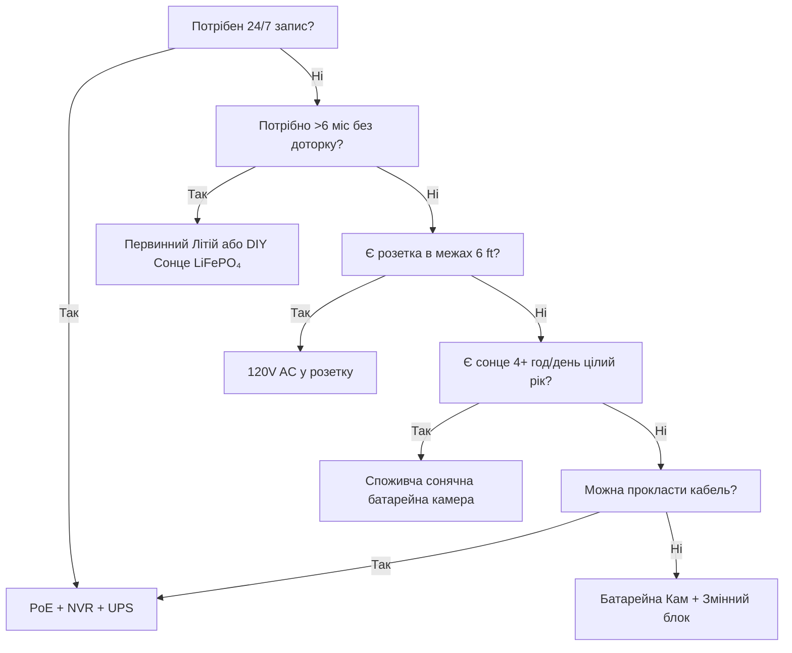

Живлення — причина №1 відмови камер безпеки. Мертва батарея о 3-й годині ночі. Замерзлий Li-ion у січні. Сонячна панель, завалена снігом. PoE комутатор вимкнули «на хвилинку». Цей посібник розбирає кожну енергоархітектуру з реальною фізикою, реальними даними та рамковими рішеннями, щоб ви вибрали раз і назавжди.

<Badge variant="outline">Спочатку фізика</Badge> **Енергія на вході = Енергія на
виході + Втрати.** Жоден маркетинг цього не змінить. Розраховуйте джерело для
найгіршого випадку (найкоротший день, найхолодніша температура, найвища
активність), а не найкращого.

## Порівняння енергоархітектур

| Архітектура                          | Джерело напруги          | Макс. відстань                 | Надійність       | Складність встановлення | Найкраще для                                |
| ------------------------------------ | ------------------------ | ------------------------------ | ---------------- | ----------------------- | ------------------------------------------- |
| **120V AC + Адаптер**                | Розетка                  | 6 футів (кабель)               | ★★★★★ (мережа)   | Проста                  | Внутрішні, ґанок, є розетка                 |
| **PoE (802.3af/at/bt)**              | PoE комутатор/Інжектор   | 328 футів (100 м)              | ★★★★★ (з UPS)    | Середня (кабель)        | **Золотий стандарт** — 24/7, NVR, віддалено |
| **12V/24V DC Пряме**                 | Банка батарей / БЖ       | 50–100 футів (падіння напруги) | ★★★★☆            | Середня                 | Офф-грид, RV, існуюча 12V шина              |
| **Перезаряджуваний Li-ion**          | Внутрішня батарея        | Н/Д (безпровідно)              | ★★☆☆☆ (сезонно)  | Проста                  | Орендарі, тимчасово, зони без кабелів       |
| **Первинний Літій (Не перезарядж.)** | Внутрішня батарея        | Н/Д                            | ★★★☆☆ (1–2 роки) | Проста                  | Трейл камери, ультра-віддалені, немає сонця |
| **Сонячне + Перезаряджуване**        | Сонце → Панель → Батарея | Н/Д                            | ★★★☆☆ (погода)   | Легка–Середня           | Паркан, ворота, сарай, офф-грид             |
| **Гібрид: PoE + Батарея Резерв**     | PoE + UPS/Внутрішня      | 328 футів                      | ★★★★★            | Вища                    | Критичні входи, номери                      |

<Callout type="warning">

**Маркетинг vs Реальність:** «6 місяців роботи батареї» = 10 подій руху/день,
10с кліпи, 70°F, без живого перегляду. **Реальний світ:** 20–40 подій/день + 5
живих переглядів = **2–6 тижнів**. Завжди занижуйте в 3–5 разів.

</Callout>

## Поглиблений розбір: Кожна архітектура

### 1. PoE (Power over Ethernet) — Професійний вибір

<Accordion type="single" collapsible>
  <AccordionItem value="poe-basics">
    <AccordionTrigger>Як працює PoE та стандарти</AccordionTrigger>
    <AccordionContent>

<strong>IEEE 802.3af (PoE):</strong> 15.4W на PSE → 12.95W на PD (камера).
Живить більшість фіксованих bullet/domes.
<strong>IEEE 802.3at (PoE+):</strong> 30W на PSE → 25.5W на PD. Живить PTZ,
обігрівачі, IR освітлювачі.
<strong>IEEE 802.3bt (PoE++):</strong> 60W (Тип 3) / 90W (Тип 4) на PSE → 51W /
71W на PD. Живить швидкі domes, мультисенсори, склоочисники/обігрівачі.

<strong>Кабель:</strong> Мінімум Cat5e (Cat6/6a для PoE++). Макс. 100 м (328
футів) на сегмент.
<strong>Топологія:</strong> Камера → Cat5e/6 → PoE Комутатор (або NVR з PoE
портами) → UPS → Мережа.
<strong>Напруга:</strong> 44–57V DC на парах дроту (Режим A: пари даних / Режим
B: запасні пари). Камера DC-DC внутрішньо перетворює на 12V/5V/3.3V.

</AccordionContent>

  </AccordionItem>
  <AccordionItem value="poe-ups">
    <AccordionTrigger>Розрахунок UPS для PoE (критично для 24/7)</AccordionTrigger>
    <AccordionContent>

<strong>Правило:</strong> UPS має покривати
<strong>всі порти PoE комутатора + NVR + роутер</strong> на цільовий час роботи.

| Навантаження                             | Типові Вати            | 4-год робота (Wh)       | 12-год робота (Wh)        | 24-год робота (Wh)        |
| ---------------------------------------- | ---------------------- | ----------------------- | ------------------------- | ------------------------- |
| 8-портовий PoE+ Комутатор (4 кам)        | 45W                    | 180 Wh                  | 540 Wh                    | 1,080 Wh                  |
| 16-портовий PoE+ Комутатор (12 кам)      | 120W                   | 480 Wh                  | 1,440 Wh                  | 2,880 Wh                  |
| NVR (8-відсіковий, 2 HDD)                | 35W                    | 140 Wh                  | 420 Wh                    | 840 Wh                    |
| Роутер/Модем                             | 15W                    | 60 Wh                   | 180 Wh                    | 360 Wh                    |
| <strong>Всього (12 кам система)</strong> | <strong>~170W</strong> | <strong>680 Wh</strong> | <strong>2,040 Wh</strong> | <strong>4,080 Wh</strong> |

<strong>Рекомендація UPS:</strong>

<ul>
  <li>
    <strong>&lt;4 год:</strong> CyberPower CP1500PFCLCD (1,500 VA / 1,050 Wh) —
    $200
  </li>
  <li>
    <strong>8–12 год:</strong> APC SMT1500RM2UC + зовнішній батарейний блок —
    $600+
  </li>
  <li>
    <strong>24+ год:</strong> 48V LiFePO₄ серверна стійка батарея (5–10 kWh) +
    Victron інвертор/зарядний — $2,000+
  </li>
</ul>

<strong>Порада:</strong> Підключіть PoE комутатор + NVR + роутер до
<strong>одного UPS</strong>. UPS на стороні камери (на камеру) існує, але коштує
в 5 разів більше за той самий час роботи.

</AccordionContent>

  </AccordionItem>
</Accordion>

### 2. Перезаряджувані Батарейні Камери — Пастка зручності

<Callout type="note">

**Хімія:** Майже всі споживчі батарейні камери використовують **Li-ion
(NMC/LCO), 3.6–3.7V номінал, макс. 4.2V**. Не LiFePO₄. Це важливо для холоду.

</Callout>

**Реальний термін служби батареї (моделі 2025–2026, 1080p/2K/4K)**

| Камера                | Батарея              | Заявлено | **Реально (Висока активність)** | **Реально (Низька активність)** | Спосіб зарядки              |
| --------------------- | -------------------- | -------- | ------------------------------- | ------------------------------- | --------------------------- |
| EufyCam 3 S330        | 13,000 mAh           | 365 днів | 14–21 днів                      | 90–120 днів                     | USB-C (5V) / Сонце          |
| Reolink Argus 4 Pro   | 9,600 mAh            | 6 міс.   | 10–18 днів                      | 60–90 днів                      | USB-C (5V) / Сонце          |
| Ring Stick Up Cam Pro | 6,000 mAh            | 6 міс.   | 7–14 днів                       | 45–60 днів                      | USB-C (5V) / Сонце / Мережа |
| Arlo Pro 5S 2K        | 5,200 mAh            | 6 міс.   | 5–10 днів                       | 30–45 днів                      | Магнітний (власний) / Сонце |
| Blink Outdoor 4       | 2× AA Li (3,000 mAh) | 2 роки   | 60–90 днів                      | 180–365 днів                    | Заміна AA (не перезарядж.)  |
| Wyze Cam Outdoor v2   | 5,200 mAh            | 6 міс.   | 10–16 днів                      | 50–75 днів                      | Micro-USB / Сонце           |
| Reolink Go PT Plus    | 7,800 mAh            | 3 міс.   | 8–14 днів                       | 40–60 днів                      | USB-C / Сонце / 12V         |

**Висока активність =** 30+ подій руху/день + 3 живих перегляди/день + нічний IR увімкнено
**Низька активність =** 5 подій/день + 0 живих переглядів + тільки вдень

<Accordion type="single" collapsible>
  <AccordionItem value="battery-physics">
    <AccordionTrigger>
      Чому падає термін служби батареї (Фізика)
    </AccordionTrigger>
    <AccordionContent>

<ol>
  <li>
    <strong>Потужність Tx домінує:</strong> Wi-Fi радіо на +17 dBm = 300–500 mA
    @ 3.7V.
  </li>
</ol>
<ol>
  <li>
    <strong>IR світлодіоди:</strong> 850 nm IR на 100 ft = 1–2W за 30с/кліп. 30
    кліпів = 0.25–0.5 Wh = <strong>70–140 mAh @ 3.7V</strong>.
  </li>
  <li>
    <strong>PIR пробудження + DSP:</strong> 50–100 mA за 2–5с на подію. Само по
    собі незначно, але накопичується.
  </li>
  <li>
    <strong>Холодна температура:</strong> Li-ion{" "}
    <strong>внутрішній опір подвоюється при 32°F (0°C)</strong>. Напруга
    просідає під навантаженням Tx → BMS відключає при 3.0V → "мертва" батарея
    при 40% SoC. <strong>Ємність при 14°F (-10°C) ≈ 50% від 70°F.</strong>
  </li>
  <li>
    <strong>Саморозряд:</strong> 2–5%/місяць. Незначно порівняно з активним
    споживанням.
  </li>
  <li>
    <strong>Живий перегляд:</strong> 5 хв живого перегляду = енергія 30+ кліпів.{" "}
    <strong>Уникайте щоденних перевірок.</strong>
  </li>
</ol>

    </AccordionContent>

  </AccordionItem>
  <AccordionItem value="charging">
    <AccordionTrigger>Стратегії зарядки, які працюють</AccordionTrigger>
    <AccordionContent>

      <strong>Не чекайте 0%.</strong> Li-ion не любить глибокого розряду. Заряджайте при
        20–30%. <strong>Розрахунок сонячної панелі:</strong> Панель (W) ≥ Сер. споживання
      камери (W) × 3 (зима/хмарно) ÷ Пікові сонячні години (найгірший місяць). -
      Приклад: Argus 4 Pro сер. 1.5W → потрібно 4.5W. Найгірший місяць (Грудень,
      Зона 5) = 1.5 пік. год → <strong>мін. 3W панель, рекомендовано 6W</strong>. <strong>USB-C PD
      Тригерні Кабелі:</strong> Reolink/Argus/Eufy приймають 5V/9V/12V/15V/20V через
      PD. Використовуйте 12V→USB-C PD тригерний кабель для зарядки від 12V
      RV/домашньої батареї безпосередньо (90% ефективність проти 60% у 12V→120V
      інвертор→5V адаптер). <strong>Подвійна ротація батарей:</strong> Купіть запасний блок.
      Поміняйте розряджений на заряджений. Нуль простою. Працює тільки зі
      знімними блоками (Reolink, Blink, деякі Ring).

    </AccordionContent>

  </AccordionItem>
</Accordion>

### 3. Первинний Літій (Не перезаряджуваний) — Спеціаліст далеких дистанцій

| Тип батареї                       | Хімія    | Напруга | Ємність    | Діапазон температур | Найкраще для                                   |
| --------------------------------- | -------- | ------- | ---------- | ------------------- | ---------------------------------------------- |
| **Energizer Ultimate Lithium AA** | Li/FeS₂  | 1.5V    | 3,000 mAh  | -40°F до 140°F      | Blink, трейл камери, -40°F операції            |
| **Tadiran TL-5930 (D-елемент)**   | Li/SOCl₂ | 3.6V    | 19,000 mAh | -67°F до 185°F      | Трубопроводи, віддалена телеметрія, 5–10 років |
| **Saft LS 14500 (AA)**            | Li/SOCl₂ | 3.6V    | 2,600 mAh  | -60°F до 185°F      | Промислові, ATEX зони                          |

**Плюси:** У 10–20 разів більша щільність енергії проти лужних; працює при -40°F; термін зберігання 10–20 років; не потребує схеми заряджання
**Мінуси:** **Не перезаряджувані**; $2–10/елемент; плато напруги ускладнює вимірювання заряду; пасивація (затримка напруги після тривалого спокою)
**Використання:** Трейл камера на стежці, перевірка раз на квартал; датчик трубопроводу; антарктична дослідницька камера. **Не для щоденної безпеки.**

### 4. Сонце + Батарея — Офф-грид інженерія

<Callout type="info">

**Сонце — це зарядний пристрій для батареї, а не джерело живлення.**
Розраховуйте **батарею** на автономність (дні без сонця). Розраховуйте
**панель** на заряджання цієї батареї за 1 хороший день.

</Callout>

**Робочий аркуш розрахунку системи**

```
  1. Сер. потужність камери (W) × 24h = Wh/день потрібно
   Приклад: Reolink Go PT Plus = 2.5W сер → 60 Wh/день

  2. Автономність батареї (дні без сонця) × Wh/день = Wh батареї
     3 дні автономності → 180 Wh
   LiFePO₄ 12.8V → 180 Wh ÷ 12.8V = 14 Ah → **20 Ah блок (20% запас)**

  3. Пікові сонячні години найгіршого місяця (ПСГ) × Вати панелі × 0.75 (втрати) = Wh/день збір
   Грудень, Зона 5: 1.5 ПСГ × W панелі × 0.75 = 60 Wh → Панель = 53W → **60W панель**

  4. Контролер заряду: MPPT (95% ефект.) vs PWM (75% ефект.). **Завжди MPPT для >20W.**
   Victron SmartSolar 75/10, 75/15, 100/20 — Bluetooth, програмований, надійний.

  5. Монтаж: на південь (Пн. півкуля), нахил по широті (30–45°), **без тіні 9:00–15:00 21 грудня**.
   Регульований наземний монтаж > дах > стовп паркану.
```

**Реальні сонячні камерні комплекти (2026)**

| Комплект                                                          | Панель           | Батарея         | Контролер    | Камера                      | Зимовий час роботи Зона 5                   |
| ----------------------------------------------------------------- | ---------------- | --------------- | ------------ | --------------------------- | ------------------------------------------- |
| Reolink 6W + Argus 4 Pro                                          | 6W (фіксована)   | 9.6 Ah (внутр.) | Внутр. (PWM) | Argus 4 Pro                 | **Не працює Груд–Лют** (панель замала)      |
| Reolink 20W + Go PT Plus                                          | 20W (регул.)     | 7.8 Ah (внутр.) | Внутр.       | Go PT Plus                  | **На межі** (додайте зовнішню 20Ah LiFePO₄) |
| EufyCam 3 + Сонце                                                 | 2.4W (вбудована) | 13 Ah (внутр.)  | Внутр.       | EufyCam 3                   | **Не працює Лис–Бер** (панель крихітна)     |
| **DIY: 60W + 20Ah LiFePO₄ + Victron + Go PT Plus**                | 60W              | 256 Wh          | MPPT         | Go PT Plus                  | **95% роботи** (інженерне рішення)          |
| **DIY: 100W + 40Ah LiFePO₄ + Victron + PoE Інжектор + 4K Bullet** | 100W             | 512 Wh          | MPPT         | Reolink RLC-1212A + 12V→PoE | **99% роботи** (справжній офф-грид PoE)     |

<Accordion type="single" collapsible>
  <AccordionItem value="winter">
    <AccordionTrigger>Зимова реальність сонця (Зона 4–6)</AccordionTrigger>
    <AccordionContent>

<strong>Грудневе сонцестояння (Зона 5, 42°N):</strong>

<ul>
  <li>
    Пікові сонячні години: <strong>1.0–1.5</strong> (проти 5.5 у червні)
  </li>
  <li>
    Вихід панелі при нахилі 30°: <strong>15–20% від STC номіналу</strong>
  </li>
  <li>
    Сніговий покрив: <strong>0% виходу</strong> доки не очищено (авто-панелі, що
    гріються: 5–10W паразитні)
  </li>
  <li>
    Батарея при 14°F:{" "}
    <strong>Li-ion = 50% ємності; LiFePO₄ = 80% ємності</strong>
  </li>
</ul>

<strong>Стратегії виживання:</strong>

<ol>
  <li>
    <strong>Збільште панель у 3–4 рази</strong> проти літніх розрахунків (60W →
    180–240W масив)
  </li>
  <li>
    <strong>LiFePO₄ батарея</strong> (не Li-ion) — заряджається при -4°F з BMS
    обігрівачем
  </li>
  <li>
    <strong>Зменшіть робочий цикл камери:</strong> Тільки по руху, нижча
    роздільна здатність, коротші кліпи, вимкніть IR (використовуйте навколишнє
    світло)
  </li>
  <li>
    <strong>Резервна зарядка:</strong> 12V→USB-C PD тригерний кабель від
    авто/генератора щомісяця
  </li>
  <li>
    <strong>Прийміть простої:</strong> Розраховуйте на 90% роботи, а не 100%.
    3–5 темних днів на рік — нормально.
  </li>
</ol>

              </AccordionContent>

        </AccordionItem>

    </Accordion>

### 5. 12V/24V DC Пряме — Рідний для RV/Офф-грид

**Чому 12V DC?** Немає втрат на інверторі (120V AC → 12V DC = 15–25% втрати). Камера вже працює на 12V всередині.

**Підключення 12V камери безпосередньо:**

```
Домашня батарея (12V LiFePO₄)
  → 10A Запобіжник
  → 18 AWG Луджений морський дріт (червоний/чорний)
  → Водонепроникний Deutsch / SAE / Anderson Роз'єм
  → Вхід 12V камери (перевірте полярність!)
  → **Buck перетворювач**, якщо камері потрібно 5V/9V (більшість PoE камер потребують 48V → використовуйте 12V→48V PoE Інжектор)
```

**Калькулятор падіння напруги:**

```
Vпад = (2 × Довжина_фут × Струм_A × 0.000016) / Переріз_дроту_CM
  18 AWG (1,624 CM), 50 ft, 1A → 0.98V падіння (8% на 12V) — ПРИЙНЯТНО
  18 AWG, 100 ft, 1A → 1.96V падіння (16%) — ВИКОРИСТОВУЙТЕ 16 AWG (2,583 CM) → 1.2V (10%)
```

**Правило:** Тримайте 12V лінії &lt;50 ft на 18 AWG; &lt;100 ft на 14 AWG. Або використовуйте 24V/48V розподіл + buck біля камери.

**12V→PoE Інжектори (живлення PoE камер від 12V банки):**

- Tycon POE-12-48V (12V вхід → 48V PoE вихід, 15W) — $25
- Ubiquiti INJ-12V-48V (12V → 48V PoE+, 30W) — $35
- Промисловий: Mean Well NDR-120-48 (120W DIN рейка) + PoE сплітер — $60
- **Ефективність:** 85–92%. Камера бачить стандартний PoE — жодних хаків прошивки.

### 6. Гібрид: PoE + Резервна Батарея (Нуль простою)

**Архітектура:** Камера → PoE Комутатор → UPS (LiFePO₄) → Мережа.
**Плюс:** Камера має внутрішню батарею (Reolink Go PT Plus, Arlo Go 2) АБО зовнішній UPS на камеру.

| Підхід                                | Вартість   | Час роботи (на кам) | Складність |
| ------------------------------------- | ---------- | ------------------- | ---------- |
| Центральний UPS (комутатор+NVR)       | $200–2,000 | Години–Дні          | Низька     |
| UPS на камеру (APC BE600M1)           | $60×N      | 30–60 хв            | Середня    |
| Камера з внутр. батареєю (Go PT Plus) | $230       | 2–4 тиж (сонце)     | Низька     |
| **PoE + 12V LiFePO₄ + Автоперемикач** | $150/кам   | Дні–Тижні           | Висока     |

**Найкраще з обох світів:** PoE для 24/7 запису + NVR. Внутрішня батарея для **запису при відключенні мережі** (останні 30 хв до вимкнення UPS). Reolink Go PT Plus робить це нативно — записує на microSD при втраті PoE.

## Повна вартість володіння (5 років)

| Архітектура                                | Рік 1  | Рік 2–5 (Щорічно)          | 5-річний підсумок | Найкраще для                           |
| ------------------------------------------ | ------ | -------------------------- | ----------------- | -------------------------------------- |
| **PoE + NVR + UPS**                        | $1,500 | $50 (заміна HDD)           | **$1,700**        | Постійна, 24/7, 8+ камер               |
| **Батарея + Сонце (DIY LiFePO₄)**          | $800   | $0                         | **$800**          | Офф-грид, 1–4 камери, DIY              |
| **Батарейна кам + Сонячна панель (спож.)** | $500   | $50 (заміна бат. на 3 рік) | **$700**          | Оренда, без дротів, 1–2 камери         |
| **Первинний Літій (Трейл камера)**         | $300   | $100 (елементи/рік)        | **$700**          | Ультра-віддалена, квартальна перевірка |
| **120V AC у розетку**                      | $200   | $10                        | **$240**          | Внутрішня, ґанок, є розетка            |

<Callout type="tip">

**Приховані витрати:** Візити обслуговування. Батарея камери вмирає о 3-й ночі
→ 30 хв їзди на заміну = $50/раз. PoE + UPS = 0 візитів через живлення.
Врахуйте $50 × очікувані відмови/рік.

</Callout>

## Матриця рішень: Виберіть свою архітектуру



## Швидкий контрольний список для вашої камери

- [ ] **PoE:** 802.3af (15W) / at (30W) / bt (60/90W) — відповідність комутатору
- [ ] **12V DC:** Приймає 10–14V? Захист від переполюсовки? Тип роз'єму?
- [ ] **Батарея:** Знімна? Хімія (Li-ion vs LiFePO₄)? mAh @ 3.7V? Зарядка через USB-C PD?
- [ ] **Сонце:** Вати панелі? MPPT чи PWM? Довжина кабелю? Регулювання монтажу?
- [ ] **Робоча температура:** Мін. -4°F / -20°C для Li-ion; -40°F для LiFePO₄/первинного
- [ ] **Споживання:** "Макс" vs "типове" у специфікаціях — розраховуйте на типове × 1.5
- [ ] **Сповіщення про низький заряд:** Push при 20%? Поріг автоматичного вимкнення?
- [ ] **Сумісність з UPS:** NVR + Комутатор на одному UPS? Час роботи розраховано?

---

## Пов'язані посібники

- [Найкращі сонячні камери безпеки (Офф-грид)](/blog/best-solar-powered-security-cameras-offgrid) — Детальний розрахунок панелі/батареї
- [Найкращі камери безпеки для RV та мобільних будинків](/blog/best-security-cameras-for-rvs-mobile-homes) — 12V DC, вібрація, стільниковий зв'язок
- [PoE vs Безпровідні vs Сонце](/blog/poe-vs-wireless-vs-solar-comparison) — Рамка прийняття рішень
- [Налаштування безпровідної камери: DIY поради](/blog/wireless-camera-setup-diy-installation-tips) — Wi-Fi, батарея, монтаж
