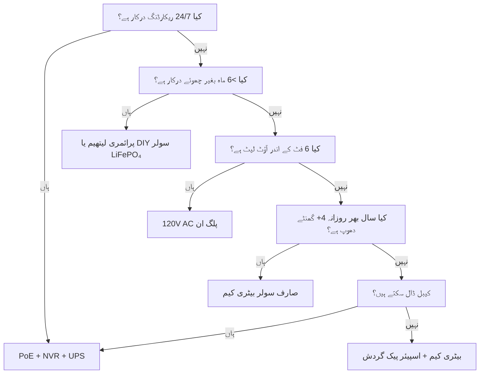

پاور سیکیورٹی کیمروں کی ناکامی کی #1 وجہ ہے۔ رات 3 بجے ڈیڈ بیٹری۔ جنوری میں جمی ہوئی Li-ion۔ برف میں دبے سولر پینل۔ PoE سوئچ "بس ایک منٹ" کے لیے ان پلگ۔ یہ گائیڈ ہر پاور آرکیٹیکچر کو حقیقی فزکس، حقیقی ڈیٹا اور فیصلہ سازی کے فریم ورک کے ساتھ توڑتی ہے تاکہ آپ ایک بار صحیح انتخاب کریں اور یہ کام کرتا رہے۔

<Badge variant="outline">فزکس پہلے</Badge> **انرجی ان = انرجی آؤٹ + نقصانات۔**
کوئی مارکیٹنگ اسے نہیں بدل سکتی۔ اپنے ذریعہ کو بدترین صورت (سب سے چھوٹا دن، سب
سے ٹھنڈا درجہ حرارت، سب سے زیادہ سرگرمی) کے لیے سائز کریں، بہترین صورت کے لیے
نہیں۔

## پاور آرکیٹیکچر کا موازنہ

| آرکیٹیکچر                            | وولٹیج سورس         | زیادہ سے زیادہ فاصلہ    | قابل اعتمادی       | تنصیب کی پیچیدگی | بہترین کے لیے                         |
| ------------------------------------ | ------------------- | ----------------------- | ------------------ | ---------------- | ------------------------------------- |
| **120V AC + اڈاپٹر**                 | وال آؤٹ لیٹ         | 6 فٹ (کورڈ)             | ★★★★★ (گرڈ)        | بہت آسان         | انڈور، پورچ، موجودہ آؤٹ لیٹ           |
| **PoE (802.3af/at/bt)**              | PoE سوئچ/انجیکٹر    | 328 فٹ (100 میٹر)       | ★★★★★ (UPS بیک اپ) | درمیانی (کیبل)   | **گولڈ اسٹینڈرڈ** — 24/7، NVR، ریموٹ  |
| **12V/24V DC ڈائریکٹ**               | بیٹری بینک / PSU    | 50–100 فٹ (وولٹیج ڈراپ) | ★★★★☆              | درمیانی          | آف گرڈ، RV، موجودہ 12V بس             |
| **ریچارج ایبل Li-ion**               | اندرونی بیٹری       | N/A (وائرلیس)           | ★★☆☆☆ (موسمی)      | بہت آسان         | کرایہ دار، عارضی، بغیر کیبل والے زونز |
| **پرائمری لیتھیم (نان ریچارج ایبل)** | اندرونی بیٹری       | N/A                     | ★★★☆☆ (1–2 سال)    | بہت آسان         | ٹریل کیم، انتہائی دور دراز، بغیر دھوپ |
| **سولر + ریچارج ایبل**               | سورج → پینل → بیٹری | N/A                     | ★★★☆☆ (موسم)       | آسان–درمیانی     | باڑ، گیٹ، شیڈ، آف گرڈ                 |
| **ہائبرڈ: PoE + بیٹری بیک اپ**       | PoE + UPS/اندرونی   | 328 فٹ                  | ★★★★★              | زیادہ            | اہم داخلی راستے، لائسنس پلیٹ          |

<Callout type="warning">

**مارکیٹنگ بمقابلہ حقیقت:** "6 ماہ کی بیٹری لائف" = روزانہ 10 موشن ایونٹس، 10
سیکنڈ کلپس، 70°F، کوئی لائیو ویو نہیں۔ **حقیقی دنیا:** 20–40 ایونٹس/دن + 5
لائیو ویوز = **2–6 ہفتے**۔ ہمیشہ 3–5 گنا کم کریں۔

</Callout>

## گہرائی میں جانکاری: ہر آرکیٹیکچر

### 1. PoE (پاور اوور ایتھرنیٹ) — پیشہ ورانہ انتخاب

<Accordion type="single" collapsible>
  <AccordionItem value="poe-basics">
    <AccordionTrigger>PoE کیسے کام کرتا ہے اور اسٹینڈرڈز</AccordionTrigger>
    <AccordionContent>

<strong>IEEE 802.3af (PoE):</strong> PSE پر 15.4W → PD (کیمرہ) پر 12.95W۔ زیادہ
تر فکسڈ بلیٹ/ڈوم کو پاور کرتا ہے۔
<strong>IEEE 802.3at (PoE+):</strong> PSE پر 30W → PD پر 25.5W۔ PTZ، ہیٹرز، IR
الیومینیٹرز کو پاور کرتا ہے۔
<strong>IEEE 802.3bt (PoE++):</strong> 60W (Type 3) / 90W (Type 4) PSE پر → 51W
/ 71W PD پر۔ اسپیڈ ڈوم، ملٹی سینسر، وائپرز/ہیٹرز کو پاور کرتا ہے۔

<strong>کیبل:</strong> Cat5e کم از کم (Cat6/6a PoE++ کے لیے)۔ زیادہ سے زیادہ 100
میٹر (328 فٹ) فی سیگمنٹ۔
<strong>ٹوپولاجی:</strong> کیمرہ → Cat5e/6 → PoE سوئچ (یا NVR جس میں PoE پورٹس
ہوں) → UPS → گرڈ۔
<strong>وولٹیج:</strong> وائر پیئرز پر 44–57V DC (Mode A: ڈیٹا پیئرز / Mode B:
اسپیئر پیئرز)۔ کیمرہ DC-DC کنورٹر سے اندرونی طور پر 12V/5V/3.3V میں تبدیل کرتا
ہے۔

</AccordionContent>

  </AccordionItem>
  <AccordionItem value="poe-ups">
    <AccordionTrigger>PoE کے لیے UPS کا سائز (24/7 کے لیے اہم)</AccordionTrigger>
    <AccordionContent>

<strong>اصول:</strong> UPS کو تمام <strong>PoE سوئچ پورٹس + NVR + روٹر</strong>
کو ہدف کے رن ٹائم کے لیے کور کرنا چاہیے۔

| لوڈ                               | عام واٹس               | 4 گھنٹے رن ٹائم (Wh)    | 12 گھنٹے رن ٹائم (Wh)     | 24 گھنٹے رن ٹائم (Wh)     |
| --------------------------------- | ---------------------- | ----------------------- | ------------------------- | ------------------------- |
| 8 پورٹ PoE+ سوئچ (4 کیم)          | 45W                    | 180 Wh                  | 540 Wh                    | 1,080 Wh                  |
| 16 پورٹ PoE+ سوئچ (12 کیم)        | 120W                   | 480 Wh                  | 1,440 Wh                  | 2,880 Wh                  |
| NVR (8 بے، 2 HDD)                 | 35W                    | 140 Wh                  | 420 Wh                    | 840 Wh                    |
| روٹر/موڈیم                        | 15W                    | 60 Wh                   | 180 Wh                    | 360 Wh                    |
| <strong>کل (12 کیم سسٹم)</strong> | <strong>~170W</strong> | <strong>680 Wh</strong> | <strong>2,040 Wh</strong> | <strong>4,080 Wh</strong> |

<strong>UPS تجویز:</strong>

<ul>
  <li>
    <strong>&lt;4 گھنٹے:</strong> CyberPower CP1500PFCLCD (1,500 VA / 1,050 Wh)
    — $200
  </li>
  <li>
    <strong>8–12 گھنٹے:</strong> APC SMT1500RM2UC + ایکسٹرنل بیٹری پیک — $600+
  </li>
  <li>
    <strong>24+ گھنٹے:</strong> 48V LiFePO₄ سرور ریک بیٹری (5–10 kWh) + Victron
    انورٹر/چارجر — $2,000+
  </li>
</ul>

<strong>پیشہ ورانہ ٹپ:</strong> PoE سوئچ + NVR + روٹر کو
<strong>ایک ہی UPS</strong> پر رکھیں۔ کیمرہ سائیڈ UPS (فی کیم) موجود ہے لیکن اسی
رن ٹائم کے لیے 5 گنا زیادہ مہنگا ہے۔

</AccordionContent>

  </AccordionItem>
</Accordion>

### 2. ریچارج ایبل بیٹری کیم — سہولت کا جال

<Callout type="note">

**کیمسٹری:** تقریباً تمام صارفی بیٹری کیم **Li-ion (NMC/LCO)، 3.6–3.7V نومینل،
4.2V زیادہ سے زیادہ** استعمال کرتے ہیں۔ LiFePO₄ نہیں۔ یہ سردی کے لیے اہم ہے۔

</Callout>

**حقیقی دنیا کی بیٹری لائف (2025–2026 ماڈلز، 1080p/2K/4K)**

| کیمرہ                 | بیٹری                | دعویٰ کردہ | **حقیقی (زیادہ سرگرمی)** | **حقیقی (کم سرگرمی)** | چارج کرنے کا طریقہ          |
| --------------------- | -------------------- | ---------- | ------------------------ | --------------------- | --------------------------- |
| EufyCam 3 S330        | 13,000 mAh           | 365 دن     | 14–21 دن                 | 90–120 دن             | USB-C (5V) / سولر           |
| Reolink Argus 4 Pro   | 9,600 mAh            | 6 ماہ      | 10–18 دن                 | 60–90 دن              | USB-C (5V) / سولر           |
| Ring Stick Up Cam Pro | 6,000 mAh            | 6 ماہ      | 7–14 دن                  | 45–60 دن              | USB-C (5V) / سولر / پلگ ان  |
| Arlo Pro 5S 2K        | 5,200 mAh            | 6 ماہ      | 5–10 دن                  | 30–45 دن              | میگنیٹک (پروپرائٹری) / سولر |
| Blink Outdoor 4       | 2× AA Li (3,000 mAh) | 2 سال      | 60–90 دن                 | 180–365 دن            | AA تبدیل کریں (نان ریچارج)  |
| Wyze Cam Outdoor v2   | 5,200 mAh            | 6 ماہ      | 10–16 دن                 | 50–75 دن              | Micro-USB / سولر            |
| Reolink Go PT Plus    | 7,800 mAh            | 3 ماہ      | 8–14 دن                  | 40–60 دن              | USB-C / سولر / 12V          |

**زیادہ سرگرمی =** 30+ موشن ایونٹس/دن + 3 لائیو ویوز/دن + رات کا IR آن  
**کم سرگرمی =** 5 ایونٹس/دن + 0 لائیو ویوز + صرف دن

<Accordion type="single" collapsible>
  <AccordionItem value="battery-physics">
    <AccordionTrigger>بیٹری لائف کیوں ختم ہوتی ہے (فزکس)</AccordionTrigger>
    <AccordionContent>

<ol>
  <li>
    <strong>Tx پاور غالب:</strong> Wi-Fi ریڈیو +17 dBm پر = 300–500 mA @ 3.7V۔
    10 سیکنڈ
  </li>
</ol>
<ol>
  <li>
    <strong>IR LEDs:</strong> 850 nm IR 100 فٹ پر = 1–2W فی کلپ 30 سیکنڈ۔ 30
    کلپس = 0.25–0.5 Wh = <strong>70–140 mAh @ 3.7V</strong>۔
  </li>
  <li>
    <strong>PIR ویک + DSP:</strong> 50–100 mA فی ایونٹ 2–5 سیکنڈ۔ اکیلے نہ ہونے
    کے برابر، مگر جمع ہو کر بڑھتا ہے۔
  </li>
  <li>
    <strong>سرد درجہ حرارت:</strong> Li-ion کی{" "}
    <strong>اندرونی مزاحمت 32°F (0°C) پر دگنی ہو جاتی ہے</strong>۔ Tx لوڈ کے تحت
    وولٹیج گرتا ہے → BMS 3.0V پر کاٹ دیتا ہے → "ڈیڈ" بیٹری 40% SoC پر۔{" "}
    <strong>14°F (-10°C) پر صلاحیت ≈ 70°F کی 50%۔</strong>
  </li>
  <li>
    <strong>سیلف ڈسچارج:</strong> 2–5%/ماہ۔ ایکٹو ڈرین کے مقابلے میں نہ ہونے کے
    برابر۔
  </li>
  <li>
    <strong>لائیو ویو:</strong> 5 منٹ لائیو ویو = 30+ کلپس کی توانائی۔{" "}
    <strong>روزانہ لائیو چیک کرنے سے گریز کریں۔</strong>
  </li>
</ol>

    </AccordionContent>

  </AccordionItem>
  <AccordionItem value="charging">
    <AccordionTrigger>چارجنگ کی حکمت عملیاں جو کام کرتی ہیں</AccordionTrigger>
    <AccordionContent>

      <strong>0% کا انتظار نہ کریں۔</strong> Li-ion گہرے ڈسچارج سے نفرت کرتا ہے۔ 20–30% پر
      چارج کریں۔ <strong>سولر پینل کا سائز:</strong> پینل (W) ≥ کیمرہ اوسط ڈرا (W) × 3
      (سردی/ابر آلود) ÷ چوٹی دھوپ کے گھنٹے (بدترین مہینہ)۔ - مثال: Argus 4 Pro
      اوسط 1.5W → 4.5W درکار۔ بدترین مہینہ (دسمبر، زون 5) = 1.5 چوٹی گھنٹے →
      <strong>کم از کم 3W پینل، 6W تجویز کردہ</strong>۔ <strong>USB-C PD ٹرگر کیبلز:</strong>
      Reolink/Argus/Eufy 5V/9G/12V/15V/20V کو PD نیگوشیشن کے ذریعے قبول کرتے
      ہیں۔ 12V→USB-C PD ٹرگر کیبل استعمال کریں تاکہ 12V RV/ہاؤس بینک سے براہ
      راست چارج کریں (90% موثر بمقابلہ 12V→120V انورٹر→5V اڈاپٹر 60%)۔ <strong>ڈوئل
      بیٹری گردش:</strong> اسپیئر پیک خریدیں۔ چارج شدہ کو ڈیڈ سے تبدیل کریں۔ صفر ڈاؤن
      ٹائم۔ صرف صارف کے قابل ہٹانے والے پیک کے ساتھ کام کرتا ہے (Reolink، Blink،
      کچھ Ring)۔

    </AccordionContent>

  </AccordionItem>
</Accordion>

### 3. پرائمری لیتھیم (نان ریچارج ایبل) — لانگ ہال سپیشلسٹ

| بیٹری کی قسم                      | کیمسٹری  | وولٹیج | صلاحیت     | درجہ حرارت کی حد | بہترین کے لیے                         |
| --------------------------------- | -------- | ------ | ---------- | ---------------- | ------------------------------------- |
| **Energizer Ultimate Lithium AA** | Li/FeS₂  | 1.5V   | 3,000 mAh  | -40°F سے 140°F   | Blink، ٹریل کیم، -40°F آپریشنز        |
| **Tadiran TL-5930 (D-cell)**      | Li/SOCl₂ | 3.6V   | 19,000 mAh | -67°F سے 185°F   | پائپ لائن، ریموٹ ٹیلی میٹری، 5–10 سال |
| **Saft LS 14500 (AA)**            | Li/SOCl₂ | 3.6V   | 2,600 mAh  | -60°F سے 185°F   | صنعتی، ATEX زونز                      |

**فوائد:** الکلائن کے مقابلے 10–20× توانائی کی کثافت؛ -40°F پر کام کرتا ہے؛ 10–20 سال شیلف لائف؛ چارجنگ سرکٹ کی ضرورت نہیں  
**نقصانات:** **نان ریچارج ایبل**؛ $2–10/سیل؛ وولٹیج پلیٹیو فیول گیجنگ کو مشکل بناتا ہے؛ پاسیویشن (لمبے آرام کے بعد وولٹیج میں تاخیر)  
**استعمال:** ٹریل کیم جو سہ ماہی چیک کیا جاتا ہے؛ پائپ لائن سینسر؛ انٹارکٹک ریسرچ کیم۔ **روزانہ استعمال کی سیکیورٹی کے لیے نہیں۔**

### 4. سولر + بیٹری — آف گرڈ انجینئرنگ

<Callout type="info">

**سولر ایک بیٹری چارجر ہے، پاور سورس نہیں۔** بیٹری کو **خود مختاری** (بغیر
دھوپ کے دن) کے لیے سائز کریں۔ پینل کو اس بیٹری کو **1 اچھے دن میں** ریچارج
کرنے کے لیے سائز کریں۔

</Callout>

**سسٹم سائزنگ ورک شیٹ**

```
  1. کیمرہ اوسط پاور (W) × 24h = یومیہ Wh درکار
   مثال: Reolink Go PT Plus = 2.5W اوسط → 60 Wh/دن

  2. بیٹری خود مختاری (بغیر دھوپ کے دن) × Wh/دن = بیٹری Wh
     3 دن خود مختاری → 180 Wh
   LiFePO₄ 12.8V → 180 Wh ÷ 12.8V = 14 Ah → **20 Ah پیک (20% مارجن)**

  3. بدترین مہینے کے چوٹی دھوپ گھنٹے (PSH) × پینل واٹس × 0.75 (نقصانات) = Wh/دن حاصل
   دسمبر، زون 5: 1.5 PSH × پینل W × 0.75 = 60 Wh → پینل = 53W → **60W پینل**

  4. چارج کنٹرولر: MPPT (95% کارکردگی) vs PWM (75% کارکردگی)۔ **ہمیشہ >20W کے لیے MPPT۔**
   Victron SmartSolar 75/10, 75/15, 100/20 — بلوٹوتھ، پروگرام ایبل، قابل اعتماد۔

  5. نصب: جنوب کی طرف (NH)، عرض بلد جھکاؤ (30–45°)، **21 دسمبر کو صبح 9–3 بجے تک کوئی سایہ نہیں**۔
   ایڈجسٹ ایبل گراؤنڈ ماؤنٹ > چھت > باڑ کی پوسٹ۔
```

**حقیقی دنیا کے سولر کیمرہ کٹس (2026)**

| کٹ                                                             | پینل             | بیٹری            | کنٹرولر       | کیمرہ                       | زون 5 سردیوں کا رن ٹائم                    |
| -------------------------------------------------------------- | ---------------- | ---------------- | ------------- | --------------------------- | ------------------------------------------ |
| Reolink 6W + Argus 4 Pro                                       | 6W (فکسڈ)        | 9.6 Ah (اندرونی) | اندرونی (PWM) | Argus 4 Pro                 | **دسمبر–فروری میں ناکام** (پینل بہت چھوٹا) |
| Reolink 20W + Go PT Plus                                       | 20W (ایڈجسٹ)     | 7.8 Ah (اندرونی) | اندرونی       | Go PT Plus                  | **مشکل** (بیرونی 20Ah LiFePO₄ شامل کریں)   |
| EufyCam 3 + سولر                                               | 2.4W (انٹیگریٹڈ) | 13 Ah (اندرونی)  | اندرونی       | EufyCam 3                   | **نومبر–مارچ میں ناکام** (پینل چھوٹا)      |
| **DIY: 60W + 20Ah LiFePO₄ + Victron + Go PT Plus**             | 60W              | 256 Wh           | MPPT          | Go PT Plus                  | **95% اپ ٹائم** (انجینئرڈ)                 |
| **DIY: 100W + 40Ah LiFePO₄ + Victron + PoE انجیکٹر + 4K بلیٹ** | 100W             | 512 Wh           | MPPT          | Reolink RLC-1212A + 12V→PoE | **99% اپ ٹائم** (حقیقی آف گرڈ PoE)         |

<Accordion type="single" collapsible>
  <AccordionItem value="winter">
    <AccordionTrigger>سردیوں کی سولر حقیقت (زون 4–6)</AccordionTrigger>
    <AccordionContent>

<strong>دسمبر سولسٹیس (زون 5، 42°N):</strong>

<ul>
  <li>
    چوٹی دھوپ گھنٹے: <strong>1.0–1.5</strong> (جون میں 5.5 کے مقابلے)
  </li>
  <li>
    30° جھکاؤ پر پینل آؤٹ پٹ: <strong>STC ریٹنگ کا 15–20%</strong>
  </li>
  <li>
    برف کا احاطہ: <strong>صاف ہونے تک 0% آؤٹ پٹ</strong> (سیلف ہیٹڈ پینل موجود
    ہیں: 5–10W پاراسٹک)
  </li>
  <li>
    14°F پر بیٹری: <strong>Li-ion = 50% صلاحیت؛ LiFePO₄ = 80% صلاحیت</strong>
  </li>
</ul>

<strong>بقا کی حکمت عملی:</strong>

<ol>
  <li>
    <strong>پینل کو گرمیوں کے حساب سے 3–4 گنا بڑا کریں</strong> (60W → 180–240W
    اری)
  </li>
  <li>
    <strong>LiFePO₄ بیٹری</strong> (Li-ion نہیں) — BMS ہیٹر کے ساتھ -4°F پر چارج
    ہوتی ہے
  </li>
  <li>
    <strong>کیمرہ ڈیوٹی سائیکل کم کریں:</strong> صرف موشن، کم ریزولوشن، چھوٹی
    کلپس، IR بند کریں (ایمبینٹ لائٹ استعمال کریں)
  </li>
  <li>
    <strong>بیک اپ چارج:</strong> 12V→USB-C PD ٹرگر کیبل گاڑی/جنریٹر سے ماہانہ
  </li>
  <li>
    <strong>ڈاؤن ٹائم قبول کریں:</strong> 90% اپ ٹائم کے لیے ڈیزائن کریں، 100%
    کے لیے نہیں۔ سال میں 3–5 دن ڈارک نارمل ہے۔
  </li>
</ol>

              </AccordionContent>

           </AccordionItem>

    </Accordion>

### 5. 12V/24V DC ڈائریکٹ — RV/آف گرڈ نیٹیو

**کیوں 12V DC؟** کوئی انورٹر نقصان نہیں (120V AC → 12V DC = 15–25% نقصان)۔ کیمرہ پہلے سے اندرونی طور پر 12V پر چلتا ہے۔

**12V کیمرہ براہ راست وائرنگ:**

```
ہاؤس بیٹری (12V LiFePO₄)
  → 10A بلیڈ فیوز
  → 18 AWG ٹن شدہ میرین وائر (ریڈ/بلیک)
  → واٹر پروف Deutsch / SAE / Anderson کنیکٹر
  → کیمرہ 12V ان پٹ (پولیرٹی تصدیق کریں!)
  → **بک کنورٹر** اگر کیمرہ کو 5V/9V درکار ہو (زیادہ تر PoE کیم کو 48V درکار ہے → 12V→48V PoE انجیکٹر استعمال کریں)
```

**وولٹیج ڈراپ کیلکولیٹر:**

```
Vdrop = (2 × لمبائی_فٹ × کرنٹ_A × 0.000016) / وائر_CM
  18 AWG (1,624 CM)، 50 فٹ، 1A → 0.98V ڈراپ (12V کا 8%) — قابل قبول
  18 AWG، 100 فٹ، 1A → 1.96V ڈراپ (16%) — 16 AWG (2,583 CM) استعمال کریں → 1.2V (10%)
```

**اصول:** 18 AWG پر 12V رنز &lt;50 فٹ رکھیں؛ 14 AWG پر &lt;100 فٹ۔ یا 24V/48V ڈسٹری بیوشن + کیمرہ پر بک استعمال کریں۔

**12V→PoE انجیکٹر (12V بینک پر PoE کیم چلائیں):**

- Tycon POE-12-48V (12V ان → 48V PoE آؤٹ، 15W) — $25
- Ubiquiti INJ-12V-48V (12V → 48V PoE+، 30W) — $35
- صنعتی: Mean Well NDR-120-48 (120W DIN ریل) + PoE سپلٹر — $60
- **کارکردگی:** 85–92%۔ کیمرہ معیاری PoE دیکھتا ہے — کوئی فرم ویئر ہیک نہیں۔

### 6. ہائبرڈ: PoE + بیٹری بیک اپ (صفر ڈاؤن ٹائم)

**آرکیٹیکچر:** کیمرہ → PoE سوئچ → UPS (LiFePO₄) → گرڈ۔  
**علاوہ:** کیمرہ میں اندرونی بیٹری ہے (Reolink Go PT Plus، Arlo Go 2) یا فی کیم بیرونی UPS۔

| طریقہ                                 | لاگت       | رن ٹائم (فی کیم) | پیچیدگی |
| ------------------------------------- | ---------- | ---------------- | ------- |
| سینٹرل UPS (سوئچ+NVR)                 | $200–2,000 | گھنٹے–دن         | کم      |
| فی کیم UPS (APC BE600M1)              | $60×N      | 30–60 منٹ        | درمیانہ |
| اندرونی بیٹری والا کیمرہ (Go PT Plus) | $230       | 2–4 ہفتے (سولر)  | کم      |
| **PoE + 12V LiFePO₄ + آٹو سوئچ**      | $150/کیم   | دن–ہفتے          | زیادہ   |

**دونوں کا بہترین:** 24/7 ریکارڈنگ + NVR کے لیے PoE۔ **گرڈ آؤٹ ریکارڈنگ** کے لیے اندرونی بیٹری (UPS مرنے سے پہلے آخری 30 منٹ)۔ Reolink Go PT Plus یہ قدرتی طور پر کرتا ہے — PoE ختم ہونے پر microSD پر ریکارڈ کرتا ہے۔

## 5 سالہ کل لاگت (TCO)

| آرکیٹیکچر                        | سال 1  | سال 2–5 (سالانہ)        | 5 سالہ کل  | بہترین کے لیے                 |
| -------------------------------- | ------ | ----------------------- | ---------- | ----------------------------- |
| **PoE + NVR + UPS**              | $1,500 | $50 (HDD تبدیل)         | **$1,700** | مستقل، 24/7، 8+ کیم           |
| **بیٹری + سولر (DIY LiFePO₄)**   | $800   | $0                      | **$800**   | آف گرڈ، 1–4 کیم، DIY          |
| **بیٹری کیم + سولر پینل (صارف)** | $500   | $50 (سال 3 بیٹری تبدیل) | **$700**   | کرایہ، بغیر تاروں، 1–2 کیم    |
| **پرائمری لیتھیم (ٹریل کیم)**    | $300   | $100 (سیلز/سال)         | **$700**   | انتہائی دور دراز، سہ ماہی چیک |
| **120V AC پلگ ان**               | $200   | $10                     | **$240**   | انڈور، پورچ، آؤٹ لیٹ موجود    |

<Callout type="tip">

**پوشیدہ لاگت:** ٹرک رولز۔ بیٹری کیم رات 3 بجے مر جاتا ہے → آپ 30 منٹ ڈرائیو
کر کے تبدیل کریں = $50/مرتبہ۔ PoE + UPS = پاور کے لیے 0 ٹرک رولز۔ $50 × متوقع
ناکامیاں/سال شامل کریں۔

</Callout>

## فیصلہ میٹرکس: اپنا آرکیٹیکچر منتخب کریں



## اپنے کیمرے کے لیے فوری اسپیک چیک لسٹ

- [ ] **PoE:** 802.3af (15W) / at (30W) / bt (60/90W) — سوئچ سے مماثل کریں
- [ ] **12V DC:** 10–14V قبول کرتا ہے؟ ریورس پولیرٹی پروٹیکشن؟ کنیکٹر کی قسم؟
- [ ] **بیٹری:** ہٹانے کے قابل؟ کیمسٹری (Li-ion vs LiFePO₄)؟ mAh @ 3.7V؟ USB-C PD چارج؟
- [ ] **سولر:** پینل واٹس؟ MPPT یا PWM؟ کیبل کی لمبائی؟ ماؤنٹ ایڈجسٹ ایبلٹی؟
- [ ] **آپریٹنگ درجہ حرارت:** Li-ion کے لیے کم از کم -4°F / -20°C؛ LiFePO₄/پرائمری کے لیے -40°F
- [ ] **پاور ڈرا:** اسپیک شیٹ "زیادہ سے زیادہ" بمقابلہ "عام" — عام × 1.5 کے لیے ڈیزائن کریں
- [ ] **کم بیٹری الرٹ:** 20% پر ایپ پش؟ آٹو شٹ ڈاؤن تھریشولڈ؟
- [ ] **UPS مطابقت:** NVR + سوئچ ایک ہی UPS پر؟ رن ٹائم کا حساب لگایا گیا؟

---

## متعلقہ گائیڈز

- [بہترین سولر پاورڈ سیکیورٹی کیم (آف گرڈ)](/blog/best-solar-powered-security-cameras-offgrid) — پینل/بیٹری سائزنگ گہرائی میں
- [RVs اور موبائل ہومز کے لیے بہترین سیکیورٹی کیم](/blog/best-security-cameras-for-rvs-mobile-homes) — 12V DC، وائبریشن، سیلولر
- [PoE بمقابلہ وائرلیس بمقابلہ سولر موازنہ](/blog/poe-vs-wireless-vs-solar-comparison) — فیصلہ فریم ورک
- [وائرلیس کیمرہ سیٹ اپ: DIY انسٹالیشن ٹپس](/blog/wireless-camera-setup-diy-installation-tips) — Wi-Fi، بیٹری، ماؤنٹنگ
