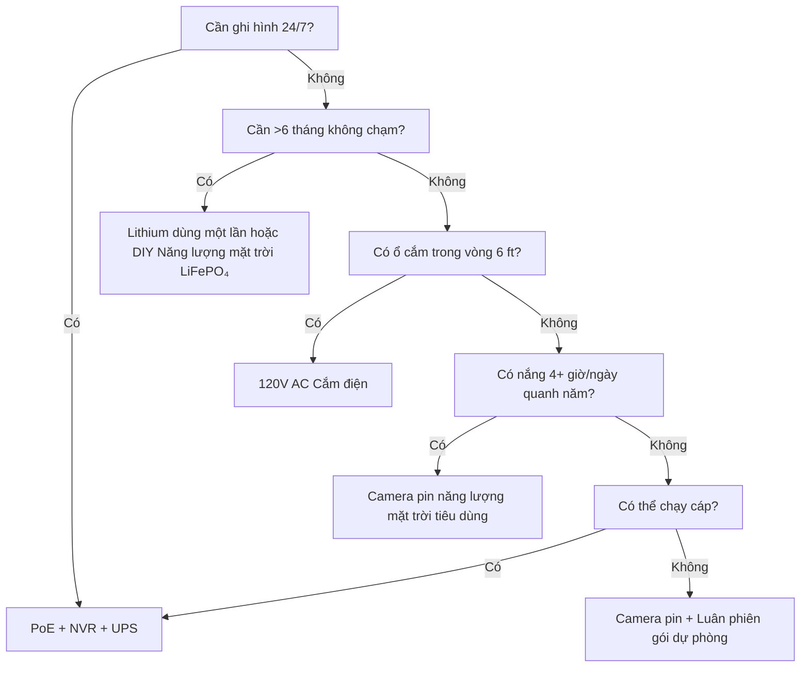

Nguồn điện là nguyên nhân số 1 khiến camera an ninh hỏng. Pin hết lúc 3 giờ sáng. Li-ion đóng băng vào tháng Một. Tấm pin mặt trời bị chôn trong tuyết. PoE switch bị rút "chỉ một phút." Hướng dẫn này phân tích mọi kiến trúc nguồn điện với vật lý thực tế, dữ liệu thực tế và khung ra quyết định để bạn chọn một lần và nó hoạt động.

<Badge variant="outline">Vật Lý Trước Tiên</Badge> **Năng lượng vào = Năng lượng
ra + Tổn thất.** Không tiếp thị nào thay đổi được điều này. Định cỡ nguồn cho
trường hợp xấu nhất (ngày ngắn nhất, nhiệt độ lạnh nhất, hoạt động cao nhất),
không phải tốt nhất.

## So Sánh Kiến Trúc Nguồn Điện

| Kiến trúc                                | Nguồn điện áp            | Khoảng cách tối đa | Độ tin cậy           | Độ phức tạp lắp đặt | Tốt nhất cho                                   |
| ---------------------------------------- | ------------------------ | ------------------ | -------------------- | ------------------- | ---------------------------------------------- |
| **120V AC + Bộ chuyển đổi**              | Ổ cắm tường              | 6 ft (dây)         | ★★★★★ (lưới)         | Rất đơn giản        | Trong nhà, hiên, ổ cắm có sẵn                  |
| **PoE (802.3af/at/bt)**                  | PoE Switch/Bộ phun       | 328 ft (100 m)     | ★★★★★ (UPS dự phòng) | Trung bình (cáp)    | **Tiêu chuẩn vàng** — 24/7, NVR, từ xa         |
| **12V/24V DC Trực tiếp**                 | Ngân hàng pin / PSU      | 50–100 ft (sụt áp) | ★★★★☆                | Trung bình          | Ngoài lưới, RV, bus 12V có sẵn                 |
| **Li-ion sạc lại**                       | Pin bên trong            | N/A (không dây)    | ★★☆☆☆ (theo mùa)     | Rất đơn giản        | Người thuê nhà, tạm thời, khu vực không có cáp |
| **Lithium dùng một lần (Không sạc lại)** | Pin bên trong            | N/A                | ★★★☆☆ (1–2 năm)      | Rất đơn giản        | Camera săn bắn, siêu xa, không có nắng         |
| **Năng lượng mặt trời + Sạc lại**        | Mặt trời → Tấm pin → Pin | N/A                | ★★★☆☆ (thời tiết)    | Dễ–Trung bình       | Hàng rào, cổng, nhà kho, ngoài lưới            |
| **Hybrid: PoE + Dự phòng Pin**           | PoE + UPS/Pin bên trong  | 328 ft             | ★★★★★                | Cao hơn             | Lối vào quan trọng, biển số xe                 |

<Callout type="warning">

**Tiếp thị vs Thực tế:** "Tuổi thọ pin 6 tháng" = 10 sự kiện chuyển động/ngày,
clip 10 giây, 70°F, không xem trực tiếp. **Thực tế:** 20–40 sự kiện/ngày + 5
lần xem trực tiếp = **2–6 tuần**. Luôn giảm 3–5 lần.

</Callout>

## Phân Tích Chuyên Sâu: Từng Kiến Trúc

### 1. PoE (Cấp nguồn qua Ethernet) — Lựa Chọn Chuyên Nghiệp

<Accordion type="single" collapsible>
  <AccordionItem value="poe-basics">
    <AccordionTrigger>Cách PoE Hoạt Động & Tiêu Chuẩn</AccordionTrigger>
    <AccordionContent>

<strong>IEEE 802.3af (PoE):</strong> 15.4W tại PSE → 12.95W tại PD (camera). Cấp
nguồn cho hầu hết camera dạng viên đạn/vòm cố định.
<strong>IEEE 802.3at (PoE+):</strong> 30W tại PSE → 25.5W tại PD. Cấp nguồn cho
PTZ, bộ sưởi, đèn hồng ngoại.
<strong>IEEE 802.3bt (PoE++):</strong> 60W (Type 3) / 90W (Type 4) tại PSE → 51W
/ 71W tại PD. Cấp nguồn cho speed dome, đa cảm biến, bộ gạt nước/sưởi.

<strong>Cáp:</strong> Cat5e tối thiểu (Cat6/6a cho PoE++). Tối đa 100 m (328 ft)
mỗi đoạn.
<strong>Cấu trúc:</strong> Camera → Cat5e/6 → PoE Switch (hoặc NVR với cổng PoE)
→ UPS → Lưới điện.
<strong>Điện áp:</strong> 44–57V DC trên cặp dây (Mode A: cặp dữ liệu / Mode B:
cặp dự phòng). Camera chuyển đổi DC-DC thành 12V/5V/3.3V bên trong.

</AccordionContent>

  </AccordionItem>
  <AccordionItem value="poe-ups">
    <AccordionTrigger>Định Cỡ UPS cho PoE (Quan Trọng cho 24/7)</AccordionTrigger>
    <AccordionContent>

<strong>Nguyên tắc:</strong> UPS phải bao phủ
<strong>tất cả cổng PoE switch + NVR + router</strong> cho thời gian chạy mục
tiêu.

| Tải                                     | Công suất điển hình    | Thời gian chạy 4 giờ (Wh) | Thời gian chạy 12 giờ (Wh) | Thời gian chạy 24 giờ (Wh) |
| --------------------------------------- | ---------------------- | ------------------------- | -------------------------- | -------------------------- |
| PoE+ Switch 8 cổng (4 cam)              | 45W                    | 180 Wh                    | 540 Wh                     | 1,080 Wh                   |
| PoE+ Switch 16 cổng (12 cam)            | 120W                   | 480 Wh                    | 1,440 Wh                   | 2,880 Wh                   |
| NVR (8 bay, 2 HDD)                      | 35W                    | 140 Wh                    | 420 Wh                     | 840 Wh                     |
| Router/Modem                            | 15W                    | 60 Wh                     | 180 Wh                     | 360 Wh                     |
| <strong>Tổng (hệ thống 12 cam)</strong> | <strong>~170W</strong> | <strong>680 Wh</strong>   | <strong>2,040 Wh</strong>  | <strong>4,080 Wh</strong>  |

<strong>Khuyến nghị UPS:</strong>

<ul>
  <li>
    <strong>&lt;4 giờ:</strong> CyberPower CP1500PFCLCD (1,500 VA / 1,050 Wh) —
    $200
  </li>
  <li>
    <strong>8–12 giờ:</strong> APC SMT1500RM2UC + gói pin ngoài — $600+
  </li>
  <li>
    <strong>24+ giờ:</strong> Pin rack server 48V LiFePO₄ (5–10 kWh) + Victron
    inverter/sạc — $2,000+
  </li>
</ul>

<strong>Mẹo chuyên nghiệp:</strong> Đặt PoE switch + NVR + router trên
<strong>cùng một UPS</strong>. UPS mỗi camera (tại camera) tồn tại nhưng đắt gấp
5 lần cho cùng thời gian chạy.

</AccordionContent>

  </AccordionItem>
</Accordion>

### 2. Camera Pin Sạc Lại — Bẫy Tiện Lợi

<Callout type="note">

**Hóa chất:** Hầu hết camera pin tiêu dùng đều dùng **Li-ion (NMC/LCO),
3.6–3.7V danh định, 4.2V tối đa**. Không phải LiFePO₄. Điều này quan trọng với
thời tiết lạnh.

</Callout>

**Tuổi thọ pin thực tế (Mẫu 2025–2026, 1080p/2K/4K)**

| Camera                | Pin                  | Công bố  | **Thực tế (Hoạt động cao)** | **Thực tế (Hoạt động thấp)** | Phương thức sạc                             |
| --------------------- | -------------------- | -------- | --------------------------- | ---------------------------- | ------------------------------------------- |
| EufyCam 3 S330        | 13,000 mAh           | 365 ngày | 14–21 ngày                  | 90–120 ngày                  | USB-C (5V) / Năng lượng mặt trời            |
| Reolink Argus 4 Pro   | 9,600 mAh            | 6 tháng  | 10–18 ngày                  | 60–90 ngày                   | USB-C (5V) / Năng lượng mặt trời            |
| Ring Stick Up Cam Pro | 6,000 mAh            | 6 tháng  | 7–14 ngày                   | 45–60 ngày                   | USB-C (5V) / Năng lượng mặt trời / Cắm điện |
| Arlo Pro 5S 2K        | 5,200 mAh            | 6 tháng  | 5–10 ngày                   | 30–45 ngày                   | Từ tính (độc quyền) / Năng lượng mặt trời   |
| Blink Outdoor 4       | 2× AA Li (3,000 mAh) | 2 năm    | 60–90 ngày                  | 180–365 ngày                 | Thay AA (không sạc lại)                     |
| Wyze Cam Outdoor v2   | 5,200 mAh            | 6 tháng  | 10–16 ngày                  | 50–75 ngày                   | Micro-USB / Năng lượng mặt trời             |
| Reolink Go PT Plus    | 7,800 mAh            | 3 tháng  | 8–14 ngày                   | 40–60 ngày                   | USB-C / Năng lượng mặt trời / 12V           |

**Hoạt động cao =** 30+ sự kiện chuyển động/ngày + 3 lần xem trực tiếp/ngày + IR ban đêm bật  
**Hoạt động thấp =** 5 sự kiện/ngày + 0 xem trực tiếp + chỉ ban ngày

<Accordion type="single" collapsible>
  <AccordionItem value="battery-physics">
    <AccordionTrigger>Tại Sao Tuổi Thọ Pin Suy Giảm (Vật Lý)</AccordionTrigger>
    <AccordionContent>

<ol>
  <li>
    <strong>Công suất Tx chiếm ưu thế:</strong> Radio Wi-Fi tại +17 dBm =
    300–500 mA @
  </li>
</ol>
<ol>
  <li>
    <strong>Đèn LED IR:</strong> IR 850 nm ở 100 ft = 1–2W trong 30 giây/clip.
    30 clip = 0.25–0.5 Wh = <strong>70–140 mAh @ 3.7V</strong>.
  </li>
  <li>
    <strong>Đánh thức PIR + DSP:</strong> 50–100 mA trong 2–5 giây mỗi sự kiện.
    Riêng lẻ không đáng kể, cộng dồn lại lớn.
  </li>
  <li>
    <strong>Nhiệt độ lạnh:</strong>{" "}
    <strong>Điện trở trong của Li-ion tăng gấp đôi ở 32°F (0°C)</strong>. Điện
    áp sụt dưới tải Tx → BMS ngắt ở 3.0V → pin "chết" ở 40% SoC.{" "}
    <strong>Dung lượng ở 14°F (-10°C) ≈ 50% so với 70°F.</strong>
  </li>
  <li>
    <strong>Tự xả:</strong> 2–5%/tháng. Không đáng kể so với tiêu thụ chủ động.
  </li>
  <li>
    <strong>Xem trực tiếp:</strong> Xem trực tiếp 5 phút = năng lượng của 30+
    clip. <strong>Tránh kiểm tra trực tiếp hàng ngày.</strong>
  </li>
</ol>

    </AccordionContent>

  </AccordionItem>
  <AccordionItem value="charging">
    <AccordionTrigger>Chiến Lược Sạc Hiệu Quả</AccordionTrigger>
    <AccordionContent>

      <strong>Đừng đợi đến 0%.</strong> Li-ion ghét xả sâu. Sạc ở 20–30%. <strong>Định cỡ tấm pin
      mặt trời:</strong> Tấm pin (W) ≥ Mức tiêu thụ trung bình của camera (W) × 3 (mùa
      đông/u ám) ÷ Giờ nắng cao điểm (tháng tệ nhất). - Ví dụ: Argus 4 Pro trung
      bình 1.5W → cần 4.5W. Tháng tệ nhất (Tháng 12, Vùng 5) = 1.5 giờ cao điểm
      → <strong>tấm pin tối thiểu 3W, khuyến nghị 6W</strong>. <strong>Cáp kích hoạt USB-C PD:</strong>
      Reolink/Argus/Eufy chấp nhận 5V/9V/12V/15V/20V qua đàm phán PD. Dùng cáp
      kích hoạt 12V→USB-C PD để sạc trực tiếp từ ngân hàng pin 12V RV/nhà (90%
      hiệu suất so với inverter 12V→120V→bộ chuyển đổi 5V đạt 60%). <strong>Luân phiên
      hai pin:</strong> Mua gói dự phòng. Đổi pin đã sạc cho pin hết. Không thời gian
      chết. Chỉ hoạt động với gói pin người dùng có thể tháo được (Reolink,
      Blink, một số Ring).

    </AccordionContent>

  </AccordionItem>
</Accordion>

### 3. Lithium Dùng Một Lần (Không Sạc Lại) — Chuyên Gia Đường Dài

| Loại pin                          | Hóa chất | Điện áp | Dung lượng | Dải nhiệt độ    | Tốt nhất cho                           |
| --------------------------------- | -------- | ------- | ---------- | --------------- | -------------------------------------- |
| **Energizer Ultimate Lithium AA** | Li/FeS₂  | 1.5V    | 3,000 mAh  | -40°F đến 140°F | Blink, camera săn bắn, hoạt động -40°F |
| **Tadiran TL-5930 (D-cell)**      | Li/SOCl₂ | 3.6V    | 19,000 mAh | -67°F đến 185°F | Đường ống, đo từ xa, 5–10 năm          |
| **Saft LS 14500 (AA)**            | Li/SOCl₂ | 3.6V    | 2,600 mAh  | -60°F đến 185°F | Công nghiệp, khu vực ATEX              |

**Ưu điểm:** Mật độ năng lượng gấp 10–20 lần kiềm; hoạt động ở -40°F; thời hạn sử dụng 10–20 năm; không cần mạch sạc  
**Nhược điểm:** **Không sạc lại được**; $2–10/viên; điện áp ổn định gây khó khăn cho đo nhiên liệu; thụ động (chậm điện áp sau thời gian dài nghỉ)  
**Trường hợp sử dụng:** Camera săn bắn trên đường mòn kiểm tra hàng quý; cảm biến đường ống; camera nghiên cứu Nam Cực. **Không dùng cho an ninh hàng ngày.**

### 4. Năng Lượng Mặt Trời + Pin — Kỹ Thuật Ngoài Lưới

<Callout type="info">

**Năng lượng mặt trời là bộ sạc pin, không phải nguồn điện.** Định cỡ **pin**
cho khả năng tự chủ (ngày không có nắng). Định cỡ **tấm pin** để sạc lại pin
đó trong 1 ngày nắng tốt.

</Callout>

**Bảng tính định cỡ hệ thống**

```
  1. Công suất trung bình camera (W) × 24h = Wh/ngày cần
   Ví dụ: Reolink Go PT Plus = 2.5W trung bình → 60 Wh/ngày

  2. Số ngày tự chủ pin (không nắng) × Wh/ngày = Pin Wh
     3 ngày tự chủ → 180 Wh
   LiFePO₄ 12.8V → 180 Wh ÷ 12.8V = 14 Ah → **Gói 20 Ah (dự phòng 20%)**

  3. Giờ nắng cao điểm tháng tệ nhất (PSH) × Công suất tấm pin × 0.75 (tổn thất) = Wh/ngày thu được
   Tháng 12, Vùng 5: 1.5 PSH × Tấm pin W × 0.75 = 60 Wh → Tấm pin = 53W → **Tấm pin 60W**

  4. Bộ điều khiển sạc: MPPT (95% hiệu suất) vs PWM (75% hiệu suất). **Luôn dùng MPPT cho >20W.**
   Victron SmartSolar 75/10, 75/15, 100/20 — Bluetooth, có thể lập trình, đáng tin cậy.

  5. Lắp đặt: Hướng nam (BCB), góc nghiêng theo vĩ độ (30–45°), **không bóng râm 9 giờ sáng–3 giờ chiều ngày 21/12**.
   Giá đỡ mặt đất có thể điều chỉnh > mái nhà > cọc hàng rào.
```

**Bộ camera năng lượng mặt trời thực tế (2026)**

| Bộ                                                            | Tấm pin                 | Pin                | Bộ điều khiển | Camera                      | Thời gian chạy mùa đông Vùng 5                       |
| ------------------------------------------------------------- | ----------------------- | ------------------ | ------------- | --------------------------- | ---------------------------------------------------- |
| Reolink 6W + Argus 4 Pro                                      | 6W (cố định)            | 9.6 Ah (bên trong) | Trong (PWM)   | Argus 4 Pro                 | **Thất bại Thg12–Thg2** (tấm pin quá nhỏ)            |
| Reolink 20W + Go PT Plus                                      | 20W (có thể điều chỉnh) | 7.8 Ah (bên trong) | Trong         | Go PT Plus                  | **Giới hạn** (thêm LiFePO₄ 20Ah ngoài)               |
| EufyCam 3 + Năng lượng mặt trời                               | 2.4W (tích hợp)         | 13 Ah (bên trong)  | Trong         | EufyCam 3                   | **Thất bại Thg11–Thg3** (tấm pin nhỏ)                |
| **DIY: 60W + 20Ah LiFePO₄ + Victron + Go PT Plus**            | 60W                     | 256 Wh             | MPPT          | Go PT Plus                  | **95% thời gian hoạt động** (được thiết kế)          |
| **DIY: 100W + 40Ah LiFePO₄ + Victron + Bộ phun PoE + Đạn 4K** | 100W                    | 512 Wh             | MPPT          | Reolink RLC-1212A + 12V→PoE | **99% thời gian hoạt động** (PoE ngoài lưới thực sự) |

<Accordion type="single" collapsible>
  <AccordionItem value="winter">
    <AccordionTrigger>Kiểm Tra Thực Tế Năng Lượng Mặt Trời Mùa Đông (Vùng 4–6)</AccordionTrigger>
    <AccordionContent>

<strong>Đông chí tháng 12 (Vùng 5, 42°B):</strong>

<ul>
  <li>
    Giờ nắng cao điểm: <strong>1.0–1.5</strong> (so với 5.5 vào tháng 6)
  </li>
  <li>
    Sản lượng tấm pin ở góc nghiêng 30°: <strong>15–20% định mức STC</strong>
  </li>
  <li>
    Lớp phủ tuyết: <strong>0% sản lượng</strong> cho đến khi được dọn (tấm pin
    tự sưởi tồn tại: 5–10W ký sinh)
  </li>
  <li>
    Pin ở 14°F:{" "}
    <strong>Li-ion = 50% dung lượng; LiFePO₄ = 80% dung lượng</strong>
  </li>
</ul>

<strong>Chiến lược sinh tồn:</strong>

<ol>
  <li>
    <strong>Tấm pin lớn hơn 3–4 lần</strong> tính toán mùa hè (60W → dàn
    180–240W)
  </li>
  <li>
    <strong>Pin LiFePO₄</strong> (không phải Li-ion) — sạc ở -4°F với bộ sưởi
  </li>
  <li>
    <strong>Giảm chu kỳ hoạt động camera:</strong> Chỉ chuyển động, độ phân giải
    thấp hơn, clip ngắn hơn, tắt IR (dùng ánh sáng xung quanh)
  </li>
  <li>
    <strong>Sạc dự phòng:</strong> Cáp kích hoạt 12V→USB-C PD từ xe/máy phát
    hàng tháng
  </li>
  <li>
    <strong>Chấp nhận thời gian chết:</strong> Thiết kế cho 90% thời gian hoạt
    động, không phải 100%. 3–5 ngày tối/năm là bình thường.
  </li>
</ol>

              </AccordionContent>

           </AccordionItem>

    </Accordion>

### 5. 12V/24V DC Trực Tiếp — Bản Địa RV/Ngoài Lưới

**Tại sao 12V DC?** Không mất mát inverter (120V AC → 12V DC = 15–25% mất mát). Camera đã chạy trên 12V nội bộ.

**Đi dây camera 12V trực tiếp:**

```
Pin nhà (12V LiFePO₄)
  → Cầu chì lưỡi 10A
  → Dây hàng hải thiếc 18 AWG (đỏ/đen)
  → Đầu nối chống nước Deutsch / SAE / Anderson
  → Đầu vào 12V camera (xác minh cực tính!)
  → **Bộ chuyển đổi Buck** nếu camera cần 5V/9V (hầu hết camera PoE cần 48V → dùng bộ phun PoE 12V→48V)
```

**Máy tính sụt áp:**

```
Vdrop = (2 × Chiều dài_ft × Dòng_A × 0.000016) / Dây_CM
  18 AWG (1,624 CM), 50 ft, 1A → sụt 0.98V (8% trên 12V) — CHẤP NHẬN ĐƯỢC
  18 AWG, 100 ft, 1A → sụt 1.96V (16%) — DÙNG 16 AWG (2,583 CM) → 1.2V (10%)
```

**Nguyên tắc:** Giữ đường chạy 12V dưới 50 ft trên 18 AWG; dưới 100 ft trên 14 AWG. Hoặc dùng phân phối 24V/48V + buck tại camera.

**Bộ phun 12V→PoE (Chạy camera PoE trên ngân hàng 12V):**

- Tycon POE-12-48V (12V vào → 48V PoE ra, 15W) — $25
- Ubiquiti INJ-12V-48V (12V → 48V PoE+, 30W) — $35
- Công nghiệp: Mean Well NDR-120-48 (120W ray DIN) + bộ chia PoE — $60
- **Hiệu suất:** 85–92%. Camera thấy PoE tiêu chuẩn — không cần hack firmware.

### 6. Hybrid: PoE + Dự Phòng Pin (Không Thời Gian Chết)

**Kiến trúc:** Camera → PoE Switch → UPS (LiFePO₄) → Lưới điện.  
**Thêm:** Camera có pin bên trong (Reolink Go PT Plus, Arlo Go 2) HOẶC UPS ngoài mỗi camera.

| Cách tiếp cận                          | Chi phí    | Thời gian chạy (mỗi cam)       | Độ phức tạp |
| -------------------------------------- | ---------- | ------------------------------ | ----------- |
| UPS trung tâm (switch+NVR)             | $200–2,000 | Giờ–Ngày                       | Thấp        |
| UPS mỗi camera (APC BE600M1)           | $60×N      | 30–60 phút                     | Trung bình  |
| Camera có pin bên trong (Go PT Plus)   | $230       | 2–4 tuần (năng lượng mặt trời) | Thấp        |
| **PoE + 12V LiFePO₄ + Tự động chuyển** | $150/cam   | Ngày–Tuần                      | Cao         |

**Tốt nhất của cả hai thế giới:** PoE cho ghi hình 24/7 + NVR. Pin bên trong cho **ghi hình khi mất điện** (30 phút cuối trước khi UPS chết). Reolink Go PT Plus làm điều này tự nhiên — ghi vào microSD khi mất PoE.

## Tổng Chi Phí Sở Hữu (5 Năm)

| Kiến trúc                                     | Năm 1  | Năm 2–5 (Hàng năm)   | Tổng 5 năm | Tốt nhất cho                    |
| --------------------------------------------- | ------ | -------------------- | ---------- | ------------------------------- |
| **PoE + NVR + UPS**                           | $1,500 | $50 (thay HDD)       | **$1,700** | Cố định, 24/7, 8+ camera        |
| **Pin + Năng lượng mặt trời (DIY LiFePO₄)**   | $800   | $0                   | **$800**   | Ngoài lưới, 1–4 camera, DIY     |
| **Camera pin + Tấm pin mặt trời (Tiêu dùng)** | $500   | $50 (thay pin năm 3) | **$700**   | Thuê nhà, không dây, 1–2 camera |
| **Lithium dùng một lần (Camera săn bắn)**     | $300   | $100 (pin/năm)       | **$700**   | Siêu xa, kiểm tra hàng quý      |
| **120V AC Cắm điện**                          | $200   | $10                  | **$240**   | Trong nhà, hiên nhà, có ổ cắm   |

<Callout type="tip">

**Chi phí ẩn:** Xe chạy. Camera pin chết lúc 3 giờ sáng → bạn lái xe 30 phút
để thay = $50/lần. PoE + UPS = 0 lần chạy xe vì nguồn điện. Tính $50 × số lần
hỏng dự kiến/năm.

</Callout>

## Ma Trận Quyết Định: Chọn Kiến Trúc Của Bạn



## Danh Sách Kiểm Tra Thông Số Kỹ Thuật Nhanh Cho Camera Của Bạn

- [ ] **PoE:** 802.3af (15W) / at (30W) / bt (60/90W) — khớp với switch
- [ ] **12V DC:** Chấp nhận 10–14V? Bảo vệ đảo cực? Loại đầu nối?
- [ ] **Pin:** Có thể tháo rời? Hóa chất (Li-ion vs LiFePO₄)? mAh @ 3.7V? Sạc qua USB-C PD?
- [ ] **Năng lượng mặt trời:** Công suất tấm pin? MPPT hay PWM? Chiều dài cáp? Khả năng điều chỉnh giá đỡ?
- [ ] **Nhiệt độ hoạt động:** Tối thiểu -4°F / -20°C cho Li-ion; -40°F cho LiFePO₄/dùng một lần
- [ ] **Mức tiêu thụ điện:** Bảng thông số "tối đa" vs "điển hình" — thiết kế cho điển hình × 1.5
- [ ] **Cảnh báo pin yếu:** Push thông báo ứng dụng ở 20%? Ngưỡng tự động tắt?
- [ ] **Tương thích UPS:** NVR + Switch trên cùng UPS? Đã tính thời gian chạy?

---

## Hướng Dẫn Liên Quan

- [Camera An Ninh Năng Lượng Mặt Trời Tốt Nhất (Ngoài Lưới)](/blog/best-solar-powered-security-cameras-offgrid) — Tìm hiểu sâu về định cỡ tấm pin/pin
- [Camera An Ninh Tốt Nhất cho RV & Nhà Di Động](/blog/best-security-cameras-for-rvs-mobile-homes) — 12V DC, rung động, di động
- [So Sánh PoE vs Không Dây vs Năng Lượng Mặt Trời](/blog/poe-vs-wireless-vs-solar-comparison) — Khung ra quyết định
- [Thiết Lập Camera Không Dây: Mẹo Tự Lắp Đặt](/blog/wireless-camera-setup-diy-installation-tips) — Wi-Fi, pin, lắp đặt
