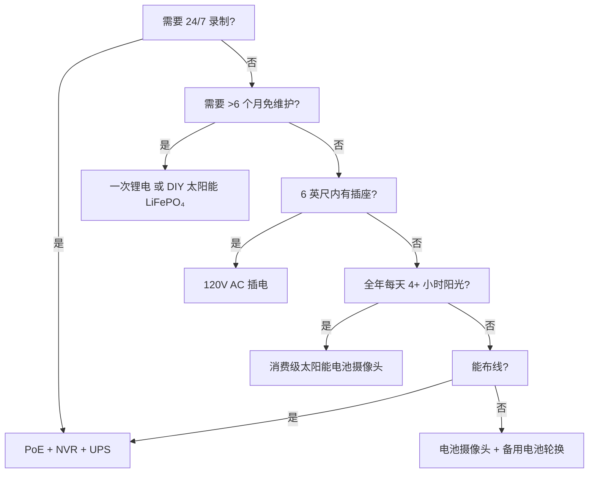

import { Callout } from "@/components/ui/callout"
import { Badge } from "@/components/ui/badge"
import { Accordion, AccordionItem, AccordionTrigger, AccordionContent } from "@/components/ui/accordion"

供电是安防摄像头失效的头号原因。凌晨 3 点电池耗尽。一月锂电冻结。太阳能板被雪埋。PoE 交换机被拔 "就一分钟"。本指南用真实物理、真实数据、决策框架拆解每种供电架构，让您一次选对、长久无忧。

<Badge variant="outline">物理优先</Badge> **能量守恒: 输入 = 输出 + 损耗。** 营销改变不了这点。按*最差*情况定尺寸 (最短白天、最低温、最高活动)，而非最好情况。

## 供电架构对比

| 架构 | 电压来源 | 最大距离 | 可靠性 | 安装复杂度 | 最适合 |
|--------------|----------------|--------------|-------------|-------------------|----------|
| **120V AC + 适配器** | 墙插 | 6 英尺 (线长) | ★★★★★ (电网) | 极简 | 室内、门廊、现有插座 |
| **PoE (802.3af/at/bt)** | PoE 交换机/注入器 | 328 英尺 (100 米) | ★★★★★ (UPS 备份) | 中等 (布线) | **黄金标准** — 24/7、NVR、远程 |
| **12V/24V DC 直供** | 电池组 / 电源 | 50–100 英尺 (压降) | ★★★★☆ | 中等 | 离网、房车、现有 12V 总线 |
| **可充电锂离子** | 内置电池 | N/A (无线) | ★★☆☆☆ (季节性) | 极简 | 租房者、临时、无布线区域 |
| **一次锂电 (不可充)** | 内置电池 | N/A | ★★★☆☆ (1–2 年) | 极简 | 追踪相机、超偏远、无阳光 |
| **太阳能 + 可充电** | 阳光 → 面板 → 电池 | N/A | ★★★☆☆ (天气) | 简单–中等 | 围栏、大门、棚屋、离网 |
| **混合: PoE + 电池备份** | PoE + UPS/内置 | 328 英尺 | ★★★★★ | 较高 | 关键入口、车牌识别 |

<Callout type="warning">
**营销 vs 现实:** "6 个月续航" = 每天 10 次运动、10 秒片段、70°F、无实时预览。**真实世界:** 每天 20–40 次事件 + 5 次实时预览 = **2–6 周**。永远按 3–5 倍降额。
</Callout>

## 深度解析: 每种架构

### 1. PoE (以太网供电) — 专业选择

<Accordion type="single" collapsible>
  <AccordionItem value="poe-basics">
    <AccordionTrigger>PoE 工作原理与标准</AccordionTrigger>
    <AccordionContent>
**IEEE 802.3af (PoE):** PSE 端 15.4W → PD 端 (摄像头) 12.95W。驱动多数固定子弹/球机。  
**IEEE 802.3at (PoE+):** PSE 端 30W → PD 端 25.5W。驱动 PTZ、加热器、IR 补光灯。  
**IEEE 802.3bt (PoE++):** 60W (Type 3) / 90W (Type 4) PSE 端 → PD 端 51W / 71W。驱动高速球机、多传感器、雨刷/加热器。

**线材:** Cat5e 起 (Cat6/6a 用于 PoE++)。单段最长 100 米 (328 英尺)。  
**拓扑:** 摄像头 → Cat5e/6 → PoE 交换机 (或带 PoE 口的 NVR) → UPS → 电网。  
**电压:** 线对上 44–57V DC (Mode A: 数据线对 / Mode B: 备用线对)。摄像头内部 DC-DC 转 12V/5V/3.3V。
    </AccordionContent>
  </AccordionItem>
  <AccordionItem value="poe-ups">
    <AccordionTrigger>PoE UPS 定型 (24/7 关键)</AccordionTrigger>
    <AccordionContent>
**原则:** UPS 必须覆盖 **所有 PoE 交换机端口 + NVR + 路由器** 以达目标续航。

| 负载 | 典型功率 | 4 小时续航 (Wh) | 12 小时续航 (Wh) | 24 小时续航 (Wh) |
|------|---------------|-------------------|--------------------|--------------------|
| 8 口 PoE+ 交换机 (4 摄像头) | 45W | 180 Wh | 540 Wh | 1,080 Wh |
| 16 口 PoE+ 交换机 (12 摄像头) | 120W | 480 Wh | 1,440 Wh | 2,880 Wh |
| NVR (8 盘位, 2 HDD) | 35W | 140 Wh | 420 Wh | 840 Wh |
| 路由器/光猫 | 15W | 60 Wh | 180 Wh | 360 Wh |
| **总计 (12 摄像头系统)** | **~170W** | **680 Wh** | **2,040 Wh** | **4,080 Wh** |

**UPS 推荐:** 
- **<4 小时:** CyberPower CP1500PFCLCD (1,500 VA / 1,050 Wh) — $200
- **8–12 小时:** APC SMT1500RM2UC + 外置电池包 — $600+
- **24+ 小时:** 48V LiFePO₄ 机架电池 (5–10 kWh) + Victron 逆变器/充电器 — $2,000+

**专业提示:** PoE 交换机 + NVR + 路由器放 **同一 UPS**。摄像头端 UPS (单摄像头) 存在但同续航成本 5 倍。
    </AccordionContent>
  </AccordionItem>
</Accordion>

### 2. 可充电电池摄像头 — 便利性陷阱

<Callout type="note">
**化学成分:** 绝大多数消费级电池摄像头用 **Li-ion (NMC/LCO), 3.6–3.7V 标称, 4.2V 最大**。不是 LiFePO₄。这对低温很重要。
</Callout>

**真实续航 (2025–2026 款, 1080p/2K/4K)**

| 摄像头 | 电池 | 宣称 | **真实 (高活动)** | **真实 (低活动)** | 充电方式 |
|--------|---------|---------|--------------------------|-------------------------|---------------|
| EufyCam 3 S330 | 13,000 mAh | 365 天 | 14–21 天 | 90–120 天 | USB-C (5V) / 太阳能 |
| Reolink Argus 4 Pro | 9,600 mAh | 6 个月 | 10–18 天 | 60–90 天 | USB-C (5V) / 太阳能 |
| Ring Stick Up Cam Pro | 6,000 mAh | 6 个月 | 7–14 天 | 45–60 天 | USB-C (5V) / 太阳能 / 插电 |
| Arlo Pro 5S 2K | 5,200 mAh | 6 个月 | 5–10 天 | 30–45 天 | 磁吸 (专有) / 太阳能 |
| Blink Outdoor 4 | 2× AA Li (3,000 mAh) | 2 年 | 60–90 天 | 180–365 天 | 换 AA (不可充) |
| Wyze Cam Outdoor v2 | 5,200 mAh | 6 个月 | 10–16 天 | 50–75 天 | Micro-USB / 太阳能 |
| Reolink Go PT Plus | 7,800 mAh | 3 个月 | 8–14 天 | 40–60 天 | USB-C / 太阳能 / 12V |

**高活动 =** 每天 30+ 次运动事件 + 3 次实时预览 + 夜间 IR 开启  
**低活动 =** 每天 5 次事件 + 0 实时预览 + 仅白天

<Accordion type="single" collapsible>
  <AccordionItem value="battery-physics">
    <AccordionTrigger>电池续航崩溃的物理原因</AccordionTrigger>
    <AccordionContent>
1. **Tx 功率主导:** Wi-Fi 射频 +17 dBm = 300–500 mA @ 3.7V。10 秒片段 = 5–10 mAh。30 片段 = 150–300 mAh/天 = **5,000 mAh 的 3–6%/天**。
2. **IR LED:** 850 nm IR 100 英尺 = 1–2W 持续 30 秒/片段。30 片段 = 0.25–0.5 Wh = **70–140 mAh @ 3.7V**。
3. **PIR 唤醒 + DSP:** 每事件 50–100 mA 持续 2–5 秒。单独可忽略, 累积可观。
3. **低温:** Li-ion **32°F (0°C) 内阻翻倍**。Tx 负载下电压跌落 → BMS 在 3.0V 切断 → "没电" 实为 40% SoC。**14°F (-10°C) 容量 ≈ 70°F 的 50%。**
4. **自放电:** 2–5%/月。相对主动耗电可忽略。
5. **实时预览:** 5 分钟实时 = 30+ 片段能量。**避免每日查看实况。**
    </AccordionContent>
  </AccordionItem>
  <AccordionItem value="charging">
    <AccordionTrigger>行之有效的充电策略</AccordionTrigger>
    <AccordionContent>
**别等 0%。** Li-ion 怕深放电。20–30% 时充电。  
**太阳能板定型:** 面板 (W) ≥ 摄像头平均功耗 (W) × 3 (冬天/阴天) ÷ 峰值日照小时 (最差月)。  
- 例: Argus 4 Pro 平均 1.5W → 需 4.5W。最差月 (12 月, 5 区) = 1.5 峰值小时 → **最小 3W 面板, 推荐 6W**。  
**USB-C PD 触发线:** Reolink/Argus/Eufy 接受 5V/9V/12V/15V/20V 经 PD 协商。用 12V→USB-C PD 触发线从 12V 房车/家用电池组直充 (90% 效率 vs 12V→120V 逆变器→5V 适配器 60%)。  
**双电池轮换:** 买备用包。满电换没电。零停机。仅限用户可拆卸电池包 (Reolink, Blink, 部分 Ring)。
    </AccordionContent>
  </AccordionItem>
</Accordion>

### 3. 一次锂电 (不可充电) — 长期专家

| 电池类型 | 化学成分 | 电压 | 容量 | 温度范围 | 最适合 |
|--------------|-----------|---------|----------|------------|----------|
| **Energizer Ultimate Lithium AA** | Li/FeS₂ | 1.5V | 3,000 mAh | -40°F 至 140°F | Blink, 追踪相机, -40°F 操作 |
| **Tadiran TL-5930 (D-cell)** | Li/SOCl₂ | 3.6V | 19,000 mAh | -67°F 至 185°F | 管道、远程遥测、5–10 年 |
| **Saft LS 14500 (AA)** | Li/SOCl₂ | 3.6V | 2,600 mAh | -60°F 至 185°F | 工业、ATEX 区域 |

**优点:** 能量密度比碱性电池高 10–20×; -40°F 工作; 10–20 年货架寿命; 无充电电路  
**缺点:** **不可充电**; $2–10/节; 电压平台致电量估算难; 钝化 (长休后电压延迟)  
**用例:** 季度检查一次的狩猎追踪相机; 管道传感器; 南极科考相机。**非日常安防用。**

### 4. 太阳能 + 电池 — 离网工程

<Callout type="info">
**太阳能是电池充电器, 非电源。** 为**自主天数** (无日照天数) 定**电池**容量。为**1 个好天**充满该电池定**面板**瓦数。
</Callout>

**系统定型工作表**

```
1. 摄像头平均功率 (W) × 24h = 每日所需 Wh
   例: Reolink Go PT Plus = 2.5W 平均 → 60 Wh/天

2. 电池自主天数 × Wh/天 = 电池 Wh
   3 天自主 → 180 Wh
   LiFePO₄ 12.8V → 180 Wh ÷ 12.8V = 14 Ah → **20 Ah 电池包 (20% 余量)**

3. 最差月峰值日照小时 (PSH) × 面板瓦数 × 0.75 (损耗) = 每日收获 Wh
   12 月, 5 区: 1.5 PSH × 面板 W × 0.75 = 60 Wh → 面板 = 53W → **60W 面板**

4. 充电控制器: MPPT (95% 效) vs PWM (75% 效)。**>20W 必用 MPPT。**
   Victron SmartSolar 75/10, 75/15, 100/20 — 蓝牙、可编程、可靠。

5. 安装: 朝真南 (北半球), 倾角 = 纬度 + 15° (冬季优化)
   可调地面架 > 屋顶 > 围栏柱。
```

**真实太阳能摄像头套件 (2026)**

| 套件 | 面板 | 电池 | 控制器 | 摄像头 | 5 区冬季续航 |
|-----|-------|---------|------------|--------|----------------------|
| Reolink 6W + Argus 4 Pro | 6W (固定) | 9.6 Ah (内置) | 内部 (PWM) | Argus 4 Pro | **12–2 月失效** (面板太小) |
| Reolink 20W + Go PT Plus | 20W (可调) | 7.8 Ah (内置) | 内部 | Go PT Plus | **勉强** (外加 20Ah LiFePO₄) |
| EufyCam 3 + 太阳能 | 2.4W (集成) | 13 Ah (内置) | 内部 | EufyCam 3 | **11–3 月失效** (面板极小) |
| **DIY: 60W + 20Ah LiFePO₄ + Victron + Go PT Plus** | 60W | 256 Wh | MPPT | Go PT Plus | **95% 正常运行** (工程化) |
| **DIY: 100W + 40Ah LiFePO₄ + Victron + PoE 注入器 + 4K 子弹** | 100W | 512 Wh | MPPT | Reolink RLC-1212A + 12V→PoE | **99% 正常运行** (真离网 PoE) |

<Accordion type="single" collapsible>
  <AccordionItem value="winter">
    <AccordionTrigger>冬季太阳能现实核查 (4–6 区)</AccordionTrigger>
    <AccordionContent>
**12 月冬至 (5 区, 42°N):**
- 峰值日照小时: **1.0–1.5** (6 月 5.5)
- 30° 倾角面板输出: **STC 额定值的 15–20%**
- 积雪覆盖: **0% 输出** 直到清理 (自热面板存在: 5–10W 寄生功耗)
- 电池 14°F: **Li-ion = 50% 容量; LiFePO₄ = 80% 容量**

**生存策略:**
1. **面板按夏季计算 3–4 倍** (60W → 180–240W 阵列)
2. **LiFePO₄ 电池** (非 Li-ion) — -4°F 仍可随 BMS 加热器充电
3. **降低摄像头占空比:** 仅运动、降分辨率、缩短片段、关 IR (用环境光)
4. **备用充电:** 12V→USB-C PD 触发线从车/发电机月充一次
5. **接受停机:** 设计 90% 正常运行, 非 100%。每年 3–5 天黑屏正常。
    </AccordionContent>
  </AccordionItem>
</Accordion>

### 5. 12V/24V DC 直供 — 房车/离网原生

**为何 12V DC?** 无逆变器损耗 (120V AC → 12V DC = 15–25% 损耗)。摄像头内部本就跑 12V。

**12V 摄像头直接布线:**
```
车载电池 (12V LiFePO₄) 
  → 10A 刀片保险丝 
  → 18 AWG 镀锡船用线 (红/黑) 
  → 防水 Deutsch / SAE / Anderson 接头 
  → 摄像头 12V 输入 (核对极性!)
  → **降压转换器** 若摄像头需 5V/9V (多数 PoE 摄像头需 48V → 用 12V→48V PoE 注入器)
```

**压降计算器:**
```
Vdrop = (2 × 长度_英尺 × 电流_A × 0.000016) / 线材_CM
18 AWG (1,624 CM), 50 英尺, 1A → 0.98V 降 (12V 上 8%) — 可接受
18 AWG, 100 英尺, 1A → 1.96V 降 (16%) — 用 16 AWG (2,583 CM) → 1.2V (10%)
```
**原则:** 18 AWG 12V 跑线 <50 英尺; 14 AWG <100 英尺。或用 24V/48V 配电 + 摄像头端降压。

**12V→PoE 注入器 (用 12V 电池跑 PoE 摄像头):**
- Tycon POE-12-48V (12V 进 → 48V PoE 出, 15W) — $25
- Ubiquiti INJ-12V-48V (12V → 48V PoE+, 30W) — $35
- 工业级: Mean Well NDR-120-48 (120W DIN 导轨) + PoE 分离器 — $60
- **效率:** 85–92%。摄像头看到标准 PoE — 无固件黑科技。

### 6. 混合: PoE + 电池备份 (零停机)

**架构:** 摄像头 → PoE 交换机 → UPS (LiFePO₄) → 电网。  
**加:** 摄像头内置电池 (Reolink Go PT Plus, Arlo Go 2) 或单摄像头外置 UPS。

| 方案 | 成本 | 续航 (单摄) | 复杂度 |
|----------|------|-------------------|------------|
| 中心 UPS (交换机+NVR) | $200–2,000 | 小时–天 | 低 |
| 单摄像头 UPS (APC BE600M1) | $60×N | 30–60 分钟 | 中等 |
| 内置电池摄像头 (Go PT Plus) | $230 | 2–4 周 (太阳能) | 低 |
| **PoE + 12V LiFePO₄ + 自动切换** | $150/摄 | 天–周 | 高 |

**两全其美:** PoE 供 24/7 录制 + NVR。内置电池做 **断电后录制** (UPS 死前最后 30 分钟)。Reolink Go PT Plus 原生支持 — PoE 掉电时录至 microSD。

## 5 年总拥有成本 (TCO)

| 架构 | 第 1 年 | 第 2–5 年 (年均) | 5 年合计 | 最适合 |
|--------------|--------|-------------------|------------|----------|
| **PoE + NVR + UPS** | $1,500 | $50 (换 HDD) | **$1,700** | 永久、24/7、8+ 摄像头 |
| **电池 + 太阳能 (DIY LiFePO₄)** | $800 | $0 | **$800** | 离网、1–4 摄像头、DIY |
| **电池摄像头 + 太阳能板 (消费级)** | $500 | $50 (第 3 年换电池) | **$700** | 租房、无布线、1–2 摄像头 |
| **一次锂电 (追踪相机)** | $300 | $100 (电池/年) | **$700** | 超偏远、季度巡检 |
| **120V AC 插电** | $200 | $10 | **$240** | 室内、门廊、有插座 |

<Callout type="tip">
**隐性成本:** 跑腿。电池摄像头凌晨 3 点死 → 开车 30 分钟换 = $50/次。PoE + UPS = 0 次因电源跑腿。按 $50 × 预期年故障次数计入。
</Callout>

## 决策矩阵: 选定您的架构



## 您的摄像头快速规格核对清单

- [ ] **PoE:** 802.3af (15W) / at (30W) / bt (60/90W) — 匹配交换机
- [ ] **12V DC:** 接受 10–14V? 反接保护? 接口类型?
- [ ] **电池:** 可拆卸? 化学成分 (Li-ion vs LiFePO₄)? mAh @ 3.7V? USB-C PD 充电?
- [ ] **太阳能:** 面板瓦数? MPPT 还是 PWM? 线长? 支架可调性?
- [ ] **工作温度:** Li-ion 最低 -4°F / -20°C; LiFePO₄/一次电池 -40°F
- [ ] **功耗:** 规格书 "最大" vs "典型" — 按典型 × 1.5 设计
- [ ] **低电量提醒:** App 推送 20%? 自动关机阈值?
- [ ] **UPS 兼容性:** NVR + 交换机同一 UPS? 续航已算?

---

## 相关指南

- [最佳太阳能安防摄像头 (离网)](/blog/best-solar-powered-security-cameras-offgrid) — 面板/电池定型深度解析
- [房车与移动住宅最佳安防摄像头](/blog/best-security-cameras-for-rvs-mobile-homes) — 12V DC、抗震、蜂窝网
- [PoE vs 无线 vs 太阳能对比](/blog/poe-vs-wireless-vs-solar-comparison) — 决策框架
- [无线摄像头 DIY 安装技巧](/blog/wireless-camera-setup-diy-installation-tips) — Wi-Fi、电池、安装优化