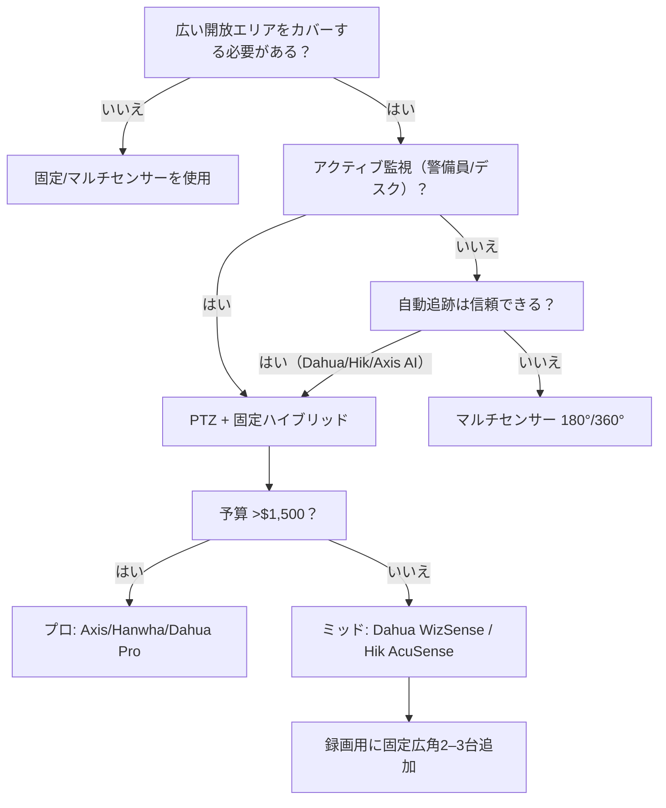

1台のPTZ（パン・チルト・ズーム）カメラで、駐車場、倉庫の通路、建設現場をカバーできます — 固定バレットカメラなら4–6台必要です。しかしPTZは3–5倍高価で、可動部が故障しやすく、向けた方向しか見えません。このガイドは、PTZがその価値を発揮するタイミングと、どのモデルが優れているかを判断するのに役立ちます。

<Badge variant="outline">結論</Badge> **PTZを使うべき場合:**
広い開放エリア（駐車場、庭、外周）、活発な監視（警備デスク）、不審者の自動追跡。**PTZを避けるべき場合:**
廊下、小さな部屋、入口のチョークポイント、「セット＆フォーゲット」設置 —
固定広角またはマルチセンサーの方が安くて信頼性が高いです。

## PTZ vs 固定 vs マルチセンサー: 費用対効果

| アプローチ                 | 必要台数 | 総コスト（カメラのみ） | カバレッジギャップ                | 最適                       |
| -------------------------- | -------- | ---------------------- | --------------------------------- | -------------------------- |
| **4× 固定4Kバレット**      | 4        | ~$520                  | なし（同時録画）                  | 24時間録画、どこでも証拠   |
| **2× 180° マルチセンサー** | 2        | ~$700                  | 最小限（継ぎ目）                  | 広い廊下、建物の角         |
| **1× PTZ（25倍光学）**     | 1        | ~$450–1,200            | **あり — 向けた方向しか見えない** | アクティブ監視、コスト削減 |

<Callout type="warning">

**PTZ死角のルール:** 25倍ズームのPTZは約2°の視野角です。100 ft先では**幅3.5 ftのスライス**しか見えません。中心から10 ft左にいる侵入者は見えません。PTZには警備員が見ているか、スマート自動追跡＋広角の補助カメラが**必要**です。

</Callout>

## 光学 vs デジタルズーム: 唯一重要なスペック

| ズームタイプ     | 仕組み                                   | 最大時の画質                           | 使用例                            |
| ---------------- | ---------------------------------------- | -------------------------------------- | --------------------------------- |
| **光学**         | 物理レンズ素子が移動                     | **フルセンサー解像度**（25倍で4K/8MP） | ナンバープレート、顔、遠方の詳細  |
| **デジタル**     | クロップ＋ファームウェアでアップスケール | 急速に劣化（4K → 1080p → 720p）        | 「あると便利」程度のみ            |
| **ハイブリッド** | 光学＋限定的デジタル                     | 光学範囲＝真の画質                     | マーケティング仕様 — 光学のみ確認 |

**注目すべき仕様:** `光学ズーム: 25倍` または `30倍` — 「300倍デジタルズーム」は無視。  
**レンズ範囲例:** 4.8–120 mm（25倍） on 1/1.8" センサー = ~58° 広角 → 2.3° 望遠。

## 自動追跡AI: 警備員の代わりになるか？

<Accordion type="single" collapsible>
  <AccordionItem value="tracking-work">
    <AccordionTrigger>自動追跡の仕組み（そして失敗する時）</AccordionTrigger>
    <AccordionContent>

**典型的なパイプライン:**

1. **広視野角検出**（サブストリーム、1080p/4MP）→ 人/車両AI
2. **ターゲットロック** → PTZモーターが対象を中心に捕捉
3. **ズームイン** → プリセットレベルまで光学ズーム（通常8–15倍）
4. **追跡** → 中心に捉え続けるためにパン/チルトを継続
5. **復帰** → 停留時間後（10–60秒）、「ホーム」プリセットに戻る

**失敗する状況:**

- **複数対象:** 最も大きい/近いものを選択; 他を見失う
- **速い横方向の動き:** モーターが100°/秒で追従できない — 対象が視野から外れる
- **遮蔽:** 木、トラック、柱でロックが切れる → ホームに戻る
- **夜間IR:** AI検出範囲が50–70%低下; PTZが暗闇にズームイン
- **PTZ「ハンティング」:** 風による振動＋感度の高い検出＝常時動作＝モーター摩耗

**まともな追跡機能を持つベンダー（2026年）:** Dahua WizSense/WizMind、Hikvision AcuSense/DeepinView、Axis Q61/Q63、Hanwha XNP、Reolink RLC-823A（予算）

</AccordionContent>

  </AccordionItem>
  <AccordionItem value="tracking-vs-fixed">
    <AccordionTrigger>自動追跡＋固定カメラ＝両方の長所</AccordionTrigger>
    <AccordionContent>

**ハイブリッド導入（推奨）:**

- **PTZ** 中央/ポールに設置 — 自動追跡、ズームで識別
- **2–4台の固定広角**（180° または 4Kバレット）— 24時間録画、死角なし
- **NVR/VMSが連携:** 固定カメラはすべてを録画; PTZはズームでイベントをブックマーク

**コスト例（駐車場 200×300 ft）:**

- 1× Dahua SD6AL230U-HNI（30倍、AI追跡）~$1,100
- 3× Dahua IPC-HFW3849T1-AS（4K、110°）~$450
- **合計: ~$1,550** vs 6台の固定バレット ~$780（ただしケーブル6本、NVRポート6つ、ストレージ6倍）

**結論:** ハイブリッドはケーブル/ポートを節約し、フォレンジックズームを追加。PTX単独＝責任ギャップ。

</AccordionContent>

  </AccordionItem>
</Accordion>

## PTZフォームファクターと取り付け

| タイプ                             | パン/チルト範囲           | 速度        | 取付                      | 最適                       |
| ---------------------------------- | ------------------------- | ----------- | ------------------------- | -------------------------- |
| **スピードドーム**（吊下げ）       | 360° 無制限 / -15° to 90° | 240–400°/秒 | ペンダント（ポール/天井） | 駐車場、交差点、スタジアム |
| **ミニPTZ / タレットPTZ**          | 355° / -5° to 90°         | 60–100°/秒  | 壁 / 天井 / ポール        | 建物の角、私道、庭         |
| **ポジショニングシステム**（重量） | 360° 無制限 / -90° to 90° | 100–200°/秒 | 台座 / タワー             | 外周、境界線、重要インフラ |
| **PTZドアベル**                    | 350° / 90°                | 30–60°/秒   | 壁（ドアベル配線）        | ポーチ＋私道のコンボ       |

**速度の重要性:** 400°/秒なら150 ft先の時速30マイルの車を追跡できます。60°/秒では見失います。**プリセットツアー速度**（最大速度だけでなく）を確認してください。

## プリセットツアーとパトロール: 「仮想警備員」モード

<Callout type="note">

**プリセット:** 保存されたPTZ位置（パン、チルト、ズーム、フォーカス）。**ツアー:** 停留時間付きのプリセットのシーケンス。**パターン:** 記録された手動経路（スムーズな動き）。

</Callout>

**駐車場の典型的なツアー（8プリセット、15秒停留）:**

1. 入口ゲート（ズーム10倍）— ナンバープレート撮影
2. 車線A（ズーム5倍）— 交通の流れ
3. 障害者用スペース（ズーム8倍）— コンプライアンス
4. 遠隅（ズーム15倍）— 死角確認
5. 出口ゲート（ズーム10倍）— ナンバープレート撮影
6. ゴミ置き場エリア（ズーム5倍）— 徘徊
7. 建物入口（ズーム8倍）— 出入り
8. **ホーム**（広角、1倍）— 全体ビュー

**時間帯別にツアーをスケジュール:** 昼間＝5分ループ; 夜間＝2分ループ＋IRオン; ランチタイム＝入口重視。

## 接続: PoE vs Wi-Fi vs 4G vs ファイバー

| 電源/データ                          | 最大距離                   | 信頼性 | 使用例                                  |
| ------------------------------------ | -------------------------- | ------ | --------------------------------------- |
| **PoE+ (802.3at, 30W)**              | 328 ft (100 m) 銅線        | ★★★★★  | 標準 — PoEインジェクター/スイッチを使用 |
| **PoE++ (802.3bt, 60–90W)**          | 328 ft                     | ★★★★★  | ヒーター/ブロワーPTZ、IR照明器          |
| **長距離PoE (LRPoE)**                | 1,500–3,000 ft             | ★★★★☆  | 外周ポール — LRPoEスイッチが必要        |
| **ファイバー＋メディアコンバーター** | 数マイル                   | ★★★★★  | キャンパス、都市、重要インフラ          |
| **Wi-Fi 6 / 6E**                     | 150–300 ft LOS             | ★★☆☆☆  | 一時設置、ケーブル経路なし              |
| **4G/5G LTE**                        | 電波がある場所ならどこでも | ★★★☆☆  | 遠隔地、建設現場、バックアップ          |

**ヒーター/ブロワー = PoE++ または 24V AC。** ほとんどのスピードドームは-40°Fの低温始動に24V AC（別途トランス）またはPoE++が必要です。仕様を確認: `ヒーター: あり` → 60W+ を予算に。

## 予算別おすすめ

### 予算 (&lt;$500): Reolink RLC-823A（4K、36倍光学、PoE）

**仕様:** 4K（8MP）、1/1.8" センサー、4.8–172.8mm（36倍）、340° パン / 90° チルト、190 ft IR、人/車両/ペット検出、microSD 256 GB、ONVIF  
**長所:** 信じられないズーム/価格比; PoE; 自動追跡はそこそこ動作; Reolink NVR/アプリエコシステム  
**短所:** プラスチックギア（2–3年で摩耗）; 340° で360°ではない; ヒーターなし; IRは190 ftのみ  
**最適:** 私道、小さな庭、予算NVR構築

### ミッドレンジ ($500–1,200): Dahua SD5A445GB-HNR（4MP、45倍、WizSense）

**仕様:** 4MP、1/2.8" STARVIS、3.95–177.75mm（45倍）、360° 無制限 / -15° to 90°、492 ft IR、WizSense AI（境界、トリップワイヤー、人数カウント）、PoE+、IP67、IK10  
**長所:** 45倍光学＝300+ ft先のナンバープレート; 492 ft IR; 金属ギア; Dahua NVR/VMS統合; ヒーターオプション  
**短所:** 4MP で4Kではない; 中国ファームウェア（International版を使用）; DIYには設定が複雑  
**最適:** 駐車場、倉庫、外周 — プロ設置

### ミッドレンジ代替: Hikvision DS-2DE4A425IW-DE（4MP、25倍、AcuSense）

**仕様:** 4MP、1/1.8"、4.8–120mm（25倍）、360° 無制限 / -5° to 90°、164 ft IR、AcuSense 2.0、PoE+、IP66  
**長所:** 信頼性の高いAcuSense誤報低減; HikCentral VMS; 幅広いサポート  
**短所:** IRが短い; 25倍 vs 45倍; ヒーター標準装備なし  
**最適:** Hikvisionエコシステム、予算重視のプロ

### プロ ($1,200–3,000): Axis Q6135-LE（2MP、32倍、Lightfinder 2.0）

**仕様:** 2MP（1080p）、1/2.8"、4.3–137.6mm（32倍）、360° 無制限 / -90° to 90°、656 ft IR、Lightfinder 2.0 + Forensic WDR、Zipstream H.264/265、PoE++（Class 6）、IP66/67、IK10、-50°F to 140°F  
**長所:** 最高の低照度性能（Lightfinder）; 656 ft IR; サイバーセキュリティ署名済みファームウェア; 5年保証; Axis Camera Station / ACAPアプリ  
**短所:** 2MPのみ; 高価; 内蔵AI追跡なし（ACAPアプリが必要）  
**最適:** 重要インフラ、自治体、エンタープライズ — 稼働時間＝責任

### プロ代替: Hanwha XNP-9300RW（4K、30倍、WiseNet AI）

**仕様:** 4K（8MP）、1/1.8"、4.5–135mm（30倍）、360° 無制限 / -20° to 90°、328 ft IR、WiseNet AI（物体検出/分類）、PoE++、IP66/IK10、-40°F to 131°F  
**長所:** 4K＋30倍; 強力なAI; Wisenet WAVE VMS; NDAA準拠  
**短所:** 価格; 韓国ファームウェアの学習曲線  
**最適:** NDAAプロジェクト、政府、学校

## ストレージと帯域幅: PTZは両方を消費する

| ストリーム                | 解像度      | ビットレート (H.265) | 24時間/日 (GB) | 備考                                 |
| ------------------------- | ----------- | -------------------- | -------------- | ------------------------------------ |
| **メイン（録画用）**      | 4K / 8MP    | 6–10 Mbps            | 65–108 GB/日   | ズームはビットレートをあまり変えない |
| **サブ（ライブ/表示用）** | 1080p / 2MP | 1.5–3 Mbps           | 16–32 GB/日    | 自動追跡検出に使用                   |
| **第三（モバイル用）**    | 720p / D1   | 0.5–1 Mbps           | 5–11 GB/日     | オプション                           |

**PTZ特有:** プリセットツアー＝常時動作 = **Pフレーム節約なし**。ビットレートはIフレームピークのまま。固定カメラの2倍のストレージを予算に。

**NVRサイジング:** 1台の4K PTZ＋3台の4K固定 = ~300 GB/日。16 TB = 53日。32 TB = 106日。適宜計画してください。

## 統合チェックリスト

- [ ] **ONVIF Profile S/G/T** — NVR/VMS検出、PTZ制御、プリセット
- [ ] **CGI / HTTP API** — カスタムホームオートメーション（Home Assistant、Node-RED）
- [ ] **Pelco-D / Pelco-P** — レガシージョイスティック/キーボードサポート
- [ ] **RTSP/RTMP/SRT** — YouTube、Wowza、カスタムインジェストにストリーム
- [ ] **MQTT** — ダッシュボードマッピング用位置テレメトリ
- [ ] **VMSサポート** — Milestone、Genetec、Avigilon、Exacq、Nx Witness、Wisenet WAVE、Dahua DSS、HikCentral

<Callout type="tip">

**Home Assistant + ONVIF PTZ:** `onvif:` 統合を追加 → `camera.ptz` エンティティが公開 → サービスコール `pan`、`tilt`、`zoom`、`goto_preset`。自動化: 「門で動体検知時 → PTZプリセット1（ズーム15倍）→ スナップショット付き通知。」

</Callout>

## メンテナンス: 隠れたコスト

| 間隔           | タスク                                               | 理由                                       |
| -------------- | ---------------------------------------------------- | ------------------------------------------ |
| **毎月**       | フルプリセットツアーを実行; 各ズームでフォーカス確認 | モーターが固着; フォーカスがずれる         |
| **四半期ごと** | ドームを清掃（マイクロファイバー＋レンズクリーナー） | IR反射、かすみ、クモの巣                   |
| **毎年**       | PTZスリップリング/ケーブルハーネスを確認             | 360° 無制限＝回転コネクタが摩耗            |
| **2–3年**      | ドームを交換（ポリカーボネートの黄変）               | 光透過率低下＝夜間性能低下                 |
| **5年**        | モーター/ギアの再構築またはユニット交換              | プラスチックギアが摩耗; 金属ギアがすり減る |

**PTZメンテナンスにカメラコストの年間10–15%** を予算に。固定カメラ: 1–2%。

## 意思決定フローチャート

---

## 関連ガイド

- [2026年最高の屋外用防犯カメラ](/blog/best-outdoor-security-cameras-2026) — 固定カメラの代替案
- [広い裏庭・広大な土地に最適なカメラ](/blog/best-cameras-for-large-backyards-acreage) — 広大な土地でのPTZ vs マルチセンサー
- [PoE vs ワイヤレス vs ソーラー比較](/blog/poe-vs-wireless-vs-solar-comparison) — PTZポールの電源オプション
- [NVR vs DVR](/blog/nvr-vs-dvr) — PTZストリーム用レコーダーの選択
