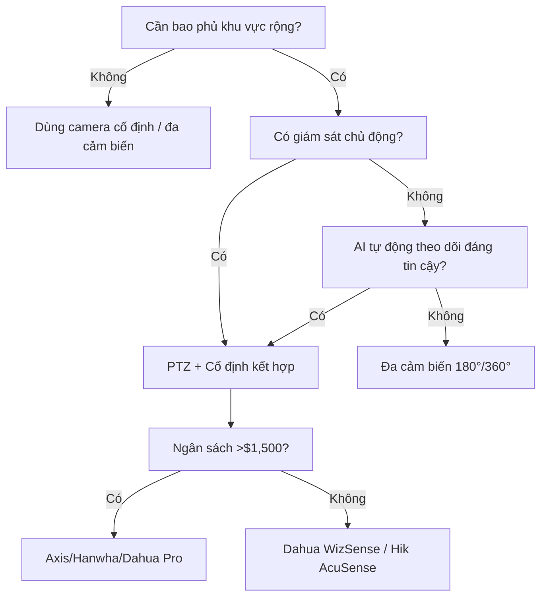

Một camera PTZ (Pan-Tilt-Zoom) có thể bao phủ một bãi đỗ xe, nhà kho hoặc công trường xây dựng mà cần 4–6 camera cố định. Nhưng PTZ đắt gấp 3–5 lần, có bộ phận chuyển động dễ hỏng và chỉ nhìn thấy nơi nó được hướng tới. Hướng dẫn này giúp bạn quyết định khi nào PTZ đáng đầu tư — và mẫu nào hoạt động tốt.

<Badge variant="outline">Tóm Tắt</Badge> **Dùng PTZ cho:** Khu vực rộng lớn (bãi
đỗ xe, sân vườn, vành đai), giám sát chủ động (bàn bảo vệ), tự động theo dõi kẻ
xâm nhập. **Bỏ qua PTZ cho:** Hành lang, phòng nhỏ, điểm nghẽn lối vào — camera
góc rộng cố định rẻ hơn và đáng tin cậy hơn.

## PTZ vs Cố Định vs Đa Cảm Biến: Tính Toán

| Phương án                  | Số camera | Tổng chi phí | Khoảng trống bao phủ            | Tốt nhất cho                         |
| -------------------------- | --------- | ------------ | ------------------------------- | ------------------------------------ |
| **4× Cố định 4K**          | 4         | ~$520        | Không (đồng thời)               | Ghi 24/7, bằng chứng mọi góc         |
| **2× Đa cảm biến 180°**    | 2         | ~$700        | Tối thiểu (đường nối)           | Hành lang rộng, góc tòa nhà          |
| **1× PTZ (25× Quang học)** | 1         | ~$450–1,200  | **Có — chỉ thấy nơi hướng tới** | Giám sát chủ động, tiết kiệm chi phí |

<Callout type="warning">

**Quy tắc Điểm Mù PTZ:** PTZ ở zoom 25× có FOV ~2°. Ở 100 ft, đó là **lát cắt rộng 3.5 ft**. Kẻ xâm nhập cách trung tâm 10 ft là vô hình. PTZ _yêu cầu_ hoặc bảo vệ theo dõi hoặc tự động theo dõi thông minh + camera góc rộng thứ cấp.

</Callout>

## Zoom Quang Học vs Kỹ Thuật Số: Thông Số Quan Trọng Nhất

| Loại zoom       | Cách hoạt động                   | Chất lượng ảnh ở tối đa                         | Ứng dụng                                   |
| --------------- | -------------------------------- | ----------------------------------------------- | ------------------------------------------ |
| **Quang học**   | Thấu kính vật lý di chuyển       | **Độ phân giải cảm biến đầy đủ** (4K/8MP ở 25×) | Biển số, khuôn mặt, chi tiết xa            |
| **Kỹ thuật số** | Cắt + phóng to trong firmware    | Giảm nhanh (4K → 1080p → 720p)                  | Chỉ "có thì tốt"                           |
| **Kết hợp**     | Quang học + kỹ thuật số giới hạn | Tầm quang học = chất lượng thật                 | Thông số tiếp thị — chỉ kiểm tra quang học |

**Thông số cần xem:** `Zoom Quang học: 25×` hoặc `30×` — bỏ qua "zoom kỹ thuật số 300×."

## AI Tự Động Theo Dõi: Có Thay Thế Bảo Vệ Không?

<Accordion type="single" collapsible>
  <AccordionItem value="tracking">
    <AccordionTrigger>Cách Tự Động Theo Dõi Hoạt Động (Và Thất Bại)</AccordionTrigger>
    <AccordionContent>

**Quy trình điển hình:**

1. **Phát hiện FOV rộng** (luồng phụ, 1080p/4MP) → AI Người/Phương tiện
2. **Khóa mục tiêu** → Động cơ PTZ xoay đến trung tâm mục tiêu
3. **Zoom vào** → Zoom quang học đến mức đặt trước (thường 8–15×)
4. **Theo dõi** → Pan/tilt liên tục để giữ trung tâm
5. **Quay lại** — Sau thời gian dừng (10–60s), quay về preset "home"

**Nơi thất bại:**

- **Nhiều mục tiêu:** Chọn lớn nhất/gần nhất; mất các mục tiêu khác
- **Di chuyển ngang nhanh:** Động cơ không thể xoay 100°/giây — mục tiêu thoát FOV
- **Che khuất:** Cây, xe tải, cột phá vỡ khóa → quay về home
- **IR ban đêm:** Tầm phát hiện AI giảm 50–70%; PTZ zoom vào bóng tối

</AccordionContent>
  </AccordionItem>
</Accordion>

## Yếu Tố Hình Thức & Gắn Kết PTZ

| Loại                        | Tầm Pan/Tilt               | Tốc độ        | Gắn             | Tốt nhất cho                 |
| --------------------------- | -------------------------- | ------------- | --------------- | ---------------------------- |
| **Speed Dome (treo)**       | 360° vô tận / -15° đến 90° | 240–400°/giây | Treo (cột/trần) | Bãi đỗ, ngã tư, sân vận động |
| **Mini PTZ**                | 355° / -5° đến 90°         | 60–100°/giây  | Tường/trần/cột  | Góc tòa nhà, đường lái, sân  |
| **Hệ thống định vị (nặng)** | 360° vô tận / -90° đến 90° | 100–200°/giây | Bệ/tháp         | Vành đai, biên giới, hạ tầng |
| **PTZ Chuông cửa**          | 350° / 90°                 | 30–60°/giây   | Tường           | Hiên nhà + đường lái         |

## Lựa Chọn Hàng Đầu Theo Ngân Sách

### Ngân Sách (<$500): Reolink RLC-823A (4K, 36× Quang học, PoE)

**Thông số:** 4K (8MP), cảm biến 1/1.8", 4.8–172.8mm (36×), 340° pan / 90° tilt, IR 190 ft, phát hiện người/xe/thú cưng, microSD 256 GB  
**Ưu:** Zoom/giá tuyệt vời; PoE; tự động theo dõi hoạt động tốt  
**Nhược:** Bánh răng nhựa (mòn sau 2–3 năm); 340° không phải 360°; không có sưởi  
**Tốt nhất cho:** Đường lái xe, sân nhỏ

### Trung Cấp ($500–1,200): Dahua SD5A445GB-HNR (4MP, 45×, WizSense)

**Thông số:** 4MP, STARVIS 1/2.8", 3.95–177.75mm (45×), 360° vô tận / -15° đến 90°, IR 492 ft, AI WizSense, PoE+, IP67, IK10  
**Ưu:** 45× quang học = biển số ở 300+ ft; IR 492 ft; bánh răng kim loại  
**Nhược:** 4MP không phải 4K; firmware Trung Quốc; thiết lập phức tạp  
**Tốt nhất cho:** Bãi đỗ xe, nhà kho

### Chuyên Nghiệp ($1,200–3,000): Axis Q6135-LE (2MP, 32×, Lightfinder 2.0)

**Thông số:** 2MP, 4.3–137.6mm (32×), 360° vô tận / -90° đến 90°, IR 656 ft, Lightfinder 2.0, PoE++, IP66/67, IK10, -50°F đến 140°F  
**Ưu:** Thiếu sáng tốt nhất; IR 656 ft; firmware ký số; bảo hành 5 năm  
**Nhược:** Chỉ 2MP; đắt; không AI theo dõi tích hợp  
**Tốt nhất cho:** Hạ tầng quan trọng, doanh nghiệp

## Bảo Trì: Chi Phí Ẩn

| Khoảng thời gian | Công việc                           | Tại sao                           |
| ---------------- | ----------------------------------- | --------------------------------- |
| **Hàng tháng**   | Chạy preset tour; xác nhận lấy nét  | Động cơ kẹt; focus trôi           |
| **Hàng quý**     | Lau dome (khăn sợi nhỏ + dung dịch) | IR bật lại, mờ, mạng nhện         |
| **Hàng năm**     | Kiểm tra slip ring / dây cáp        | 360° vô tận = đầu nối xoay mòn    |
| **2–3 Năm**      | Thay dome (polycarbonate vàng)      | Mất truyền sáng = đêm tệ hơn      |
| **5 Năm**        | Phục hồi động cơ/bánh răng          | Bánh răng nhựa hỏng; kim loại mòn |

## Lưu Đồ Quyết Định

## Hướng Dẫn Liên Quan

- [Camera An Ninh Ngoài Trời Tốt Nhất 2026](/blog/best-outdoor-security-cameras-2026) — Lựa chọn camera cố định
- [Camera Tốt Nhất Cho Sân Rộng](/blog/best-cameras-for-large-backyards-acreage) — PTZ vs đa cảm biến cho diện tích lớn
- [PoE vs Không Dây vs Năng Lượng Mặt Trời](/blog/poe-vs-wireless-vs-solar-comparison) — Tùy chọn nguồn cho cột PTZ
- [NVR vs DVR](/blog/nvr-vs-dvr) — Lựa chọn đầu ghi cho luồng PTZ
